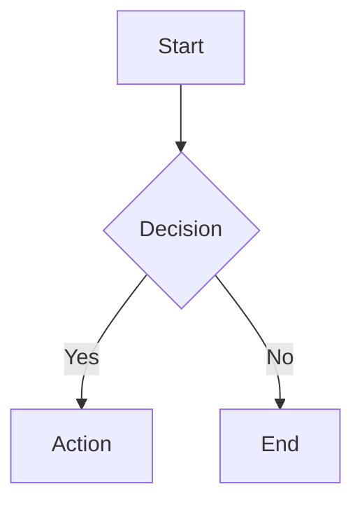

# Subject Quality Standard

This document defines the requirements every subject must meet to be considered **production-ready**. Each subject must have a `subject-spec.yaml` that defines its specific requirements based on its pedagogy.

---

## Quick Reference

| Component | Requirement |
|-----------|-------------|
| Subject Spec | **Required** — `subject-spec.yaml` defining targets |
| Topics | 7 topics per subject |
| Subtopics | 7 subtopics per topic (49 total) |
| Subtopic Word Count | 800+ words each |
| Exercises | Per spec (base default: 16/topic) |
| Quizzes | Per spec (base default: 3/topic × 5 questions) |
| Exams | Midterm + Final (question counts per spec) |
| Projects | Per spec (default: required for CS, none for MATH) |

---

## Per-Subject Specifications

Every subject **must** have a `subject-spec.yaml` that documents its pedagogical approach and assessment requirements. This ensures that content creators understand what "good" looks like for each specific subject.

### Why Required?

Different subjects have fundamentally different pedagogical needs:

| Subject Type | Characteristics |
|--------------|-----------------|
| Proof-based Math | Fewer, deeper exercises; proofs take time |
| Intro Programming | High volume practice; immediate feedback |
| Theory/Algorithms | Mix of proofs and implementation |
| Applied/Capstone | Project-focused; reduced exams |

A single universal standard cannot serve all subjects well. The spec ensures each subject's requirements are intentional and justified.

### Subject Spec Location

```
src/subjects/{subject}/subject-spec.yaml
```

### What a Subject Spec Contains

| Section | Purpose |
|---------|---------|
| `role` | Where the subject fits in the curriculum; the transformation it achieves |
| `pedagogy` | Knowledge type, mastery indicators, common struggles |
| `content` | Subject-specific content requirements and conventions |
| `assessment` | Philosophy, what assessments measure, anti-patterns |
| `grading` | Passing thresholds with rationale |
| `exercises` | Types, quantities (with ranges and justification), difficulty distribution |
| `quizzes` | Structure, question types with justification |
| `exams` | Question counts, formats, coverage with justification |
| `projects` | Whether required, count, goals |
| `red_flags` | Subject-specific content problems to avoid |

### Base Defaults

When a spec doesn't override a value, these defaults apply:

| Component | Default |
|-----------|---------|
| Exercises per topic | 16 |
| Quizzes per topic | 3 (5 questions each) |
| Midterm questions | 26 |
| Final questions | 42 |
| Projects | Required for CS, none for MATH |
| Passing score | 70% |

### Schema Reference

See [`SUBJECT_SPEC_SCHEMA.md`](./SUBJECT_SPEC_SCHEMA.md) for the full schema definition with all available fields.

---

## 1. Topics

### Requirements
- **Exactly 7 topics** per subject
- Each topic represents a major concept area
- Topics should build on each other progressively
- Topic titles should be clear and descriptive

### Topic Structure
```typescript
interface Topic {
  id: string;           // Format: '{subject}-topic-{N}'
  title: string;        // Clear, descriptive title
  content: string;      // Fallback content (legacy)
  subtopics: Subtopic[]; // Required: 7 subtopics
  readings?: Reading[]; // Optional: academic references
  quizIds: string[];    // Required: 3 quiz IDs
  exerciseIds: string[]; // Required: 16 exercise IDs
}
```

---

## 2. Subtopics

### Requirements
- **Exactly 7 subtopics** per topic (49 total per subject)
- **Minimum 800 words** per subtopic
- Each subtopic should be self-contained and focused
- Progressive difficulty within topic

### Subtopic Content Requirements

Each subtopic markdown file must include:

| Section | Required | Description |
|---------|----------|-------------|
| Title (H1) | Yes | Clear heading matching subtopic title |
| Introduction | Yes | 1-2 paragraphs introducing the concept |
| Core Content | Yes | Main explanation with examples |
| Code Examples | Yes* | Working, syntactically correct code (*for CS subjects) |
| Key Takeaways | Yes | Bullet points summarizing main points |
| Common Mistakes | Recommended | Pitfalls students should avoid |

### Word Count Guidelines
- **Minimum:** 800 words
- **Target:** 1,000-1,200 words
- **Maximum:** 2,000 words (split if longer)

### File Naming
```
src/subjects/{subject}/content/topic-{N}/
├── 01-introduction.md
├── 02-{concept-name}.md
├── 03-{concept-name}.md
├── 04-{concept-name}.md
├── 05-{concept-name}.md
├── 06-{concept-name}.md
└── 07-{summary-or-best-practices}.md
```

### Frontmatter Requirements

Each subtopic markdown file **must** include YAML frontmatter at the top:

```yaml
---
id: cs101-t1-intro
title: "Introduction to Variables"
order: 1
---

# Introduction to Variables

[Content starts here...]
```

| Field | Required | Description |
|-------|----------|-------------|
| `id` | Yes | Unique subtopic ID (format: `{subject}-t{N}-{slug}`) |
| `title` | Yes | Display title for the subtopic |
| `order` | Yes | Sort order within the topic (1-7) |

The frontmatter is automatically parsed by the shared loader to build subtopic metadata.

### ID Format
- Pattern: `{subject}-t{topic}-{slug}`
- Example: `cs101-t1-intro`, `math201-t3-eigenvalues`

---

## 3. Exercises

### Requirements
- **Exactly 16 exercises** per topic (112 total per subject)
- Difficulty ratings from 1-5
- Two exercise types: **Coding** (CS subjects) and **Written** (MATH/theory subjects)
- Complete solutions and hints for all exercises

### Difficulty Distribution (per topic)

| Difficulty | Count | Description |
|------------|-------|-------------|
| 1 (Beginner) | 3 | Basic concept application |
| 2 (Easy) | 3 | Simple problems, single concept |
| 3 (Medium) | 4 | Combining concepts, moderate complexity |
| 4 (Hard) | 3 | Complex problems, edge cases |
| 5 (Expert) | 3 | Advanced, optimization, multiple approaches |

### Exercise Types

Subjects use one of two exercise types:

| Subject Type | Exercise Type | Validation Method |
|--------------|---------------|-------------------|
| CS (Programming) | Coding | Automated test cases |
| MATH/Theory | Written | LLM evaluation (Gemini API) |

---

### Coding Exercise Components

| Component | Required | Specification |
|-----------|----------|---------------|
| id | Yes | Format: `{subject}-t{topic}-ex{NN}` |
| title | Yes | Clear, descriptive (3-8 words) |
| description | Yes | Problem statement with markdown support |
| difficulty | Yes | Integer 1-5 |
| starterCode | Yes | Compilable/runnable skeleton |
| solution | Yes | Complete, correct, well-commented |
| testCases | Yes | 4-6 test cases (see below) |
| hints | Yes | 3-4 progressive hints |
| language | Yes | Programming language identifier |

### Test Case Requirements

| Type | Count | Visibility |
|------|-------|------------|
| Basic cases | 2-3 | Visible |
| Edge cases | 1-2 | Hidden |
| Boundary cases | 1 | Hidden |

Each test case must have:
- `input`: String input to function/program
- `expectedOutput`: Expected result (or auto-generated from solution)
- `isHidden`: Boolean
- `description`: What this test validates

---

### Written Exercise Components

| Component | Required | Specification |
|-----------|----------|---------------|
| id | Yes | Format: `{subject}-t{topic}-ex{NN}` |
| type | Yes | Must be `'written'` |
| title | Yes | Clear, descriptive (3-8 words) |
| description | Yes | Problem statement with markdown/LaTeX support |
| difficulty | Yes | Integer 1-5 |
| solution | Yes | Complete reference solution for LLM comparison |
| hints | Yes | 3-4 progressive hints |

### Written Exercise Evaluation

Written exercises are evaluated by the Gemini API, which compares student submissions against the reference solution. The evaluation returns:

| Field | Description |
|-------|-------------|
| `passed` | Boolean (score ≥ 70%) |
| `score` | 0-100 percentage |
| `feedback` | Detailed explanation of evaluation |
| `strengths` | What the student did well |
| `improvements` | Areas for improvement |

**Grading Criteria:**
1. **Correctness** - Is the logic/reasoning valid?
2. **Completeness** - Are all parts of the problem addressed?
3. **Clarity** - Is the explanation well-structured?

**Flexibility:** The LLM accepts alternative valid approaches, different notation, and equivalent proofs that differ from the reference solution.

---

### Hint Guidelines
1. **Hint 1:** General direction ("Think about what data structure would help...")
2. **Hint 2:** Specific approach ("Consider using a dictionary to track...")
3. **Hint 3:** Near-solution ("The key insight is that you need to...")
4. **Hint 4 (optional):** Almost gives it away for struggling students

---

## 4. Quizzes

### Requirements
- **Exactly 3 quizzes** per topic (21 total per subject)
- **Exactly 5 questions** per quiz (15 questions per topic, 105 total)
- Progressive difficulty across quizzes

### Quiz Progression

| Quiz | Name | Focus | Difficulty |
|------|------|-------|------------|
| A | Fundamentals | Definitions, basic concepts | Easy |
| B | Application | Using concepts, code tracing | Medium |
| C | Mastery | Edge cases, deep understanding | Hard |

### Question Type Distribution (per quiz)

| Type | Count | Use Case |
|------|-------|----------|
| `multiple_choice` | 2-3 | Conceptual understanding |
| `code_output` | 1-2 | Code tracing (CS subjects) |
| `true_false` | 1 | Common misconceptions |
| `fill_blank` | 0-1 | Terminology, syntax |

### Question Requirements

| Component | Required | Specification |
|-----------|----------|---------------|
| id | Yes | Unique question ID (either `q1`, `q2`, etc. within a quiz, or globally unique within the subject like `{subject}-q{N}`) |
| type | Yes | One of the valid question types |
| prompt | Yes | Clear, unambiguous question |
| options | For MC | 4 options, one clearly correct |
| correctAnswer | Yes | Index (MC), boolean (T/F), or string |
| explanation | Yes | Why the answer is correct (2-4 sentences) |
| codeSnippet | For code_output | Syntactically correct, runnable code |

### Answer Format by Type

| Type | `correctAnswer` Format |
|------|------------------------|
| `multiple_choice` | Either a 0-based index (`number`) of the correct option, or the exact correct option string (`string`) |
| `true_false` | `true` or `false` |
| `fill_blank` | String (case-insensitive matching) |
| `code_output` | Exact string output including newlines |

---

## 5. Exams

### Requirements
- **Midterm Exam:** Covers topics 1-4
- **Final Exam:** Comprehensive (all 7 topics)
- Both exams required for all subjects

### Exam Specifications

| Exam | Questions | Duration | Coverage |
|------|-----------|----------|----------|
| Midterm | 25-30 | 75 minutes | Topics 1-4 (~6-7 per topic) |
| Final | 40-45 | 120 minutes | All topics (~6 per topic) |

### Question Type Distribution

| Type | Percentage | Purpose |
|------|------------|---------|
| `multiple_choice` | 40-50% | Conceptual understanding |
| `code_output` | 20-25% | Code tracing, prediction |
| `fill_blank` | 10-15% | Terminology, syntax |
| `true_false` | 5-10% | Common misconceptions |
| `written` | 5-10% | Explanations, comparisons |
| `coding` | 5-10% | Implementation skills |

### Exam Components

| Component | Required | Specification |
|-----------|----------|---------------|
| id | Yes | Format: `{subject}-exam-{type}` |
| title | Yes | "{SUBJECT} Midterm/Final Examination" |
| durationMinutes | Yes | 75 (midterm) or 120 (final) |
| instructions | Yes | Array of 3-5 instruction strings |
| questions | Yes | Array of QuizQuestion objects |

### Written Question Requirements
- Must include `modelAnswer` for AI grading
- Model answer should be 50-150 words
- Should test understanding, not memorization

### Coding Question Requirements
- Must include `starterCode`, `solution`, `testCases`
- 3-5 test cases (mix of visible and hidden)
- Should be completable in 5-10 minutes

---

## 6. Projects (CS Subjects Only)

### Applicability

| Subject Type | Projects Required |
|--------------|-------------------|
| CS (Programming) | 2-3 projects |
| MATH | None (use written exercises) |

### Project Specifications

| Component | Required | Specification |
|-----------|----------|---------------|
| id | Yes | Format: `{subject}-project-{N}` |
| title | Yes | Descriptive project name |
| description | Yes | Full description (500+ words) |
| requirements | Yes | 8-12 specific requirements |
| estimatedHours | Yes | 8-15 hours typically |
| rubric | Yes | 4-5 criteria with 4 scoring levels |
| scaffolding | Recommended | Getting started guide, milestones, tips |

### Rubric Requirements

Each rubric criterion must have:
- `name`: What's being evaluated
- `weight`: Percentage of total (must sum to 100%)
- `levels`: Array of 4 scoring levels with descriptions

### Scoring Levels

| Level | Score | Description Pattern |
|-------|-------|-------------------|
| Excellent | 4 | Exceeds expectations |
| Good | 3 | Meets all requirements |
| Satisfactory | 2 | Meets most requirements |
| Needs Improvement | 1 | Significant gaps |

---

## 7. Technical Requirements

### Code Quality
- All code examples must be syntactically correct
- All solutions must produce correct output
- All test cases must pass with provided solutions
- Code should follow language-specific style guides

### Mathematical Notation
- Use KaTeX/LaTeX for all mathematical expressions
- Inline math: `$expression$`
- Block math: `$$expression$$`
- All notation must render correctly

### Visual Content
Use diagrams and graphs to enhance understanding. Two visualization tools are available:

**Mermaid Diagrams** — For flowcharts, sequence diagrams, state machines, ER diagrams:
````markdown

````

**Function Plots** — For mathematical functions, derivatives, curves (especially useful for MATH subjects):
````markdown
```plot
{
  "xAxis": { "domain": [-5, 5] },
  "yAxis": { "domain": [-5, 25] },
  "data": [
    { "fn": "x^2", "color": "#8b5cf6" },
    { "fn": "2*x", "color": "#22c55e" }
  ]
}
```
````

**When to use visualizations:**
| Content Type | Recommended Tool |
|--------------|------------------|
| Algorithms, workflows | Mermaid flowchart |
| System architecture | Mermaid graph/C4 |
| Database relationships | Mermaid ER diagram |
| Mathematical functions | Function plot |
| Derivatives and integrals | Function plot |
| Optimization problems | Function plot |

### Markdown Formatting
- Use proper heading hierarchy (H1 → H2 → H3)
- Code blocks with language specification
- Tables for structured data
- Lists for enumerations

### ID Stability
- IDs must never change once published
- User progress is tracked by ID
- Use consistent naming conventions

---

## 8. Quality Checklist

### Per Subject
- [ ] `subject-spec.yaml` exists with all required sections
- [ ] 7 topics defined
- [ ] All topic IDs follow convention
- [ ] Subject exports all content correctly in index.ts

### Per Topic
- [ ] 7 subtopics with 800+ words each
- [ ] Exercises per spec target (default: 16), difficulty 1-5
- [ ] Quizzes per spec target (default: 3 × 5 questions)
- [ ] `exercises.json` and `quizzes.json` in topic directory

### Per Subtopic
- [ ] Minimum 800 words
- [ ] Clear introduction and structure
- [ ] Code examples (CS subjects)
- [ ] Key takeaways section

### Per Exercise
- [ ] Difficulty rating assigned
- [ ] Starter code provided
- [ ] Complete solution provided
- [ ] 4-6 test cases (mix visible/hidden)
- [ ] 3-4 progressive hints

### Per Quiz
- [ ] Exactly 5 questions
- [ ] Mix of question types
- [ ] All questions have explanations
- [ ] Correct answers verified

### Per Exam
- [ ] Appropriate question count (25-30 or 40-45)
- [ ] Duration specified
- [ ] Instructions provided
- [ ] All topics covered proportionally
- [ ] Written questions have model answers
- [ ] Coding questions have test cases

### Per Project (CS only)
- [ ] Clear requirements (8-12)
- [ ] Rubric with 4-5 criteria
- [ ] All rubric weights sum to 100%
- [ ] Estimated hours provided

---

## 9. Subject Directory Structure

Each subject is fully self-contained in a single directory with all content and data colocated:

### Directory Structure

```
src/subjects/{subject}/
├── subject-spec.yaml     # REQUIRED: Subject specification (pedagogy, targets)
├── content/              # Markdown lesson content (with frontmatter)
│   ├── topic-1/          # Topic directory
│   │   ├── 01-intro.md   # Subtopic (frontmatter: id, title, order)
│   │   ├── 02-...md
│   │   ├── exercises.json # Exercises for this topic
│   │   ├── quizzes.json   # Quizzes for this topic
│   │   └── ...
│   ├── topic-2/
│   │   └── ...
│   └── ...
├── index.ts              # TypeScript exports (imports from JSON)
├── topics.ts             # Topic definitions (uses glob imports)
├── exams.json            # Midterm and final exams
└── projects.json         # Projects (if required by spec)
```

### Shared Loader

The shared loader at `src/subjects/loader.ts` provides utilities for all subjects:

```typescript
import { buildTopicsFromGlob } from '../loader';
```

Key functions:
- `parseFrontmatter(markdown)` - Extracts YAML frontmatter from markdown
- `buildTopicsFromGlob(subjectId, globResult, topicConfigs)` - Builds Topic[] from glob imports
- `slugFromFilename(filename)` - Generates slug from filename (e.g., "01-intro.md" → "intro")

### Why Colocated?

1. **Single source of truth** - All content for a subject in one place
2. **Easier navigation** - No jumping between directories
3. **Simpler imports** - Relative paths like `./content/topic-1/`
4. **Self-contained** - Each subject can be worked on independently
5. **Automatic discovery** - Glob imports find all markdown files automatically

### TypeScript Exports

The `index.ts` file imports JSON and exports with proper types:

```typescript
import type { Quiz, Exam, Exercise } from '../../core/types';
import quizzesData from './quizzes.json';
import examsData from './exams.json';
import exercisesData from './exercises.json';

export const {subject}Quizzes = quizzesData as Quiz[];
export const {subject}Exams = examsData as Exam[];
export const {subject}Exercises = exercisesData as Exercise[];
export { {subject}Topics } from './topics';
```

### Topics with Glob Imports

The `topics.ts` file uses Vite's glob imports for automatic content discovery:

```typescript
import type { Topic } from '../../core/types';
import { buildTopicsFromGlob } from '../loader';

// Glob import all markdown content
const content = import.meta.glob('./content/**/*.md', {
  eager: true,
  query: '?raw',
  import: 'default',
}) as Record<string, string>;

// Topic configuration (titles and quiz/exercise IDs)
const topicConfigs = [
  {
    number: 1,
    title: "Variables and Data Types",
    quizIds: ['cs101-quiz-1', 'cs101-quiz-1b', 'cs101-quiz-1c'],
    exerciseIds: ['cs101-t1-ex01', 'cs101-t1-ex02', /* ... */],
  },
  // ... 7 topics total
];

export const cs101Topics: Topic[] = buildTopicsFromGlob('cs101', content, topicConfigs);
```

The loader automatically:
1. Finds all markdown files in `./content/topic-N/`
2. Parses frontmatter to extract `id`, `title`, and `order`
3. Builds subtopic arrays sorted by `order`
4. Constructs the full Topic[] array

---

## 10. Validation Commands

To validate a subject meets standards:

```bash
# Check subject spec exists
ls src/subjects/{subject}/subject-spec.yaml

# Count subtopics per topic
find src/subjects/{subject}/content/topic-* -name "*.md" | wc -l
# Expected: 49 (7 topics × 7 subtopics)

# Estimate word counts
wc -w src/subjects/{subject}/content/topic-*/*.md

# Count exercises (per-topic JSONs)
find src/subjects/{subject}/content -name "exercises.json" -exec jq 'length' {} \; | paste -sd+ | bc
# Expected: per subject spec (default 112)

# Count quizzes (per-topic JSONs)
find src/subjects/{subject}/content -name "quizzes.json" -exec jq 'length' {} \; | paste -sd+ | bc
# Expected: per subject spec (default 21)

# Run quality analysis (checks all subjects against their specs)
npm run quality
```

---

## 11. Version History

| Version | Date | Changes |
|---------|------|---------|
| 1.4 | 2025-12-20 | Made subject-spec.yaml mandatory; moved exercises/quizzes to per-topic directories |
| 1.3 | 2025-12-20 | Added glob imports, frontmatter, and shared loader for simplified topics.ts |
| 1.2 | 2025-12-20 | Colocated content and data into unified src/subjects/ structure |
| 1.1 | 2025-12-20 | Migrated assessment data from TypeScript to JSON format |
| 1.0 | 2025-12-17 | Initial standard based on curriculum review |

---

## Summary

A production-ready subject requires:

| Component | Requirement |
|-----------|-------------|
| Subject Spec | `subject-spec.yaml` (mandatory) |
| Topics | 7 |
| Subtopics | 49 (800+ words each) |
| Exercises | Per spec (base: 112) |
| Quiz Questions | Per spec (base: 105) |
| Exams | 2 (Midterm + Final, question counts per spec) |
| Projects | Per spec |

**Estimated content per subject (with base defaults):**
- ~40,000+ words of educational content
- ~112 coding/written exercises with solutions
- ~105 quiz questions with explanations
- ~70 exam questions
- Project requirements with rubrics (if required by spec)
