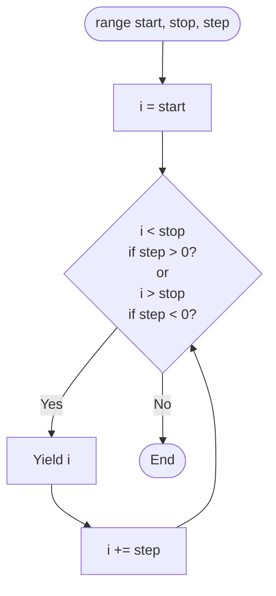

## `for` Loops and `range()`

`for` loops are for iterating over sequences (iterables). They are ideal when you want to process each item in a collection - a list, a string, a range of numbers, a file, or any other iterable object.

```python
fruits = ["apple", "banana", "cherry"]
for fruit in fruits:
    print(fruit)
```

The `for` loop automatically:
1. Gets the next item from the sequence
2. Assigns it to the loop variable (`fruit`)
3. Executes the loop body
4. Repeats until the sequence is exhausted

---

## Basic `for` Loop Syntax

```python
for variable in iterable:
    # code block - runs once per item
    # 'variable' holds the current item
```

### Iterating Over Different Types

```python
# List
colors = ["red", "green", "blue"]
for color in colors:
    print(color)

# String (character by character)
for char in "Python":
    print(char)  # P, y, t, h, o, n

# Tuple
coordinates = (10, 20, 30)
for coord in coordinates:
    print(coord)

# Set (order not guaranteed)
unique_numbers = {3, 1, 4, 1, 5}
for num in unique_numbers:
    print(num)
```

---

## `range()` (Counting Loops)

`range()` produces a sequence of integers. It's commonly used when you need to repeat something a specific number of times or iterate through indices.

### `range()` Syntax

```python
range(stop)           # 0 to stop-1
range(start, stop)    # start to stop-1
range(start, stop, step)  # start to stop-1, stepping by step
```



### Examples

```python
range(5)         # 0, 1, 2, 3, 4
range(2, 6)      # 2, 3, 4, 5
range(0, 10, 2)  # 0, 2, 4, 6, 8
range(10, 0, -1) # 10, 9, 8, 7, 6, 5, 4, 3, 2, 1
range(5, -1, -1) # 5, 4, 3, 2, 1, 0
```

### Common `range()` Patterns

```python
# Repeat something N times
for _ in range(3):    # _ indicates we don't use the variable
    print("Hello!")

# Count from 1 to N (inclusive)
for i in range(1, 6):
    print(i)  # 1, 2, 3, 4, 5

# Countdown
for i in range(5, 0, -1):
    print(i)  # 5, 4, 3, 2, 1

# Every other number (even numbers)
for i in range(0, 10, 2):
    print(i)  # 0, 2, 4, 6, 8

# Index-based loop
names = ["Alice", "Bob", "Charlie"]
for i in range(len(names)):
    print(f"{i}: {names[i]}")
```

---

## Direct Iteration vs Index-Based

### Prefer Direct Iteration

If you don't need the index, iterate directly over the collection:

```python
# Prefer this - cleaner and more Pythonic
names = ["Alice", "Bob", "Charlie"]
for name in names:
    print(name)

# Avoid this when you don't need the index
for i in range(len(names)):
    print(names[i])
```

Direct iteration is:
- More readable
- Less error-prone (no off-by-one errors)
- Works with any iterable (not just indexable sequences)

### When You Need Both Index and Value: `enumerate()`

If you need both the index and the value, use `enumerate()`:

```python
names = ["Alice", "Bob", "Charlie"]

# With enumerate - clean and Pythonic
for i, name in enumerate(names):
    print(f"{i}: {name}")

# Output:
# 0: Alice
# 1: Bob
# 2: Charlie

# Start counting from 1 instead of 0
for i, name in enumerate(names, start=1):
    print(f"{i}. {name}")

# Output:
# 1. Alice
# 2. Bob
# 3. Charlie
```

---

## Iterating Over Dictionaries

When you loop over a dictionary, you loop over **keys** by default:

```python
person = {"name": "Alice", "age": 30, "city": "NYC"}

# Default: iterate over keys
for key in person:
    print(f"{key}: {person[key]}")

# Explicit methods
for key in person.keys():
    print(key)

for value in person.values():
    print(value)

# Best for both key and value
for key, value in person.items():
    print(f"{key}: {value}")
```

### Dictionary Iteration Order

As of Python 3.7+, dictionaries maintain insertion order. You can rely on iterating in the order items were added.

---

## Parallel Iteration with `zip()`

`zip()` pairs up items from multiple iterables:

```python
names = ["Alice", "Bob", "Charlie"]
scores = [95, 87, 92]

for name, score in zip(names, scores):
    print(f"{name}: {score}")

# Output:
# Alice: 95
# Bob: 87
# Charlie: 92
```

### `zip()` Stops at Shortest

If iterables have different lengths, `zip()` stops at the shortest:

```python
a = [1, 2, 3, 4, 5]
b = ["a", "b", "c"]

for x, y in zip(a, b):
    print(x, y)
# Output: (1,a), (2,b), (3,c) - stops after 3

# To iterate to the longest, use itertools.zip_longest
from itertools import zip_longest
for x, y in zip_longest(a, b, fillvalue="?"):
    print(x, y)
# Output: (1,a), (2,b), (3,c), (4,?), (5,?)
```

### Combining `enumerate()` and `zip()`

```python
names = ["Alice", "Bob"]
scores = [95, 87]

for i, (name, score) in enumerate(zip(names, scores), start=1):
    print(f"{i}. {name}: {score}")
```

---

## Nested Loops (2D Work)

Nested loops are useful for grids, tables, matrices, and generating combinations:

```python
# Grid of coordinates
for row in range(3):
    for col in range(4):
        print(f"({row},{col})", end=" ")
    print()  # Newline after each row

# Output:
# (0,0) (0,1) (0,2) (0,3)
# (1,0) (1,1) (1,2) (1,3)
# (2,0) (2,1) (2,2) (2,3)
```

### Nested Loop with a 2D List

```python
matrix = [
    [1, 2, 3],
    [4, 5, 6],
    [7, 8, 9]
]

for row in matrix:
    for value in row:
        print(value, end=" ")
    print()
```

### Multiplication Table

```python
for i in range(1, 6):
    for j in range(1, 6):
        print(f"{i*j:3}", end=" ")
    print()
```

### Caution: Nested Loops Multiply Work

Be careful with nested loops - they multiply the work:
- 2 loops of 1000 iterations each = 1,000,000 total iterations
- 3 loops of 100 iterations each = 1,000,000 total iterations

```python
# O(n²) - can be slow for large n
for i in range(n):
    for j in range(n):
        # This runs n * n times
        pass
```

The time complexity is $O(n^2)$ - for an outer loop of size $n$ and an inner loop of size $n$, the total iterations are $n \times n = n^2$.

---

## Loop Variable Scope

In Python, the loop variable persists after the loop ends:

```python
for i in range(5):
    pass

print(i)  # 4 - the last value

for letter in "abc":
    pass

print(letter)  # 'c' - the last value
```

This can be useful but also a source of bugs if you accidentally use a loop variable outside the loop.

---

## Key Takeaways

- `for` loops iterate over sequences (lists, strings, ranges, etc.)
- `range(n)` produces 0 to n-1; `range(start, stop, step)` for more control
- **Prefer direct iteration** over index-based loops when possible
- Use `enumerate()` when you need both index and value
- Use `zip()` to iterate over multiple sequences in parallel
- Dictionary iteration: use `.items()` for key-value pairs
- Nested loops multiply iterations - be mindful of performance
- Loop variables persist after the loop ends
