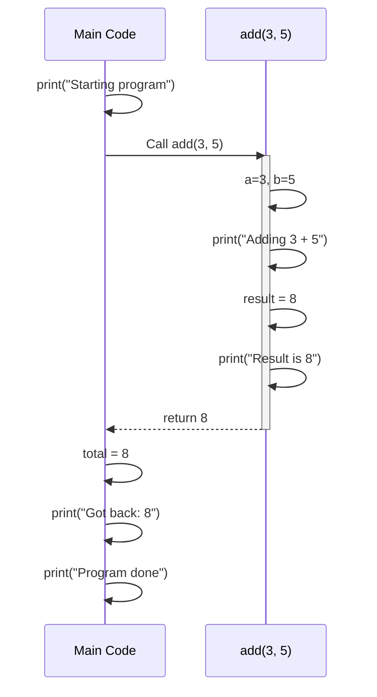

## Defining and Calling Functions

Creating your own functions involves two distinct steps: **defining** the function (writing the code) and **calling** it (running the code). This separation is what makes functions reusable - you define once, call many times.

---

## The Basic Function Definition

A function definition tells Python what the function should do. It doesn't run the code immediately - it just saves it for later use:

```python
def say_hello():
    print("Hello!")

# At this point, nothing has been printed yet
# The function is defined but not called
```

The `def` keyword is followed by:
1. The function name (`say_hello`)
2. Parentheses (which may contain parameters)
3. A colon
4. An indented block of code (the function body)

### Calling the Function

To actually run the code inside the function, you call it using its name followed by parentheses:

```python
def say_hello():
    print("Hello!")

say_hello()  # Output: Hello!
say_hello()  # Output: Hello!
say_hello()  # Output: Hello!
```

Each call executes the entire function body. You can call the same function as many times as you need.

---

## Parameters vs Arguments

These terms are often confused, but the distinction matters:

- **Parameter**: The variable name in the function definition (a placeholder)
- **Argument**: The actual value you pass when calling the function

```python
def greet(name):      # 'name' is a PARAMETER (definition)
    print(f"Hi, {name}!")

greet("Alice")        # "Alice" is an ARGUMENT (call)
greet("Bob")          # "Bob" is an ARGUMENT (call)
```

Think of parameters as empty boxes with labels, and arguments as the items you put in those boxes.

### Multiple Parameters

Functions can accept multiple parameters, separated by commas:

```python
def introduce(name, age, city):
    print(f"{name} is {age} years old and lives in {city}.")

introduce("Alice", 25, "New York")
introduce("Bob", 30, "Los Angeles")
```

When calling the function, the arguments are matched to parameters **by position**:
- First argument → first parameter
- Second argument → second parameter
- And so on...

### No Parameters

Some functions don't need any input:

```python
def print_separator():
    print("-" * 40)

def get_current_time():
    from datetime import datetime
    return datetime.now().strftime("%H:%M:%S")

print_separator()
print(get_current_time())
print_separator()
```

---

## Functions Should Usually Return Values

There are two ways a function can "give back" results:

1. **Printing** - Displays output to the screen
2. **Returning** - Sends a value back to the code that called the function

### The Problem with Only Printing

```python
def calculate_area_print(width, height):
    print(width * height)

# This prints 15, but we can't use the result
calculate_area_print(3, 5)

# This doesn't work - area is None!
area = calculate_area_print(3, 5)
print(f"The area is {area}")  # "The area is None"
```

When a function only prints, you can see the result but you can't use it in your program.

### The Power of Returning

```python
def calculate_area_return(width, height):
    return width * height

# Now we can use the result
area = calculate_area_return(3, 5)
print(f"The area is {area}")  # "The area is 15"

# We can use it in calculations
double_area = calculate_area_return(3, 5) * 2
print(double_area)  # 30

# We can use it in conditions
if calculate_area_return(10, 10) > 50:
    print("That's a big rectangle!")
```

### When to Print vs Return

| Use `print()` when... | Use `return` when... |
|----------------------|---------------------|
| You want to display output to the user | You want to use the result elsewhere in your code |
| The function's purpose is to display information | The function computes or transforms data |
| You're debugging | You're building reusable, composable functions |

```python
# Print: for displaying to user
def display_welcome(name):
    print(f"Welcome, {name}!")
    print("=" * 30)

# Return: for getting a value
def format_welcome(name):
    return f"Welcome, {name}!"

# Often you'll combine them
message = format_welcome("Alice")
print(message)  # Caller decides if/when to print
```

---

## The Flow of Execution

Understanding how function calls work is crucial:

```python
def add(a, b):
    print(f"Adding {a} + {b}")
    result = a + b
    print(f"Result is {result}")
    return result

print("Starting program")
total = add(3, 5)
print(f"Got back: {total}")
print("Program done")
```

Output:
```
Starting program
Adding 3 + 5
Result is 8
Got back: 8
Program done
```

The execution flow:
1. "Starting program" prints
2. Python sees `add(3, 5)` and jumps to the function
3. Inside the function: prints, calculates, prints, returns
4. Back in main code: `total` receives `8`
5. "Got back: 8" prints
6. "Program done" prints



### Return Exits the Function

Once `return` executes, the function immediately stops:

```python
def check_positive(number):
    if number <= 0:
        return "Not positive"
    print("This only runs for positive numbers")
    return "Positive"

print(check_positive(-5))   # "Not positive" (print line skipped)
print(check_positive(10))   # Prints message, then "Positive"
```

---

## The `pass` Placeholder

When you're planning your code structure but haven't written the implementation yet, use `pass` as a placeholder:

```python
def validate_email(email):
    pass  # TODO: implement this

def send_notification(user, message):
    pass  # TODO: implement this

def calculate_shipping(weight, destination):
    pass  # TODO: implement this
```

This lets you outline your program's structure before filling in the details. Without `pass`, you'd get a syntax error because Python expects at least one statement in the function body.

### Using `...` (Ellipsis)

You can also use `...` (ellipsis) as a placeholder:

```python
def future_feature():
    ...
```

Both `pass` and `...` work the same way - they're just placeholders that do nothing.

---

## Calling Functions Within Functions

Functions can call other functions:

```python
def square(n):
    return n * n

def sum_of_squares(a, b):
    return square(a) + square(b)

result = sum_of_squares(3, 4)  # 9 + 16 = 25
print(result)
```

This is the foundation of modular programming - building complex behavior from simple pieces.

### A More Practical Example

```python
def calculate_subtotal(prices):
    return sum(prices)

def calculate_tax(subtotal, tax_rate=0.08):
    return subtotal * tax_rate

def calculate_total(prices, tax_rate=0.08):
    subtotal = calculate_subtotal(prices)
    tax = calculate_tax(subtotal, tax_rate)
    return subtotal + tax

# Use the high-level function
prices = [29.99, 15.00, 8.50]
total = calculate_total(prices)
print(f"Total: ${total:.2f}")
```

Each function does one job, and they combine to create useful functionality.

---

## Common Mistakes

### Forgetting Parentheses

```python
def greet():
    return "Hello!"

# Wrong - this is the function object itself
message = greet
print(message)  # <function greet at 0x...>

# Right - this calls the function
message = greet()
print(message)  # "Hello!"
```

### Forgetting to Save the Return Value

```python
def add(a, b):
    return a + b

# Wrong - result is lost
add(3, 5)

# Right - save the result
result = add(3, 5)
```

### Defining but Never Calling

```python
def important_calculation():
    return 42

# This function is never called, so it never runs
print("Program done")
```

---

## Key Takeaways

- `def` defines a function; parentheses `()` call it
- Parameters are placeholders in the definition; arguments are values at call time
- Functions that `return` values are more flexible than functions that only `print`
- `return` immediately exits the function and sends a value back
- Use `pass` or `...` as placeholders for unimplemented functions
- Functions can call other functions to build complex behavior
- Always remember: define once, call many times

