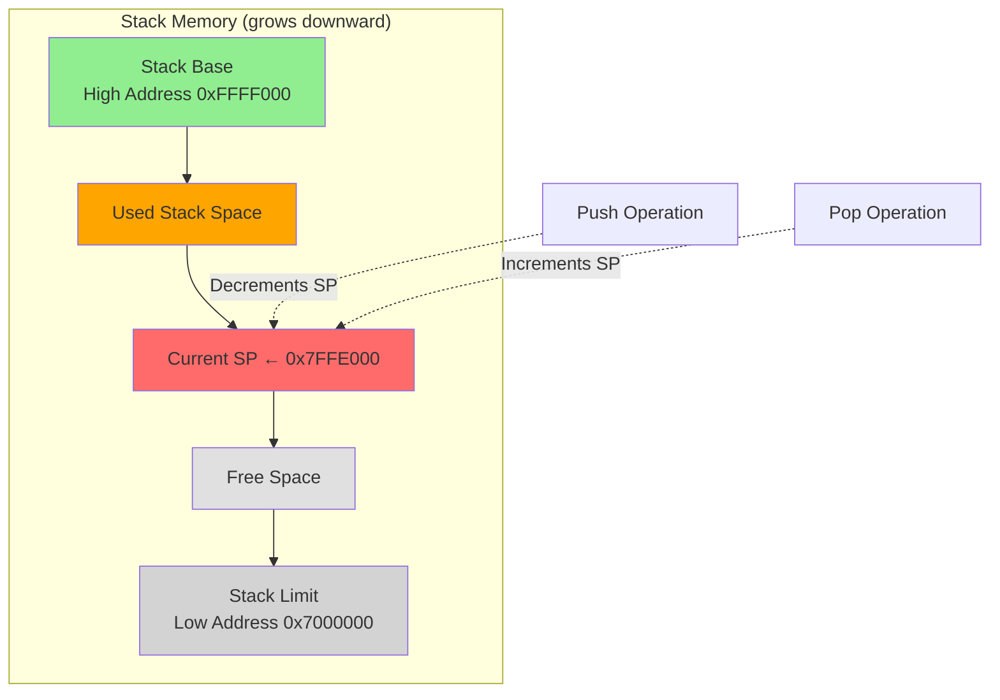
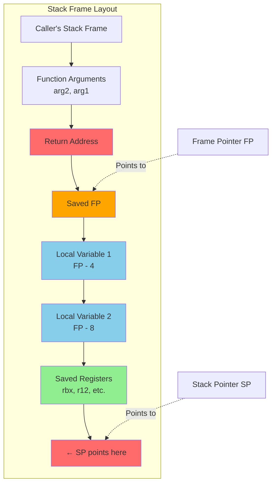

# The Stack: Calls, Returns, and Frames

The **stack** is a region of memory that plays a central role in program execution. It stores return addresses for function calls, local variables, and saved register values. Understanding the stack is essential for reading assembly code, debugging crashes, and understanding security vulnerabilities like buffer overflows.

## What Is the Stack?

The stack is a Last-In-First-Out (LIFO) data structure implemented as a contiguous region of memory. It's called a "stack" because it works like a stack of plates—you can only add or remove items from the top.

### Stack Pointer (SP)

The **stack pointer** register tracks the current "top" of the stack. On most architectures:
- **Push** decrements SP, then stores data at the new SP location
- **Pop** loads data from SP, then increments SP

The stack grows **downward** in memory on most systems (x86, ARM, MIPS). This means:
- Higher addresses = earlier (bottom of stack)
- Lower addresses = later (top of stack)
- Pushing decreases SP; popping increases SP

### Stack Operations

**Push** (store onto stack):
```assembly
; ARM conceptual
SUB SP, SP, #4        ; Make room
STR R0, [SP]          ; Store value

; x86
push eax              ; Single instruction does both
```

**Pop** (load from stack):
```assembly
; ARM conceptual
LDR R0, [SP]          ; Load value
ADD SP, SP, #4        ; Release space

; x86
pop eax               ; Single instruction does both
```

### Stack Memory Region

The operating system allocates a fixed-size region for the stack (typically 8 MB on Linux). Stack addresses are valid only within this region. Stack overflow (using too much stack space) causes a crash.

```
High addresses
+------------------+
| Stack base       |  ← Bottom of stack (initial SP)
|                  |
|    Used stack    |
|                  |
+------------------+  ← Current SP (top of stack)
|                  |
|    Free space    |
|                  |
+------------------+
| Stack limit      |  ← End of allocated region
+------------------+
Low addresses
```



## Function Calls and Returns

When a function is called, the CPU needs to:
1. **Save the return address** (where to continue after the function)
2. **Transfer control** to the function
3. **Execute the function body**
4. **Restore the return address** and resume at the caller

### The Call Instruction

The CALL instruction (or BL on ARM) does two things:
1. Saves the return address (next instruction after the call)
2. Jumps to the function

```assembly
; x86
call my_function      ; Push return address, jump to my_function

; ARM
BL   my_function      ; Save return address in LR, branch to my_function
```

On x86, the return address is pushed onto the stack.
On ARM, the return address is stored in the Link Register (LR).

### The Return Instruction

The RET instruction (or BX LR on ARM) returns to the caller:
1. Retrieves the return address
2. Jumps to that address

```assembly
; x86
ret                   ; Pop return address into PC

; ARM
BX   LR               ; Branch to address in LR
```

### Simple Call/Return Example

```assembly
; Caller
    MOV R0, #5        ; Argument
    BL  double        ; Call double(5)
    ; Returns here with result in R0
    ...

; Function: double(x) returns x*2
double:
    ADD R0, R0, R0    ; R0 = R0 * 2
    BX  LR            ; Return
```

## Stack Frames

A **stack frame** (also called activation record) is the portion of the stack used by a single function invocation. It contains:
- **Return address** (on x86, or saved LR on ARM if nested)
- **Saved registers** (callee-saved registers that the function modifies)
- **Local variables**
- **Function arguments** (sometimes—depends on calling convention)

### Frame Pointer (FP / BP)

The **frame pointer** provides a stable reference point within the stack frame. While SP changes as the function pushes and pops, FP remains constant throughout the function.

```
High addresses
+------------------+
| Caller's frame   |
+------------------+
| Return address   |  ← Where FP typically points (after setup)
+------------------+
| Saved FP         |
+------------------+
| Local variable 1 |  ← [FP - 4]
+------------------+
| Local variable 2 |  ← [FP - 8]
+------------------+
|     ...          |
+------------------+  ← SP (top of frame)
Low addresses
```



Local variables can be accessed at fixed offsets from FP regardless of what's been pushed onto the stack since.

### Function Prologue

The **prologue** is code at the start of a function that sets up the stack frame:

```assembly
; x86-64 prologue
push rbp              ; Save caller's frame pointer
mov  rbp, rsp         ; Set up our frame pointer
sub  rsp, 32          ; Allocate space for local variables
push rbx              ; Save callee-saved registers we'll use
```

```assembly
; ARM prologue
PUSH {FP, LR}         ; Save frame pointer and return address
MOV  FP, SP           ; Set up frame pointer
SUB  SP, SP, #16      ; Allocate local variable space
```

### Function Epilogue

The **epilogue** reverses the prologue before returning:

```assembly
; x86-64 epilogue
pop  rbx              ; Restore saved registers
mov  rsp, rbp         ; Deallocate local variables
pop  rbp              ; Restore caller's frame pointer
ret                   ; Return
```

```assembly
; ARM epilogue
ADD  SP, SP, #16      ; Deallocate locals
POP  {FP, LR}         ; Restore FP and return address
BX   LR               ; Return (or: POP {FP, PC} to return directly)
```

## Calling Conventions

A **calling convention** (part of the ABI—Application Binary Interface) defines:
- How arguments are passed (registers? stack?)
- How return values are returned
- Which registers the callee must preserve
- How the stack frame is structured

### Argument Passing

**ARM (AAPCS)**:
- Arguments 1-4 in R0-R3
- Additional arguments on stack
- Return value in R0 (R0-R1 for 64-bit)

**x86-64 (System V AMD64)**:
- Arguments 1-6 in RDI, RSI, RDX, RCX, R8, R9
- Additional arguments on stack (right to left)
- Return value in RAX

**x86-32 (cdecl)**:
- All arguments on stack (right to left)
- Return value in EAX
- Caller cleans up stack

### Register Preservation

**Caller-saved** (volatile): Function may freely modify these. Caller must save them if needed across the call.
- x86-64: RAX, RCX, RDX, RSI, RDI, R8-R11
- ARM: R0-R3, R12

**Callee-saved** (non-volatile): Function must restore these before returning.
- x86-64: RBX, RBP, R12-R15
- ARM: R4-R11

## Nested Calls and Recursion

When function A calls function B, B's frame is pushed on top of A's frame. When B returns, its frame is popped, exposing A's frame again.

```
Stack during A calling B calling C:

+------------------+
| A's frame        |
+------------------+
| B's frame        |
+------------------+
| C's frame        |  ← SP
+------------------+
```

**Recursion** works the same way—each recursive call creates a new frame. Deep recursion can exhaust stack space (stack overflow).

### Stack Trace Example

If C crashes, the debugger can walk the stack:
1. C's frame contains B's return address
2. B's frame contains A's return address
3. Continue up to main

This is how debuggers show "stack traces" or "backtraces."

## Security: Buffer Overflows

The stack layout creates a classic security vulnerability. Consider:

```c
void vulnerable() {
    char buffer[64];
    gets(buffer);  // Dangerous! No bounds checking
}
```

Stack layout:
```
+------------------+
| Return address   |  ← Target for attackers
+------------------+
| Saved FP         |
+------------------+
| buffer[63..0]    |  ← Input goes here
+------------------+
```

If input exceeds 64 bytes, it overwrites saved FP and return address. An attacker can inject a malicious return address, redirecting execution to attacker-controlled code.

### Mitigations

- **Stack canaries**: Secret value between buffer and return address; checked before return
- **ASLR**: Randomize stack addresses so attacker can't predict target
- **NX/DEP**: Mark stack memory non-executable
- **Safe functions**: Use `fgets`, `strncpy` instead of `gets`, `strcpy`

## Debugging with the Stack

### Reading a Stack Trace

```
#0  crash_here () at bug.c:10
#1  0x00401234 in process_data () at bug.c:25
#2  0x00401100 in main () at bug.c:50
```

Read bottom-up: main called process_data, which called crash_here, which crashed.

### Examining the Stack in GDB

```gdb
(gdb) info frame         ; Current frame info
(gdb) backtrace          ; Full stack trace
(gdb) frame 2            ; Select frame #2
(gdb) info locals        ; Local variables in current frame
(gdb) x/20x $sp          ; Examine 20 words at stack pointer
```

## Key Takeaways

- The **stack** is LIFO memory managed by the **stack pointer (SP)**.
- Most stacks grow **downward**; push decrements SP, pop increments SP.
- **CALL** saves return address and jumps; **RET** restores return address and jumps back.
- A **stack frame** contains return address, saved registers, and local variables.
- The **frame pointer (FP)** provides stable access to local variables.
- **Prologue** sets up the frame; **epilogue** tears it down.
- **Calling conventions** define argument passing, return values, and register preservation.
- Nested calls and recursion create stacked frames; deep recursion can overflow.
- **Buffer overflows** exploit stack layout to hijack control flow.
- Stack traces walk frames to show call history—essential for debugging.

