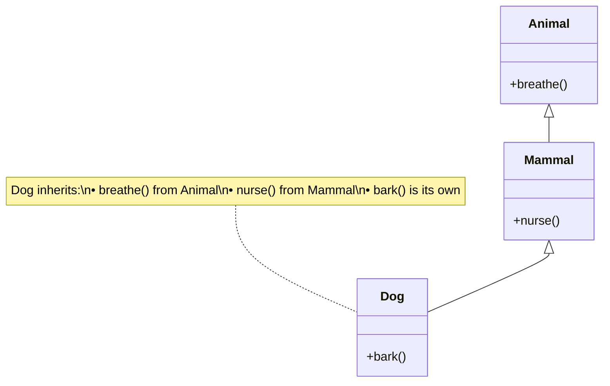

## Basic Inheritance: Parent and Child Classes

Creating a child class that inherits from a parent is straightforward. The child automatically receives all of the parent's attributes and methods.

---

## Inheritance Syntax

Use parentheses after the class name to specify the parent:

```python
class Parent:
    """The base class."""
    pass

class Child(Parent):
    """Inherits from Parent."""
    pass
```

---

## A Complete Example

```python
class Animal:
    def __init__(self, name):
        self.name = name

    def speak(self):
        return "Some generic sound"

    def eat(self):
        return f"{self.name} is eating"

class Dog(Animal):  # Dog inherits from Animal
    def speak(self):  # Override parent method
        return f"{self.name} says woof!"

    def fetch(self):  # Add new method
        return f"{self.name} fetches the ball"

# Create a Dog instance
buddy = Dog("Buddy")

# Inherited attributes and methods work
print(buddy.name)       # "Buddy" (inherited)
print(buddy.eat())      # "Buddy is eating" (inherited)

# Overridden method uses new behavior
print(buddy.speak())    # "Buddy says woof!" (overridden)

# New method unique to Dog
print(buddy.fetch())    # "Buddy fetches the ball" (new)
```

---

## What the Child Gets

A child class automatically receives:

### 1. Instance Attributes
```python
class Vehicle:
    def __init__(self, brand, year):
        self.brand = brand
        self.year = year

class Car(Vehicle):
    pass  # Gets brand and year from Vehicle

my_car = Car("Toyota", 2022)
print(my_car.brand)  # "Toyota"
print(my_car.year)   # 2022
```

### 2. Class Attributes
```python
class Animal:
    kingdom = "Animalia"

class Dog(Animal):
    pass

print(Dog.kingdom)  # "Animalia"
```

### 3. Methods
```python
class Shape:
    def describe(self):
        return "I am a shape"

class Circle(Shape):
    pass  # Gets describe() from Shape

c = Circle()
print(c.describe())  # "I am a shape"
```

---

## Checking Inheritance Relationships

Python provides tools to check class relationships:

```python
class Animal:
    pass

class Dog(Animal):
    pass

class Cat(Animal):
    pass

buddy = Dog()

# isinstance: Is this object an instance of this class (or parent)?
print(isinstance(buddy, Dog))      # True
print(isinstance(buddy, Animal))   # True (parent counts!)
print(isinstance(buddy, Cat))      # False

# issubclass: Is this class a child of another class?
print(issubclass(Dog, Animal))     # True
print(issubclass(Dog, Dog))        # True (class is subclass of itself)
print(issubclass(Cat, Dog))        # False
```

---

## The Universal Base: `object`

In Python 3, all classes implicitly inherit from `object`:

```python
class MyClass:
    pass

# These are equivalent:
class MyClass(object):
    pass

# Every class is a subclass of object
print(issubclass(MyClass, object))  # True
print(issubclass(int, object))      # True
print(issubclass(str, object))      # True
```

This is why all objects have methods like `__str__`, `__repr__`, and `__eq__`.

---

## Adding Child-Specific Attributes

Children can have their own attributes in addition to inherited ones:

```python
class Animal:
    def __init__(self, name):
        self.name = name

class Dog(Animal):
    def __init__(self, name, breed):
        super().__init__(name)  # Initialize parent attributes
        self.breed = breed      # Add child-specific attribute

buddy = Dog("Buddy", "Golden Retriever")
print(buddy.name)   # "Buddy" (from Animal)
print(buddy.breed)  # "Golden Retriever" (Dog-specific)
```

---

## Inheritance Chains

Classes can inherit from classes that inherit from other classes:

```python
class Animal:
    def breathe(self):
        return "Breathing..."

class Mammal(Animal):
    def nurse(self):
        return "Nursing young..."

class Dog(Mammal):
    def bark(self):
        return "Woof!"

# Dog has everything from the chain
buddy = Dog()
print(buddy.breathe())  # From Animal
print(buddy.nurse())    # From Mammal
print(buddy.bark())     # From Dog
```

### Inheritance Hierarchy Visualization



---

## Practical Example: User Hierarchy

```python
class User:
    def __init__(self, username, email):
        self.username = username
        self.email = email
        self.permissions = set()

    def has_permission(self, perm):
        return perm in self.permissions

class AdminUser(User):
    def __init__(self, username, email):
        super().__init__(username, email)
        self.permissions = {'read', 'write', 'delete', 'admin'}

class ModeratorUser(User):
    def __init__(self, username, email):
        super().__init__(username, email)
        self.permissions = {'read', 'write', 'moderate'}

class GuestUser(User):
    def __init__(self):
        super().__init__("guest", "")
        self.permissions = {'read'}

# Different users, same interface
admin = AdminUser("alice", "alice@example.com")
guest = GuestUser()

print(admin.has_permission('delete'))  # True
print(guest.has_permission('delete'))  # False
```

### User Hierarchy Diagram

```mermaid
classDiagram
    User <|-- AdminUser
    User <|-- ModeratorUser
    User <|-- GuestUser

    class User {
        +String username
        +String email
        +Set~String~ permissions
        +has_permission(perm)
    }

    class AdminUser {
        +permissions: {read, write, delete, admin}
    }

    class ModeratorUser {
        +permissions: {read, write, moderate}
    }

    class GuestUser {
        +permissions: {read}
    }
```

---

## Key Takeaways

- Child classes inherit from parents using `class Child(Parent):`
- Children receive all attributes and methods from parents
- Use `isinstance()` to check object types (includes parent types)
- Use `issubclass()` to check class relationships
- All Python classes inherit from `object`
- Inheritance chains allow multi-level hierarchies
