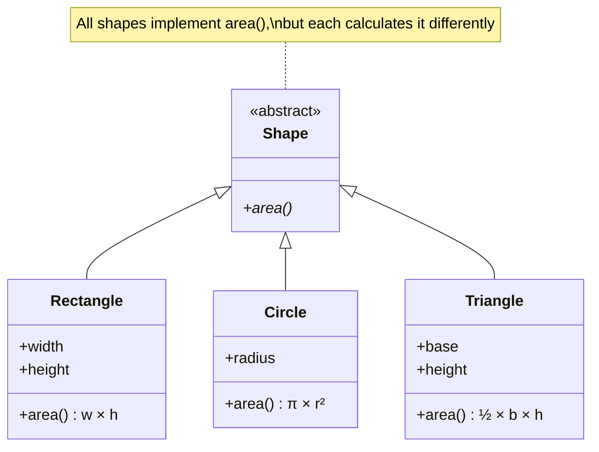
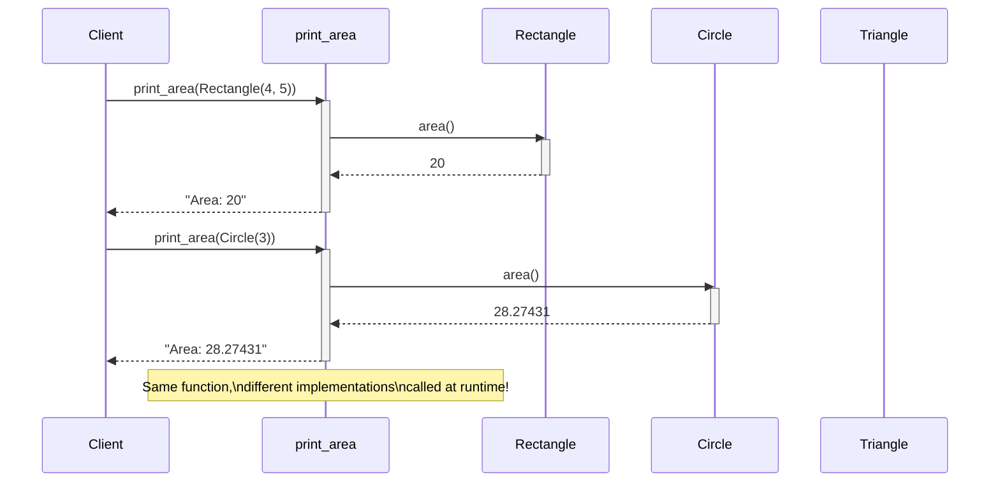

## Subtype Polymorphism (Method Overriding)

Subtype polymorphism is the classic OOP form: child classes override parent methods to provide specialized behavior. Code written for the parent type automatically works with children.

---

## How It Works

Different classes implement the same method differently:

```python
class Shape:
    def area(self):
        raise NotImplementedError

class Rectangle(Shape):
    def __init__(self, width, height):
        self.width = width
        self.height = height

    def area(self):
        return self.width * self.height

class Circle(Shape):
    def __init__(self, radius):
        self.radius = radius

    def area(self):
        return 3.14159 * self.radius ** 2

class Triangle(Shape):
    def __init__(self, base, height):
        self.base = base
        self.height = height

    def area(self):
        return 0.5 * self.base * self.height
```

### Polymorphism Class Hierarchy



---

## Polymorphic Functions

Functions that accept the parent type work with any child:

```python
def print_area(shape):
    """Works with any Shape subclass."""
    print(f"Area: {shape.area()}")

# Same function, different behaviors
print_area(Rectangle(4, 5))  # Area: 20
print_area(Circle(3))        # Area: 28.27431
print_area(Triangle(4, 6))   # Area: 12.0
```

### Method Dispatch Flow



---

## Polymorphic Collections

Store different types in the same collection:

```python
shapes = [
    Rectangle(10, 5),
    Circle(3),
    Triangle(8, 4),
    Rectangle(2, 2)
]

# Process all uniformly
total_area = sum(shape.area() for shape in shapes)
print(f"Total area: {total_area}")

# Find largest shape
largest = max(shapes, key=lambda s: s.area())
print(f"Largest: {largest.area()}")
```

---

## The Strategy Pattern

Swap implementations at runtime:

```python
class SortStrategy:
    def sort(self, data):
        raise NotImplementedError

class BubbleSort(SortStrategy):
    def sort(self, data):
        arr = list(data)
        for i in range(len(arr)):
            for j in range(len(arr) - 1):
                if arr[j] > arr[j + 1]:
                    arr[j], arr[j + 1] = arr[j + 1], arr[j]
        return arr

class QuickSort(SortStrategy):
    def sort(self, data):
        if len(data) <= 1:
            return list(data)
        pivot = data[len(data) // 2]
        left = [x for x in data if x < pivot]
        middle = [x for x in data if x == pivot]
        right = [x for x in data if x > pivot]
        return self.sort(left) + middle + self.sort(right)

class MergeSort(SortStrategy):
    def sort(self, data):
        if len(data) <= 1:
            return list(data)
        mid = len(data) // 2
        left = self.sort(data[:mid])
        right = self.sort(data[mid:])
        return self._merge(left, right)

    def _merge(self, left, right):
        result = []
        i = j = 0
        while i < len(left) and j < len(right):
            if left[i] <= right[j]:
                result.append(left[i])
                i += 1
            else:
                result.append(right[j])
                j += 1
        result.extend(left[i:])
        result.extend(right[j:])
        return result

# Client code doesn't care which algorithm
def process_data(data, sorter):
    return sorter.sort(data)

data = [3, 1, 4, 1, 5, 9, 2, 6]
print(process_data(data, BubbleSort()))  # Same result
print(process_data(data, QuickSort()))   # Different algorithm
print(process_data(data, MergeSort()))   # Yet another
```

---

## Plugin Architectures

Polymorphism enables plugin systems:

```python
class Plugin:
    def process(self, data):
        raise NotImplementedError

class CompressionPlugin(Plugin):
    def process(self, data):
        return f"compressed({data})"

class EncryptionPlugin(Plugin):
    def process(self, data):
        return f"encrypted({data})"

class LoggingPlugin(Plugin):
    def process(self, data):
        print(f"Processing: {data}")
        return data

class ValidationPlugin(Plugin):
    def process(self, data):
        if not data:
            raise ValueError("Empty data")
        return data

# Chain plugins together
def apply_plugins(data, plugins):
    for plugin in plugins:
        data = plugin.process(data)
    return data

pipeline = [
    ValidationPlugin(),
    LoggingPlugin(),
    CompressionPlugin(),
    EncryptionPlugin()
]

result = apply_plugins("Hello, World!", pipeline)
# Processing: Hello, World!
# encrypted(compressed(Hello, World!))
```

---

## Testing with Polymorphism

Swap real implementations with test doubles:

```python
class Database:
    def query(self, sql):
        # Real database query
        return fetch_from_database(sql)

class MockDatabase:
    def __init__(self, responses):
        self.responses = responses
        self.queries = []

    def query(self, sql):
        self.queries.append(sql)
        return self.responses.get(sql, [])

# Production code
def get_user(db, user_id):
    results = db.query(f"SELECT * FROM users WHERE id = {user_id}")
    return results[0] if results else None

# Test with mock
mock_db = MockDatabase({
    "SELECT * FROM users WHERE id = 1": [{"id": 1, "name": "Alice"}]
})

user = get_user(mock_db, 1)
assert user["name"] == "Alice"
assert "SELECT * FROM users WHERE id = 1" in mock_db.queries
```

---

## Benefits of Subtype Polymorphism

1. **Open/Closed Principle:** Open for extension, closed for modification
2. **Single point of change:** Add new types without changing client code
3. **Testability:** Easy to mock and test
4. **Clarity:** Behavior is localized in each class

---

## Key Takeaways

- Subtype polymorphism uses method overriding
- Write functions that accept base types—they work with all children
- Collections can hold mixed subtypes
- Strategy pattern enables runtime algorithm swapping
- Polymorphism is essential for plugin architectures and testing
