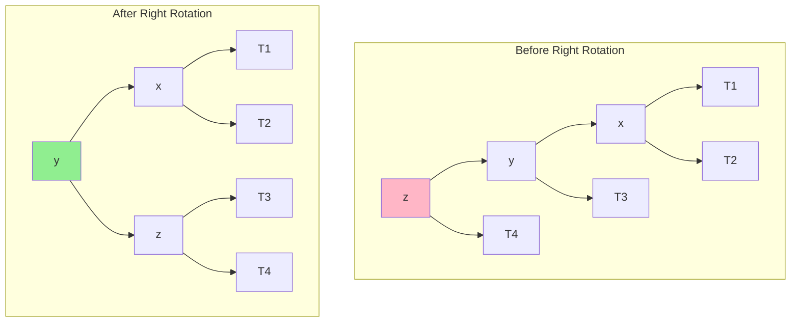
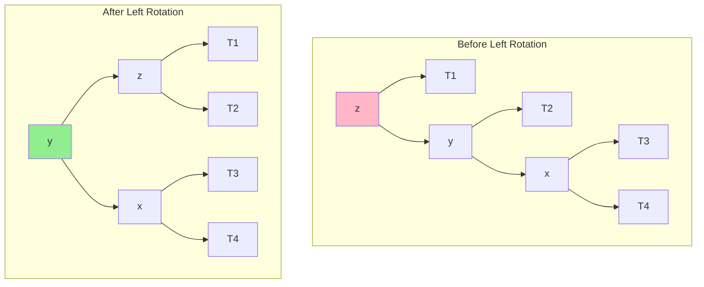
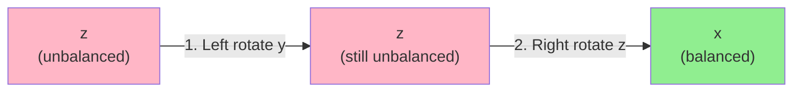
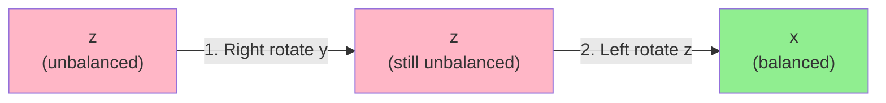

# Balanced Trees

Standard Binary Search Trees can become skewed, degrading operations from O(log n) to O(n). Balanced trees maintain height constraints to guarantee efficient operations. Understanding balanced trees is crucial for building high-performance applications.

## The Balance Problem

When elements are inserted in sorted order, a BST degrades into a linked list:

```
Inserting 1, 2, 3, 4, 5:
    1
     \
      2
       \
        3
         \
          4
           \
            5

Height = n-1, all operations become O(n)
```

A balanced tree keeps the height at O(log n), ensuring efficient operations.

## Height-Balanced Trees (AVL Trees)

An AVL tree maintains the property that for every node, the heights of left and right subtrees differ by at most 1.

**Balance Factor** = height(left subtree) - height(right subtree)

Valid balance factors: -1, 0, +1

```python
class AVLNode:
    def __init__(self, value):
        self.value = value
        self.left = None
        self.right = None
        self.height = 1  # Height of node (leaf = 1)

def get_height(node):
    return node.height if node else 0

def get_balance(node):
    if not node:
        return 0
    return get_height(node.left) - get_height(node.right)
```

## AVL Tree Rotations

When insertion or deletion violates the balance property, we perform rotations to restore balance.

### Right Rotation (Left-Left Case)

When the left subtree of the left child is too tall:



**Operation**: $y$ becomes new root, $z$ becomes right child of $y$, $T3$ moves to left child of $z$

```python
def right_rotate(z):
    y = z.left
    T3 = y.right

    # Perform rotation
    y.right = z
    z.left = T3

    # Update heights
    z.height = 1 + max(get_height(z.left), get_height(z.right))
    y.height = 1 + max(get_height(y.left), get_height(y.right))

    return y  # New root
```

### Left Rotation (Right-Right Case)

When the right subtree of the right child is too tall:



**Operation**: Mirror of right rotation - $y$ becomes root, $z$ becomes left child, $T2$ moves to right child of $z$

```python
def left_rotate(z):
    y = z.right
    T2 = y.left

    y.left = z
    z.right = T2

    z.height = 1 + max(get_height(z.left), get_height(z.right))
    y.height = 1 + max(get_height(y.left), get_height(y.right))

    return y
```

### Left-Right Case

Left child is right-heavy: first left rotate the left child, then right rotate.



**Two rotations needed**: Convert to Left-Left case, then apply right rotation

### Right-Left Case

Right child is left-heavy: first right rotate the right child, then left rotate.



**Two rotations needed**: Convert to Right-Right case, then apply left rotation

## AVL Insertion

```python
def avl_insert(root, value):
    # Standard BST insert
    if not root:
        return AVLNode(value)

    if value < root.value:
        root.left = avl_insert(root.left, value)
    elif value > root.value:
        root.right = avl_insert(root.right, value)
    else:
        return root  # No duplicates

    # Update height
    root.height = 1 + max(get_height(root.left), get_height(root.right))

    # Get balance factor
    balance = get_balance(root)

    # Left-Left Case
    if balance > 1 and value < root.left.value:
        return right_rotate(root)

    # Right-Right Case
    if balance < -1 and value > root.right.value:
        return left_rotate(root)

    # Left-Right Case
    if balance > 1 and value > root.left.value:
        root.left = left_rotate(root.left)
        return right_rotate(root)

    # Right-Left Case
    if balance < -1 and value < root.right.value:
        root.right = right_rotate(root.right)
        return left_rotate(root)

    return root
```

## Red-Black Trees

Red-Black trees are another self-balancing BST with a different approach. Each node is colored red or black, with rules that ensure balance.

**Properties:**
1. Every node is either red or black
2. The root is black
3. All leaves (NIL nodes) are black
4. Red nodes cannot have red children (no two consecutive reds)
5. Every path from a node to its descendant leaves contains the same number of black nodes

```python
class RBNode:
    def __init__(self, value):
        self.value = value
        self.left = None
        self.right = None
        self.parent = None
        self.color = 'RED'  # New nodes are always red
```

Red-Black trees guarantee that the longest path is at most twice the shortest path, ensuring O(log n) height.

## Comparison: AVL vs Red-Black

| Aspect | AVL | Red-Black |
|--------|-----|-----------|
| Balance | Stricter (height diff $\leq 1$) | Looser (longest $\leq 2 \times$ shortest) |
| Height Guarantee | $h \leq 1.44 \log n$ | $h \leq 2 \log n$ |
| Search | Slightly faster (lower height) | Slightly slower |
| Insert/Delete | More rotations | Fewer rotations |
| Use Cases | Read-heavy workloads | Write-heavy workloads |
| Implementation | Simpler | More complex |

**Height bounds**:
- AVL: Maximum height is $1.44 \log_2(n+2)$
- Red-Black: Maximum height is $2 \log_2(n+1)$

Both guarantee $O(\log n)$ operations, but AVL is more strictly balanced.

**Real-world usage:**
- AVL: Database indexing where reads dominate
- Red-Black: Language standard libraries (Java TreeMap, C++ std::map)

## B-Trees (Brief Introduction)

B-Trees are balanced trees optimized for disk-based storage. Instead of binary nodes, each node can have many children.

```
        [30|60]
       /   |   \
    [10|20] [40|50] [70|80|90]
```

Properties:
- All leaves are at the same depth
- Nodes can have many keys (reduces disk reads)
- Used in databases and file systems

## Practical Considerations

**When to use balanced trees:**
- Need guaranteed $O(\log n)$ operations
- Data is accessed in sorted order frequently
- Need efficient range queries
- Require predecessor/successor operations

**When to use hash tables instead:**
- Only need exact key lookup
- Don't need ordering
- Can tolerate worst-case $O(n)$ (rare with good hash functions)
- Want expected $O(1)$ operations

## Summary

Balanced trees solve the BST degradation problem by maintaining height constraints. AVL trees use strict height balance with rotations. Red-Black trees use color properties for looser balance with fewer rotations. Both guarantee O(log n) operations. Understanding these concepts prepares you for database indexing, language standard libraries, and system design.
