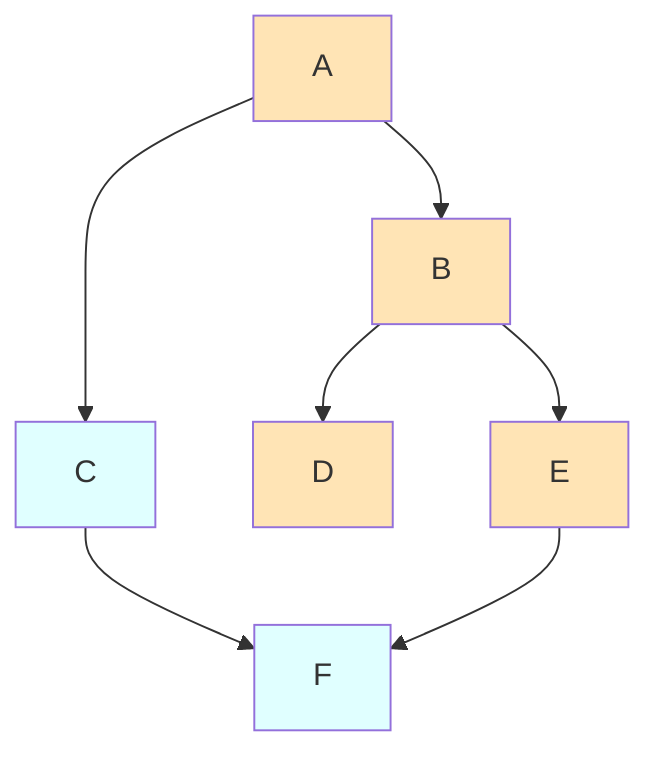

# Graph Traversals: DFS and BFS

Graph traversals are fundamental algorithms that visit all vertices in a graph. The two main traversal strategies - Depth-First Search (DFS) and Breadth-First Search (BFS) - form the basis for many graph algorithms.

## Depth-First Search (DFS)

DFS explores as far as possible along each branch before backtracking. Think of it as exploring a maze by always taking the first unexplored path until you hit a dead end.

### Recursive Implementation

```python
def dfs_recursive(graph, start, visited=None):
    """DFS using recursion."""
    if visited is None:
        visited = set()

    visited.add(start)
    print(start, end=' ')  # Process vertex

    for neighbor in graph[start]:
        if neighbor not in visited:
            dfs_recursive(graph, neighbor, visited)

    return visited

# Example
graph = {
    'A': ['B', 'C'],
    'B': ['A', 'D', 'E'],
    'C': ['A', 'F'],
    'D': ['B'],
    'E': ['B', 'F'],
    'F': ['C', 'E']
}
dfs_recursive(graph, 'A')  # A B D E F C
```

### Iterative Implementation

```python
def dfs_iterative(graph, start):
    """DFS using explicit stack."""
    visited = set()
    stack = [start]

    while stack:
        vertex = stack.pop()

        if vertex in visited:
            continue

        visited.add(vertex)
        print(vertex, end=' ')

        # Add neighbors to stack (reverse for consistent order)
        for neighbor in reversed(graph[vertex]):
            if neighbor not in visited:
                stack.append(neighbor)

    return visited
```

### DFS Properties

- **Time Complexity**: $O(V + E)$ for adjacency list
- **Space Complexity**: $O(V)$ for visited set + $O(V)$ for recursion stack
- **Order**: Explores deeply before widely
- **Path**: Does NOT guarantee shortest path

## Breadth-First Search (BFS)

BFS explores all neighbors at the current depth before moving deeper. Think of it as ripples spreading from a stone dropped in water.

### Implementation

```python
from collections import deque

def bfs(graph, start):
    """BFS using queue."""
    visited = set([start])
    queue = deque([start])

    while queue:
        vertex = queue.popleft()
        print(vertex, end=' ')

        for neighbor in graph[vertex]:
            if neighbor not in visited:
                visited.add(neighbor)
                queue.append(neighbor)

    return visited

# Using same graph
bfs(graph, 'A')  # A B C D E F (level by level)
```

### Level-Order BFS

Track the level/distance for each vertex:

```python
def bfs_with_levels(graph, start):
    """BFS tracking distance from start."""
    distances = {start: 0}
    queue = deque([start])

    while queue:
        vertex = queue.popleft()

        for neighbor in graph[vertex]:
            if neighbor not in distances:
                distances[neighbor] = distances[vertex] + 1
                queue.append(neighbor)

    return distances

# Returns: {'A': 0, 'B': 1, 'C': 1, 'D': 2, 'E': 2, 'F': 2}
```

### BFS Properties

- **Time Complexity**: $O(V + E)$ for adjacency list
- **Space Complexity**: $O(V)$ for visited set + $O(V)$ for queue
- **Order**: Explores level by level
- **Path**: Guarantees shortest path in unweighted graphs

**Why BFS finds shortest paths**: BFS explores nodes in order of increasing distance from the source. When a node is first discovered, we've found the shortest path to it.

## Comparison

| Aspect | DFS | BFS |
|--------|-----|-----|
| Data Structure | Stack (recursion) | Queue |
| Space (worst) | $O(V)$ | $O(V)$ |
| Space (typical) | $O(h)$ | $O(w)$ |
| Shortest Path | No | Yes (unweighted) |
| Complete | Yes | Yes |
| Good For | Cycle detection, topological sort, maze solving | Shortest path, level-order, web crawling |

Where $h$ is the height/depth of the graph and $w$ is the maximum width.

### Visual Comparison



**DFS Order** (orange): A → B → D → E → F → C (go deep first)
**BFS Order** (cyan): A → B → C → D → E → F (go wide first)

### Complexity Analysis

Both algorithms visit each vertex once and examine each edge once:

$$\text{Time Complexity} = O(V + E)$$

Where:
- $V$ = number of vertices
- $E$ = number of edges

**Space Complexity**:
- DFS: $O(V)$ for visited set + $O(h)$ for recursion stack, where $h$ is graph depth
- BFS: $O(V)$ for visited set + $O(w)$ for queue, where $w$ is maximum breadth

## Traversing All Components

For disconnected graphs, call traversal from each unvisited vertex:

```python
def dfs_all_components(graph):
    """Visit all vertices including disconnected components."""
    visited = set()

    for vertex in graph:
        if vertex not in visited:
            print(f"New component starting at {vertex}")
            dfs_recursive(graph, vertex, visited)
            print()  # Newline after each component

    return visited
```

## Path Finding

### Find Path Using DFS

```python
def find_path_dfs(graph, start, end, path=None):
    """Find a path from start to end using DFS."""
    if path is None:
        path = []

    path = path + [start]

    if start == end:
        return path

    for neighbor in graph.get(start, []):
        if neighbor not in path:
            result = find_path_dfs(graph, neighbor, end, path)
            if result:
                return result

    return None
```

### Find Shortest Path Using BFS

```python
def shortest_path_bfs(graph, start, end):
    """Find shortest path using BFS."""
    if start == end:
        return [start]

    visited = {start}
    queue = deque([(start, [start])])

    while queue:
        vertex, path = queue.popleft()

        for neighbor in graph[vertex]:
            if neighbor == end:
                return path + [neighbor]

            if neighbor not in visited:
                visited.add(neighbor)
                queue.append((neighbor, path + [neighbor]))

    return None  # No path exists
```

## Detecting Cycles

### In Undirected Graphs

```python
def has_cycle_undirected(graph):
    """Detect cycle in undirected graph using DFS."""
    visited = set()

    def dfs(vertex, parent):
        visited.add(vertex)

        for neighbor in graph[vertex]:
            if neighbor not in visited:
                if dfs(neighbor, vertex):
                    return True
            elif neighbor != parent:
                return True  # Back edge found

        return False

    for vertex in graph:
        if vertex not in visited:
            if dfs(vertex, None):
                return True

    return False
```

### In Directed Graphs

```python
def has_cycle_directed(graph):
    """Detect cycle in directed graph using DFS with colors."""
    WHITE, GRAY, BLACK = 0, 1, 2
    color = {v: WHITE for v in graph}

    def dfs(vertex):
        color[vertex] = GRAY  # Being processed

        for neighbor in graph.get(vertex, []):
            if color[neighbor] == GRAY:
                return True  # Back edge to ancestor
            if color[neighbor] == WHITE:
                if dfs(neighbor):
                    return True

        color[vertex] = BLACK  # Done processing
        return False

    for vertex in graph:
        if color[vertex] == WHITE:
            if dfs(vertex):
                return True

    return False
```

## Bi-directional BFS

For finding shortest path between two specific nodes, search from both ends:

```python
def bidirectional_bfs(graph, start, end):
    """Faster shortest path using bi-directional BFS."""
    if start == end:
        return [start]

    front = {start: [start]}
    back = {end: [end]}

    while front and back:
        # Expand the smaller frontier
        if len(front) <= len(back):
            front, result = expand(graph, front, back)
        else:
            back, result = expand(graph, back, front)

        if result:
            return result

    return None

def expand(graph, current, other):
    """Expand frontier by one level."""
    new_frontier = {}

    for vertex, path in current.items():
        for neighbor in graph.get(vertex, []):
            if neighbor in other:
                # Found connection!
                return new_frontier, path + other[neighbor][::-1]

            if neighbor not in current:
                new_frontier[neighbor] = path + [neighbor]

    return new_frontier, None
```

## Summary

DFS and BFS are fundamental graph traversals with different strengths. DFS uses a stack (recursion) and explores deeply, useful for cycle detection and topological sorting. BFS uses a queue and explores level by level, guaranteeing shortest paths in unweighted graphs. Both run in O(V + E) time. Choose based on your specific problem requirements.
