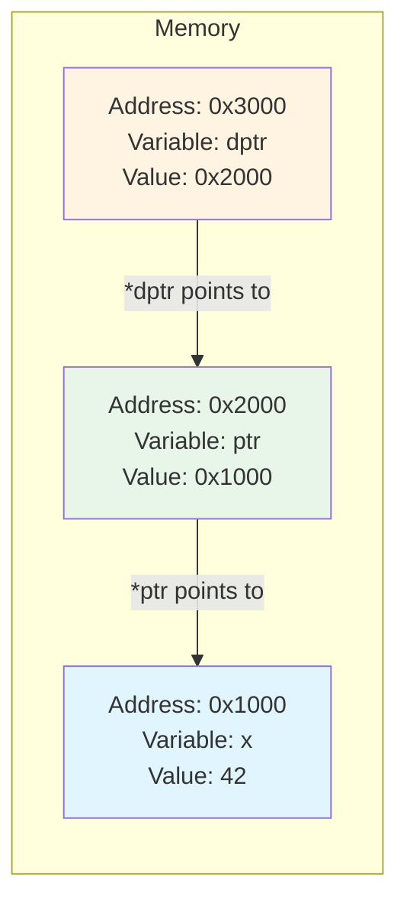
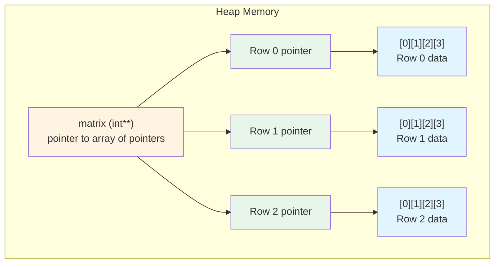

# Double Pointers (Pointer to Pointer)

A double pointer is a pointer that holds the address of another pointer. While this sounds abstract, double pointers solve practical problems like modifying a pointer in a function, creating 2D arrays, and working with arrays of strings.

## Understanding Double Pointers

A regular pointer stores an address to data. A double pointer stores an address to a pointer:

```c
int x = 42;
int *ptr = &x;       // ptr points to x
int **dptr = &ptr;   // dptr points to ptr

printf("x = %d\n", x);           // 42
printf("*ptr = %d\n", *ptr);     // 42
printf("**dptr = %d\n", **dptr); // 42
```

### Double Pointer Indirection Diagram



Each level of indirection requires one dereference operation:
- `dptr` holds address 0x3000
- `*dptr` = value at 0x3000 = 0x2000 (the value in `ptr`)
- `**dptr` = value at 0x2000 = 0x1000, then value at 0x1000 = 42

## When Do You Need Double Pointers?

### 1. Modifying a Pointer in a Function

Single pointers can't modify the original pointer in the caller:

```c
void setToNull(int *ptr) {
    ptr = NULL;  // Only changes local copy!
}

int main() {
    int x = 5;
    int *p = &x;
    setToNull(p);
    // p still points to x, not NULL!
    return 0;
}
```

Use a double pointer to modify the original:

```c
void setToNull(int **ptr) {
    *ptr = NULL;  // Modifies the original pointer
}

int main() {
    int x = 5;
    int *p = &x;
    setToNull(&p);  // Pass address of pointer
    // p is now NULL
    return 0;
}
```

### 2. Allocating Memory in Functions

A common pattern for functions that allocate memory:

```c
int createArray(int **arr, int size) {
    *arr = malloc(size * sizeof(int));
    if (*arr == NULL) {
        return -1;  // Allocation failed
    }
    return 0;  // Success
}

int main() {
    int *numbers = NULL;

    if (createArray(&numbers, 10) == 0) {
        // numbers now points to allocated memory
        for (int i = 0; i < 10; i++) {
            numbers[i] = i * i;
        }
        free(numbers);
    }

    return 0;
}
```

### 3. Building Linked Data Structures

Double pointers simplify linked list operations:

```c
typedef struct Node {
    int data;
    struct Node *next;
} Node;

// Without double pointer: awkward special case for head
void insertAtHead(Node **head, int data) {
    Node *newNode = malloc(sizeof(Node));
    newNode->data = data;
    newNode->next = *head;
    *head = newNode;  // Update the original head pointer
}

int main() {
    Node *list = NULL;
    insertAtHead(&list, 10);  // list now points to first node
    insertAtHead(&list, 20);  // list now points to new first node
    return 0;
}
```

## 2D Arrays with Double Pointers

Double pointers can represent 2D arrays dynamically:

```c
// Allocate 2D array
int rows = 3, cols = 4;
int **matrix = malloc(rows * sizeof(int*));

for (int i = 0; i < rows; i++) {
    matrix[i] = malloc(cols * sizeof(int));
}

// Access elements
matrix[1][2] = 42;  // Row 1, Column 2

// Free 2D array
for (int i = 0; i < rows; i++) {
    free(matrix[i]);
}
free(matrix);
```

### 2D Array Memory Layout



Memory allocation requires $n + 1$ `malloc` calls for an $n$-row matrix: one for the array of row pointers, plus one for each row.

## Arrays of Strings

Strings in C are `char*`. An array of strings is `char**`:

```c
char **names = malloc(3 * sizeof(char*));
names[0] = "Alice";
names[1] = "Bob";
names[2] = "Charlie";

for (int i = 0; i < 3; i++) {
    printf("%s\n", names[i]);
}

free(names);  // Only free the array of pointers
              // Don't free string literals!
```

Dynamic string array:
```c
char **createStringArray(int count) {
    char **arr = malloc(count * sizeof(char*));
    for (int i = 0; i < count; i++) {
        arr[i] = malloc(100);  // 100 chars per string
        arr[i][0] = '\0';      // Initialize as empty string
    }
    return arr;
}

void freeStringArray(char **arr, int count) {
    for (int i = 0; i < count; i++) {
        free(arr[i]);
    }
    free(arr);
}
```

## Command Line Arguments

`main` can receive arguments as a double pointer:

```c
int main(int argc, char **argv) {
    // argc: number of arguments
    // argv: array of string pointers

    printf("Program name: %s\n", argv[0]);

    for (int i = 1; i < argc; i++) {
        printf("Argument %d: %s\n", i, argv[i]);
    }

    return 0;
}

// Running: ./program hello world
// Output:
// Program name: ./program
// Argument 1: hello
// Argument 2: world
```

`char **argv` and `char *argv[]` are equivalent in function parameters.

## Dereferencing Multiple Levels

```c
int x = 100;
int *p = &x;
int **pp = &p;
int ***ppp = &pp;

// All access x:
x;
*p;
**pp;
***ppp;

// All access p:
p;
*pp;
**ppp;

// All access pp:
pp;
*ppp;
```

## Common Patterns

**Safe free and nullify:**
```c
void safeFree(int **ptr) {
    if (*ptr != NULL) {
        free(*ptr);
        *ptr = NULL;
    }
}

int main() {
    int *data = malloc(100);
    safeFree(&data);  // data is now NULL
    safeFree(&data);  // Safe: does nothing
    return 0;
}
```

**Return allocated memory via parameter:**
```c
int readFile(const char *filename, char **content, size_t *size) {
    FILE *f = fopen(filename, "r");
    if (!f) return -1;

    fseek(f, 0, SEEK_END);
    *size = ftell(f);
    fseek(f, 0, SEEK_SET);

    *content = malloc(*size + 1);
    fread(*content, 1, *size, f);
    (*content)[*size] = '\0';

    fclose(f);
    return 0;
}
```

## Key Takeaways

- A double pointer (`int **`) stores the address of a pointer
- Use double pointers to modify a pointer in a function
- Double pointers enable dynamic 2D arrays
- Arrays of strings are naturally `char **`
- `main` uses `char **argv` for command line arguments
- Each `*` follows one level of indirection
- Always match the number of malloc/free calls for each level

Double pointers are essential for dynamic data structures and flexible memory management. In the next section, we'll explore function pointers.
