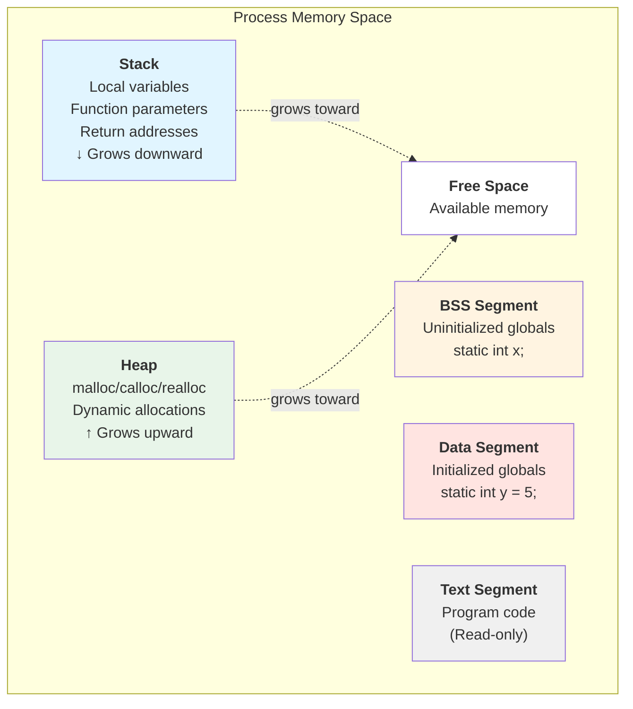
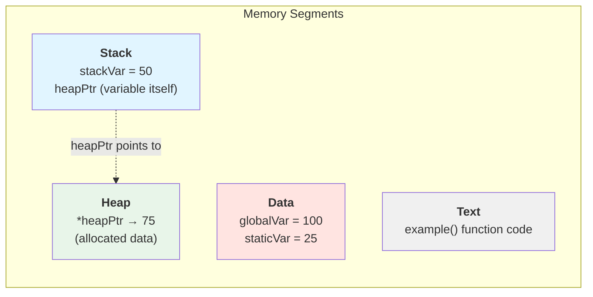

# Stack vs Heap Memory

Understanding memory organization is fundamental to C programming. C provides two main regions for storing data: the stack and the heap. Each has different characteristics that affect how you write programs.

## Memory Layout of a C Program

When a C program runs, memory is organized into several segments:

```
High Addresses
┌─────────────────┐
│      Stack      │  ← Local variables, function calls (grows down)
├─────────────────┤
│        ↓        │
│    (unused)     │
│        ↑        │
├─────────────────┤
│      Heap       │  ← Dynamic allocation (grows up)
├─────────────────┤
│      BSS       │  ← Uninitialized global/static variables
├─────────────────┤
│      Data       │  ← Initialized global/static variables
├─────────────────┤
│      Text       │  ← Program code (read-only)
└─────────────────┘
Low Addresses
```

### Memory Layout Diagram



## The Stack

The stack is used for:
- Local variables
- Function parameters
- Return addresses
- Temporary values

```c
void foo() {
    int x = 10;       // On stack
    char buffer[100]; // On stack
    double y = 3.14;  // On stack
}  // All automatically freed when function returns
```

**Stack characteristics:**
- **Automatic management**: Variables are created and destroyed automatically
- **Fast allocation**: Just moving a pointer
- **Limited size**: Typically 1-8 MB (can cause stack overflow)
- **LIFO order**: Last In, First Out
- **Contiguous**: Variables are placed sequentially

## The Heap

The heap is used for:
- Dynamically allocated memory
- Data that must outlive the current function
- Large data structures
- Data whose size isn't known at compile time

```c
void bar() {
    int *ptr = malloc(sizeof(int));  // On heap
    *ptr = 42;
    // ptr itself is on stack, but points to heap memory
    // Must free(ptr) or memory leaks!
}
```

**Heap characteristics:**
- **Manual management**: You allocate and free explicitly
- **Slower allocation**: More bookkeeping required
- **Large capacity**: Limited only by system memory
- **Fragmentation**: Can become fragmented over time
- **Non-contiguous**: Allocations scattered in memory

## Comparing Stack and Heap

| Aspect | Stack | Heap |
|--------|-------|------|
| Management | Automatic | Manual (malloc/free) |
| Speed | Very fast | Slower |
| Size limit | Small (MB) | Large (GB) |
| Lifetime | Until function returns | Until you free it |
| Access | Direct | Through pointers |
| Fragmentation | No | Yes |
| Growth direction | Downward | Upward |

## When to Use Each

**Use the stack for:**
```c
void stackExamples() {
    int count = 0;                    // Simple variables
    double values[100];               // Fixed-size arrays (if small)
    struct Point { int x, y; } p;     // Small structures
}
```

**Use the heap for:**
```c
void heapExamples() {
    // Size determined at runtime
    int n;
    scanf("%d", &n);
    int *arr = malloc(n * sizeof(int));

    // Large arrays
    int *bigArray = malloc(1000000 * sizeof(int));

    // Data that must outlive the function
    // (returned to caller)
}
```

## Stack Overflow

The stack has limited size. Exceeding it causes a crash:

```c
// BAD: Huge array on stack
void stackOverflow() {
    int huge[10000000];  // Likely crash!
}

// BAD: Infinite recursion
void infinite() {
    infinite();  // Eventually crashes
}

// GOOD: Large data on heap
void properLarge() {
    int *huge = malloc(10000000 * sizeof(int));
    if (huge) {
        // Use it...
        free(huge);
    }
}
```

## Memory Visualization

```c
int globalVar = 100;  // Data segment

void example() {
    int stackVar = 50;              // Stack
    static int staticVar = 25;      // Data segment
    int *heapPtr = malloc(4);       // heapPtr on stack, data on heap
    *heapPtr = 75;

    printf("globalVar: %p\n", &globalVar);
    printf("stackVar: %p\n", &stackVar);
    printf("staticVar: %p\n", &staticVar);
    printf("heapPtr: %p\n", heapPtr);

    free(heapPtr);
}
```

### Variable Placement Diagram



## Lifetime Comparison

```c
int* createOnStack() {
    int local = 42;
    return &local;  // DANGEROUS! local is destroyed
}

int* createOnHeap() {
    int *ptr = malloc(sizeof(int));
    *ptr = 42;
    return ptr;  // SAFE! Data persists until free()
}

int main() {
    int *bad = createOnStack();   // Dangling pointer!
    int *good = createOnHeap();   // Valid pointer

    // printf("%d\n", *bad);  // Undefined behavior
    printf("%d\n", *good);     // 42

    free(good);  // Don't forget!
    return 0;
}
```

## Static Variables

Static variables live in the data segment, not stack or heap:

```c
void counter() {
    static int count = 0;  // Initialized once, persists
    count++;
    printf("Called %d times\n", count);
}

int main() {
    counter();  // 1
    counter();  // 2
    counter();  // 3
    return 0;
}
```

## Key Takeaways

- Stack: automatic, fast, limited size, short-lived
- Heap: manual, slower, large capacity, persistent
- Use stack for small, fixed-size, local data
- Use heap for large, dynamic, or long-lived data
- Stack overflow crashes the program
- Heap requires explicit free() to avoid leaks
- Static variables persist like heap but don't need freeing

Understanding this memory model is essential for writing efficient, bug-free C programs. Next, we'll explore malloc and free in detail.
