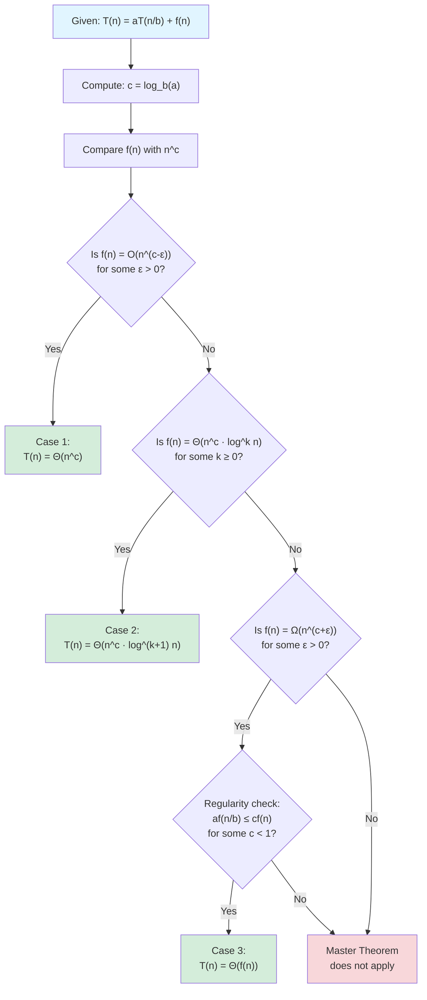

# The Master Theorem

The Master Theorem is a powerful tool that instantly solves most divide-and-conquer recurrences. Instead of drawing recursion trees or grinding through substitution proofs, you compare the recurrence's parameters to determine which of three cases applies, then read off the solution. For the vast majority of divide-and-conquer algorithms, the Master Theorem provides the answer in seconds.

The theorem's genius lies in its characterization of where work concentrates. In some algorithms, most work happens at the leaves of the recursion tree—the base cases dominate. In others, work is evenly distributed across all levels. In still others, the root dominates—the combine step overshadows recursion. The Master Theorem identifies which pattern applies by comparing the combine step's cost to the number and size of subproblems.

Understanding the Master Theorem means understanding the three cases intuitively, not just memorizing formulas. Case 1 applies when recursion creates more work than combination eliminates—work grows toward the leaves. Case 3 applies when combination dominates—work shrinks toward the leaves. Case 2, the balanced case, applies when work is roughly equal at each level, giving an extra logarithmic factor. This intuition helps recognize which case applies and why.

## Standard Form

The Master Theorem applies to recurrences of the form:

$$T(n) = aT(n/b) + f(n)$$

Where:
- **$a \geq 1$**: Number of subproblems
- **$b > 1$**: Factor by which input size shrinks
- **$f(n)$**: Work done outside recursive calls (divide + combine)

## The Three Cases

Compare $f(n)$ with $n^{\log_b a}$:

### Case 1: Recursion Dominates

If $f(n) = O(n^{\log_b a - \varepsilon})$ for some $\varepsilon > 0$:

$$T(n) = \Theta(n^{\log_b a})$$

**Intuition**: Work at leaves dominates; most work happens in recursive calls.

**Example**: Binary search variant
- $T(n) = 2T(n/2) + O(1)$
- $a = 2, b = 2, \log_b a = 1$
- $f(n) = O(1) = O(n^0)$, which is $O(n^{1-\varepsilon})$ for $\varepsilon = 1$
- Case 1: $T(n) = \Theta(n)$

### Case 2: Equal Work at All Levels

If $f(n) = \Theta(n^{\log_b a} \cdot \log^k n)$ for some $k \geq 0$:

$$T(n) = \Theta(n^{\log_b a} \cdot \log^{k+1} n)$$

**Special case** ($k = 0$): If $f(n) = \Theta(n^{\log_b a})$:

$$T(n) = \Theta(n^{\log_b a} \cdot \log n)$$

**Intuition**: Work evenly distributed across levels; $\log n$ levels contribute.

**Example**: Merge sort
- $T(n) = 2T(n/2) + \Theta(n)$
- $a = 2, b = 2, \log_b a = 1$
- $f(n) = \Theta(n) = \Theta(n^1)$
- Case 2 ($k=0$): $T(n) = \Theta(n \log n)$

### Case 3: Combine Step Dominates

If $f(n) = \Omega(n^{\log_b a + \varepsilon})$ for some $\varepsilon > 0$, AND $f(n)$ satisfies the regularity condition $af(n/b) \leq cf(n)$ for some $c < 1$:

$$T(n) = \Theta(f(n))$$

**Intuition**: Work at root dominates; recursive work is negligible.

**Example**: Select algorithm's worst case analysis
- $T(n) = T(n/2) + \Theta(n)$
- $a = 1, b = 2, \log_b a = 0$
- $f(n) = \Theta(n) = \Omega(n^{0+1})$
- Regularity: $1 \cdot f(n/2) = n/2 \leq (1/2) \cdot n = (1/2) \cdot f(n)$ ✓
- Case 3: $T(n) = \Theta(n)$

## Worked Examples

### Example 1: Karatsuba Multiplication

$$T(n) = 3T(n/2) + \Theta(n)$$

- $a = 3, b = 2$
- $\log_2 3 \approx 1.585$
- $f(n) = \Theta(n) = O(n^{1.585 - 0.585})$

**Case 1**: $T(n) = \Theta(n^{\log_2 3}) \approx \Theta(n^{1.585})$

### Example 2: Strassen's Matrix Multiplication

$$T(n) = 7T(n/2) + \Theta(n^2)$$

- $a = 7, b = 2$
- $\log_2 7 \approx 2.807$
- $f(n) = \Theta(n^2) = O(n^{2.807 - 0.807})$

**Case 1**: $T(n) = \Theta(n^{\log_2 7}) \approx \Theta(n^{2.807})$

### Example 3: Modified Binary Search

$$T(n) = T(n/2) + \Theta(\log n)$$

- $a = 1, b = 2$
- $\log_2 1 = 0$
- $f(n) = \Theta(\log n)$

This doesn't fit standard cases! $f(n) = \Theta(\log n)$ is between $\Theta(1)$ and $\Theta(n^\varepsilon)$.

**Solution by expansion**:

$$\begin{align*}
T(n) &= \log n + \log(n/2) + \log(n/4) + \cdots \\
     &= \log n + (\log n - 1) + (\log n - 2) + \cdots \\
     &= \Theta(\log^2 n)
\end{align*}$$

### Example 4: Balanced Partition

$$T(n) = 2T(n/2) + n \log n$$

- $a = 2, b = 2$
- $\log_2 2 = 1$
- $f(n) = n \log n = \Theta(n^1 \cdot \log n)$

**Case 2** ($k = 1$): $T(n) = \Theta(n \log^2 n)$

### Example 5: Unequal Division

```
T(n) = T(n/3) + T(2n/3) + Θ(n)
```

Master Theorem doesn't directly apply (different subproblem sizes). But analysis shows work is Θ(n) per level, log_{3/2}(n) levels deep.

**Result**: T(n) = Θ(n log n)

## Recognizing Cases

### Decision Flow Diagram



### Quick Decision Guide

Given $T(n) = aT(n/b) + f(n)$:

1. Compute $c = \log_b a$

2. Compare $f(n)$ to $n^c$:
   - $f(n)$ polynomially smaller → **Case 1** → $T(n) = \Theta(n^c)$
   - $f(n) \approx n^c$ (within log factors) → **Case 2** → Add $\log n$ factor
   - $f(n)$ polynomially larger (and regularity holds) → **Case 3** → $T(n) = \Theta(f(n))$

### Common Patterns

| Recurrence | log_b(a) | f(n) | Case | T(n) |
|------------|----------|------|------|------|
| T(n) = 2T(n/2) + 1 | 1 | O(1) | 1 | Θ(n) |
| T(n) = 2T(n/2) + n | 1 | Θ(n) | 2 | Θ(n log n) |
| T(n) = 2T(n/2) + n² | 1 | Ω(n²) | 3 | Θ(n²) |
| T(n) = 4T(n/2) + n | 2 | O(n) | 1 | Θ(n²) |
| T(n) = 4T(n/2) + n² | 2 | Θ(n²) | 2 | Θ(n² log n) |
| T(n) = T(n/2) + n | 0 | Ω(n) | 3 | Θ(n) |

## When Master Theorem Doesn't Apply

### Gap Between Cases

If f(n) differs from n^(log_b(a)) by less than a polynomial factor:

```
T(n) = 2T(n/2) + n/log n
```

Here f(n) = n/log n is not polynomially different from n. Use other methods.

### Non-Constant a or b

```
T(n) = √n · T(√n) + n
```

Master Theorem requires constant a and b.

### Floor/Ceiling Effects

```
T(n) = 2T(⌊n/2⌋) + n
```

In practice, floors/ceilings don't affect asymptotic result. Can usually apply Master Theorem.

### Regularity Condition Fails

In Case 3, if af(n/b) > cf(n) for all c < 1, the theorem doesn't apply directly.

## Extended Master Theorem

For more cases, including logarithmic gaps:

If f(n) = Θ(n^(log_b(a)) · (log n)^k):
- k > -1: T(n) = Θ(n^(log_b(a)) · (log n)^(k+1))
- k = -1: T(n) = Θ(n^(log_b(a)) · log log n)
- k < -1: T(n) = Θ(n^(log_b(a)))

## Alternative: Akra-Bazzi Method

For more general recurrences:

```
T(n) = Σᵢ aᵢT(bᵢn + hᵢ(n)) + g(n)
```

Find p such that Σᵢ aᵢbᵢ^p = 1, then:

```
T(n) = Θ(n^p · (1 + ∫₁ⁿ g(u)/u^(p+1) du))
```

Handles unequal splits and floor/ceiling terms rigorously.

## Proof Intuition

### Recursion Tree Analysis

The Master Theorem can be understood through recursion trees:

- **Depth**: log_b(n) levels
- **Nodes at level i**: a^i
- **Work per node at level i**: f(n/b^i)
- **Total work at level i**: a^i · f(n/b^i)

**Case 1**: Work increases geometrically down the tree; leaves dominate.

**Case 2**: Work roughly equal at each level; multiply by number of levels.

**Case 3**: Work decreases geometrically down the tree; root dominates.

## Summary

The Master Theorem is a powerful tool for analyzing divide-and-conquer algorithms:

1. Write recurrence in form T(n) = aT(n/b) + f(n)
2. Compute log_b(a)
3. Compare f(n) to n^(log_b(a))
4. Apply appropriate case

When it doesn't apply, fall back to:
- Substitution method
- Recursion tree analysis
- Akra-Bazzi method

