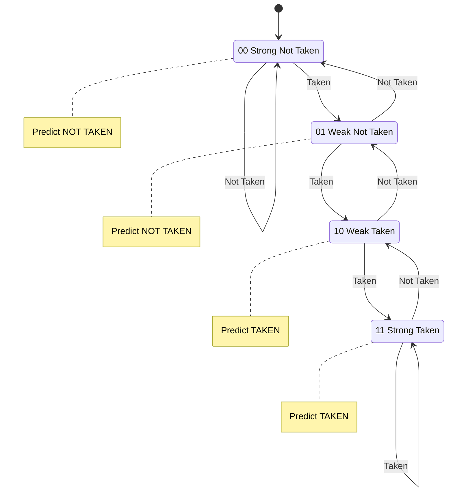
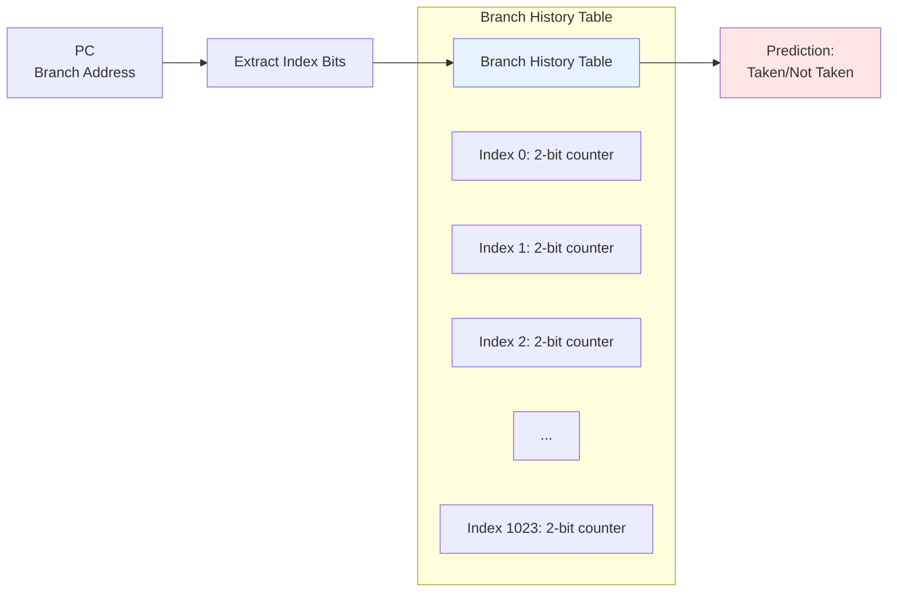
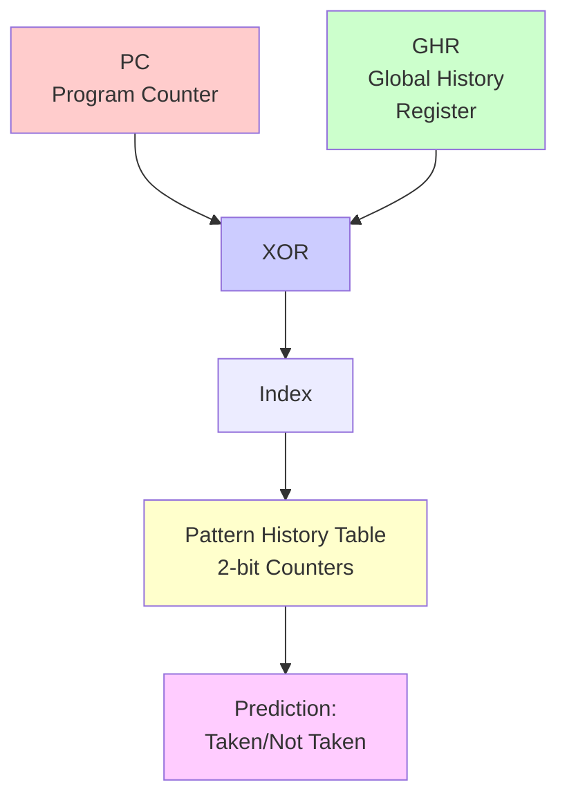

# Branch Prediction

**Branch prediction** is essential for high-performance pipelining. Since branch outcomes aren't known until late in the pipeline, prediction allows continued instruction fetch without waiting, dramatically reducing control hazard penalties.

## The Branch Problem

Consider a branch instruction in a 5-stage pipeline:

```nasm
beq $t0, $t1, target
add $t2, $t3, $t4    ; Fetched speculatively
sub $t5, $t6, $t7    ; Fetched speculatively
```

```
Clock:      1    2    3    4    5
beq:       IF   ID   EX   MEM  WB
                     │
                Branch resolved here
add:            IF   ID   ??
sub:                 IF   ??
```

By the time we know whether to branch, we've already fetched 2 instructions that might be wrong.

## Static Branch Prediction

### Always Predict Not Taken

Simplest approach: assume branches are never taken.

- Fetch the sequential instruction
- If branch is actually taken, flush the pipeline

```
Accuracy: ~50-60% (depends on program)
Penalty when wrong: 1-3 cycles
```

### Always Predict Taken

- Fetch from the branch target
- If branch is actually not taken, flush

Better for loops but requires knowing the target address early.

### Backward Taken, Forward Not Taken (BTFNT)

Heuristic based on common patterns:
- **Backward branches** (negative offset): Usually loop edges → predict taken
- **Forward branches** (positive offset): Usually conditionals → predict not taken

```
Accuracy: ~65-70%
```

### Compiler Hints

The compiler can provide hints based on profiling:

```nasm
beq.likely $t0, $t1, target    ; Hint: likely taken
beq.unlikely $t0, $t1, target  ; Hint: likely not taken
```

## Dynamic Branch Prediction

Dynamic predictors learn from runtime behavior.

### 1-Bit Predictor

Store one bit per branch: taken (1) or not taken (0).

```
Prediction = Last outcome
```

**Problem**: Loops always mispredict twice

```
Loop: ...
      bne $t0, $zero, Loop    ; Taken N-1 times, not taken once

Iteration:  1    2    3    4    5(exit)
Actual:     T    T    T    T    NT
Predict:    NT   T    T    T    T
Result:     ✗    ✓    ✓    ✓    ✗
```

Mispredict on entry AND exit.

### 2-Bit Saturating Counter

Use 2 bits per branch with four states:



**Prediction rule**:
- States 00, 01 → Predict Not Taken
- States 10, 11 → Predict Taken

**Benefit**: Must be wrong twice to change prediction.

```
Loop example with 2-bit predictor:
Iteration:  1    2    3    4    5(exit)
Actual:     T    T    T    T    NT
State:      01   10   11   11   11→10
Predict:    NT   T    T    T    T
Result:     ✗    ✓    ✓    ✓    ✗
```

Still mispredicts at entry, but counter stays high after loop exits.

### Branch History Table (BHT)

Store 2-bit predictors indexed by branch address:



Index using lower bits of PC. Different branches may alias to same entry.

**Typical accuracy**: 85-90%

## Correlated Branch Prediction

### Two-Level Adaptive Predictor

Some branches correlate with recent branch history:

```c
if (x == 0) {     // Branch 1
    ...
}
if (x == 0) {     // Branch 2 - same outcome as Branch 1!
    ...
}
```

**Global History Register (GHR)**: Records outcomes of last N branches

```
GHR: 1 0 1 1 0 1 0 0  (last 8 branch outcomes)
```

**Index**: Combine GHR with PC

```
Index = XOR(PC[11:2], GHR)
```

This creates separate predictions based on the path taken to reach this branch.

### GShare Predictor

Popular correlated predictor:



**Typical accuracy**: 90-95%

## Branch Target Buffer (BTB)

Prediction is useless without knowing WHERE to branch.

**BTB** caches target addresses:

```
           ┌─────────────────────────────────────────┐
           │          Branch Target Buffer           │
           │                                         │
  PC ─────►│  Tag    │  Target Address  │ Prediction │
           │─────────┼──────────────────┼────────────│
           │  0x1000 │     0x2000       │     T      │
           │  0x1050 │     0x1000       │     T      │
           │  0x1200 │     0x1500       │    NT      │
           │         │                  │            │
           └─────────────────────────────────────────┘
                              │
                              ▼
                        Target Address
```

On IF:
1. Check if PC is in BTB
2. If hit and predict taken, fetch from target
3. If miss or predict not taken, fetch PC+4

## Return Address Stack (RAS)

Function returns are highly predictable:

```nasm
call foo       ; Push return address
...
foo:
    ...
    ret        ; Return to caller
```

**RAS**: Small stack that tracks return addresses

```
On CALL: Push PC+4 onto RAS
On RET:  Pop RAS for target prediction
```

**Accuracy**: ~95%+ for returns (since they're perfectly predictable)

## Branch Misprediction Penalty

When prediction is wrong:
1. Detect misprediction (in EX or MEM)
2. Flush incorrect instructions from pipeline
3. Fetch from correct address

**Penalty = Number of stages before resolution**

| Pipeline Depth | Typical Penalty |
|----------------|-----------------|
| 5 stages | 1-2 cycles |
| 10 stages | 3-5 cycles |
| 20+ stages (modern) | 10-20 cycles |

### Misprediction Cost

$$\text{CPI}_{\text{branch}} = \text{Accuracy} \times 0 + (1 - \text{Accuracy}) \times \text{Penalty}$$

**Example**: 95% accuracy, 15-cycle penalty

$$\text{CPI}_{\text{branch}} = 0.05 \times 15 = 0.75 \text{ cycles per branch}$$

With 15% of instructions being branches:

$$\text{CPI}_{\text{impact}} = 0.15 \times 0.75 = 0.11 \text{ additional CPI}$$

## Modern Branch Predictors

### Tournament Predictor

Combine multiple predictors, choose the best:

```
          ┌────────────────┐
          │ Local Predictor │──┐
          └────────────────┘  │
                              ▼
                         ┌────────────┐
                         │   Chooser  │──► Final Prediction
                         └────────────┘
          ┌────────────────┐  ▲
          │Global Predictor│──┘
          └────────────────┘
```

The chooser learns which predictor works better for each branch.

### TAGE Predictor

State-of-the-art predictor using multiple history lengths:

- Multiple tables indexed by different history lengths
- Longer history tables have priority
- Achieves 97%+ accuracy on many workloads

## Key Takeaways

- Branch prediction is essential for pipelined performance
- Static prediction: simple, fixed rules (~60-70% accuracy)
- Dynamic prediction: learns from history (~90-95% accuracy)
- 2-bit counters resist noise better than 1-bit
- Correlated predictors (GShare) use branch history for context
- BTB provides target addresses; RAS handles returns
- Misprediction penalty increases with pipeline depth
- Modern predictors combine multiple techniques for 97%+ accuracy
