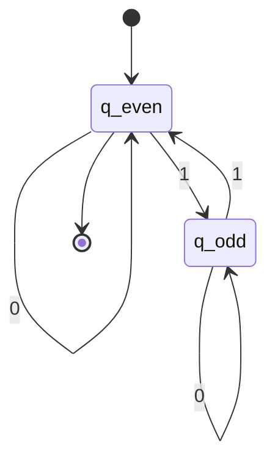

# DFA Fundamentals

A **Deterministic Finite Automaton (DFA)** is a mathematical model of computation that processes input strings and either accepts or rejects them. DFAs are the simplest model of computation with practical applications in lexical analysis, pattern matching, and protocol verification.

## Formal Definition

A DFA is defined as a 5-tuple $M = (Q, \Sigma, \delta, q_0, F)$ where:

- **Q** is a finite set of states
- **Σ** is a finite input alphabet
- **δ: Q × Σ → Q** is the transition function
- $q_0 \in Q$ is the start state
- $F \subseteq Q$ is the set of accepting (final) states

The transition function $\delta$ is **total**, meaning for every state $q \in Q$ and every symbol $a \in \Sigma$, there is exactly one next state $\delta(q, a) \in Q$.

## Extended Transition Function

The **extended transition function** $\delta^* : Q \times \Sigma^* \to Q$ processes strings rather than single symbols. It is defined recursively:

$$
\delta^*(q, \varepsilon) = q
$$

$$
\delta^*(q, wa) = \delta(\delta^*(q, w), a) \text{ for } w \in \Sigma^*, a \in \Sigma
$$

This allows us to trace the computation path for an entire input string.

## Language Recognition

A string $w$ is **accepted** by DFA $M$ if $\delta^*(q_0, w) \in F$. The **language** recognized by $M$ is:

$$
L(M) = \{w \in \Sigma^* \mid \delta^*(q_0, w) \in F\}
$$

A language $L$ is called **regular** if there exists a DFA $M$ such that $L = L(M)$.

## Example DFA

Consider a DFA that accepts binary strings with an even number of 1s:

- $Q = \{q_{\text{even}}, q_{\text{odd}}\}$
- $\Sigma = \{0, 1\}$
- Transition function:
  - $\delta(q_{\text{even}}, 0) = q_{\text{even}}$, $\delta(q_{\text{even}}, 1) = q_{\text{odd}}$
  - $\delta(q_{\text{odd}}, 0) = q_{\text{odd}}$, $\delta(q_{\text{odd}}, 1) = q_{\text{even}}$
- $q_0 = q_{\text{even}}$
- $F = \{q_{\text{even}}\}$

This DFA tracks the parity of 1s seen so far.

### State Diagram

## State Diagram Representation

DFAs are commonly represented as directed graphs:
- Nodes represent states
- Edges labeled with input symbols represent transitions
- Start state has an incoming arrow from nowhere
- Accepting states are shown with double circles

## Designing DFAs

When designing a DFA, consider:

1. **What must be remembered**: The states encode exactly what we need to track
2. **Invariants**: Each state maintains a specific condition about strings reaching it
3. **Completeness**: Every state must have transitions for every symbol

A useful technique is to ask "what do I need to remember about the input seen so far?" The answer determines the states.

## DFA Computation as Configuration Sequence

A **configuration** is a pair $(q, w)$ representing current state and remaining input. A DFA computation is a sequence of configurations:

$$
(q_0, w) \vdash (q_1, w_1) \vdash \cdots \vdash (q_n, \varepsilon)
$$

where each step consumes one input symbol according to $\delta$. Formally, $(q, aw) \vdash (\delta(q, a), w)$ for $a \in \Sigma$.

## Practical Applications

DFAs are used extensively in:
- **Lexical analyzers**: Tokenizing source code
- **Network protocols**: Verifying message sequences
- **Text editors**: Search and replace operations
- **Digital circuits**: Controller design

Their simplicity and efficiency make them ideal for pattern matching where memory is limited.
