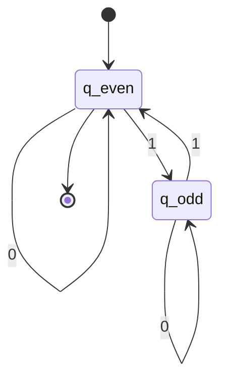
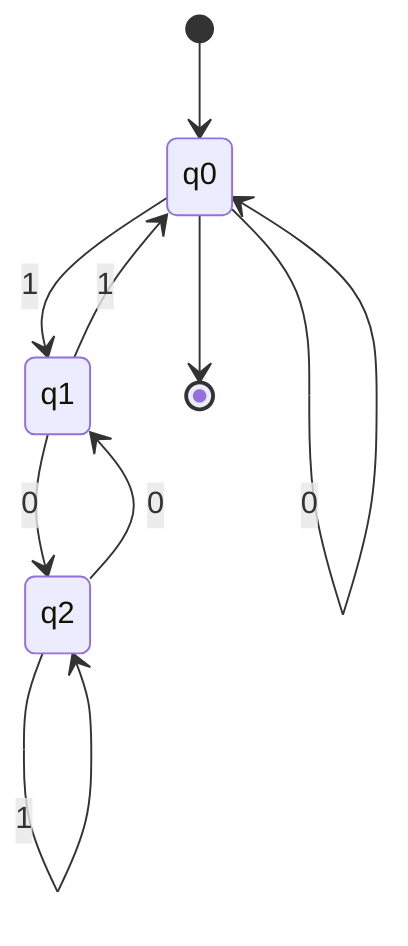

# DFA Fundamentals

A **Deterministic Finite Automaton (DFA)** is a mathematical model of computation that processes input strings and either accepts or rejects them. DFAs are the simplest model of computation with practical applications in lexical analysis, pattern matching, and protocol verification.

## Formal Definition

A DFA is defined as a 5-tuple $M = (Q, \Sigma, \delta, q_0, F)$ where:

- **Q** is a finite set of states
- **Σ** is a finite input alphabet
- **δ: Q × Σ → Q** is the transition function
- $q_0 \in Q$ is the start state
- $F \subseteq Q$ is the set of accepting (final) states

The transition function $\delta$ is **total**, meaning for every state $q \in Q$ and every symbol $a \in \Sigma$, there is exactly one next state $\delta(q, a) \in Q$.

## Extended Transition Function

The **extended transition function** $\delta^* : Q \times \Sigma^* \to Q$ processes strings rather than single symbols. It is defined recursively:

$$
\delta^*(q, \varepsilon) = q
$$

$$
\delta^*(q, wa) = \delta(\delta^*(q, w), a) \text{ for } w \in \Sigma^*, a \in \Sigma
$$

This allows us to trace the computation path for an entire input string.

## Language Recognition

A string $w$ is **accepted** by DFA $M$ if $\delta^*(q_0, w) \in F$. The **language** recognized by $M$ is:

$$
L(M) = \{w \in \Sigma^* \mid \delta^*(q_0, w) \in F\}
$$

A language $L$ is called **regular** if there exists a DFA $M$ such that $L = L(M)$.

## Example DFA

Consider a DFA that accepts binary strings with an even number of 1s:

- $Q = \{q_{\text{even}}, q_{\text{odd}}\}$
- $\Sigma = \{0, 1\}$
- Transition function:
  - $\delta(q_{\text{even}}, 0) = q_{\text{even}}$, $\delta(q_{\text{even}}, 1) = q_{\text{odd}}$
  - $\delta(q_{\text{odd}}, 0) = q_{\text{odd}}$, $\delta(q_{\text{odd}}, 1) = q_{\text{even}}$
- $q_0 = q_{\text{even}}$
- $F = \{q_{\text{even}}\}$

This DFA tracks the parity of 1s seen so far.

### State Diagram

## State Diagram Representation

DFAs are commonly represented as directed graphs:
- Nodes represent states
- Edges labeled with input symbols represent transitions
- Start state has an incoming arrow from nowhere
- Accepting states are shown with double circles

## Designing DFAs

When designing a DFA, consider:

1. **What must be remembered**: The states encode exactly what we need to track
2. **Invariants**: Each state maintains a specific condition about strings reaching it
3. **Completeness**: Every state must have transitions for every symbol

A useful technique is to ask "what do I need to remember about the input seen so far?" The answer determines the states.

## DFA Computation as Configuration Sequence

A **configuration** is a pair $(q, w)$ representing current state and remaining input. A DFA computation is a sequence of configurations:

$$
(q_0, w) \vdash (q_1, w_1) \vdash \cdots \vdash (q_n, \varepsilon)
$$

where each step consumes one input symbol according to $\delta$. Formally, $(q, aw) \vdash (\delta(q, a), w)$ for $a \in \Sigma$.

## Worked Example: Strings Divisible by 3

Let's design a DFA that accepts binary strings representing numbers divisible by 3.

**Strategy**: Track the remainder when dividing by 3. States represent remainders 0, 1, 2.

- $Q = \{q_0, q_1, q_2\}$ (remainders 0, 1, 2)
- $\Sigma = \{0, 1\}$
- Start state: $q_0$ (empty string = 0, divisible by 3)
- Accept states: $F = \{q_0\}$

**Transition logic**: When we append bit $b$ to a number with remainder $r$, the new remainder is $(2r + b) \bmod 3$.

**Transition table**:

| State | 0 | 1 |
|-------|---|---|
| $q_0$ | $q_0$ | $q_1$ |
| $q_1$ | $q_2$ | $q_0$ |
| $q_2$ | $q_1$ | $q_2$ |

**Verification**: Test string "110" (binary 6):
- Start at $q_0$
- Read '1': $\delta(q_0, 1) = q_1$
- Read '1': $\delta(q_1, 1) = q_0$
- Read '0': $\delta(q_0, 0) = q_0$ (accepting!)

### State Diagram

## Worked Example: Pattern Matching

Design a DFA accepting strings containing the substring "101".

**Strategy**: States track progress toward finding "101".

- $q_0$: haven't matched anything (or just reset)
- $q_1$: just saw '1'
- $q_{10}$: just saw "10"
- $q_{101}$: saw "101" (accepting, stays accepting)

**Transition function**:
- From $q_0$: on '1' go to $q_1$, on '0' stay at $q_0$
- From $q_1$: on '0' go to $q_{10}$, on '1' stay at $q_1$
- From $q_{10}$: on '1' go to $q_{101}$, on '0' go to $q_0$
- From $q_{101}$: on any symbol stay at $q_{101}$ (once found, always accept)

This demonstrates the "progress tracking" pattern common in DFA design.

## Common Design Patterns

### Counting Modulo n
When a property depends on count modulo $n$, use $n$ states to track the remainder.

### Progress Tracking
When searching for a pattern, states represent how much of the pattern has been matched.

### Property Accumulation
States encode accumulated properties (parity, balance, etc.) that can be updated incrementally.

## Completeness and Totality

A critical property of DFAs is that the transition function is **total**: every state has exactly one outgoing transition for each symbol. This means:

1. **No stuck states**: Computation always continues
2. **Deterministic**: No ambiguity in computation path
3. **Efficient**: O(n) time complexity for string of length n

In practice, DFAs often include a "dead state" or "error state" that represents rejection. Once entered, this state loops on all inputs and is non-accepting.

## Limitations of DFAs

While powerful, DFAs cannot recognize all languages. They are limited by **finite memory**—the state set must be fixed regardless of input length. Classic non-regular languages include:

- $\{a^n b^n \mid n \geq 0\}$ (requires counting)
- $\{w w^R \mid w \in \Sigma^*\}$ (requires stack)
- $\{a^n \mid n \text{ is prime}\}$ (requires arithmetic)

These limitations motivate more powerful models like pushdown automata and Turing machines.

## Historical Context

Deterministic finite automata were introduced by Michael Rabin and Dana Scott in 1959, earning them the Turing Award in 1976. The concept emerged from neural network models (McCulloch-Pitts neurons) and became foundational to:

- Formal language theory
- Compiler design
- Verification and model checking
- Hardware circuit design

## Practical Applications

DFAs are used extensively in:

- **Lexical analyzers**: Tokenizing source code in compilers (recognizing keywords, identifiers, numbers)
- **Network protocols**: Verifying message sequences and state machines
- **Text editors**: Search and replace operations using finite-state pattern matching
- **Digital circuits**: Controller design for hardware systems
- **String matching**: Fast pattern recognition in tools like grep
- **Input validation**: Checking formats (email addresses, phone numbers, etc.)

Their simplicity and efficiency make them ideal for pattern matching where memory is limited and speed is critical. DFA-based lexers can process millions of tokens per second.

## Key Takeaways

- DFAs are the simplest computational model with exactly one computation path per input
- The transition function is total and deterministic, ensuring O(n) runtime
- States encode "what we need to remember" about the input so far
- Every DFA state must handle every alphabet symbol
- DFAs recognize exactly the regular languages
- Design patterns include counting modulo n, progress tracking, and property accumulation
- While powerful, DFAs are limited by finite memory and cannot count unboundedly
