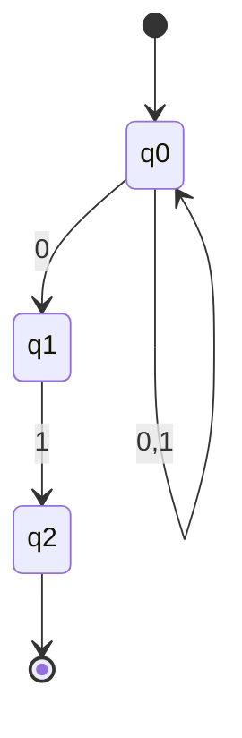

# NFA and ε-Transitions

A **Nondeterministic Finite Automaton (NFA)** extends the DFA model by allowing multiple simultaneous computation paths. Despite this added flexibility, NFAs recognize exactly the same class of languages as DFAs.

## Formal Definition

An NFA is a 5-tuple $N = (Q, \Sigma, \delta, q_0, F)$ where:

- **Q** is a finite set of states
- **Σ** is a finite input alphabet
- $\delta: Q \times (\Sigma \cup \{\varepsilon\}) \to \mathcal{P}(Q)$ is the transition function
- $q_0 \in Q$ is the start state
- $F \subseteq Q$ is the set of accepting states

The key difference from DFA: $\delta$ returns a **set** of states (the powerset $\mathcal{P}(Q)$), and transitions can occur on $\varepsilon$ (the empty string).

## Nondeterminism Explained

In an NFA, when processing input symbol a in state q:
- There may be **zero** transitions (the computation branch "dies")
- There may be **one** transition (like a DFA)
- There may be **multiple** transitions (computation "splits")

The NFA accepts if **any** computation path leads to an accepting state.

## ε-Transitions

An **ε-transition** allows the automaton to change state without consuming any input. This is useful for:
- Combining automata
- Simplifying constructions
- Expressing optional patterns

The **ε-closure** of state $q$, denoted $\text{ECLOSE}(q)$, is the set of all states reachable from $q$ using only $\varepsilon$-transitions (including $q$ itself):

$$
\text{ECLOSE}(q) = \{p \in Q \mid q \xrightarrow{\varepsilon^*} p\}
$$

## Extended Transition Function

For NFAs, the extended transition function $\delta^*: Q \times \Sigma^* \to \mathcal{P}(Q)$ is defined:

$$
\delta^*(q, \varepsilon) = \text{ECLOSE}(\{q\})
$$

$$
\delta^*(q, wa) = \text{ECLOSE}\left(\bigcup_{p \in \delta^*(q, w)} \delta(p, a)\right)
$$

For a set of states $S \subseteq Q$: $\delta^*(S, w) = \bigcup_{q \in S} \delta^*(q, w)$

## Language Recognition

An NFA $N$ accepts string $w$ if some state in $\delta^*(q_0, w)$ is an accepting state:

$$
L(N) = \{w \in \Sigma^* \mid \delta^*(q_0, w) \cap F \neq \emptyset\}
$$

## Example NFA

An NFA accepting strings ending in "01":

- $Q = \{q_0, q_1, q_2\}$
- $\Sigma = \{0, 1\}$
- Transitions:
  - $\delta(q_0, 0) = \{q_0, q_1\}$
  - $\delta(q_0, 1) = \{q_0\}$
  - $\delta(q_1, 1) = \{q_2\}$
- $q_0$ is the start state
- $F = \{q_2\}$

The nondeterminism "guesses" when the final "01" begins.

### State Diagram

Note: The diagram shows $q_0$ has a self-loop for both 0 and 1, plus an additional transition on 0 to $q_1$ (nondeterministic choice).

## Why Use NFAs?

NFAs are often easier to design than DFAs because:

1. **Natural expression**: Nondeterminism captures "or" naturally
2. **Smaller size**: NFAs can be exponentially smaller than equivalent DFAs
3. **Compositional**: Easy to combine automata for complex patterns
4. **Theoretical utility**: Many proofs are simpler with NFAs

## Computation Trees

An NFA computation on input w forms a tree:
- Root is the start state
- Each path represents one computation branch
- Leaves are final configurations
- Accept if any leaf is in an accepting state with empty remaining input

## Equivalence to DFA

Every NFA can be converted to an equivalent DFA (same language). This is proven constructively using the **subset construction**, covered in the next section.

The converse is trivial: every DFA is already an NFA (with singleton transition sets).

## Applications

NFAs with ε-transitions are fundamental in:
- **Thompson's construction**: Converting regular expressions to NFAs
- **Compiler generators**: Tools like lex/flex
- **Pattern matching engines**: Regular expression libraries
