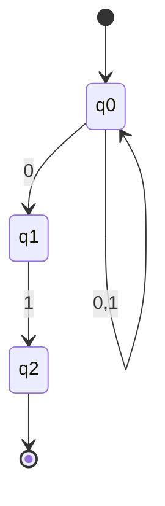
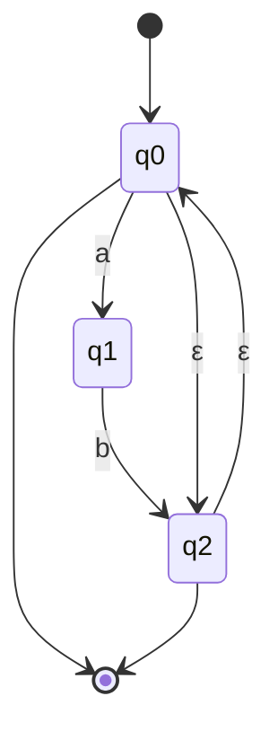

# NFA and ε-Transitions

A **Nondeterministic Finite Automaton (NFA)** extends the DFA model by allowing multiple simultaneous computation paths. Despite this added flexibility, NFAs recognize exactly the same class of languages as DFAs.

## Formal Definition

An NFA is a 5-tuple $N = (Q, \Sigma, \delta, q_0, F)$ where:

- **Q** is a finite set of states
- **Σ** is a finite input alphabet
- $\delta: Q \times (\Sigma \cup \{\varepsilon\}) \to \mathcal{P}(Q)$ is the transition function
- $q_0 \in Q$ is the start state
- $F \subseteq Q$ is the set of accepting states

The key difference from DFA: $\delta$ returns a **set** of states (the powerset $\mathcal{P}(Q)$), and transitions can occur on $\varepsilon$ (the empty string).

## Nondeterminism Explained

In an NFA, when processing input symbol a in state q:
- There may be **zero** transitions (the computation branch "dies")
- There may be **one** transition (like a DFA)
- There may be **multiple** transitions (computation "splits")

The NFA accepts if **any** computation path leads to an accepting state.

## ε-Transitions

An **ε-transition** allows the automaton to change state without consuming any input. This is useful for:
- Combining automata
- Simplifying constructions
- Expressing optional patterns

The **ε-closure** of state $q$, denoted $\text{ECLOSE}(q)$, is the set of all states reachable from $q$ using only $\varepsilon$-transitions (including $q$ itself):

$$
\text{ECLOSE}(q) = \{p \in Q \mid q \xrightarrow{\varepsilon^*} p\}
$$

## Extended Transition Function

For NFAs, the extended transition function $\delta^*: Q \times \Sigma^* \to \mathcal{P}(Q)$ is defined:

$$
\delta^*(q, \varepsilon) = \text{ECLOSE}(\{q\})
$$

$$
\delta^*(q, wa) = \text{ECLOSE}\left(\bigcup_{p \in \delta^*(q, w)} \delta(p, a)\right)
$$

For a set of states $S \subseteq Q$: $\delta^*(S, w) = \bigcup_{q \in S} \delta^*(q, w)$

## Language Recognition

An NFA $N$ accepts string $w$ if some state in $\delta^*(q_0, w)$ is an accepting state:

$$
L(N) = \{w \in \Sigma^* \mid \delta^*(q_0, w) \cap F \neq \emptyset\}
$$

## Example NFA

An NFA accepting strings ending in "01":

- $Q = \{q_0, q_1, q_2\}$
- $\Sigma = \{0, 1\}$
- Transitions:
  - $\delta(q_0, 0) = \{q_0, q_1\}$
  - $\delta(q_0, 1) = \{q_0\}$
  - $\delta(q_1, 1) = \{q_2\}$
- $q_0$ is the start state
- $F = \{q_2\}$

The nondeterminism "guesses" when the final "01" begins.

### State Diagram



Note: The diagram shows $q_0$ has a self-loop for both 0 and 1, plus an additional transition on 0 to $q_1$ (nondeterministic choice).

## Why Use NFAs?

NFAs are often easier to design than DFAs because:

1. **Natural expression**: Nondeterminism captures "or" naturally
2. **Smaller size**: NFAs can be exponentially smaller than equivalent DFAs
3. **Compositional**: Easy to combine automata for complex patterns
4. **Theoretical utility**: Many proofs are simpler with NFAs

## Computation Trees

An NFA computation on input w forms a tree:
- Root is the start state
- Each path represents one computation branch
- Leaves are final configurations
- Accept if any leaf is in an accepting state with empty remaining input

## Equivalence to DFA

Every NFA can be converted to an equivalent DFA (same language). This is proven constructively using the **subset construction**, covered in the next section.

The converse is trivial: every DFA is already an NFA (with singleton transition sets).

## Computing ε-Closure: Detailed Algorithm

The ε-closure is fundamental to working with ε-NFAs. Here's a detailed algorithm:

```
ECLOSE(S):
    closure = S
    stack = list(S)

    while stack is not empty:
        q = stack.pop()
        for each p in δ(q, ε):
            if p not in closure:
                closure.add(p)
                stack.push(p)

    return closure
```

**Time complexity**: O(n²) where n is the number of states, since each state is visited once and each ε-transition examined once.

**Example**: Given states {$q_0, q_1, q_2, q_3$} with ε-transitions:
- $\delta(q_0, \varepsilon) = \{q_1\}$
- $\delta(q_1, \varepsilon) = \{q_2, q_3\}$
- $\delta(q_2, \varepsilon) = \emptyset$
- $\delta(q_3, \varepsilon) = \emptyset$

Then $\text{ECLOSE}(q_0) = \{q_0, q_1, q_2, q_3\}$ (follows the chain).

## Worked Example: Optional Substring

Design an NFA accepting strings containing zero or more occurrences of "ab".

**Strategy**: Use ε-transitions to allow skipping or repeating the pattern.

States:
- $q_0$: start state (accepting—allows empty string)
- $q_1$: just read 'a' in current pattern
- $q_2$: completed "ab" (accepting)

**Transitions**:
- $\delta(q_0, a) = \{q_1\}$
- $\delta(q_1, b) = \{q_2\}$
- $\delta(q_2, \varepsilon) = \{q_0\}$ (can repeat pattern)
- $\delta(q_0, \varepsilon) = \{q_2\}$ (can skip to accepting)

This NFA accepts: ε, "ab", "abab", "ababab", etc.

### State Diagram



## Worked Example: Alternative Patterns

Design an NFA accepting strings ending in "01" or "10".

**Strategy**: Create two parallel paths and use ε-transitions to choose.

States:
- $q_0$: start state
- $q_1, q_2$: path for "01"
- $q_3, q_4$: path for "10"

**Transitions**:
- $\delta(q_0, \varepsilon) = \{q_1, q_3\}$ (nondeterministically choose path)
- Path 1: $\delta(q_1, 0) = \{q_2\}$, $\delta(q_2, 1) = \{\text{accept}\}$
- Path 2: $\delta(q_3, 1) = \{q_4\}$, $\delta(q_4, 0) = \{\text{accept}\}$

The ε-transition at the start elegantly expresses "or" in the language specification.

## Simulation of NFA Computation

To simulate an NFA on input string $w = a_1 a_2 \cdots a_n$:

```
simulate_nfa(N, w):
    current_states = ECLOSE({q₀})

    for each symbol a in w:
        next_states = ∅
        for each state q in current_states:
            next_states = next_states ∪ δ(q, a)
        current_states = ECLOSE(next_states)

    return (current_states ∩ F ≠ ∅)
```

**Time complexity**: O(n · m²) where n = |w| and m = |Q|.

This algorithm maintains the set of possible states at each step, effectively exploring all computation paths in parallel.

## Advantages Over DFAs

### Conceptual Simplicity
NFAs often match the problem specification more directly:
- "Contains X or Y" → two paths with ε-branch
- "Optional prefix" → ε-transition to skip it
- "Repeated pattern" → ε-loop back to start

### Size Efficiency
For the language "strings where the kth symbol from the end is 1":
- NFA: k+1 states (guess where the last k symbols begin)
- Minimal DFA: 2^k states (must track last k symbols)

This exponential gap shows NFAs can be remarkably more compact.

### Compositional Construction
NFAs easily combine via ε-transitions:
- Union: ε-transitions from new start to both NFAs
- Concatenation: ε-transitions from first's accepting states to second's start
- Kleene star: ε-transitions for looping and skipping

## Common Mistakes and Pitfalls

### Mistake 1: Accepting vs. Rejecting on No Transitions
When an NFA has no available transition, that computation branch dies—it does not mean rejection. The input is accepted if **any** branch accepts.

### Mistake 2: Forgetting ε-Closure
When checking if an NFA accepts, you must include all ε-reachable states. Simply checking if you can reach an accepting state via input symbols is insufficient.

### Mistake 3: Assuming Union of Empty Sets
If $\delta(q, a) = \emptyset$ for some state and symbol, that branch terminates. This is not an error—it's a feature of nondeterminism.

## Relationship to Regular Expressions

NFAs with ε-transitions are the natural target for regular expression compilation:

- **Base**: ε and single symbols are trivial NFAs
- **Union** ($R|S$): ε-transitions from new start to both
- **Concatenation** ($RS$): ε-transition from R's accepting to S's start
- **Kleene star** ($R^*$): ε-transitions for looping and skipping

This is **Thompson's construction**, the standard algorithm in tools like grep and lexical analyzers.

## Applications

NFAs with ε-transitions are fundamental in:

- **Thompson's construction**: Converting regular expressions to NFAs efficiently
- **Compiler generators**: Tools like lex/flex use NFAs as intermediate representation
- **Pattern matching engines**: Regular expression libraries (PCRE, Java regex, Python re)
- **Text search**: Fast multi-pattern matching in tools like grep and awk
- **Protocol verification**: Modeling nondeterministic systems
- **Natural language processing**: Finite-state morphology and phonology

The NFA model is preferred during construction even though DFAs are faster for matching—the NFA is converted to DFA only after construction is complete.

## Key Takeaways

- NFAs allow multiple computation paths via nondeterministic transitions
- ε-transitions enable state changes without consuming input
- An NFA accepts if any computation path leads to acceptance
- ε-closure is essential for correct NFA simulation and conversion
- NFAs can be exponentially more compact than equivalent DFAs
- Every NFA can be converted to an equivalent DFA (proven via subset construction)
- NFAs are the natural target for regular expression compilation
- Despite added flexibility, NFAs recognize exactly the regular languages—no more, no less
