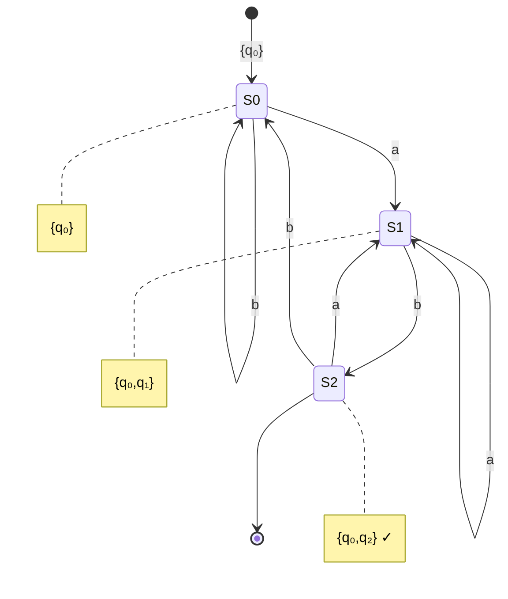

# Subset Construction

The **subset construction** (also called powerset construction) converts any NFA to an equivalent DFA. This algorithm proves that DFAs and NFAs recognize the same class of languages—the regular languages.

## The Key Insight

The main idea is to track the **set of all possible states** the NFA could be in. Each DFA state corresponds to a subset of NFA states.

If the NFA has n states, the DFA might have up to 2ⁿ states (all possible subsets). In practice, many subsets are often unreachable.

## The Algorithm

Given NFA $N = (Q, \Sigma, \delta_N, q_0, F_N)$, construct DFA $D = (Q', \Sigma, \delta_D, q_0', F')$:

1. **States**: $Q' \subseteq \mathcal{P}(Q)$, the power set of $Q$
2. **Start state**: $q_0' = \text{ECLOSE}(\{q_0\})$
3. **Transition function**: For state $S \subseteq Q$ and symbol $a \in \Sigma$:
   $$\delta_D(S, a) = \text{ECLOSE}\left(\bigcup_{q \in S} \delta_N(q, a)\right)$$
4. **Accepting states**: $F' = \{S \in Q' \mid S \cap F_N \neq \emptyset\}$

## Computing ε-Closure

The ε-closure of a set S is computed by:

```
ε-closure(S):
    result = S
    stack = list(S)
    while stack is not empty:
        q = stack.pop()
        for r in δ(q, ε):
            if r not in result:
                result.add(r)
                stack.push(r)
    return result
```

## Lazy Construction

Rather than computing all 2ⁿ states upfront, we build only **reachable states**:

```
subset_construction(N):
    q₀' = ε-closure({q₀})
    Q' = {q₀'}
    worklist = [q₀']

    while worklist is not empty:
        S = worklist.pop()
        for a in Σ:
            T = ε-closure(⋃{δ(q, a) | q ∈ S})
            if T not in Q':
                Q'.add(T)
                worklist.append(T)
            add transition (S, a) → T

    F' = {S ∈ Q' | S ∩ F ≠ ∅}
    return DFA(Q', Σ, δ_D, q₀', F')
```

## Example: Subset Construction

Consider an NFA accepting strings ending in "ab":

**NFA Transition Table:**

| State | a | b | ε |
|-------|---|---|---|
| $q_0$ | $\{q_0, q_1\}$ | $\{q_0\}$ | $\emptyset$ |
| $q_1$ | $\emptyset$ | $\{q_2\}$ | $\emptyset$ |
| $q_2$ | $\emptyset$ | $\emptyset$ | $\emptyset$ |

Accepting state: $F_N = \{q_2\}$

**Subset Construction:**

Starting from $\{q_0\}$, we compute transitions:

- $\delta_D(\{q_0\}, a) = \{q_0, q_1\}$
- $\delta_D(\{q_0\}, b) = \{q_0\}$
- $\delta_D(\{q_0, q_1\}, a) = \{q_0, q_1\}$
- $\delta_D(\{q_0, q_1\}, b) = \{q_0, q_2\}$
- $\delta_D(\{q_0, q_2\}, a) = \{q_0, q_1\}$
- $\delta_D(\{q_0, q_2\}, b) = \{q_0\}$

**Resulting DFA:**



Accepting states: Any containing $q_2$, so $F' = \{\{q_0, q_2\}\}$

## Worst-Case Exponential Blowup

The exponential blowup can actually occur. Consider the NFA for "strings where the nth-from-last symbol is 1." This NFA has n+1 states, but the minimal DFA has 2ⁿ states.

This shows that NFAs can be exponentially more succinct than DFAs for some languages.

## Correctness Proof

**Theorem**: $L(D) = L(N)$

**Proof sketch**: By induction on $|w|$, we show that:

$$
\delta_D^*(q_0', w) = \delta_N^*(q_0, w)
$$

That is, after reading $w$, the DFA is in state $S$ where $S$ is exactly the set of states the NFA could be in.

**Base case** ($w = \varepsilon$): $\delta_D^*(q_0', \varepsilon) = \text{ECLOSE}(\{q_0\}) = \delta_N^*(q_0, \varepsilon)$

**Inductive step**: Assume true for $w$, prove for $wa$. By construction of $\delta_D$, the claim holds.

Since the DFA accepts iff the final state contains an NFA accepting state, and the NFA accepts iff some computation reaches an accepting state, $L(D) = L(N)$. $\square$

## Practical Considerations

In lexical analyzer generators:
- NFAs are built from regular expressions
- Subset construction converts to DFA
- DFA is then minimized
- Resulting DFA enables O(n) string matching

The conversion is typically done once at compile time, so exponential worst-case is acceptable for the speed of matching at runtime.
