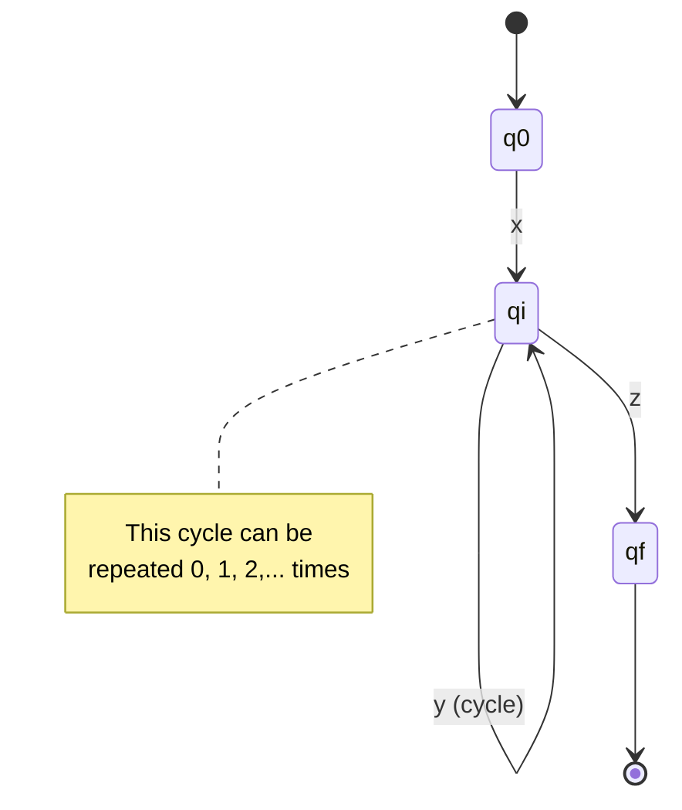

# Pumping Lemma for Regular Languages

The **Pumping Lemma** is a necessary condition for regularity. It provides a powerful technique for proving that certain languages are **not** regular.

## Statement of the Lemma

**Pumping Lemma**: If $L$ is a regular language, then there exists a positive integer $p$ (the pumping length) such that for any string $s \in L$ with $|s| \geq p$, we can write $s = xyz$ where:

1. $|y| > 0$ ($y$ is non-empty)
2. $|xy| \leq p$ ($y$ occurs early in $s$)
3. For all $i \geq 0$, $xy^i z \in L$ ($y$ can be "pumped")

Formally:
$$
L \text{ regular} \implies \exists p > 0 : \forall s \in L \left(|s| \geq p \implies \exists x,y,z : s = xyz \land |y| > 0 \land |xy| \leq p \land \forall i \geq 0 : xy^iz \in L\right)
$$

## Intuition

If $L$ is regular, some DFA $M$ with $p$ states recognizes it. For any string $s$ with $|s| \geq p$, reading $s$ must revisit some state (pigeonhole principle). This creates a cycle that can be traversed any number of times.

### Visualization

## Proof of the Lemma

Let M be a DFA with p states accepting L. Consider s ∈ L with |s| ≥ p.

Reading s, the sequence of states is q₀, q₁, ..., q_n where n ≥ p. By pigeonhole, some state repeats: q_i = q_j for i < j ≤ p.

Let:
- x = s[1..i] (prefix to first occurrence of repeated state)
- y = s[i+1..j] (substring from first to second occurrence)
- z = s[j+1..n] (suffix after second occurrence)

Then:
1. y ≠ ε (since i < j)
2. |xy| ≤ p (since j ≤ p)
3. xy^i z ∈ L (cycling through the repeated state)

## Using the Lemma (Proof by Contradiction)

To prove L is not regular:

1. Assume L is regular
2. Let p be the pumping length (exists by the lemma)
3. Choose a specific string s ∈ L with |s| ≥ p
4. For **all** possible decompositions s = xyz satisfying conditions 1 and 2, show that some xy^i z ∉ L
5. This contradicts the lemma, so L is not regular

**Key**: The adversary chooses p and the decomposition; you choose s and i.

## Example: $L = \{a^n b^n \mid n \geq 0\}$

**Claim**: $L$ is not regular.

**Proof**:
1. Assume $L$ is regular with pumping length $p$
2. Choose $s = a^p b^p \in L$ (note: $|s| = 2p \geq p$)
3. For any decomposition $s = xyz$ with $|xy| \leq p$ and $|y| > 0$:
   - Since $|xy| \leq p$, both $x$ and $y$ consist only of $a$'s
   - Thus $y = a^k$ for some $k > 0$
4. Consider $xy^2z = a^p a^k b^p = a^{p+k} b^p$
5. Since $k > 0$, we have $p + k > p$, so $xy^2z \notin L$
6. This contradicts the pumping lemma!
7. Therefore, $L$ is not regular. $\square$

## Example: L = {ww | w ∈ {a,b}*}

**Claim**: L is not regular.

**Proof**:
1. Assume L is regular with pumping length p
2. Choose s = aᵖbaᵖb ∈ L
3. For any valid decomposition, y = aᵏ for some k > 0
4. xy⁰z = aᵖ⁻ᵏbaᵖb
5. This is not of the form ww (different halves), so xy⁰z ∉ L
6. Contradiction! L is not regular.

## Example: L = {aⁿ | n is prime}

**Claim**: L is not regular.

**Proof**:
1. Assume L is regular with pumping length p
2. Choose s = aⁿ where n > p is prime
3. Let y = aᵏ where k > 0
4. Consider xy^(n+1)z = aⁿ⁺ⁿᵏ = aⁿ⁽¹⁺ᵏ⁾
5. Since n > 1 and k > 0, this is n(1+k) which is composite
6. So xy^(n+1)z ∉ L
7. Contradiction! L is not regular.

## Common Mistakes

1. **Forgetting the constraints**: y must satisfy |y| > 0 and |xy| ≤ p
2. **Not considering all decompositions**: Must argue for all valid xyz
3. **Wrong string choice**: s must be in L and depend on p appropriately
4. **Using pumping lemma to prove regularity**: The lemma is only necessary, not sufficient!

## Limitations

The pumping lemma is a **necessary but not sufficient** condition. Some non-regular languages satisfy the pumping conditions. More powerful tools:
- Myhill-Nerode theorem (gives exact characterization)
- Closure properties
- Kolmogorov complexity arguments

## Applications

Non-regularity proofs matter because:
- Determine appropriate computational models
- Guide algorithm design
- Inform language/grammar design
- Establish theoretical boundaries
