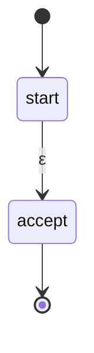
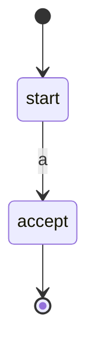
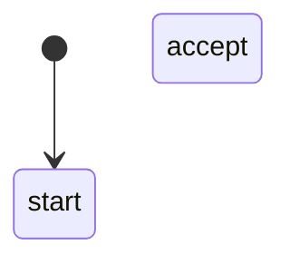
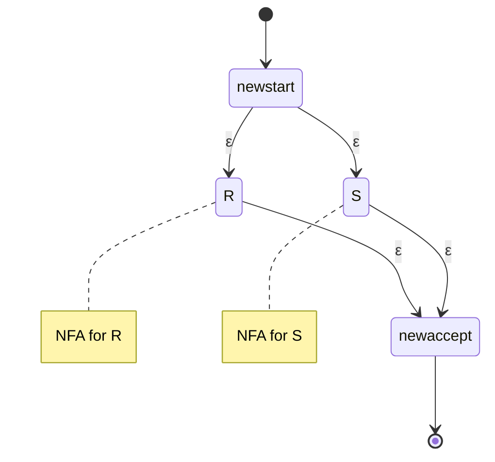
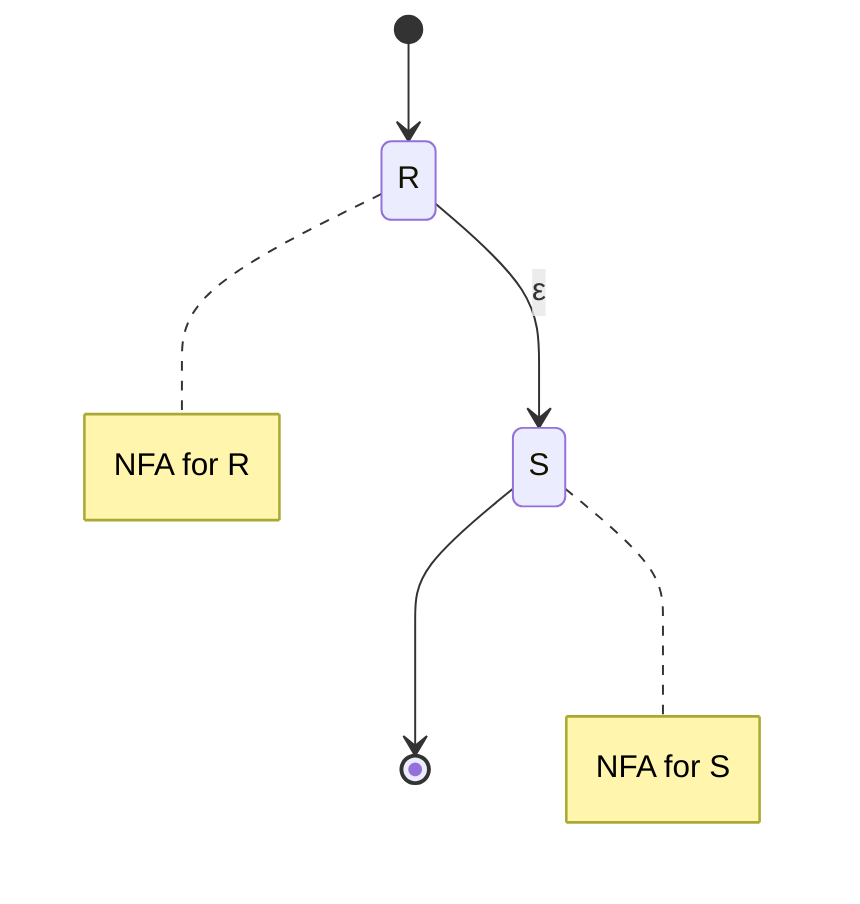
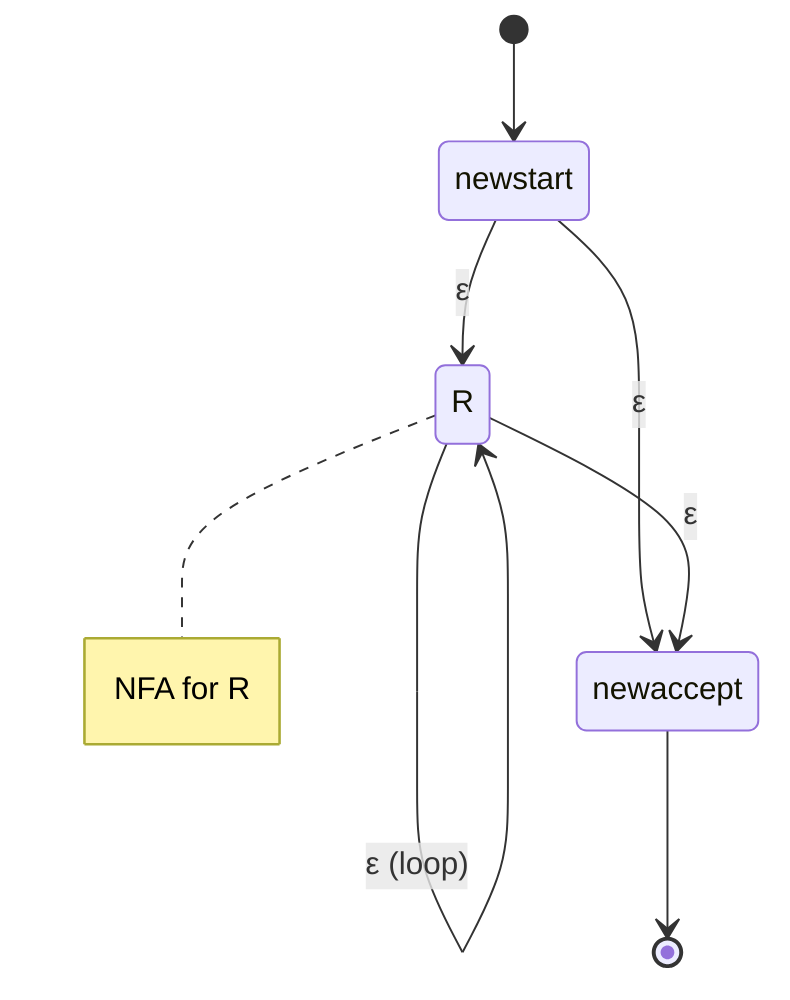

# Regex to NFA Conversion

**Thompson's construction** converts any regular expression to an equivalent NFA. This algorithm is fundamental to regex matching implementations.

## Thompson's Construction

The algorithm builds NFAs inductively, following the structure of the regex. Each construction produces an NFA with:
- Exactly one start state (no incoming transitions)
- Exactly one accept state (no outgoing transitions)
- At most 2n states for an expression of size n

## Base Cases

### Empty String: $\varepsilon$



Single transition on $\varepsilon$.

### Single Symbol: $a$



Single transition labeled with symbol $a$.

### Empty Language: $\emptyset$



No transition connecting start to accept (nothing accepted).

## Recursive Cases

### Union: $R \mid S$

Given NFAs for $R$ and $S$:



New start state with $\varepsilon$-transitions to both sub-NFAs. Both sub-NFAs' accept states connect via $\varepsilon$ to new accept.

### Concatenation: $RS$



Connect $R$'s accept state to $S$'s start state with $\varepsilon$-transition. Overall start is $R$'s start, overall accept is $S$'s accept.

### Kleene Star: $R^*$



Structure allows:
- $\varepsilon$ from new start to $R$'s start (enter loop)
- $\varepsilon$ from $R$'s accept back to $R$'s start (repeat)
- $\varepsilon$ from new start to new accept (accept empty, skip entirely)
- $\varepsilon$ from $R$'s accept to new accept (exit loop)

## Properties of Thompson Construction

1. **Linear size**: NFA has at most 2|R| states for regex R
2. **Simple structure**: Each state has at most two outgoing transitions
3. **ε-transitions only split/merge**: Alphabet transitions are direct
4. **Compositional**: Built from sub-NFAs

## Example: (a|b)*abb

Building bottom-up:

1. NFA for a: s₁ --a--> s₂
2. NFA for b: s₃ --b--> s₄
3. NFA for (a|b): s₀ --ε--> s₁, s₀ --ε--> s₃, s₂ --ε--> s₅, s₄ --ε--> s₅
4. NFA for (a|b)*: add loop and bypass
5. NFA for abb: three consecutive symbol transitions
6. Concatenate all parts

## Converting to DFA

After Thompson's construction, use subset construction:

1. Build NFA using Thompson's construction
2. Apply subset construction to get DFA
3. Optionally minimize the DFA

This three-step process is used in most regex implementations.

## Alternative: Glushkov Construction

Glushkov's construction builds an ε-free NFA:

1. **Mark** positions in regex (each symbol gets unique label)
2. Compute **nullable**, **first**, **last**, **follow** sets
3. Create state for each position plus start state
4. Transitions based on follow relationships

Results in n+1 states for n positions (more compact than Thompson).

## Comparison

| Property | Thompson | Glushkov |
|----------|----------|----------|
| States | ≤ 2n | n+1 |
| ε-transitions | Yes | No |
| Construction | Simpler | More complex |
| Determinization | Same result | Same result |

## Implementation Notes

Thompson's construction is preferred for:
- Simple implementation
- Lazy NFA simulation (no full DFA construction)
- On-the-fly matching

```python
def thompson_concat(nfa1, nfa2):
    # Connect nfa1's accept to nfa2's start with ε
    nfa1.accept.add_epsilon_transition(nfa2.start)
    return NFA(nfa1.start, nfa2.accept)

def thompson_union(nfa1, nfa2):
    new_start = State()
    new_accept = State()
    new_start.add_epsilon_transition(nfa1.start)
    new_start.add_epsilon_transition(nfa2.start)
    nfa1.accept.add_epsilon_transition(new_accept)
    nfa2.accept.add_epsilon_transition(new_accept)
    return NFA(new_start, new_accept)
```

## Regex Derivatives Alternative

Instead of building an automaton, use **Brzozowski derivatives**:

∂_a R gives the regex matching suffixes after reading 'a'

This enables on-the-fly matching without explicit NFA construction.
