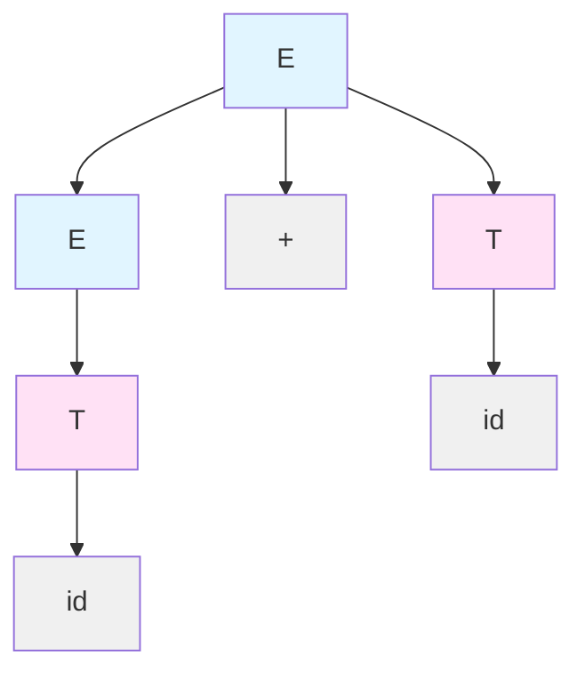
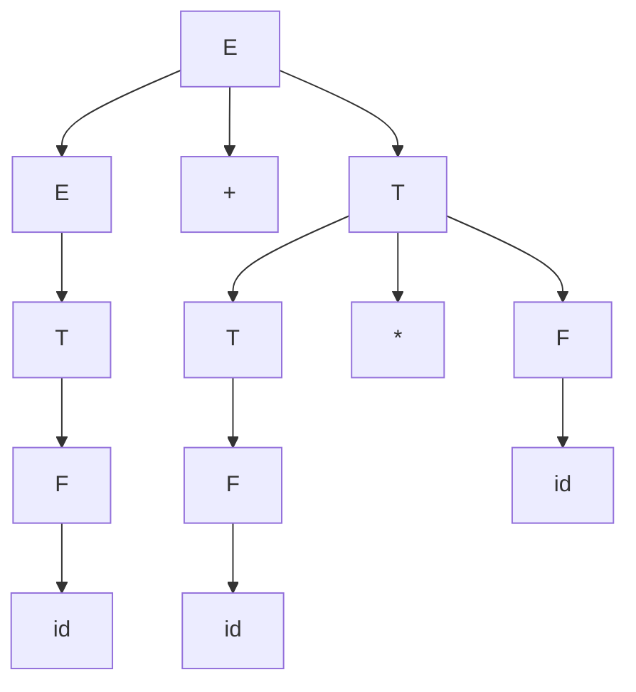

# Parse Trees

A **parse tree** (or derivation tree) is a graphical representation of how a string is derived from a grammar. Parse trees are fundamental to syntax analysis in compilers.

## Structure of Parse Trees

A parse tree for grammar $G = (V, \Sigma, R, S)$ satisfies:
- Root is labeled with start symbol $S$
- Each internal node is labeled with a variable from $V$
- Children of node $A$ labeled $X_1, X_2, \ldots, X_k$ correspond to rule $A \to X_1X_2\cdots X_k$
- Leaves are labeled with terminals from $\Sigma$ or $\varepsilon$

## The Yield

The **yield** (or frontier) of a parse tree is the string of terminal symbols at the leaves, read left to right.

A string $w$ is in $L(G)$ iff there exists a parse tree with:
- Root labeled $S$
- Yield equal to $w$

Formally: $L(G) = \{w \in \Sigma^* \mid S \Rightarrow^* w\}$

## Example Parse Tree

For grammar with productions:
- $E \to E + T \mid T$
- $T \to \text{id}$

Parse tree for "id + id":



**Derivation**: $E \Rightarrow E + T \Rightarrow T + T \Rightarrow \text{id} + T \Rightarrow \text{id} + \text{id}$

**Yield**: id + id

## Parse Trees vs Derivations

| Derivations | Parse Trees |
|-------------|-------------|
| Sequence of steps | Tree structure |
| Order matters | Order irrelevant |
| Many per string | Structure-based |
| Leftmost/rightmost unique | Unique per structure |

Multiple derivations can produce the same parse tree.

## Constructing Parse Trees

### From Leftmost Derivation
Process derivation left to right, building tree top-down, always expanding leftmost variable.

### From Rightmost Derivation
Process derivation right to left (bottom-up), building tree from leaves to root.

## Parse Tree Properties

**Height**: Longest path from root to leaf
**Width**: Maximum number of nodes at any level

For string w:
- Height relates to derivation depth
- Width bounded by |V ∪ Σ|^height

## Subtrees

A **subtree** rooted at node A represents a derivation A ⇒* w where w is the subtree's yield.

Subtrees can be:
- Replaced by other subtrees for the same variable
- Used to prove properties by structural induction

## Parse Tree Algorithms

### CYK Algorithm
Builds parse table bottom-up, finding all derivations for each substring.

### Earley Parser
Builds parse forest incrementally, handling all CFGs.

### Recursive Descent
Constructs tree top-down for LL grammars.

### LR Parsing
Constructs tree bottom-up for LR grammars.

## Parse Forests

When grammar is ambiguous, multiple parse trees exist for some strings. A **parse forest** represents all trees compactly.

## Applications

Parse trees are used in:
- **Compilers**: AST construction
- **Natural language processing**: Syntax analysis
- **XML/JSON processing**: Document structure
- **Query languages**: Expression evaluation

## Tree Automata

Parse trees can be processed by **tree automata**, which extend finite automata to trees:
- States assigned to nodes bottom-up
- Transitions based on children's states
- Accept based on root state

## Constructing Parse Trees: Detailed Example

Let's construct a complete parse tree for a more complex example to illustrate the process.

**Grammar**:
- E → E + T | T
- T → T * F | F
- F → (E) | id

**String**: id + id * id

**Parse Tree**:



**Reading the tree**:
- Root E represents the entire expression
- Left subtree (E → T → F → id) represents the first operand
- Middle node (+) represents the operator
- Right subtree represents id * id, showing multiplication binds tighter than addition

The yield of this tree is "id + id * id" when we read the leaves from left to right.

## Parse Tree Properties and Characteristics

### Internal Node Count
For a parse tree with yield w where |w| = n terminals:
- Minimum internal nodes: 1 (if S → w directly)
- For CNF grammars: exactly n - 1 internal nodes with two children

### Height Analysis
Parse tree height affects derivation complexity:

**For CNF grammars**:
- String of length n requires height at least log₂(n)
- Maximum height bounded by grammar-specific constants

**For general CFGs**:
- Height can vary significantly
- ε-productions can increase height without increasing yield length

### Tree Width
The width of a parse tree at level i is the number of nodes at that level.

**Maximum width**:
- Bounded by |V ∪ Σ|^height in worst case
- For CNF: width grows exponentially with depth near leaves

## Abstract Syntax Trees vs Parse Trees

While parse trees show complete derivation structure, compilers typically use **Abstract Syntax Trees (ASTs)**:

**Parse Tree**:
- Contains all grammar symbols
- Shows exact rule applications
- Includes unnecessary structural nodes

**Abstract Syntax Tree**:
- Contains only essential semantic information
- Omits pure syntactic elements (parentheses, keywords)
- More compact representation

**Example**: For "id + id * id"

Parse tree has nodes: E, T, F, +, *, id (multiple levels)
AST has nodes: +, *, id (minimal structure)

The AST retains operator precedence without explicit T and F nodes.

## Parsing Algorithms and Parse Tree Construction

### Recursive Descent Parsing
Constructs parse trees top-down for LL grammars:
1. Start with start symbol
2. For each variable, call recursive function
3. Match terminals against input
4. Build tree nodes during recursion

**Example function for E → E + T | T**:
```
parseE():
  left = parseT()
  if next token is '+':
    consume('+')
    right = parseT()
    return createNode(E, [left, '+', right])
  return left
```

### CYK Algorithm
Builds parse trees bottom-up using dynamic programming:
1. Fill table with possible derivations for substrings
2. Combine smaller parse trees into larger ones
3. Check if start symbol can derive entire string

**Time complexity**: O(n³|G|) for string length n

### Earley Parsing
Constructs parse forest (all possible trees) incrementally:
- Maintains parse states at each input position
- Handles all CFGs efficiently
- Produces compact representation of all parse trees

### LR Parsing
Builds parse trees bottom-up using shift-reduce actions:
1. Shift terminals onto stack
2. Reduce when handle is recognized
3. Build tree nodes during reductions

LR parsers are deterministic and efficient for large classes of grammars.

## Ambiguous Parse Trees

When a grammar is ambiguous, a string can have multiple parse trees representing different structural interpretations.

**Example**: For grammar E → E + E | E * E | id and string "id + id * id"

**Tree 1**: ((id + id) * id) - addition at root
**Tree 2**: (id + (id * id)) - multiplication at root

These represent different evaluation orders and produce different semantic meanings. The grammar lacks operator precedence, causing this structural ambiguity.

## Parse Tree Transformations

Parse trees can be manipulated for various purposes:

### Tree Rewriting
- Replace subtrees with equivalent structures
- Optimize expressions
- Normalize representations

### Tree Pruning
- Remove unnecessary nodes
- Convert to AST
- Simplify for semantic analysis

### Tree Annotation
- Add type information
- Compute attributes
- Perform semantic checks

## Parse Trees in Compiler Construction

Parse trees serve multiple roles in compilation:

### Syntax Analysis Phase
1. Lexer produces tokens
2. Parser constructs parse tree
3. Tree validates syntactic correctness

### Semantic Analysis Phase
1. Traverse tree to check types
2. Build symbol tables
3. Compute inherited and synthesized attributes

### Code Generation Phase
1. Walk tree in postorder
2. Generate intermediate code
3. Optimize tree-based representations

## Yield Computation

The **yield function** maps parse trees to strings:

$$
\text{yield}(T) = \begin{cases}
a & \text{if } T \text{ is leaf labeled } a \\
\text{yield}(T_1) \cdots \text{yield}(T_k) & \text{if } T \text{ has children } T_1, \ldots, T_k
\end{cases}
$$

**Properties**:
- yield(T) ∈ Σ* for valid parse tree T
- w ∈ L(G) iff there exists tree T with root S and yield(T) = w
- Two trees are structurally equivalent iff they have the same yield and structure

## Tree Height and Derivation Length

**Theorem**: For a parse tree T with n internal nodes, any derivation of yield(T) requires exactly n steps.

**Proof**:
- Each internal node represents one rule application
- Each derivation step expands one variable
- Number of steps equals number of internal nodes

This relationship connects derivation complexity to tree structure.

## Key Takeaways

- Parse trees provide a graphical representation of how strings are derived from grammars
- The yield of a parse tree is the string formed by reading its leaves left to right
- A string is in L(G) if and only if there exists a parse tree with the start symbol at the root and the string as its yield
- Parse trees show derivation structure without specifying the order of rule applications
- Multiple derivations can correspond to a single parse tree in unambiguous grammars
- Parse tree height relates to derivation complexity and grammar structure
- Compilers use parse trees for syntax validation and convert them to ASTs for semantic analysis
- Different parsing algorithms (top-down, bottom-up) construct parse trees in different orders
- Parse tree properties like height and width affect parsing efficiency
- Understanding parse tree structure is fundamental to language processing and compiler design
