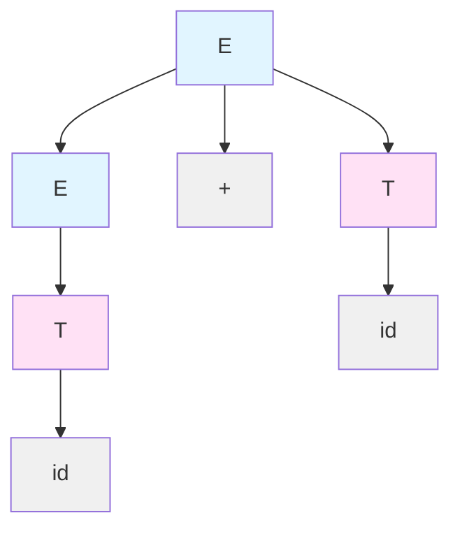

# Parse Trees

A **parse tree** (or derivation tree) is a graphical representation of how a string is derived from a grammar. Parse trees are fundamental to syntax analysis in compilers.

## Structure of Parse Trees

A parse tree for grammar $G = (V, \Sigma, R, S)$ satisfies:
- Root is labeled with start symbol $S$
- Each internal node is labeled with a variable from $V$
- Children of node $A$ labeled $X_1, X_2, \ldots, X_k$ correspond to rule $A \to X_1X_2\cdots X_k$
- Leaves are labeled with terminals from $\Sigma$ or $\varepsilon$

## The Yield

The **yield** (or frontier) of a parse tree is the string of terminal symbols at the leaves, read left to right.

A string $w$ is in $L(G)$ iff there exists a parse tree with:
- Root labeled $S$
- Yield equal to $w$

Formally: $L(G) = \{w \in \Sigma^* \mid S \Rightarrow^* w\}$

## Example Parse Tree

For grammar with productions:
- $E \to E + T \mid T$
- $T \to \text{id}$

Parse tree for "id + id":

**Derivation**: $E \Rightarrow E + T \Rightarrow T + T \Rightarrow \text{id} + T \Rightarrow \text{id} + \text{id}$

**Yield**: id + id

## Parse Trees vs Derivations

| Derivations | Parse Trees |
|-------------|-------------|
| Sequence of steps | Tree structure |
| Order matters | Order irrelevant |
| Many per string | Structure-based |
| Leftmost/rightmost unique | Unique per structure |

Multiple derivations can produce the same parse tree.

## Constructing Parse Trees

### From Leftmost Derivation
Process derivation left to right, building tree top-down, always expanding leftmost variable.

### From Rightmost Derivation
Process derivation right to left (bottom-up), building tree from leaves to root.

## Parse Tree Properties

**Height**: Longest path from root to leaf
**Width**: Maximum number of nodes at any level

For string w:
- Height relates to derivation depth
- Width bounded by |V ∪ Σ|^height

## Subtrees

A **subtree** rooted at node A represents a derivation A ⇒* w where w is the subtree's yield.

Subtrees can be:
- Replaced by other subtrees for the same variable
- Used to prove properties by structural induction

## Parse Tree Algorithms

### CYK Algorithm
Builds parse table bottom-up, finding all derivations for each substring.

### Earley Parser
Builds parse forest incrementally, handling all CFGs.

### Recursive Descent
Constructs tree top-down for LL grammars.

### LR Parsing
Constructs tree bottom-up for LR grammars.

## Parse Forests

When grammar is ambiguous, multiple parse trees exist for some strings. A **parse forest** represents all trees compactly.

## Applications

Parse trees are used in:
- **Compilers**: AST construction
- **Natural language processing**: Syntax analysis
- **XML/JSON processing**: Document structure
- **Query languages**: Expression evaluation

## Tree Automata

Parse trees can be processed by **tree automata**, which extend finite automata to trees:
- States assigned to nodes bottom-up
- Transitions based on children's states
- Accept based on root state
