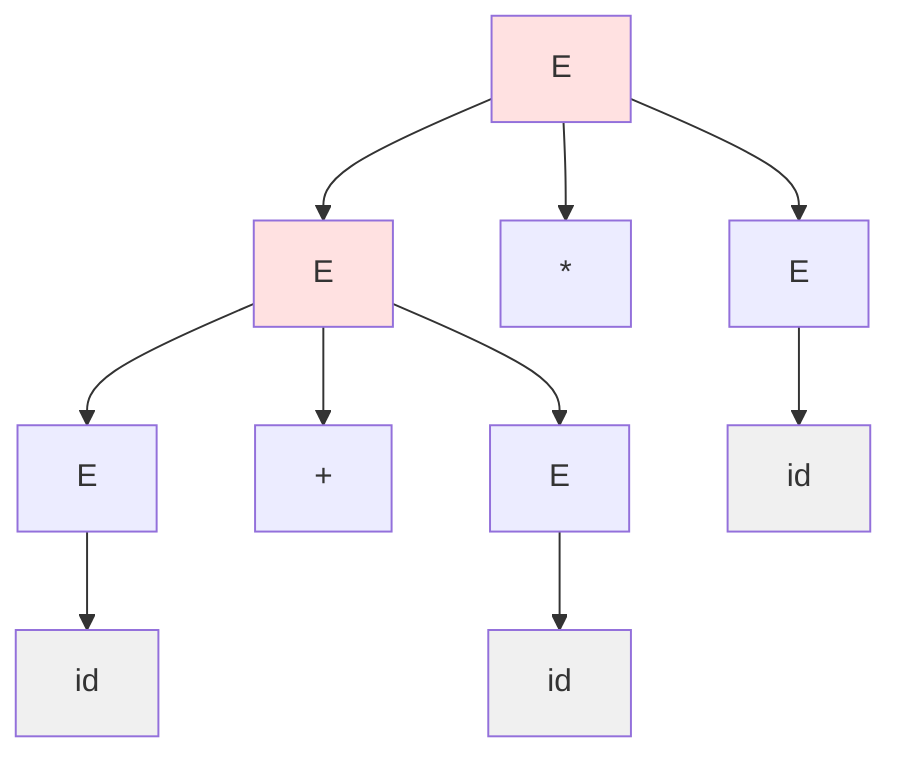
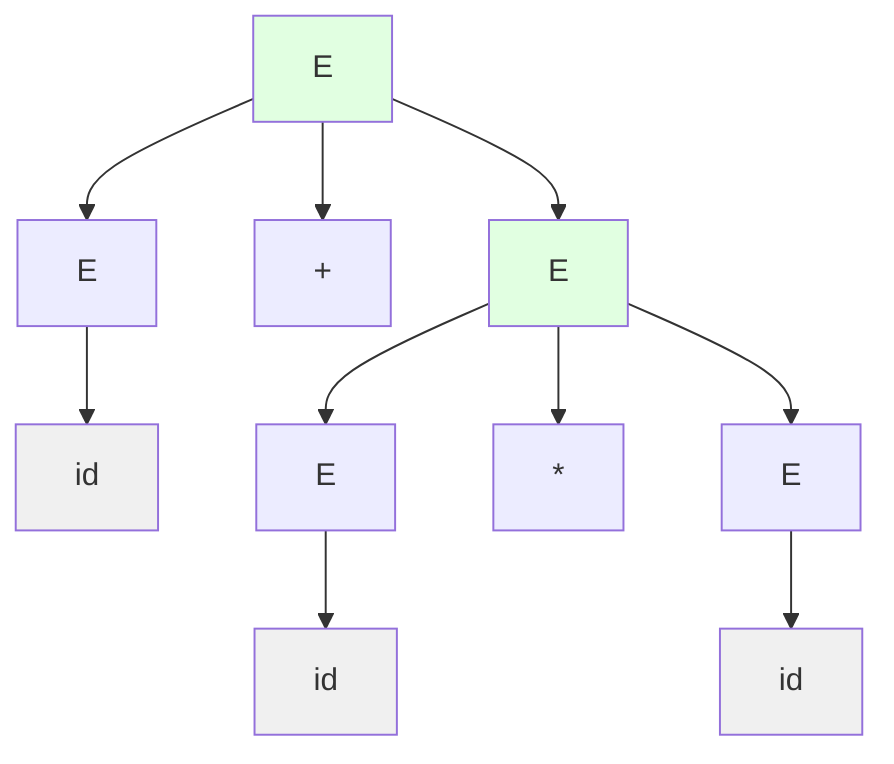

# Ambiguity

A grammar is **ambiguous** if some string has multiple parse trees. Ambiguity causes problems in parsing and interpretation.

## Definition

A CFG $G$ is **ambiguous** if there exists a string $w \in L(G)$ with two or more distinct parse trees.

Equivalently, $w$ has two distinct leftmost derivations (or two distinct rightmost derivations).

Formally:
$$
G \text{ is ambiguous} \iff \exists w \in L(G) : w \text{ has multiple parse trees}
$$

## Classic Example: Dangling Else

Grammar for if-statements:
- S → if E then S else S
- S → if E then S
- S → other

For "if E₁ then if E₂ then S₁ else S₂":
- Parse 1: else binds to inner if
- Parse 2: else binds to outer if

This **dangling else** ambiguity appears in many programming languages.

## Arithmetic Expression Ambiguity

Ambiguous grammar: $E \to E + E \mid E * E \mid \text{id}$

For "id + id * id":

### Parse Tree 1: $(id + id) * id$



### Parse Tree 2: $id + (id * id)$



These give different evaluation results! Tree 1 evaluates to $(id_1 + id_2) \times id_3$, while Tree 2 evaluates to $id_1 + (id_2 \times id_3)$.

## Detecting Ambiguity

**Bad news**: Ambiguity is **undecidable** in general.

No algorithm can determine if an arbitrary CFG is ambiguous.

**Practical approach**: Use grammar patterns known to be unambiguous.

## Removing Ambiguity

### Technique 1: Precedence Levels
Introduce separate variables for different precedence:
```
E → E + T | T
T → T * F | F
F → (E) | id
```
Now * binds tighter than +.

### Technique 2: Associativity
Left-associative: E → E + T
Right-associative: E → T + E

### Technique 3: Disambiguating Rules
Add rules outside grammar to resolve ambiguity:
- "else binds to nearest if"
- "operators left-associate"

## Inherent Ambiguity

Some CFLs are **inherently ambiguous**: every grammar for them is ambiguous.

**Example**: $L = \{a^n b^n c^m d^m \mid n, m \geq 1\} \cup \{a^n b^m c^m d^n \mid n, m \geq 1\}$

Any grammar for $L$ must be ambiguous because strings like $a^n b^n c^n d^n$ belong to both sub-languages and can be parsed in two fundamentally different ways:
- Matching $n$ $a$'s with $n$ $b$'s and $n$ $c$'s with $n$ $d$'s
- Matching $n$ $a$'s with $n$ $d$'s and $n$ $b$'s with $n$ $c$'s

## Ambiguity in Practice

### Parser Generators
Tools like Yacc/Bison:
- Detect ambiguity as shift-reduce conflicts
- Allow explicit resolution rules
- Default: shift on conflict (else binds to nearest if)

### GLR Parsers
Handle ambiguous grammars by:
- Exploring all parses in parallel
- Returning parse forest
- Useful for NLP where ambiguity is natural

## Consequences of Ambiguity

| Context | Issue |
|---------|-------|
| Programming languages | Multiple interpretations |
| Compilers | Which code to generate? |
| Natural language | "I saw the man with binoculars" |
| Security | Parsing inconsistencies |

## Unambiguous Grammar Properties

For unambiguous G:
- Each w ∈ L(G) has exactly one parse tree
- Each w has exactly one leftmost derivation
- Each w has exactly one rightmost derivation
- Parsing produces deterministic result

## Testing for Ambiguity

Heuristics:
- Generate random strings, count parses
- Use grammar analysis tools
- Check for common ambiguous patterns
