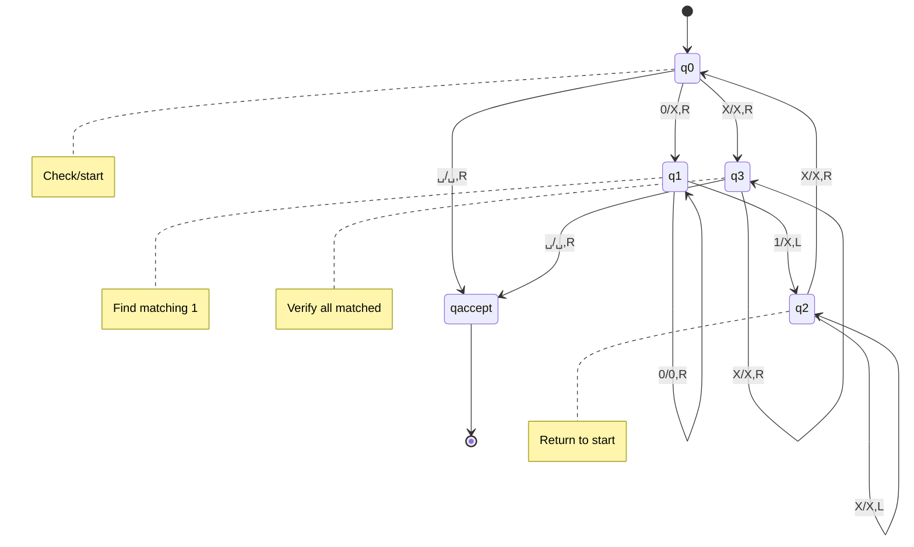

# TM Definition

A **Turing Machine (TM)** is the most powerful computational model, equivalent to any general-purpose computer. It can read, write, and move on an infinite tape.

## Formal Definition

A TM is a 7-tuple $M = (Q, \Sigma, \Gamma, \delta, q_0, q_{\text{accept}}, q_{\text{reject}})$ where:

- **Q** is a finite set of states
- **Σ** is the input alphabet (not containing blank $\sqcup$)
- **Γ** is the tape alphabet ($\Sigma \subset \Gamma$, $\sqcup \in \Gamma$)
- $\delta: Q \times \Gamma \to Q \times \Gamma \times \{L, R\}$ is the transition function
- $q_0 \in Q$ is the start state
- $q_{\text{accept}} \in Q$ is the accept state
- $q_{\text{reject}} \in Q$ is the reject state ($q_{\text{accept}} \neq q_{\text{reject}}$)

## The Tape

The TM has an infinite tape divided into cells:
- Each cell holds one symbol from Γ
- Initially contains input string followed by blanks
- Tape infinite in one or both directions

## The Head

A read/write head:
- Positioned over one cell
- Can read the current symbol
- Can write a new symbol
- Moves left (L) or right (R) one cell per step

## Transition Function

$\delta(q, a) = (r, b, D)$ means:

In state $q$, reading symbol $a$:
1. Write symbol $b$ (replacing $a$)
2. Move head in direction $D \in \{L, R\}$
3. Enter state $r$

## Halting States

When TM enters $q_{\text{accept}}$ or $q_{\text{reject}}$, it **halts**:
- $q_{\text{accept}}$: Input accepted
- $q_{\text{reject}}$: Input rejected

The TM may also run forever without halting (for some inputs).

## Configurations

A **configuration** captures the complete machine state:

$uqv$ represents:
- Tape contents: $uv$ (with blanks beyond)
- Current state: $q$
- Head position: over first symbol of $v$

## Computation Steps

Configuration $C_1$ **yields** $C_2$ (written $C_1 \vdash C_2$):

If $\delta(q_i, b) = (q_j, c, L)$:
$$uaq_ibv \vdash uq_jacv \quad \text{(move left)}$$

If $\delta(q_i, b) = (q_j, c, R)$:
$$uaq_ibv \vdash uacq_jv \quad \text{(move right)}$$

## Language Recognition

The language recognized by TM $M$:

$$
L(M) = \{w \in \Sigma^* \mid M \text{ accepts } w\}
$$

$M$ accepts $w$ if starting from $q_0w$, $M$ eventually reaches $q_{\text{accept}}$.

## Example TM

TM for $L = \{0^n 1^n \mid n \geq 0\}$:

**Algorithm:**
1. If tape is blank, accept
2. If first symbol isn't 0, reject
3. Cross off a 0 (write X)
4. Move right to find a 1
5. Cross off the 1 (write X)
6. Move left to find next 0
7. Repeat until all 0s and 1s crossed off

### State Diagram

## State Diagram Notation

Transitions drawn as: $q_1 \xrightarrow{0/X,R} q_2$

Read 0, write X, move right, go to state $q_2$.

## TM vs Previous Models

| Model | Memory | Power |
|-------|--------|-------|
| DFA | None | Regular |
| PDA | Stack (LIFO) | Context-free |
| TM | Infinite tape (random access) | Recursively enumerable |

The infinite read/write tape gives TMs their power.
