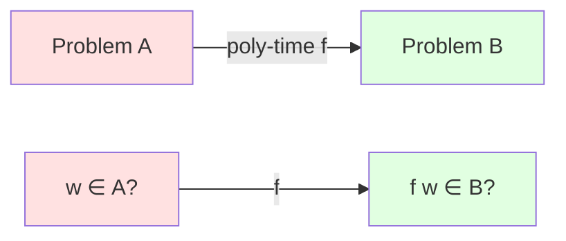
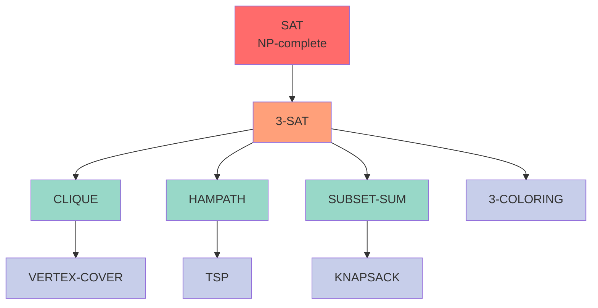
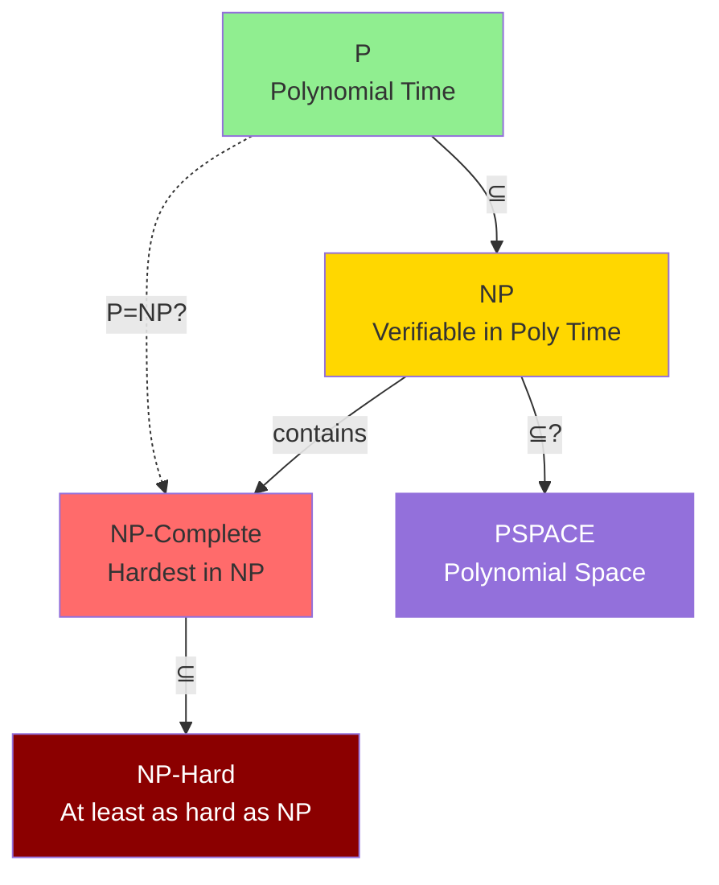

# NP-Completeness

**NP-complete** problems are the "hardest" problems in NP. If any NP-complete problem has a polynomial-time algorithm, then P = NP.

## Definition

A language $L$ is **NP-complete** if:
1. $L \in \mathbf{NP}$ (in NP)
2. For every $A \in \mathbf{NP}$: $A \leq_p L$ (NP-hard)

**NP-hard**: At least as hard as everything in $\mathbf{NP}$.
**NP-complete**: NP-hard and in $\mathbf{NP}$.

## Polynomial-Time Reductions

$A \leq_p B$ ("$A$ reduces to $B$ in polynomial time") if there exists polynomial-time computable $f$ such that:

$$
w \in A \iff f(w) \in B
$$

**Transitivity**: $A \leq_p B$ and $B \leq_p C$ implies $A \leq_p C$.

### Reduction Diagram

If we can solve $B$ in polynomial time, then we can solve $A$ in polynomial time.

## The First NP-Complete Problem

**Cook-Levin Theorem** (1971): SAT is NP-complete.

**Proof idea**: Any NP verifier's computation can be encoded as a Boolean formula that's satisfiable iff the original instance is in the language.

## Proving NP-Completeness

To prove $L$ is NP-complete:
1. Show $L \in \mathbf{NP}$ (give polynomial verifier)
2. Show known NP-complete problem reduces to $L$

If SAT $\leq_p L$ and $L \in \mathbf{NP}$, then $L$ is NP-complete.

**Proof template:**
$$
\text{Known NP-complete} \leq_p L \land L \in \mathbf{NP} \implies L \text{ is NP-complete}
$$

## Classic NP-Complete Problems

### SAT (Boolean Satisfiability)
Given Boolean formula φ, is there a satisfying assignment?

### 3-SAT
SAT restricted to clauses with exactly 3 literals.
3-SAT ≤_p SAT (special case)
SAT ≤_p 3-SAT (reduction)

### CLIQUE
Does graph G have a clique of size k?
3-SAT ≤_p CLIQUE

### VERTEX-COVER
Does graph G have a vertex cover of size k?
CLIQUE ≤_p VERTEX-COVER (complement relationship)

### HAMILTONIAN-PATH
Does graph G have a Hamiltonian path?
3-SAT ≤_p HAMPATH

### SUBSET-SUM
Given set S and target t, is there subset summing to t?
3-SAT ≤_p SUBSET-SUM

### TRAVELING SALESMAN (Decision)
Is there a tour of length ≤ k?
HAMPATH ≤_p TSP

### GRAPH-COLORING
Can G be colored with k colors?
3-SAT ≤_p 3-COLORING

## The Web of Reductions

Cook's theorem established SAT as NP-complete. Thousands of problems have been shown NP-complete by reduction chains:

Each arrow represents a polynomial-time reduction $\leq_p$.

## Consequences of NP-Completeness

If $L$ is NP-complete:
- $L \in \mathbf{P} \implies \mathbf{P} = \mathbf{NP}$
- $L \notin \mathbf{P} \iff \mathbf{P} \neq \mathbf{NP}$ (assuming separation)
- No known polynomial algorithm
- Unlikely to find one

### Complexity Class Hierarchy

## Dealing with NP-Complete Problems

Practical approaches:
1. **Approximation**: Find near-optimal solutions
2. **Heuristics**: Fast algorithms without guarantees
3. **Special cases**: Identify tractable subproblems
4. **Parameterized**: Fix some parameter
5. **Randomization**: Accept probabilistic guarantees
6. **Exponential but smart**: Exact algorithms with good constants

## NP-Hard vs NP-Complete

**NP-hard**: As hard as NP (may not be in NP)
**NP-complete**: NP-hard AND in NP

Examples:
- Halting problem: NP-hard, not in NP (undecidable)
- Optimization TSP: NP-hard, not in NP (not decision)
- TSP decision: NP-complete

## Historical Impact

NP-completeness theory:
- Unified thousands of problems
- Provided framework for "hardness"
- Guides algorithm design
- Foundation of complexity theory
