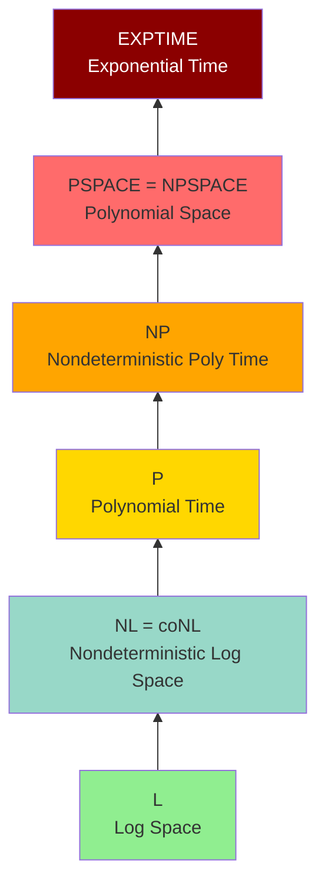

# Space Complexity

**Space complexity** measures memory usage of computation. It provides a different perspective on computational resources, sometimes more relevant than time.

## Definition

For TM $M$ on input $w$, **space used** is the number of distinct tape cells visited.

The **space complexity** of $M$ is function $s: \mathbb{N} \to \mathbb{N}$:

$$
s(n) = \max\{\text{cells } M \text{ uses on input } w : |w| = n\}
$$

## Space Complexity Classes

$$
\mathbf{SPACE}(f(n)) = \{L \mid L \text{ decidable using } O(f(n)) \text{ space}\}
$$

$$
\mathbf{NSPACE}(f(n)) = \{L \mid L \text{ decidable by NTM using } O(f(n)) \text{ space}\}
$$

## Important Classes

### L (Logarithmic Space)
$$
\mathbf{L} = \mathbf{SPACE}(\log n)
$$

Very restrictive: can't even write down the input! Uses separate read-only input tape.

### NL (Nondeterministic Log Space)
$$
\mathbf{NL} = \mathbf{NSPACE}(\log n)
$$

### PSPACE
$$
\mathbf{PSPACE} = \bigcup_{k} \mathbf{SPACE}(n^k)
$$

All polynomial-space problems.

### NPSPACE
$$
\mathbf{NPSPACE} = \bigcup_{k} \mathbf{NSPACE}(n^k)
$$

## Savitch's Theorem

**Theorem**: $\mathbf{NSPACE}(f(n)) \subseteq \mathbf{SPACE}(f(n)^2)$ for $f(n) \geq \log n$

**Corollary**: $\mathbf{NPSPACE} = \mathbf{PSPACE}$

Nondeterminism doesn't help much for space! (Unlike time, where $\mathbf{P}$ vs $\mathbf{NP}$ is open)

## Space Hierarchy

**Theorem**: For space-constructible $f(n)$:
$$
\mathbf{SPACE}(f(n)) \subsetneq \mathbf{SPACE}(f(n) \cdot \log f(n))
$$

More space means strictly more power.

## Relationships

$$
\mathbf{L} \subseteq \mathbf{NL} \subseteq \mathbf{P} \subseteq \mathbf{NP} \subseteq \mathbf{PSPACE} \subseteq \mathbf{EXPTIME}
$$

**Known separations:**
- $\mathbf{L} \subsetneq \mathbf{PSPACE}$ (space hierarchy)
- $\mathbf{P} \subsetneq \mathbf{EXPTIME}$ (time hierarchy)

**Unknown:**
- $\mathbf{L}$ vs $\mathbf{NL}$
- $\mathbf{P}$ vs $\mathbf{NP}$
- $\mathbf{NP}$ vs $\mathbf{PSPACE}$

## PSPACE-Complete Problems

A problem is **PSPACE-complete** if:
1. In PSPACE
2. Every PSPACE problem reduces to it (in polynomial time)

### TQBF (True Quantified Boolean Formulas)
∀x₁∃x₂∀x₃... φ(x₁,...,xₙ)

Is the quantified formula true?

TQBF is PSPACE-complete.

### Game Problems
Many two-player games are PSPACE-complete:
- Generalized chess (arbitrary board size)
- Generalized Go
- Generalized checkers

### Planning Problems
AI planning with polynomial plan length is PSPACE-complete.

## L-Complete Problems

**PATH** (directed s-t connectivity) is NL-complete.
**2-SAT** is NL-complete.

## Time-Space Tradeoffs

**Theorem**: SPACE(f(n)) ⊆ TIME(2^O(f(n)))

Space can be "converted" to time (exponentially).

**Theorem**: TIME(f(n)) ⊆ SPACE(f(n))

Time bounds space linearly.

## Sublinear Space

For space less than n (input length):
- Need read-only input tape
- Working tape has limited space
- Still useful for streaming algorithms

## Immerman-Szelepcsényi Theorem

**Theorem**: NL = coNL

Nondeterministic log space is closed under complement!

Contrasts with NP, where NP = coNP is open.

## Space in Practice

Space often more constraining than time:
- Memory limited
- Cache effects matter
- Streaming data can't store everything

Space-efficient algorithms are valuable.

## Summary: Complexity Landscape

**Containment relationships:**
$$
\mathbf{L} \subseteq \mathbf{NL} \subseteq \mathbf{P} \subseteq \mathbf{NP} \subseteq \mathbf{PSPACE} = \mathbf{NPSPACE} \subseteq \mathbf{EXPTIME}
$$

Many containments known; most equalities unknown.
