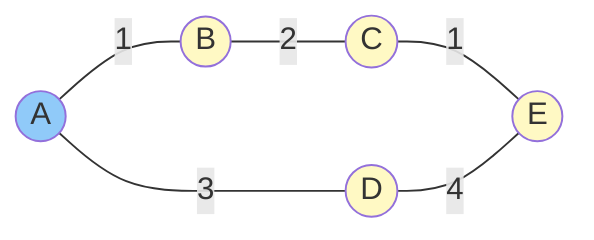
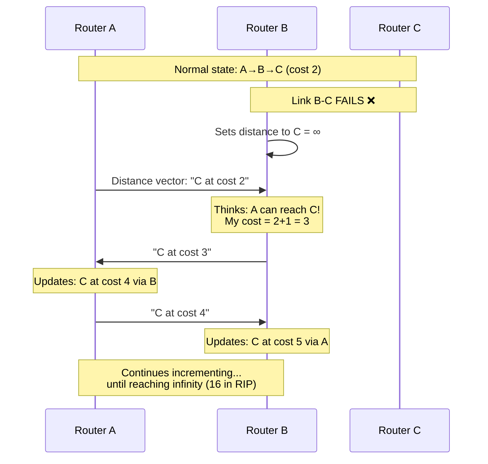

# Distance Vector Routing

## The Distance Vector Approach

Distance vector routing is a decentralized approach where each router knows only its directly connected neighbors and learns about distant networks through information exchanged with those neighbors. Each router maintains a vector (list) of distances to all known destinations.

The algorithm is based on the Bellman-Ford equation: if you know the shortest distance from your neighbors to a destination, you can compute your shortest distance by adding the cost to reach each neighbor.

## How Distance Vector Works

Each router maintains a distance table:
- Destinations it knows about
- Distance (cost) to reach each destination
- Next hop for each destination

**Algorithm**:
1. Initialize distances to directly connected networks (cost = link cost)
2. Initialize distances to all other destinations as infinity
3. Periodically send distance vector to all neighbors
4. When receiving neighbor's vector, update own table if better path found

**Update rule** (Bellman-Ford):

$$D(x,y) = \min_{v \in \text{neighbors}} \{ c(x,v) + D(v,y) \}$$

Where:
- $D(x,y)$ = distance from x to y
- $c(x,v)$ = cost of link from x to neighbor v
- $D(v,y)$ = neighbor v's advertised distance to y

## Example: Distance Vector Operation

Consider network:

Initial state (Router A's view):
| Dest | Distance | Next Hop |
|------|----------|----------|
| A | 0 | - |
| B | 1 | B |
| D | 3 | D |
| C | ∞ | - |
| E | ∞ | - |

After receiving B's vector (B knows: C=2, A=1):
| Dest | Distance | Next Hop |
|------|----------|----------|
| A | 0 | - |
| B | 1 | B |
| D | 3 | D |
| C | 3 | B | (1+2)
| E | ∞ | - |

After receiving D's vector (D knows: E=4):
| Dest | Distance | Next Hop |
|------|----------|----------|
| A | 0 | - |
| B | 1 | B |
| D | 3 | D |
| C | 3 | B |
| E | 7 | D | (3+4)

Convergence continues until all routers have optimal paths.

## The Count-to-Infinity Problem

Distance vector has a fundamental problem with handling link failures:

**Scenario**: A—B—C where A reaches C via B (distance 2)

If B—C link fails:
1. B sets distance to C as infinity
2. Before B's update reaches A, A sends its vector showing C at distance 2
3. B thinks: "A can reach C in 2, so I can reach C in 3 via A!"
4. B advertises C at distance 3
5. A receives this and thinks: "Now B says 3, my path is 4"
6. They keep incrementing until reaching infinity

This "counting to infinity" causes slow convergence and routing loops.

## Solutions to Count-to-Infinity

**Split Horizon**: Don't advertise routes back to the router you learned them from. If B learned about C from C, don't tell C about that route.

**Split Horizon with Poison Reverse**: Explicitly advertise infinity for routes learned from a neighbor back to that neighbor. Stronger than split horizon.

**Hold-down Timers**: After hearing a route is unreachable, ignore new routes to that destination for a period. Prevents premature acceptance of stale information.

**Triggered Updates**: Send updates immediately when routing changes, not just periodically. Speeds convergence.

**Maximum Hop Count**: Define infinity as a small number (e.g., 16 for RIP). Ensures eventual convergence, but limits network diameter.

## RIP: Routing Information Protocol

RIP is the classic distance vector protocol:

**RIP v1**:
- Hop count metric (max 15, 16 = infinity)
- Updates every 30 seconds
- Classful (no subnet masks in updates)
- Broadcast updates

**RIP v2**:
- Adds subnet masks (classless)
- Multicast updates (224.0.0.9)
- Authentication support
- Next hop specification

**RIP operation**:
1. Exchange routing tables with neighbors every 30 seconds
2. If no update from neighbor in 180 seconds, mark routes via that neighbor as unreachable
3. After 240 seconds, remove routes

**Limitations**:
- 15 hop maximum limits network size
- Slow convergence (minutes)
- Bandwidth overhead from periodic full updates

## Distance Vector Characteristics

**Advantages**:
- Simple to understand and implement
- Low memory requirements
- Good for small networks

**Disadvantages**:
- Slow convergence
- Count-to-infinity problem
- Limited scalability (hop count limits)
- Periodic updates waste bandwidth

Distance vector is suitable for small networks where simplicity matters more than convergence speed. For larger networks, link state protocols (OSPF) are preferred.
