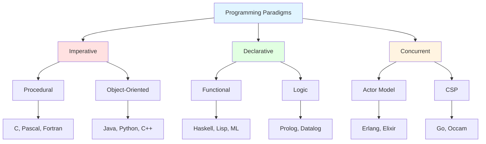

# Introduction to Programming Paradigms

## What is a Programming Paradigm?

A programming paradigm is a fundamental style or approach to programming that provides a framework for thinking about and structuring code. It represents a set of concepts, principles, and patterns that guide how programmers express computational logic and organize software systems. Rather than being tied to specific programming languages, paradigms represent abstract models of computation that can be implemented across various languages, though some languages are designed specifically to support particular paradigms.

The term "paradigm" comes from the Greek word "paradeigma," meaning pattern or example. In programming, a paradigm serves as a mental model that shapes how developers conceptualize problems and formulate solutions. Each paradigm offers distinct advantages and trade-offs, making certain types of problems easier or harder to solve depending on the approach chosen.

Understanding programming paradigms is crucial for several reasons. First, it expands a programmer's toolkit, enabling them to choose the most appropriate approach for a given problem. Second, it facilitates learning new programming languages, as many languages can be grouped by the paradigms they support. Third, it promotes deeper understanding of fundamental computer science concepts, as different paradigms expose different aspects of computation. Finally, modern software development increasingly embraces multi-paradigm approaches, combining elements from various paradigms to leverage their respective strengths.

## Major Programming Paradigms

The landscape of programming paradigms can be broadly categorized into several major families, each with distinct characteristics and philosophical foundations.

**Imperative Programming** represents one of the oldest and most intuitive paradigms, closely mirroring how computers actually execute instructions at the hardware level. In imperative programming, programs consist of sequences of commands that explicitly change program state. The programmer specifies not only what should be computed but also precisely how the computation should proceed, step by step. Languages like C, Pascal, and Fortran exemplify this paradigm. Imperative programming aligns naturally with the von Neumann architecture, where programs sequentially modify memory locations.

**Declarative Programming** stands in contrast to imperative approaches by emphasizing what should be computed rather than how to compute it. In declarative paradigms, programmers describe the desired result or relationship, and the underlying system determines the execution strategy. This abstraction often leads to more concise and maintainable code, as implementation details are hidden behind high-level specifications. SQL for database queries and HTML for document structure represent declarative approaches, though neither is a general-purpose programming language.

**Object-Oriented Programming (OOP)** emerged as a powerful paradigm for managing complexity in large software systems. OOP organizes code around objects—entities that combine data (attributes) and behavior (methods). Key concepts include encapsulation (bundling data with methods), inheritance (creating hierarchies of related classes), and polymorphism (treating objects of different types uniformly). Languages like Java, Python, and C++ strongly embrace OOP principles, though they also support other paradigms.

**Functional Programming** treats computation as the evaluation of mathematical functions, emphasizing immutability and avoiding side effects. In functional paradigms, functions are first-class citizens that can be passed as arguments, returned from other functions, and composed to build complex operations from simple ones. This approach often leads to more predictable and testable code, as functions with the same inputs always produce the same outputs. Haskell, Lisp, and increasingly mainstream languages like JavaScript and Python support functional programming concepts.

**Logic Programming** represents a unique paradigm based on formal logic. Programs consist of logical statements describing relationships and rules, and execution involves automated logical inference to derive conclusions. Prolog, the most prominent logic programming language, excels at problems involving symbolic reasoning, constraint satisfaction, and rule-based systems. While less common in mainstream development, logic programming provides powerful abstractions for certain problem domains.

## The Evolution of Programming Paradigms

Programming paradigms have evolved alongside advances in computer hardware, software engineering practices, and theoretical computer science. Understanding this evolution provides context for why different paradigms exist and when each might be most appropriate.

The earliest programs were written in machine code, directly manipulating hardware registers and memory addresses. Assembly language provided a thin abstraction layer, but programming remained tedious and error-prone. The development of high-level imperative languages like Fortran (1957) and COBOL (1959) marked a significant leap forward, allowing programmers to express algorithms more naturally while compilers handled low-level details.

The 1960s and 1970s saw experimentation with alternative paradigms. Lisp (1958) pioneered functional programming concepts, while Simula (1967) introduced object-oriented ideas. Prolog (1972) brought logic programming to the forefront. These languages initially served specialized communities—Lisp in artificial intelligence research, Simula in simulation modeling, Prolog in expert systems—but their ideas gradually influenced mainstream programming.

The 1980s witnessed the rise of object-oriented programming as a dominant paradigm, driven by languages like Smalltalk, C++, and later Java. OOP promised to address the "software crisis" through better code organization, reusability, and modeling of real-world entities. During this period, functional programming remained largely academic, though languages like ML and Scheme continued to advance functional concepts.

The 21st century has brought renewed interest in functional programming and multi-paradigm approaches. Challenges like concurrent and distributed computing, where mutable state creates complexity, have highlighted functional programming's advantages. Modern languages like Scala, Rust, and Kotlin explicitly embrace multiple paradigms, allowing developers to choose the most appropriate approach for each situation. Even traditionally object-oriented languages like Java and C# have incorporated functional features like lambda expressions and streams.

## Why Study Programming Paradigms?

Studying programming paradigms transcends mere academic interest; it fundamentally shapes how programmers think about and solve problems. Each paradigm offers a different lens through which to view computation, and exposure to multiple paradigms enriches problem-solving capabilities.

**Cognitive Flexibility**: Learning different paradigms expands mental models for approaching problems. A programmer trained exclusively in imperative programming might naturally think in terms of loops and state modifications, while someone familiar with functional programming might immediately consider recursion and transformations. Having multiple tools in your cognitive toolkit enables selecting the most natural and effective approach for each problem.

**Language Acquisition**: Understanding paradigms accelerates learning new programming languages. Rather than treating each language as an entirely new skill, programmers can recognize familiar paradigm patterns. Learning Scala becomes easier when you understand both object-oriented and functional concepts. Picking up Erlang is smoother when you grasp functional programming and actor-based concurrency.

**Code Quality**: Different paradigms encourage different coding practices, many of which improve code quality regardless of the primary paradigm used. Functional programming's emphasis on immutability and pure functions reduces bugs. Object-oriented programming's encapsulation principles improve maintainability. Exposure to these ideas helps programmers write better code in any language.

**Career Versatility**: The software industry increasingly values polyglot programmers who can work across multiple languages and paradigms. Distributed systems might leverage Erlang's actor model, data pipelines might use functional transformations, and business logic might employ object-oriented patterns. Understanding paradigms makes transitioning between these contexts feasible.

**Future-Proofing**: As computing continues to evolve—with quantum computing, edge computing, and AI-driven development on the horizon—new paradigms and variations will emerge. A strong foundation in paradigm concepts provides the flexibility to adapt to future developments rather than being locked into today's dominant approaches.

In subsequent sections, we will explore each major paradigm in depth, examining their theoretical foundations, practical applications, strengths, and limitations. This journey through programming paradigms will equip you with both the knowledge to understand diverse programming languages and the wisdom to choose appropriate tools for the challenges you'll face in modern software development.
