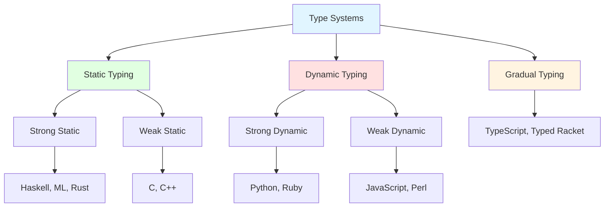

# Type Basics

## What Are Types?

Types form the foundation of modern programming languages, providing a formal system for classifying values and expressions according to the kinds of operations they support. At the most fundamental level, a type represents a set of possible values along with the operations that can be performed on those values. An integer type, for instance, represents whole numbers along with arithmetic operations like addition and multiplication. A string type represents sequences of characters with operations like concatenation and substring extraction.

The concept of types emerged from efforts to make programming more reliable and reasoning about programs more tractable. In the earliest days of computing, machine code operated on raw bits without any notion of types—a programmer could treat the same bit pattern as an integer, a floating-point number, or a memory address, leading to subtle and catastrophic bugs. Assembly languages provided minimal type distinctions through different instruction opcodes, but the burden of using appropriate instructions remained with programmers.

High-level programming languages introduced explicit type systems to prevent entire classes of errors. When you declare a variable as an integer in C or a string in Python, you're establishing a contract: this variable will hold values of this type, and only operations valid for this type will be applied. This contract enables both compile-time verification (catching errors before execution) and runtime checks (preventing invalid operations during execution), depending on the language's type system design.

Types serve multiple crucial purposes in programming. First, they provide **error detection**—type systems catch mistakes like adding a number to a string or calling a method that doesn't exist. These errors, caught early, are far easier to fix than runtime failures in production. Second, types enable **abstraction**—interfaces and abstract types let programmers work at higher levels without concerning themselves with implementation details. Third, types facilitate **optimization**—knowing a variable's type lets compilers generate efficient machine code tailored to that type. Fourth, types serve as **documentation**—a function signature like `String toLowerCase(String input)` clearly communicates what inputs the function expects and what output it produces.

Type systems vary dramatically across languages. Some languages have simple type systems with a handful of primitive types and basic mechanisms for creating new types. Others have sophisticated type systems with advanced features like generics, type inference, dependent types, and more. Understanding types deeply—their purpose, how they work, and the trade-offs different type system designs entail—is essential for mastering programming language theory and practice.

## Type Safety and Type Errors

Type safety refers to a programming language's ability to prevent type errors—operations that violate type constraints. A type error occurs when an operation is applied to a value of an inappropriate type, such as attempting to call a function with arguments of the wrong type or accessing a field that doesn't exist on an object.



**Strongly Typed vs Weakly Typed** languages differ in how rigorously they enforce type constraints. Strong typing means the language prevents type errors through compile-time checking, runtime checking, or both. Weakly typed languages allow operations that mix types, performing implicit conversions or simply allowing potentially unsafe operations.

Consider integer-string concatenation:

```python
# Python (strongly typed): type error
x = 5
y = "hello"
z = x + y  # TypeError: unsupported operand type(s)
```

```javascript
// JavaScript (weakly typed): implicit conversion
let x = 5;
let y = "hello";
let z = x + y;  // "5hello" - number converted to string
```

Python raises an error because adding a number to a string doesn't make sense without explicit conversion. JavaScript silently converts the number to a string and concatenates. Neither approach is universally better—strong typing catches errors but requires explicitness, while weak typing provides convenience at the cost of potential confusion.

**Type Soundness** is a formal property guaranteeing that well-typed programs won't encounter type errors at runtime. A sound type system ensures that if a program type-checks (compiles without type errors), runtime execution won't produce type violations. This "well-typed programs don't go wrong" principle provides strong safety guarantees.

Formally, type soundness consists of two key properties:

**Progress**: If $\vdash e : T$, then either $e$ is a value or $\exists e'$ such that $e \rightarrow e'$.

**Preservation**: If $\vdash e : T$ and $e \rightarrow e'$, then $\vdash e' : T$.

Not all practical languages are sound. C's type system is unsound—pointer casts and array bounds violations can cause type errors at runtime despite passing type checking. Java is mostly sound but has loopholes (null pointer exceptions, unchecked casts). Languages like ML, Haskell, and Rust aim for soundness, providing stronger guarantees.

**Static vs Dynamic Type Checking** represents a fundamental distinction in when types are checked:

**Static Type Checking** verifies types at compile time before program execution. Languages like Java, C++, Haskell, and Rust check types statically:

```java
public class Example {
    public static int add(int a, int b) {
        return a + b;
    }

    public static void main(String[] args) {
        int result = add(5, "hello");  // Compile error!
    }
}
```

The compiler rejects this program because `add` expects two integers but receives a string. Static checking catches errors early, enables optimizations, and provides IDE support for autocomplete and refactoring.

**Dynamic Type Checking** verifies types at runtime during program execution. Languages like Python, Ruby, and JavaScript check types dynamically:

```python
def add(a, b):
    return a + b

result = add(5, "hello")  # Runs but raises TypeError
```

This code passes any preliminary checks (Python doesn't compile in the traditional sense) but fails when executed because addition isn't defined for integers and strings. Dynamic checking provides flexibility—you can write code that works with any types supporting required operations—but errors appear only when code actually executes.

**Gradual Typing** combines static and dynamic checking, allowing programmers to add type annotations incrementally. TypeScript, Python with type hints, and Typed Racket exemplify gradual typing:

```typescript
// TypeScript: can mix typed and untyped code
function add(a: number, b: number): number {
    return a + b;
}

let x: any = "hello";  // 'any' opts out of type checking
let result = add(5, x);  // Type error caught statically
```

Gradual typing enables evolving codebases from dynamic to static typing, providing static checking benefits where annotations exist while maintaining flexibility elsewhere.

**Type Errors in Practice** encompass various categories:

1. **Arity Errors**: Wrong number of arguments to functions
2. **Field Access Errors**: Accessing nonexistent object fields
3. **Null/Undefined Errors**: Operating on null/undefined values
4. **Cast Errors**: Invalid type conversions
5. **Parametric Errors**: Type parameter mismatches in generics

Modern type systems attempt to catch these errors early while minimizing false positives (rejecting valid programs) and false negatives (accepting invalid programs). The art of type system design involves balancing expressiveness (allowing useful programs), safety (preventing errors), and simplicity (keeping the system understandable).

## Primitive and Composite Types

Programming languages provide **primitive types**—built-in, fundamental types that form the building blocks for more complex types—and mechanisms for creating **composite types** that combine multiple values.

**Primitive Types** typically include:

**Integers** represent whole numbers in various sizes (8-bit, 16-bit, 32-bit, 64-bit) and signedness (signed vs unsigned):

```c
int8_t tiny = 127;      // -128 to 127
uint8_t small = 255;    // 0 to 255
int32_t medium = 2147483647;
uint64_t large = 18446744073709551615UL;
```

Different sizes enable trading range for memory efficiency.

**Floating-Point Numbers** represent real numbers with fractional parts:

```python
pi = 3.14159
scientific = 6.022e23  # Scientific notation
```

IEEE 754 standard defines floating-point formats, though precision limitations cause subtle issues—`0.1 + 0.2` doesn't exactly equal `0.3` in binary floating-point.

**Booleans** represent true/false values:

```java
boolean isValid = true;
boolean isReady = false;
```

**Characters and Strings** represent text. Characters are single letters/symbols; strings are sequences:

```python
char = 'A'
string = "Hello, World!"
unicode = "こんにちは"  # Unicode support varies by language
```

**Unit/Void Types** represent absence of meaningful value, used for functions with side effects but no return value:

```rust
fn print_message(msg: &str) -> () {  // () is unit type
    println!("{}", msg);
}
```

**Composite Types** build complex structures from simpler types:

**Arrays/Lists** are ordered collections of elements of the same type:

```typescript
let numbers: number[] = [1, 2, 3, 4, 5];
let first: number = numbers[0];
```

Arrays have fixed or dynamic size depending on the language.

**Tuples** group fixed-size collections of potentially different-typed values:

```python
person = ("Alice", 30, "Engineer")
name, age, occupation = person  # Destructuring
```

```haskell
-- Haskell tuples with explicit types
pair :: (Int, String)
pair = (42, "answer")
```

**Records/Structs** are collections of named fields:

```c
struct Point {
    double x;
    double y;
};

struct Point p = {3.0, 4.0};
double x_coord = p.x;
```

Records provide meaningful field names rather than positional tuple access.

**Enumerations** define types with a fixed set of named values:

```java
enum Day {
    MONDAY, TUESDAY, WEDNESDAY, THURSDAY, FRIDAY, SATURDAY, SUNDAY
}

Day today = Day.MONDAY;
```

**Union Types** represent values that could be one of several types:

```typescript
type StringOrNumber = string | number;

function process(value: StringOrNumber) {
    if (typeof value === "string") {
        console.log(value.toUpperCase());
    } else {
        console.log(value * 2);
    }
}
```

**Option/Maybe Types** explicitly represent values that might be absent:

```rust
enum Option<T> {
    Some(T),
    None
}

fn find_item(id: u32) -> Option<String> {
    if id == 1 {
        Some("Item 1".to_string())
    } else {
        None
    }
}
```

Option types eliminate null pointer errors by making absence explicit and forcing handling.

**Function Types** treat functions as values with types describing parameter and return types:

```typescript
type BinaryOp = (a: number, b: number) => number;

const add: BinaryOp = (a, b) => a + b;
const multiply: BinaryOp = (a, b) => a * b;
```

Function types enable higher-order programming, where functions accept or return other functions.

## Type Checking and Type Inference

Type checking is the process of verifying that programs respect type constraints. Type inference automatically deduces types without requiring explicit annotations. Together, these mechanisms enable both safety and convenience.

**Type Checking Algorithms** verify type correctness through various approaches:

**Nominal Typing** considers types equal only if they have the same name:

```java
class UserId {
    private int id;
}

class ProductId {
    private int id;
}

UserId uid = new UserId();
ProductId pid = uid;  // Error: incompatible types
```

Even though UserId and ProductId have identical structure, they're different types because they have different names. Nominal typing supports strong abstraction—UserId and ProductId aren't interchangeable despite structural similarity.

**Structural Typing** considers types equal if they have the same structure:

```typescript
interface Point {
    x: number;
    y: number;
}

function distance(p: Point): number {
    return Math.sqrt(p.x * p.x + p.y * p.y);
}

// This works even though 'obj' isn't explicitly declared as Point
let obj = { x: 3, y: 4, color: "red" };
distance(obj);  // OK: obj has required x and y fields
```

Structural typing, also called duck typing in dynamic contexts, focuses on capabilities rather than names.

**Type Inference** deduces types automatically, reducing annotation burden while maintaining static checking:

```kotlin
// Kotlin infers types
val x = 42  // Inferred as Int
val message = "Hello"  // Inferred as String
val numbers = listOf(1, 2, 3)  // Inferred as List<Int>

fun add(a: Int, b: Int) = a + b  // Return type inferred as Int
```

Type inference combines convenience of dynamic typing with safety of static typing. Programmers write less boilerplate while compilers ensure type safety.

**Hindley-Milner Type Inference**, used in ML, Haskell, and similar languages, can infer types for entire programs without any annotations.

The algorithm works by:
1. Assigning type variables: $\alpha, \beta, \gamma, \ldots$
2. Generating constraints from usage
3. Solving via unification: finding substitutions that satisfy all constraints

For example, the identity function $\lambda x. x$ gets type $\forall \alpha. \alpha \rightarrow \alpha$.

```haskell
-- No type annotations needed
identity x = x
-- Inferred type: identity :: a -> a

map f [] = []
map f (x:xs) = f x : map f xs
-- Inferred type: map :: (a -> b) -> [a] -> [b]

compose f g x = f (g x)
-- Inferred type: compose :: (b -> c) -> (a -> b) -> a -> c
```

The inference algorithm analyzes how values are used, generates constraints, and solves them to deduce most general types. This enables writing programs that look dynamically typed but are fully statically checked.

**Bidirectional Type Checking** combines inference with checking, where some contexts infer types while others check against expected types:

```typescript
// TypeScript uses bidirectional checking
const numbers = [1, 2, 3];  // Infer as number[]

// Check against expected type
const add: (a: number, b: number) => number = (a, b) => a + b;

// Inference for lambda parameter types from context
numbers.map((n) => n * 2);  // 'n' inferred as number from numbers type
```

**Flow-Sensitive Typing** refines types based on control flow:

```typescript
function process(value: string | number) {
    if (typeof value === "string") {
        // TypeScript knows value is string here
        console.log(value.toUpperCase());
    } else {
        // TypeScript knows value is number here
        console.log(value * 2);
    }
}
```

After the type guard (`typeof value === "string"`), the type system refines value's type from `string | number` to just `string` in the true branch and `number` in the false branch.

**Limitations and Challenges** in type checking and inference include:

1. **Decidability**: Some type systems are undecidable—no algorithm can determine if arbitrary programs type-check. Practical systems balance expressiveness with decidability.

2. **Error Messages**: Type errors can be cryptic, especially in languages with inference. When inference fails, error messages might be far from the actual mistake.

3. **Incomplete Inference**: Some languages require annotations where inference fails or becomes ambiguous.

4. **Performance**: Type checking complex programs can be slow, though optimizations usually keep it acceptable.

Understanding type checking and inference mechanisms helps programmers work effectively with type systems, write more maintainable code, and debug type errors efficiently. Modern languages increasingly leverage sophisticated type inference to provide both safety and convenience, demonstrating that strong typing needn't mean verbose code.
