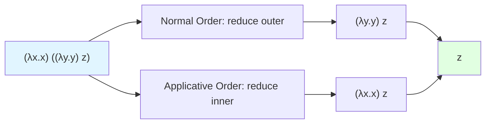

# Lambda Calculus

Lambda calculus is the theoretical foundation of functional programming. Developed by Alonzo Church in the 1930s, this simple formal system captures the essence of computation through function abstraction and application. Understanding lambda calculus provides deep insight into how functional languages work.

## Syntax of Lambda Calculus

Lambda calculus has just three constructs:

$$
\begin{align}
e ::= \quad & x & \text{(Variable)} \\
    | \quad & \lambda x.e & \text{(Abstraction)} \\
    | \quad & e \, e & \text{(Application)}
\end{align}
$$

That's it. No numbers, no conditionals, no loops—just variables, functions, and function application. Yet this minimal language is Turing-complete.

### Examples

```
-- Identity function: takes x, returns x
λx.x

-- Constant function: ignores second argument
λx.λy.x

-- Self-application
λx.x x

-- Function application
(λx.x) y    -- Applies identity to y
```

## Bound and Free Variables

A variable is **bound** if it appears within the scope of a lambda that binds it. A variable is **free** if it's not bound.

The set of free variables $FV(e)$ is defined inductively:

$$
\begin{align}
FV(x) &= \{x\} \\
FV(\lambda x.e) &= FV(e) \setminus \{x\} \\
FV(e_1 \, e_2) &= FV(e_1) \cup FV(e_2)
\end{align}
$$

For example, in $\lambda x. x \, y$, the variable $x$ is bound by $\lambda x$ while $y$ is free.

### Alpha Equivalence

Terms that differ only in the names of bound variables are considered equivalent ($\equiv_\alpha$):

$$\lambda x.x \equiv_\alpha \lambda y.y \equiv_\alpha \lambda z.z$$

All of these represent the identity function. However, $\lambda x.\lambda y.x \not\equiv_\alpha \lambda y.\lambda y.y$ because they have different behavior.

## Beta Reduction

The fundamental computation rule: applying a function substitutes the argument for the parameter:

$$(\lambda x.e_1) \, e_2 \rightarrow_\beta e_1[x := e_2]$$

This is read as: "the application of $\lambda x.e_1$ to $e_2$ beta-reduces to $e_1$ with $x$ substituted by $e_2$".

Examples of beta reduction:

$$
\begin{align}
(\lambda x.x \, x) \, y &\rightarrow_\beta y \, y \\
(\lambda x.\lambda y.x) \, a \, b &\rightarrow_\beta (\lambda y.a) \, b \rightarrow_\beta a
\end{align}
$$

### Capture-Avoiding Substitution

We must be careful not to capture free variables:

```
-- Wrong:
(λx.λy.x) y →β λy.y    -- WRONG! y got captured

-- Right (rename bound variable first):
(λx.λy.x) y →β (λx.λz.x) y →β λz.y   -- Correct!
```

### Reduction Strategies

Multiple redexes (reducible expressions) may exist. Strategy determines which to reduce:



**Normal Order**: Reduce leftmost outermost redex first (lazy evaluation)

**Applicative Order**: Reduce leftmost innermost redex first (eager evaluation)

Both strategies reach the same normal form (if one exists), but may differ in efficiency and termination.

## Church Encoding

Despite having only functions, we can encode any data.

### Booleans

Church booleans encode true and false as functions that select between two arguments:

$$
\begin{align}
\text{TRUE} &= \lambda t.\lambda f.t \\
\text{FALSE} &= \lambda t.\lambda f.f
\end{align}
$$

If-then-else is simply function application:

$$\text{IF} = \lambda b.\lambda t.\lambda e.b \, t \, e$$

Examples:
$$
\begin{align}
\text{IF} \, \text{TRUE} \, a \, b &\rightarrow_\beta a \\
\text{IF} \, \text{FALSE} \, a \, b &\rightarrow_\beta b
\end{align}
$$

### Boolean Operations

```
AND = λa.λb.a b FALSE
OR  = λa.λb.a TRUE b
NOT = λb.b FALSE TRUE

-- Verify:
AND TRUE TRUE →β TRUE TRUE FALSE →β TRUE
AND TRUE FALSE →β TRUE FALSE FALSE →β FALSE
```

### Church Numerals

Natural numbers as higher-order functions that apply a function $n$ times:

$$
\begin{align}
\mathbf{0} &= \lambda f.\lambda x.x \\
\mathbf{1} &= \lambda f.\lambda x.f \, x \\
\mathbf{2} &= \lambda f.\lambda x.f \, (f \, x) \\
\mathbf{3} &= \lambda f.\lambda x.f \, (f \, (f \, x)) \\
\mathbf{n} &= \lambda f.\lambda x.f^n \, x
\end{align}
$$

### Arithmetic

Arithmetic operations on Church numerals:

$$
\begin{align}
\text{SUCC} &= \lambda n.\lambda f.\lambda x.f \, (n \, f \, x) \\
\text{ADD} &= \lambda m.\lambda n.\lambda f.\lambda x.m \, f \, (n \, f \, x) \\
\text{MULT} &= \lambda m.\lambda n.\lambda f.m \, (n \, f)
\end{align}
$$

Alternatively, we can express addition as: $\text{ADD} = \lambda m.\lambda n.m \, \text{SUCC} \, n$ (apply SUCC $m$ times to $n$).

### Pairs

```
PAIR = λx.λy.λf.f x y    -- Constructor
FST  = λp.p TRUE         -- First projection
SND  = λp.p FALSE        -- Second projection

-- Verify:
FST (PAIR a b) →β (λp.p TRUE) (λf.f a b)
              →β (λf.f a b) TRUE
              →β TRUE a b
              →β a
```

### Lists

```
NIL  = λc.λn.n
CONS = λh.λt.λc.λn.c h (t c n)

-- List [1, 2, 3]:
CONS 1 (CONS 2 (CONS 3 NIL))
```

## The Y Combinator: Recursion

Lambda calculus has no built-in recursion, but we can encode it:

```
Y = λf.(λx.f (x x)) (λx.f (x x))

-- Key property: Y F = F (Y F)
-- This creates "infinite unfolding" enabling recursion
```

### Factorial with Y

```
FACT = Y (λf.λn.IF (ISZERO n)
                   1
                   (MULT n (f (PRED n))))

-- FACT 3 reduces to 6 (eventually!)
```

### Call-by-Value Y (Z Combinator)

For strict evaluation, we need a different fixed-point combinator:

```
Z = λf.(λx.f (λy.x x y)) (λx.f (λy.x x y))
```

## Typed Lambda Calculus

Adding types constrains which terms are valid:

### Simply Typed Lambda Calculus

```
Types:  T ::= Base | T → T

Typing rules:
           x : T ∈ Γ
          ─────────── (Var)
           Γ ⊢ x : T

         Γ, x:T₁ ⊢ e : T₂
        ─────────────────── (Abs)
        Γ ⊢ λx:T₁.e : T₁→T₂

        Γ ⊢ e₁ : T₁→T₂   Γ ⊢ e₂ : T₁
        ────────────────────────────── (App)
              Γ ⊢ e₁ e₂ : T₂
```

### Type Safety

Typed lambda calculus has strong normalization: every well-typed term eventually reduces to a normal form. This means:
- No infinite loops in simply typed lambda calculus
- But also: Y combinator is not typeable!

### System F (Polymorphic Lambda Calculus)

Adding type abstraction and application:

```
T ::= α | T → T | ∀α.T

e ::= x | λx:T.e | e e | Λα.e | e [T]

-- Polymorphic identity:
id = Λα.λx:α.x

id [Int] 5 →β (λx:Int.x) 5 →β 5
```

## Normal Forms

An expression is in **normal form** if no beta reduction is possible:

```
-- Normal forms:
λx.x
λx.y x
x y

-- Not normal forms (contain redexes):
(λx.x) y
(λx.x x) (λy.y)
```

### Head Normal Form

A weaker notion: the outermost structure is determined:

```
-- Head normal form:
λx.(λy.y) x    -- Outermost is lambda, inner redex OK
x y ((λz.z) w) -- Outermost is application with variable

-- Not head normal form:
(λx.x) y       -- Outermost is a redex
```

## Connection to Functional Programming

Lambda calculus directly corresponds to FP features:

```haskell
-- Haskell                   -- Lambda calculus
\x -> x                      -- λx.x
\x -> \y -> x                -- λx.λy.x
f x                          -- f x
let x = e1 in e2             -- (λx.e2) e1
```

## Key Takeaways

- Lambda calculus has just three constructs: variables, abstraction, application
- Beta reduction is the fundamental computation mechanism
- Free and bound variables must be handled carefully
- Church encodings represent data as functions
- The Y combinator enables recursion without built-in recursion
- Types can be added to restrict valid programs
- Simply typed lambda calculus is strongly normalizing
- System F adds polymorphism
- Lambda calculus is the theoretical foundation of functional programming

Lambda calculus may seem abstract, but it provides the conceptual tools to understand functional programming deeply. Every time you write a lambda expression, you're directly using Church's formalism from 1936.
