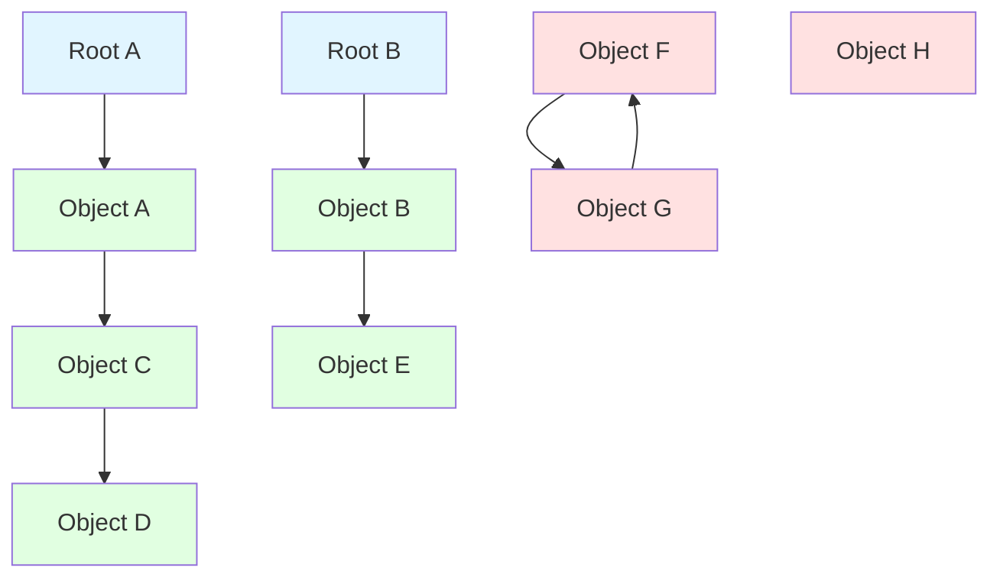
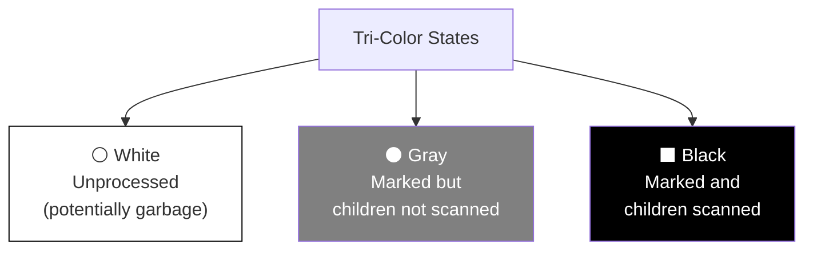

# Garbage Collection: Mark and Sweep, Mark and Compact

Garbage collection automatically reclaims memory that is no longer reachable by the program. Unlike reference counting, tracing garbage collectors can handle arbitrary object graphs including cycles. Mark-and-sweep and mark-and-compact are fundamental tracing GC algorithms that form the basis for most modern garbage collectors.

## The Reachability Concept

Garbage collection is based on a simple insight: if an object cannot be reached from the program's root set, it can never be used again and is therefore garbage.

**Root Set** includes:
- Global variables
- Local variables on the stack
- CPU registers
- Static variables

An object is **reachable** if there exists a path of references from any root to that object. All other objects are garbage.



Reachable objects (green): {A, B, C, D, E}
Garbage (red): {F, G, H}

Tracing garbage collectors traverse the object graph starting from roots, identifying all reachable objects. Anything not marked as reachable is garbage.

## Mark-and-Sweep Algorithm

Mark-and-sweep is the conceptually simplest tracing GC algorithm. It operates in two phases:

**Mark Phase**: Trace from roots, marking all reachable objects.

**Sweep Phase**: Scan all allocated memory, reclaiming unmarked objects.

### Mark Phase Implementation

```c
// Each object has a mark bit
typedef struct Object {
    bool marked;
    // ... other fields ...
} Object;

// List of all allocated objects
Object** all_objects;
size_t object_count;

void mark_phase() {
    // Mark from each root
    for (each root in root_set) {
        mark(root);
    }
}

void mark(Object* obj) {
    if (obj == NULL || obj->marked) {
        return;  // Already marked or null
    }

    obj->marked = true;  // Mark this object

    // Recursively mark all objects this one references
    for (each reference field in obj) {
        Object* child = obj->get_reference(field);
        mark(child);
    }
}
```

The mark phase is essentially a graph traversal (DFS or BFS) starting from roots.

### Sweep Phase Implementation

```c
void sweep_phase() {
    size_t i = 0;
    while (i < object_count) {
        Object* obj = all_objects[i];

        if (!obj->marked) {
            // Unreachable - reclaim it
            free(obj);
            // Remove from array (swap with last element)
            all_objects[i] = all_objects[object_count - 1];
            object_count--;
        } else {
            // Reachable - unmark for next collection
            obj->marked = false;
            i++;
        }
    }
}
```

The sweep phase scans all objects, freeing unmarked ones and clearing marks for the next collection cycle.

### Complete Collection Cycle

```c
void garbage_collect() {
    mark_phase();
    sweep_phase();
}
```

Garbage collection typically runs when:
- Allocation request fails (heap exhausted)
- Heap usage exceeds threshold
- Explicit GC trigger
- Periodic interval

## Mark-and-Sweep Characteristics

**Advantages**:
- Simple conceptually
- Handles cycles naturally
- No overhead during mutation (no write barriers for basic version)
- Works with uncooperative code (conservative GC possible)

**Disadvantages**:
- Stop-the-world pause (program stops during GC)
- Proportional to heap size (must scan all objects)
- Fragmentation (freed objects scattered in memory)
- Poor cache locality (touches all memory)
- Requires maintaining list of all objects

## Mark-and-Compact Algorithm

Mark-and-compact improves on mark-and-sweep by eliminating fragmentation. After marking reachable objects, it compacts them to one end of the heap, updating all references.

### Three-Phase Process

**Phase 1: Mark** - Same as mark-and-sweep.

**Phase 2: Compute New Locations** - Calculate where each object will move.

```c
void compute_locations() {
    void* free_ptr = heap_start;

    for (each object in heap) {
        if (object->marked) {
            object->new_location = free_ptr;
            free_ptr += object->size;
        }
    }

    // free_ptr now points to end of compacted objects
    heap_free = free_ptr;
}
```

**Phase 3: Update References and Compact** - Update all pointers to refer to new locations, then move objects.

```c
void compact() {
    // Update all references
    for (each root in root_set) {
        update_reference(&root);
    }

    for (each marked object) {
        for (each reference field in object) {
            update_reference(&field);
        }
    }

    // Move objects to new locations
    for (each marked object) {
        memmove(object->new_location, object, object->size);
        object->marked = false;  // Clear mark for next cycle
    }
}

void update_reference(Object** ref) {
    if (*ref != NULL && (*ref)->marked) {
        *ref = (*ref)->new_location;
    }
}
```

### Compaction Result

Before compaction:
```
[Used][Free][Used][Free][Free][Used][Free]
```

After compaction:
```
[Used][Used][Used][Free..................]
```

All live objects are contiguous, with all free space in one large block.

## Mark-Compact Variations

**Two-Finger Compaction**: Use two pointers, one at each end, moving objects toward each other.

```c
void two_finger_compact() {
    void* scan = heap_start;
    void* free = heap_end;

    while (scan < free) {
        if (!scan->marked) {
            // Found gap - look for object from end to fill it
            do {
                free--;
            } while (!free->marked && free > scan);

            if (free > scan) {
                // Move object from 'free' to 'scan'
                memmove(scan, free, free->size);
                update_references(free, scan);
            }
        }
        scan += scan->size;
    }
}
```

**Threaded Compaction**: Preserve relative order of objects, maintaining allocation order.

**Sliding Compaction**: Objects slide toward heap start, maintaining their relative order.

## Stop-the-World vs Incremental

Basic mark-and-sweep/compact are stop-the-world: the program (mutator) stops while GC runs. For large heaps, pauses can be unacceptable.

**Incremental GC** interleaves GC work with program execution:

```c
bool gc_in_progress = false;
Object* mark_stack_top = NULL;

void incremental_gc_step(int work_units) {
    if (!gc_in_progress) {
        // Start new collection
        gc_in_progress = true;
        push_roots_on_mark_stack();
    }

    // Do bounded amount of marking
    for (int i = 0; i < work_units && mark_stack_top; i++) {
        Object* obj = pop_mark_stack();
        obj->marked = true;

        for (each reference in obj) {
            if (!reference->marked) {
                push_mark_stack(reference);
            }
        }
    }

    if (mark_stack_empty()) {
        // Marking complete, sweep
        sweep_phase();
        gc_in_progress = false;
    }
}

void allocate_object() {
    incremental_gc_step(100);  // Do some GC work
    return bump_allocate();     // Then allocate
}
```

The challenge: program can modify object graph during incremental marking. Solutions:

**Write Barriers**: Track all pointer writes during GC.

```c
void write_barrier(Object* obj, Object* new_reference) {
    obj->field = new_reference;

    if (gc_in_progress && !new_reference->marked) {
        // New reference created during GC - must mark it
        push_mark_stack(new_reference);
    }
}
```

## Tri-Color Marking

Incremental GC often uses tri-color abstraction to track marking progress:



**Invariant**: No black object points to white object (ensures we don't miss reachable objects).

Marking process:
1. Initially: roots are gray, everything else is white
2. Pick a gray object
3. Scan its children, make white children gray
4. Make the object black
5. Repeat until no gray objects remain
6. White objects are garbage

Write barrier maintains invariant:
```c
void write_barrier(Object* obj, Object* new_ref) {
    obj->field = new_ref;

    if (obj->color == BLACK && new_ref->color == WHITE) {
        // Would violate invariant!
        new_ref->color = GRAY;  // Prevent loss
        add_to_gray_set(new_ref);
    }
}
```

## Conservative GC

Conservative GC works without precise type information. It treats anything that looks like a pointer as possibly being a pointer.

```c
void mark_conservatively(void* start, void* end) {
    for (void** p = start; p < end; p++) {
        void* potential_pointer = *p;

        // Check if it looks like a pointer into heap
        if (potential_pointer >= heap_start &&
            potential_pointer < heap_end) {

            Object* obj = find_object_containing(potential_pointer);
            if (obj) {
                mark(obj);
            }
        }
    }
}
```

This is conservative: it might keep garbage alive if a random integer happens to look like a pointer. But it never incorrectly frees reachable objects, maintaining safety.

Used by:
- Boehm-Demers-Weiser GC (C/C++)
- GC for languages with unsafe features

## Performance Tuning

**Heap Sizing**: Larger heaps reduce GC frequency but increase pause times.

**GC Triggers**: Balance heap utilization vs GC overhead.

```c
size_t heap_size = initial_heap;
size_t bytes_allocated_since_gc = 0;

void* allocate(size_t size) {
    bytes_allocated_since_gc += size;

    if (bytes_allocated_since_gc > heap_size / 2) {
        garbage_collect();
        bytes_allocated_since_gc = 0;

        if (heap_utilization() > 0.75) {
            grow_heap();
        }
    }

    return bump_allocate(size);
}
```

**Parallel Marking**: Use multiple threads for marking phase.

```c
void parallel_mark() {
    ThreadPool pool(num_cores);

    // Divide roots among threads
    for (int i = 0; i < num_cores; i++) {
        pool.submit([i]() {
            for (each root in my_roots(i)) {
                mark(root);
            }
        });
    }

    pool.wait_all();
}
```

Mark-and-sweep and mark-and-compact form the foundation of modern GC, with generations, concurrency, and other optimizations built on top.
