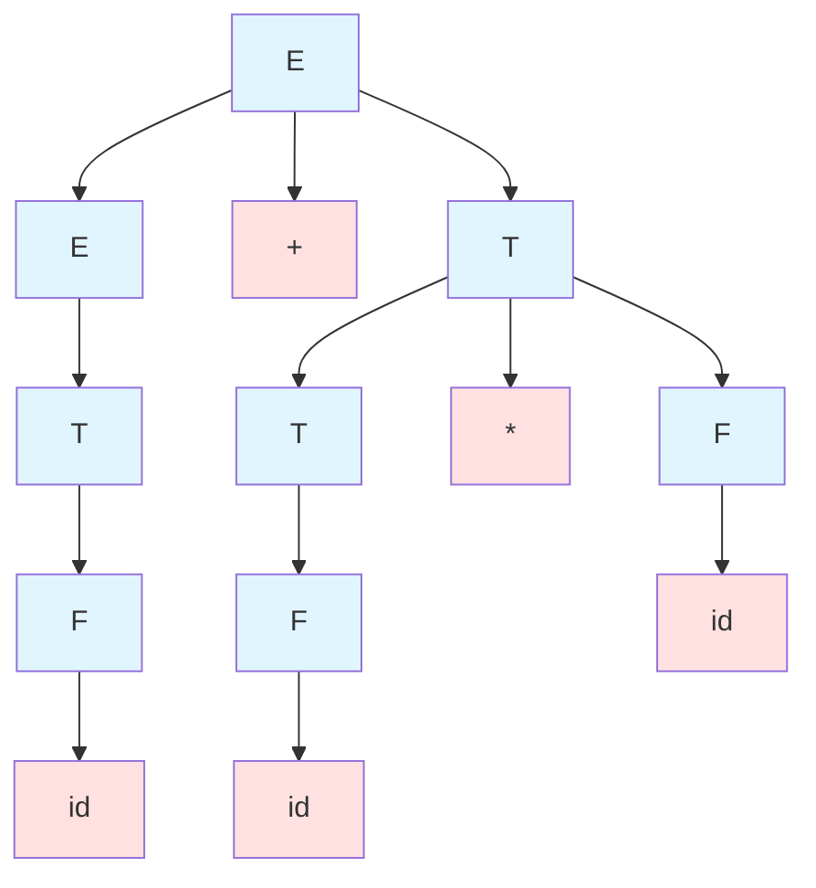
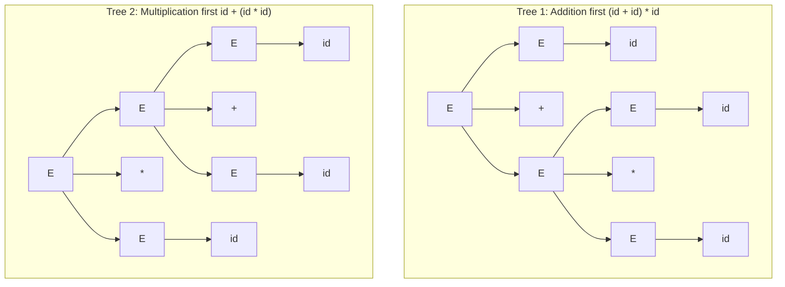
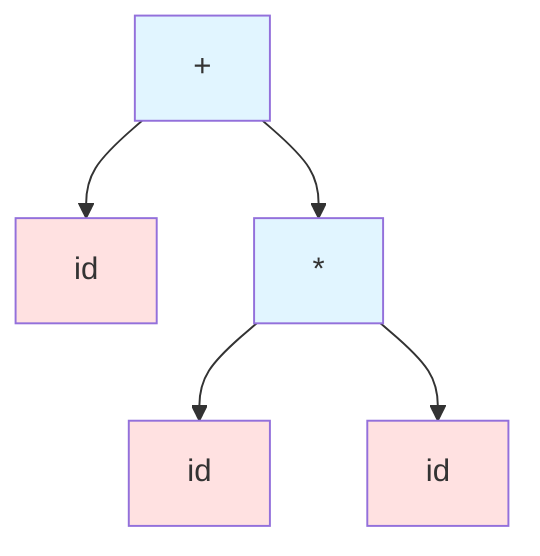

# Derivations and Parse Trees

The process of syntax analysis involves determining whether a string of tokens conforms to the grammar rules and, if so, understanding its structure. Derivations and parse trees are two complementary representations of this structure, each offering unique insights into how a sentence is generated from a grammar and how it should be interpreted.

## Derivations

A derivation is a sequence of production applications that transforms the start symbol into a string of terminals. Each step in a derivation replaces one non-terminal with the right-hand side of a production rule. Derivations demonstrate that a string belongs to the language and reveal the syntactic structure.

### Leftmost and Rightmost Derivations

Two standard derivation strategies exist:

**Leftmost derivation** always replaces the leftmost non-terminal in each step. This strategy is denoted using $\Rightarrow_{lm}$ or simply $\Rightarrow$ when context is clear.

**Rightmost derivation** always replaces the rightmost non-terminal in each step, denoted $\Rightarrow_{rm}$.

Consider the grammar:

$$
\begin{align*}
E &\rightarrow E + T \mid T \\
T &\rightarrow T * F \mid F \\
F &\rightarrow ( E ) \mid \texttt{id}
\end{align*}
$$

For the input string `id + id * id`, a leftmost derivation is:

$$
\begin{align*}
E &\Rightarrow_{lm} E + T \\
  &\Rightarrow_{lm} T + T \\
  &\Rightarrow_{lm} F + T \\
  &\Rightarrow_{lm} \texttt{id} + T \\
  &\Rightarrow_{lm} \texttt{id} + T * F \\
  &\Rightarrow_{lm} \texttt{id} + F * F \\
  &\Rightarrow_{lm} \texttt{id} + \texttt{id} * F \\
  &\Rightarrow_{lm} \texttt{id} + \texttt{id} * \texttt{id}
\end{align*}
$$

A rightmost derivation for the same string:

$$
\begin{align*}
E &\Rightarrow_{rm} E + T \\
  &\Rightarrow_{rm} E + T * F \\
  &\Rightarrow_{rm} E + T * \texttt{id} \\
  &\Rightarrow_{rm} E + F * \texttt{id} \\
  &\Rightarrow_{rm} E + \texttt{id} * \texttt{id} \\
  &\Rightarrow_{rm} T + \texttt{id} * \texttt{id} \\
  &\Rightarrow_{rm} F + \texttt{id} * \texttt{id} \\
  &\Rightarrow_{rm} \texttt{id} + \texttt{id} * \texttt{id}
\end{align*}
$$

Both derivations are valid and represent the same structure, but they apply productions in different orders. The choice of derivation strategy corresponds to different parsing approaches: top-down parsers construct leftmost derivations, while bottom-up parsers construct rightmost derivations in reverse.

## Parse Trees

A parse tree (or syntax tree) is a graphical representation of a derivation. It shows the hierarchical structure of a sentence according to the grammar. Parse trees abstract away the order of production applications, focusing on the structural relationships.

### Structure of Parse Trees

In a parse tree:
- The root is labeled with the start symbol
- Interior nodes are labeled with non-terminals
- Leaves are labeled with terminals or ε (empty string)
- Each interior node with children represents a production application

For the expression `id + id * id` with the grammar above, the parse tree is:

Reading the leaves left-to-right yields the input string: $\texttt{id} + \texttt{id} * \texttt{id}$. The tree structure encodes operator precedence: multiplication appears deeper in the tree, indicating it binds more tightly than addition.

### Parse Tree Construction

Parse trees can be constructed from derivations. Each step in a derivation corresponds to expanding a node in the tree:

1. Start with a tree containing only the root (start symbol)
2. For each derivation step, expand the corresponding node by adding children
3. Continue until all leaves are terminals

Conversely, a derivation can be extracted from a parse tree by traversing it in a specific order (preorder for leftmost, postorder for rightmost).

## Ambiguity

A grammar is ambiguous if some string in its language has more than one distinct parse tree (or equivalently, more than one leftmost or rightmost derivation). Ambiguity is problematic for compilers because it means the syntactic structure, and thus the meaning, is not uniquely determined.

### Example of Ambiguity

Consider this simpler expression grammar:

$$E \rightarrow E + E \mid E * E \mid ( E ) \mid \texttt{id}$$

The string `id + id * id` has two distinct parse trees:

Tree 1 represents $(id + id) * id = 2 \times id$, while Tree 2 represents $id + (id \times id)$, which has a different value. These have different meanings, making the grammar unsuitable for a compiler without disambiguation.

### Sources of Ambiguity

Common sources include:

**Operator precedence**: When the grammar doesn't distinguish operators of different precedence levels.

**Associativity**: When expressions like `id - id - id` can be parsed as `(id - id) - id` or `id - (id - id)`.

**Dangling else**: The classic problem where `if (a) if (b) s1 else s2` can associate the else with either if.

### Resolving Ambiguity

Several strategies resolve ambiguity:

**Grammar rewriting**: Restructure the grammar to encode precedence and associativity. The earlier expression grammar does this by using separate non-terminals (E, T, F) for different precedence levels.

**Disambiguation rules**: Specify rules outside the grammar, such as "else matches the closest unmatched if" or "operators are left-associative."

**Operator precedence tables**: Some parser generators allow specifying precedence and associativity separately from the grammar.

The most robust approach is rewriting the grammar to be unambiguous, as this makes the language specification complete and self-contained.

## Abstract Syntax Trees

While parse trees faithfully represent derivations, they include unnecessary detail for semantic analysis. An abstract syntax tree (AST) distills the parse tree to essential structural information.

ASTs differ from parse trees in several ways:
- Operators appear as interior nodes, operands as children
- Redundant non-terminals are eliminated
- Grouping parentheses are implicit in the structure

For `id + id * id`, the AST might be:

This representation directly supports interpretation and code generation. Most compilers construct ASTs rather than full parse trees, though the parsing process implicitly constructs the parse tree. The AST captures only the essential structure: addition at the root with $\texttt{id}$ and the multiplication subtree as operands.

## Derivation and Parsing Relationship

Understanding derivations is crucial for parsing algorithms:

**Top-down parsing** constructs a leftmost derivation by starting from the start symbol and predicting which productions to apply based on input tokens.

**Bottom-up parsing** constructs a rightmost derivation in reverse by starting from input tokens and reducing them according to productions until reaching the start symbol.

Both approaches aim to construct the parse tree, but they build it in different orders and make different decisions about which productions to apply.

## Practical Implications

The concepts of derivations, parse trees, and ambiguity have direct practical implications:

**Compiler correctness**: An unambiguous grammar ensures the compiler interprets programs consistently.

**Error detection**: Parsing algorithms can identify the point where input deviates from valid derivations.

**Language design**: Understanding ambiguity helps language designers create clear, intuitive syntax.

**Tool generation**: Parser generators require unambiguous grammars (or augmented with disambiguation rules) to produce deterministic parsers.

## Key Takeaways

- Derivations are sequences of production applications transforming the start symbol to terminal strings
- Leftmost derivations replace the leftmost non-terminal first; rightmost derivations replace the rightmost
- Parse trees graphically represent derivation structure, abstracting the order of production applications
- Top-down parsers construct leftmost derivations; bottom-up parsers construct rightmost derivations in reverse
- A grammar is ambiguous if a string has multiple parse trees or multiple leftmost/rightmost derivations
- Ambiguity causes semantic uncertainty and must be eliminated for compiler implementation
- Common ambiguity sources include operator precedence, associativity, and dangling else problems
- Ambiguity can be resolved by rewriting grammars or specifying external disambiguation rules
- Abstract syntax trees distill parse trees to essential structure for semantic analysis
- Understanding derivations is fundamental to comprehending and implementing parsing algorithms
