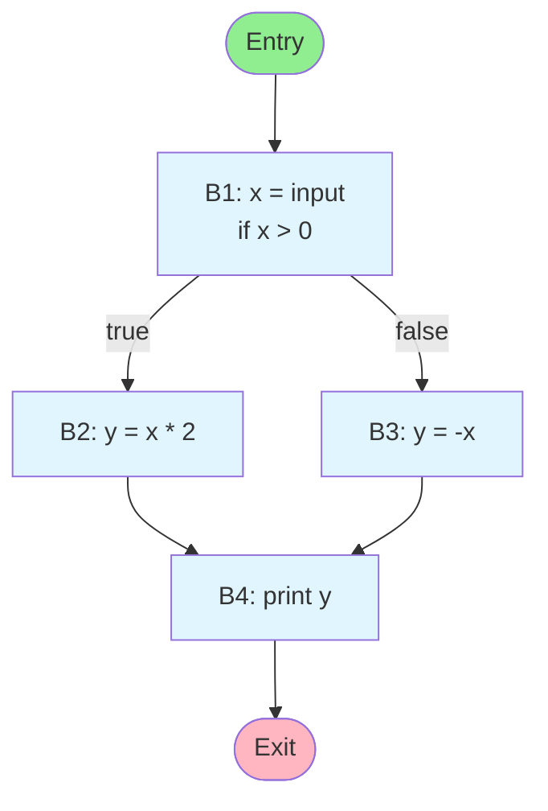
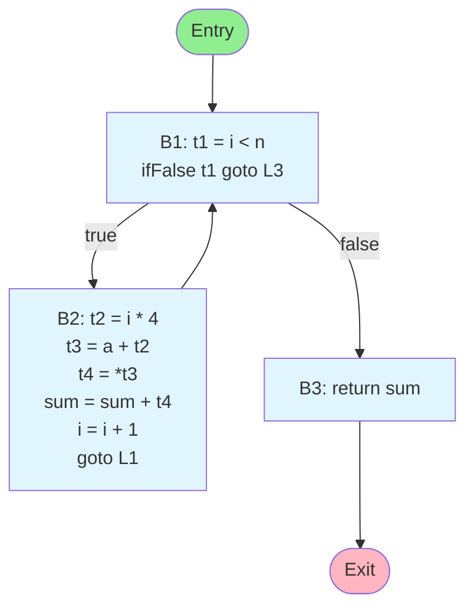
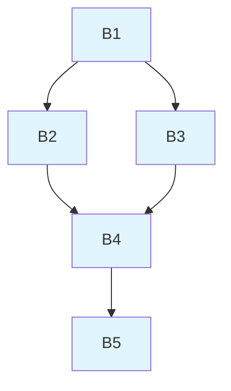
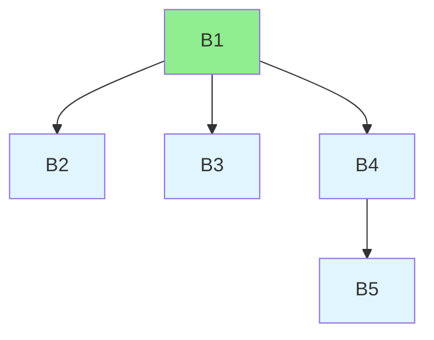

# Control Flow Graphs

Control Flow Graphs (CFGs) are fundamental data structures in compiler design, providing a graphical representation of all possible execution paths through a program. CFGs form the foundation for control flow analysis, data flow analysis, and numerous optimization techniques. Understanding CFG construction and properties is essential for building effective optimizing compilers.

## What is a Control Flow Graph?

A Control Flow Graph is a directed graph where:
- **Nodes** represent basic blocks (maximal sequences of straight-line code)
- **Edges** represent possible control flow transfers between blocks

The graph has a unique **entry node** (where execution begins) and one or more **exit nodes** (where execution terminates).

### Visual Example

Consider this simple code:
```c
1:  x = input()
2:  if (x > 0) {
3:      y = x * 2
4:  } else {
5:      y = -x
6:  }
7:  print(y)
```

The corresponding CFG:



Edges represent possible control flow: from B1, execution can proceed to either B2 (if $x > 0$) or B3 (otherwise), and both B2 and B3 lead to B4.

## Basic Blocks

A **basic block** is a maximal sequence of consecutive instructions with:
1. **Single entry point**: Only the first instruction can be entered from outside the block
2. **Single exit point**: Only the last instruction can transfer control outside the block
3. **No internal control flow**: Execution proceeds sequentially within the block

These properties guarantee that if the first instruction executes, all instructions in the block execute exactly once in order.

### Basic Block Identification Algorithm

**Leaders** are the first instructions of basic blocks. An instruction is a leader if:
1. It is the first instruction in the program
2. It is the target of a jump (conditional or unconditional)
3. It immediately follows a jump or conditional branch

**Algorithm:**
```
1. Identify all leaders
2. For each leader, its basic block consists of:
   - The leader itself
   - All instructions up to (but not including) the next leader
   - Or all instructions up to the end of the program
```

**Example:**

Three-Address Code:
```
1:  x = input()
2:  if x > 0 goto 5
3:  t1 = 0 - x
4:  goto 6
5:  t1 = x * 2
6:  y = t1
7:  call print(y)
```

**Leaders:** 1, 3, 5, 6
- Instruction 1: first instruction
- Instruction 3: follows conditional jump (line 2)
- Instruction 5: target of jump (line 2)
- Instruction 6: target of jump (line 4)

**Basic Blocks:**
- B1: [1-2]
- B2: [3-4]
- B3: [5]
- B4: [6-7]

### Properties of Basic Blocks

**Sequential Execution**: Within a basic block, instructions execute in strict sequence without interruption. This simplifies many analyses:
- **Local optimization** can treat basic blocks as atomic units
- **Register allocation** within blocks is straightforward
- **Instruction scheduling** can freely reorder instructions within blocks (respecting dependencies)

**Execution Frequency**: All instructions in a basic block execute the same number of times, making basic blocks the natural granularity for profiling and optimization decisions.

## CFG Construction

Building a CFG involves two steps: partitioning code into basic blocks, then determining control flow edges between blocks.

### Edge Construction Rules

For each basic block B with last instruction I:

1. **Fall-through edge**: If I is not an unconditional jump, add edge B → next_block
2. **Jump edge**: If I is a jump (conditional or unconditional) to label L, add edge B → block_starting_at(L)
3. **Return edge**: If I is a return statement, add edge B → Exit

**Example CFG Construction:**

TAC:
```
L1: t1 = i < n
    ifFalse t1 goto L3
    t2 = i * 4
    t3 = a + t2
    t4 = *t3
    sum = sum + t4
    i = i + 1
    goto L1
L3: return sum
```

**Basic Blocks:**
- B1 (Header): [L1: t1 = i < n, ifFalse t1 goto L3]
- B2 (Loop Body): [t2 = i * 4, ..., i = i + 1, goto L1]
- B3 (Exit): [L3: return sum]



**Edges:**
- Entry $\rightarrow$ B1 (program start)
- B1 $\rightarrow$ B2 (fall-through when condition true)
- B1 $\rightarrow$ B3 (jump when condition false)
- B2 $\rightarrow$ B1 (back edge from goto, forms loop)
- B3 $\rightarrow$ Exit (return)

The back edge from B2 to B1 identifies a loop structure.

### Special Cases

**Switch Statements**: Create edges to all case labels and the default label.

**Exception Handling**: Each instruction that can throw an exception potentially has edges to all applicable exception handlers, significantly complicating CFG structure.

**Function Calls**: Typically modeled as single nodes (assuming the function returns), though interprocedural analysis requires more sophisticated graphs.

## Dominators

A node $D$ **dominates** node $N$ (written $D \text{ dom } N$) if every path from the entry to $N$ must pass through $D$. Formally:

$$D \text{ dom } N \iff \forall \text{ paths } p : \text{Entry} \leadsto N, D \in p$$

Dominance is a fundamental relation for understanding control flow structure and enabling optimizations.

### Dominance Properties

1. **Reflexive**: Every node dominates itself
2. **Transitive**: If D dominates M and M dominates N, then D dominates N
3. **Antisymmetric**: If D dominates N and N dominates D, then D = N

The **entry node** dominates all nodes reachable from it.

### Computing Dominators

The standard algorithm iteratively computes the dominator set for each node:

$$\text{Dom}(\text{entry}) = \{\text{entry}\}$$
$$\text{Dom}(n) = \{n\} \cup \left(\bigcap_{p \in \text{pred}(n)} \text{Dom}(p)\right)$$

**Algorithm:**
```
Input: CFG with nodes N and entry node
Output: Dom(n) for each node n

Dom(entry) = {entry}
for all nodes n ≠ entry:
    Dom(n) = N  # initialize to all nodes

changed = true
while changed:
    changed = false
    for all nodes n ≠ entry:
        new_dom = {n} ∪ (∩ Dom(p) for all predecessors p of n)
        if new_dom ≠ Dom(n):
            Dom(n) = new_dom
            changed = true
```

The algorithm computes a fixed point where each node's dominator set is the intersection of its predecessors' dominator sets, plus the node itself.

**Example:**



Computation:
- $\text{Dom}(B_1) = \{B_1\}$
- $\text{Dom}(B_2) = \{B_1, B_2\}$
- $\text{Dom}(B_3) = \{B_1, B_3\}$
- $\text{Dom}(B_4) = \{B_1, B_4\}$ (intersection of $\{B_1, B_2\}$ and $\{B_1, B_3\}$)
- $\text{Dom}(B_5) = \{B_1, B_4, B_5\}$

### Immediate Dominators

Node $D$ is the **immediate dominator** (idom) of node $N$ if:
1. $D$ dominates $N$
2. $D \neq N$
3. $D$ does not dominate any other dominator of $N$ ($D$ is the "closest" dominator)

Each node (except entry) has exactly one immediate dominator, forming a **dominator tree**.

**Dominator Tree for Above Example:**



In the dominator tree, each node's parent is its immediate dominator. $B_1$ is the root (entry), and $B_4$ is the immediate dominator of $B_5$.

### Dominance Frontiers

The **dominance frontier** $\text{DF}(n)$ of node $n$ is the set of nodes where $n$'s dominance "stops":

$$\text{DF}(n) = \{y \mid (\exists x \in \text{pred}(y) : n \text{ dom } x) \land (n \not\text{ sdom } y)\}$$

where "sdom" means "strictly dominates" (dominates but is not equal to).

Intuitively, $\text{DF}(n)$ contains nodes where control flow from $n$-dominated regions merges with control flow from non-$n$-dominated regions.

**Example:**
```
      [B1]
      / \
    [B2] [B3]
     |    |
    [B4] [B5]
      \ /
      [B6]
```

- DF(B2) = {B6} (B2 dominates itself and B4, but B6 is where its dominance stops)
- DF(B3) = {B6}
- DF(B4) = {B6}
- DF(B5) = {B6}

Dominance frontiers are crucial for SSA form construction, determining where φ-functions must be inserted.

## CFG Analysis and Applications

CFGs enable numerous compiler analyses and optimizations.

### Loop Detection

**Natural Loops**: Identified by back edges (edges from a node to one of its dominators). The loop consists of the back edge target (header) and all nodes that can reach the back edge source without passing through the header.

**Example:**
```
    [B1]
     |
    [B2] <---+
    / \      |
  [B3] [B4]  |
    \  /     |
    [B5]-----+
     |
    [B6]
```

Edge B5 → B2 is a back edge (B2 dominates B5), identifying a natural loop with header B2.

### Path Analysis

**Reachability**: Which blocks can be reached from entry? Unreachable blocks can be eliminated (dead code).

**Post-dominance**: Node P post-dominates N if every path from N to exit passes through P. Useful for finding common convergence points.

### Data Flow Analysis

CFGs provide the structure for data flow analysis:
- **Reaching Definitions**: Which definitions reach which uses?
- **Live Variables**: Which variables are live at each program point?
- **Available Expressions**: Which expressions are available for reuse?

These analyses propagate information along CFG edges, respecting control flow.

## CFG Transformations

Optimizations often modify CFG structure:

**Dead Block Elimination**: Remove unreachable blocks.

**Block Merging**: Combine blocks when one has a single successor and that successor has a single predecessor:
```
; Before
B1: x = a + b
    goto B2
B2: y = x * 2

; After
B1: x = a + b
    y = x * 2
```

**Block Splitting**: Divide blocks to enable transformations or reduce code size.

**Edge Splitting**: Insert empty blocks on critical edges (edges from multi-successor to multi-predecessor blocks) to simplify analysis.

## Practical Considerations

**Representation**: CFGs are typically implemented using:
- Adjacency lists (space-efficient, standard approach)
- Adjacency matrices (faster queries, higher memory cost)
- Explicit predecessor and successor lists per block

**Maintenance**: Optimizations that modify code must update the CFG. Incremental update is more efficient than full reconstruction.

**Irreducibility**: Some CFGs (especially from assembly or goto-heavy code) are irreducible, lacking a structured loop hierarchy. These complicate analysis, often requiring node splitting or structured control flow recovery.

## Key Takeaways

- Control Flow Graphs represent all possible execution paths through a program, with nodes for basic blocks and edges for control flow transfers
- Basic blocks are maximal straight-line code sequences with single entry/exit points, identified by finding leaders (first instruction, jump targets, instructions after jumps)
- CFG construction involves partitioning code into basic blocks and adding edges based on fall-through, jumps, and returns
- A node D dominates node N if all paths from entry to N pass through D; dominance is computed iteratively as the intersection of predecessor dominators
- Immediate dominators form a tree structure where each node's idom is its closest dominator; dominator trees simplify many analyses
- Dominance frontiers identify where a node's dominance ends, crucial for SSA form construction and optimization
- CFGs enable loop detection via back edges (edges to dominators), reachability analysis for dead code elimination, and data flow analyses
- CFG transformations like block merging, splitting, and dead block elimination must maintain structural consistency and update edges appropriately
- Practical CFG implementations use adjacency lists or matrices with efficient incremental update strategies for optimization passes
