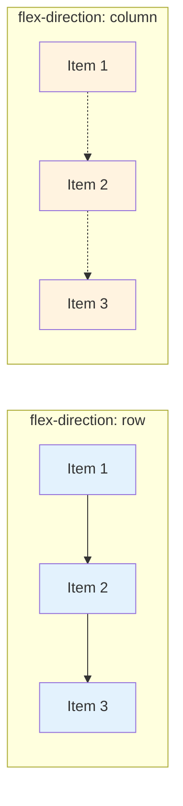

# CSS Flexbox

Flexbox (Flexible Box Layout) is a powerful CSS layout model designed for one-dimensional layouts—arranging items in rows or columns. It makes it easy to align, distribute space, and create responsive designs without floats or positioning hacks. Flexbox is essential for modern web development and is widely supported across all browsers.

## Understanding Flexbox

Flexbox consists of two types of elements:

**Flex Container**: The parent element with `display: flex` or `display: inline-flex`.

**Flex Items**: The direct children of the flex container.

```html
<div class="container">  <!-- Flex container -->
    <div>Item 1</div>    <!-- Flex item -->
    <div>Item 2</div>    <!-- Flex item -->
    <div>Item 3</div>    <!-- Flex item -->
</div>
```

```css
.container {
    display: flex;  /* Creates flex container */
}
```

## Flex Container Properties

### Display

Create a flex container:

```css
/* Block-level flex container */
.container {
    display: flex;
}

/* Inline flex container */
.container {
    display: inline-flex;
}
```

### Flex Direction

Defines the main axis (direction items are laid out):

```css
/* Row (default): left to right */
.container {
    flex-direction: row;
}

/* Row reverse: right to left */
.container {
    flex-direction: row-reverse;
}

/* Column: top to bottom */
.container {
    flex-direction: column;
}

/* Column reverse: bottom to top */
.container {
    flex-direction: column-reverse;
}
```

**Main Axis**: The direction set by `flex-direction`.

**Cross Axis**: Perpendicular to the main axis.

### Flexbox Axes Visualization



With `flex-direction: row`, the main axis is horizontal (→) and cross axis is vertical (↓).
With `flex-direction: column`, the main axis is vertical (↓) and cross axis is horizontal (→).

### Flex Wrap

Controls whether items wrap to new lines:

```css
/* No wrap (default): all items on one line */
.container {
    flex-wrap: nowrap;
}

/* Wrap: items wrap to new lines */
.container {
    flex-wrap: wrap;
}

/* Wrap reverse: items wrap in reverse order */
.container {
    flex-wrap: wrap-reverse;
}
```

### Flex Flow

Shorthand for `flex-direction` and `flex-wrap`:

```css
.container {
    flex-flow: row wrap;
    /* flex-direction: row; flex-wrap: wrap; */
}

.container {
    flex-flow: column nowrap;
}
```

### Justify Content

Aligns items along the main axis:

```css
/* Start (default) */
.container {
    justify-content: flex-start;
}

/* End */
.container {
    justify-content: flex-end;
}

/* Center */
.container {
    justify-content: center;
}

/* Space between: first/last at edges, equal space between */
.container {
    justify-content: space-between;
}

/* Space around: equal space around each item */
.container {
    justify-content: space-around;
}

/* Space evenly: equal space between and at edges */
.container {
    justify-content: space-evenly;
}
```

Visual representation (flex-direction: row):
```
flex-start:    [1][2][3]
flex-end:              [1][2][3]
center:           [1][2][3]
space-between: [1]    [2]    [3]
space-around:   [1]  [2]  [3]
space-evenly:  [1]  [2]  [3]
```

### Align Items

Aligns items along the cross axis:

```css
/* Stretch (default): items stretch to fill container */
.container {
    align-items: stretch;
}

/* Start: items at start of cross axis */
.container {
    align-items: flex-start;
}

/* End: items at end of cross axis */
.container {
    align-items: flex-end;
}

/* Center: items centered on cross axis */
.container {
    align-items: center;
}

/* Baseline: items aligned by text baseline */
.container {
    align-items: baseline;
}
```

### Align Content

Aligns multiple lines (only works with `flex-wrap: wrap`):

```css
/* Stretch (default) */
.container {
    align-content: stretch;
}

/* Start */
.container {
    align-content: flex-start;
}

/* End */
.container {
    align-content: flex-end;
}

/* Center */
.container {
    align-content: center;
}

/* Space between */
.container {
    align-content: space-between;
}

/* Space around */
.container {
    align-content: space-around;
}

/* Space evenly */
.container {
    align-content: space-evenly;
}
```

### Gap

Controls spacing between flex items:

```css
/* Both row and column gap */
.container {
    gap: 20px;
}

/* Separate row and column gap */
.container {
    row-gap: 10px;
    column-gap: 20px;
}

/* Shorthand */
.container {
    gap: 10px 20px;  /* row-gap column-gap */
}
```

## Flex Item Properties

### Flex Grow

Controls how items grow to fill available space:

```css
/* Default: 0 (don't grow) */
.item {
    flex-grow: 0;
}

/* Grow to fill space */
.item {
    flex-grow: 1;
}

/* Grow twice as much as others */
.item {
    flex-grow: 2;
}
```

Example:
```css
.item-1 { flex-grow: 1; }  /* Takes 1/4 of available space */
.item-2 { flex-grow: 2; }  /* Takes 2/4 of available space */
.item-3 { flex-grow: 1; }  /* Takes 1/4 of available space */
```

#### Flex-Grow Distribution Formula

The space allocated to each item is calculated as:

$$\text{Item Width} = \text{Base Width} + \left(\frac{\text{flex-grow}}{\sum \text{flex-grow}}\right) \times \text{Free Space}$$

For example, with 3 items in a 600px container where each item has a base width of 100px:
- Free space: $600 - (3 \times 100) = 300\text{px}$
- Sum of flex-grow values: $1 + 2 + 1 = 4$

Item widths:
- Item 1: $100 + \frac{1}{4} \times 300 = 175\text{px}$
- Item 2: $100 + \frac{2}{4} \times 300 = 250\text{px}$
- Item 3: $100 + \frac{1}{4} \times 300 = 175\text{px}$

### Flex Shrink

Controls how items shrink when space is limited:

```css
/* Default: 1 (can shrink) */
.item {
    flex-shrink: 1;
}

/* Don't shrink */
.item {
    flex-shrink: 0;
}

/* Shrink more than others */
.item {
    flex-shrink: 2;
}
```

### Flex Basis

Sets the initial size before growing/shrinking:

```css
/* Auto (default): based on content */
.item {
    flex-basis: auto;
}

/* Fixed size */
.item {
    flex-basis: 200px;
}

/* Percentage */
.item {
    flex-basis: 30%;
}

/* Content-based */
.item {
    flex-basis: content;
}
```

### Flex Shorthand

Combines `flex-grow`, `flex-shrink`, and `flex-basis`:

```css
/* flex: grow shrink basis */
.item {
    flex: 1 1 auto;
}

/* Common values */
.item {
    flex: 1;        /* flex: 1 1 0 - grow/shrink equally */
    flex: auto;     /* flex: 1 1 auto - grow/shrink based on content */
    flex: none;     /* flex: 0 0 auto - don't grow or shrink */
    flex: 0 1 200px; /* don't grow, can shrink, 200px base */
}
```

### Align Self

Override `align-items` for individual items:

```css
.item {
    align-self: auto;       /* Use container's align-items */
    align-self: flex-start;
    align-self: flex-end;
    align-self: center;
    align-self: stretch;
    align-self: baseline;
}
```

### Order

Control item order (default: 0):

```css
.item-1 { order: 2; }  /* Appears third */
.item-2 { order: 1; }  /* Appears second */
.item-3 { order: 0; }  /* Appears first */
.item-4 { order: -1; } /* Appears before all */
```

## Common Flexbox Patterns

### Centering Content

Perfect centering (horizontal and vertical):

```css
.container {
    display: flex;
    justify-content: center;  /* Horizontal */
    align-items: center;      /* Vertical */
    height: 100vh;
}
```

### Navigation Bar

```css
.nav {
    display: flex;
    justify-content: space-between;
    align-items: center;
    padding: 10px 20px;
}

.nav-links {
    display: flex;
    gap: 20px;
    list-style: none;
}
```

```html
<nav class="nav">
    <div class="logo">Logo</div>
    <ul class="nav-links">
        <li><a href="/">Home</a></li>
        <li><a href="/about">About</a></li>
        <li><a href="/contact">Contact</a></li>
    </ul>
</nav>
```

### Card Layout

```css
.card-container {
    display: flex;
    flex-wrap: wrap;
    gap: 20px;
}

.card {
    flex: 1 1 300px;  /* Grow, shrink, min 300px */
    padding: 20px;
    border: 1px solid #ddd;
    border-radius: 8px;
}
```

### Holy Grail Layout

```css
body {
    display: flex;
    flex-direction: column;
    min-height: 100vh;
}

header, footer {
    flex-shrink: 0;
}

main {
    display: flex;
    flex: 1;
}

.sidebar {
    flex: 0 0 200px;
}

.content {
    flex: 1;
}
```

### Equal Height Columns

```css
.row {
    display: flex;
}

.column {
    flex: 1;
    padding: 20px;
}
/* All columns automatically same height */
```

### Sticky Footer

```css
body {
    display: flex;
    flex-direction: column;
    min-height: 100vh;
}

main {
    flex: 1;  /* Grows to fill space */
}

footer {
    flex-shrink: 0;
}
```

## Responsive Flexbox

### Media Queries

```css
.container {
    display: flex;
    flex-direction: column;
}

@media (min-width: 768px) {
    .container {
        flex-direction: row;
        flex-wrap: wrap;
    }

    .item {
        flex: 1 1 calc(50% - 20px);
    }
}

@media (min-width: 1024px) {
    .item {
        flex: 1 1 calc(33.333% - 20px);
    }
}
```

### Auto-Responsive Grid

```css
.grid {
    display: flex;
    flex-wrap: wrap;
    gap: 20px;
}

.grid-item {
    flex: 1 1 300px;  /* Automatically responsive */
}
```

## Flexbox vs Other Layouts

**Flexbox**: One-dimensional (row or column). Best for:
- Navigation bars
- Card layouts
- Centering content
- Form layouts
- Components

**CSS Grid**: Two-dimensional (rows and columns). Best for:
- Page layouts
- Complex grids
- Magazine-style layouts

**Float**: Legacy layout method. Avoid for new projects.

## Browser Support

Flexbox is supported in all modern browsers:
- Chrome 29+
- Firefox 28+
- Safari 9+
- Edge (all versions)
- IE 11 (with prefixes)

For older browsers, use autoprefixer or vendor prefixes:

```css
.container {
    display: -webkit-flex;
    display: flex;
}
```

## Complete Example

```html
<!DOCTYPE html>
<html lang="en">
<head>
    <meta charset="UTF-8">
    <meta name="viewport" content="width=device-width, initial-scale=1.0">
    <title>Flexbox Layout</title>
    <style>
        * {
            margin: 0;
            padding: 0;
            box-sizing: border-box;
        }

        body {
            font-family: Arial, sans-serif;
            display: flex;
            flex-direction: column;
            min-height: 100vh;
        }

        /* Header */
        header {
            background-color: #333;
            color: white;
            padding: 20px;
        }

        /* Navigation */
        nav {
            display: flex;
            justify-content: space-between;
            align-items: center;
            background-color: #007bff;
            padding: 10px 20px;
        }

        .nav-links {
            display: flex;
            gap: 20px;
            list-style: none;
        }

        .nav-links a {
            color: white;
            text-decoration: none;
        }

        /* Main content */
        main {
            flex: 1;
            display: flex;
            padding: 20px;
            gap: 20px;
        }

        /* Sidebar */
        aside {
            flex: 0 0 200px;
            background-color: #f0f0f0;
            padding: 20px;
        }

        /* Content area */
        .content {
            flex: 1;
        }

        /* Card grid */
        .card-grid {
            display: flex;
            flex-wrap: wrap;
            gap: 20px;
        }

        .card {
            flex: 1 1 calc(33.333% - 20px);
            min-width: 250px;
            padding: 20px;
            background-color: white;
            border: 1px solid #ddd;
            border-radius: 8px;
        }

        /* Footer */
        footer {
            background-color: #333;
            color: white;
            padding: 20px;
            text-align: center;
        }

        /* Responsive */
        @media (max-width: 768px) {
            main {
                flex-direction: column;
            }

            aside {
                flex: 1;
            }

            .card {
                flex: 1 1 100%;
            }
        }
    </style>
</head>
<body>
    <header>
        <h1>Flexbox Layout Demo</h1>
    </header>

    <nav>
        <div class="logo">Logo</div>
        <ul class="nav-links">
            <li><a href="/">Home</a></li>
            <li><a href="/about">About</a></li>
            <li><a href="/contact">Contact</a></li>
        </ul>
    </nav>

    <main>
        <aside>
            <h3>Sidebar</h3>
            <ul>
                <li>Link 1</li>
                <li>Link 2</li>
                <li>Link 3</li>
            </ul>
        </aside>

        <div class="content">
            <h2>Main Content</h2>
            <div class="card-grid">
                <div class="card">
                    <h3>Card 1</h3>
                    <p>Card content...</p>
                </div>
                <div class="card">
                    <h3>Card 2</h3>
                    <p>Card content...</p>
                </div>
                <div class="card">
                    <h3>Card 3</h3>
                    <p>Card content...</p>
                </div>
            </div>
        </div>
    </main>

    <footer>
        <p>&copy; 2025 Flexbox Demo</p>
    </footer>
</body>
</html>
```

## Best Practices

**Use flex for one-dimensional layouts**: Rows or columns, not both simultaneously.

**Use gap instead of margins**: Cleaner spacing between items.

**Mobile-first approach**: Start with column layout, switch to row on larger screens.

**Avoid fixed widths**: Use `flex: 1` or `flex-basis` with `flex-grow`/`flex-shrink`.

**Test in multiple browsers**: Ensure consistent rendering.

**Use semantic HTML**: Flexbox works with any elements, but semantic HTML improves accessibility.

## Conclusion

Flexbox revolutionized CSS layout by providing a simple, powerful way to create flexible, responsive designs. By mastering flex container properties (justify-content, align-items, flex-direction) and flex item properties (flex-grow, flex-shrink, flex-basis), you can build modern layouts without the complexity of floats or positioning. Flexbox is essential for responsive navigation, card grids, centering content, and countless other layout patterns in modern web development.
