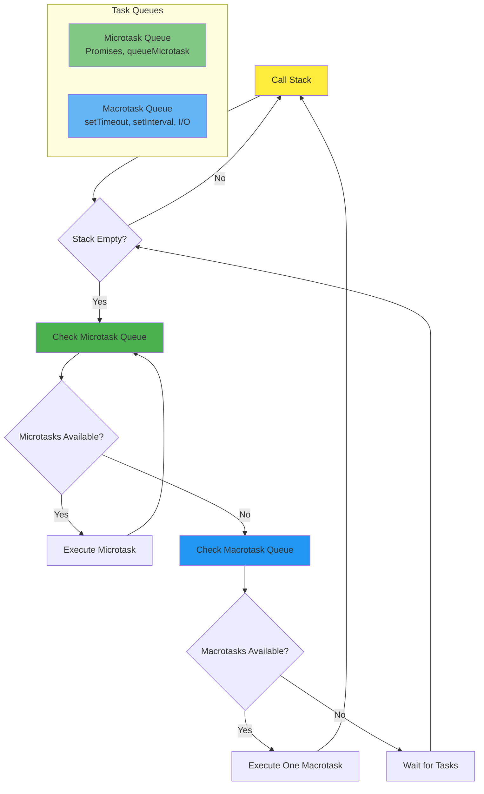

# Asynchronous Programming

Asynchronous programming is a fundamental concept in JavaScript that allows code to execute without blocking the main thread. Understanding async programming is essential for building responsive web applications that handle user interactions, network requests, and other time-consuming operations efficiently.

## Synchronous vs Asynchronous Execution

In synchronous programming, code executes line by line, with each operation completing before the next one begins. This blocking behavior can freeze the user interface when performing long-running tasks.

```javascript
// Synchronous code - blocks execution
console.log('First');
console.log('Second');
console.log('Third');
// Output: First, Second, Third (in order)

// Blocking example
function heavyComputation() {
    let sum = 0;
    for (let i = 0; i < 1000000000; i++) {
        sum += i;
    }
    return sum;
}

console.log('Start');
const result = heavyComputation(); // Blocks here
console.log('End'); // Only runs after computation completes
```

Asynchronous code allows operations to start and continue in the background while the program moves on to execute other code. JavaScript handles this using the event loop and callback queue.

```javascript
// Asynchronous code - non-blocking
console.log('First');
setTimeout(() => {
    console.log('Second');
}, 1000);
console.log('Third');
// Output: First, Third, Second
```

## The Event Loop

The event loop is the mechanism that enables JavaScript to perform non-blocking operations despite being single-threaded. It continuously checks the call stack and callback queue, executing callbacks when the stack is empty.

### Event Loop Architecture



Priority order: Call Stack → Microtasks → Macrotasks. This is why Promises execute before setTimeout callbacks.

```javascript
// Understanding execution order
console.log('1: Start');

setTimeout(() => {
    console.log('2: Timeout 1');
}, 0);

Promise.resolve().then(() => {
    console.log('3: Promise 1');
});

setTimeout(() => {
    console.log('4: Timeout 2');
}, 0);

Promise.resolve().then(() => {
    console.log('5: Promise 2');
});

console.log('6: End');

// Output order:
// 1: Start
// 6: End
// 3: Promise 1
// 5: Promise 2
// 2: Timeout 1
// 4: Timeout 2
```

The event loop prioritizes tasks in this order:
1. Synchronous code (call stack)
2. Microtasks (Promises, queueMicrotask)
3. Macrotasks (setTimeout, setInterval, I/O operations)

## The Callback Pattern

Callbacks are functions passed as arguments to other functions and executed when an asynchronous operation completes. This pattern was the original approach to async programming in JavaScript.

```javascript
// Simple callback example
function fetchData(callback) {
    setTimeout(() => {
        const data = { id: 1, name: 'John Doe' };
        callback(data);
    }, 1000);
}

fetchData((data) => {
    console.log('Received:', data);
});

// Error-first callbacks (Node.js convention)
function readFile(filename, callback) {
    setTimeout(() => {
        const error = null;
        const data = 'File contents';

        if (error) {
            callback(error, null);
        } else {
            callback(null, data);
        }
    }, 500);
}

readFile('example.txt', (error, data) => {
    if (error) {
        console.error('Error:', error);
        return;
    }
    console.log('Data:', data);
});
```

## Callback Hell

When callbacks are nested within callbacks, code becomes difficult to read and maintain. This is known as "callback hell" or "pyramid of doom."

```javascript
// Callback hell example
function getUserData(userId, callback) {
    setTimeout(() => {
        callback({ id: userId, name: 'Alice' });
    }, 100);
}

function getUserPosts(userId, callback) {
    setTimeout(() => {
        callback([{ id: 1, title: 'Post 1' }]);
    }, 100);
}

function getPostComments(postId, callback) {
    setTimeout(() => {
        callback([{ id: 1, text: 'Great post!' }]);
    }, 100);
}

// Nested callbacks - hard to read
getUserData(1, (user) => {
    console.log('User:', user);
    getUserPosts(user.id, (posts) => {
        console.log('Posts:', posts);
        getPostComments(posts[0].id, (comments) => {
            console.log('Comments:', comments);
            // Even more nesting...
        });
    });
});
```

## Common Asynchronous APIs

JavaScript provides several built-in asynchronous APIs:

```javascript
// setTimeout - Execute code after delay
const timeoutId = setTimeout(() => {
    console.log('Executed after 2 seconds');
}, 2000);

// Cancel timeout
clearTimeout(timeoutId);

// setInterval - Execute code repeatedly
const intervalId = setInterval(() => {
    console.log('Executed every second');
}, 1000);

// Cancel interval
clearInterval(intervalId);

// requestAnimationFrame - Sync with browser repaint
function animate() {
    // Animation logic
    requestAnimationFrame(animate);
}
requestAnimationFrame(animate);
```

## Event Listeners

Event listeners are a form of asynchronous callback that respond to user interactions and browser events.

```javascript
// Click event
document.getElementById('myButton').addEventListener('click', (event) => {
    console.log('Button clicked!', event);
});

// Multiple events
const input = document.getElementById('searchInput');

input.addEventListener('focus', () => {
    console.log('Input focused');
});

input.addEventListener('blur', () => {
    console.log('Input blurred');
});

input.addEventListener('input', (event) => {
    console.log('Input value:', event.target.value);
});

// Remove event listener
function handleClick() {
    console.log('Clicked');
}

button.addEventListener('click', handleClick);
button.removeEventListener('click', handleClick);
```

## Callback Best Practices

To write maintainable asynchronous code with callbacks:

```javascript
// 1. Use named functions instead of anonymous callbacks
function handleUserData(user) {
    console.log('User:', user);
    fetchUserPosts(user.id, handleUserPosts);
}

function handleUserPosts(posts) {
    console.log('Posts:', posts);
}

getUserData(1, handleUserData);

// 2. Handle errors consistently
function fetchWithErrorHandling(url, onSuccess, onError) {
    setTimeout(() => {
        const success = Math.random() > 0.5;

        if (success) {
            onSuccess({ data: 'Success' });
        } else {
            onError(new Error('Request failed'));
        }
    }, 1000);
}

fetchWithErrorHandling(
    '/api/data',
    (data) => console.log('Success:', data),
    (error) => console.error('Error:', error)
);

// 3. Avoid deep nesting - modularize
async function processUserData(userId) {
    try {
        const user = await getUser(userId);
        const posts = await getPosts(user.id);
        const comments = await getComments(posts[0].id);
        return { user, posts, comments };
    } catch (error) {
        console.error('Error processing user data:', error);
    }
}
```

## Practical Examples

```javascript
// Debouncing with callbacks
function debounce(func, delay) {
    let timeoutId;

    return function(...args) {
        clearTimeout(timeoutId);
        timeoutId = setTimeout(() => {
            func.apply(this, args);
        }, delay);
    };
}

const searchInput = document.getElementById('search');
const debouncedSearch = debounce((event) => {
    console.log('Searching for:', event.target.value);
}, 500);

searchInput.addEventListener('input', debouncedSearch);

// Throttling with callbacks
function throttle(func, limit) {
    let inThrottle;

    return function(...args) {
        if (!inThrottle) {
            func.apply(this, args);
            inThrottle = true;
            setTimeout(() => {
                inThrottle = false;
            }, limit);
        }
    };
}

const throttledScroll = throttle(() => {
    console.log('Scroll position:', window.scrollY);
}, 1000);

window.addEventListener('scroll', throttledScroll);

// Sequential execution with callbacks
function sequence(tasks, finalCallback) {
    let results = [];
    let currentIndex = 0;

    function executeNext() {
        if (currentIndex >= tasks.length) {
            finalCallback(results);
            return;
        }

        tasks[currentIndex]((result) => {
            results.push(result);
            currentIndex++;
            executeNext();
        });
    }

    executeNext();
}

sequence([
    (cb) => setTimeout(() => cb('Task 1'), 100),
    (cb) => setTimeout(() => cb('Task 2'), 100),
    (cb) => setTimeout(() => cb('Task 3'), 100)
], (results) => {
    console.log('All tasks completed:', results);
});
```

## Conclusion

Asynchronous programming is essential for modern JavaScript development. While callbacks were the original solution, they can lead to complex, hard-to-maintain code. Understanding the event loop and callback patterns provides the foundation for mastering modern async solutions like Promises and async/await, which we'll explore in subsequent lessons.
