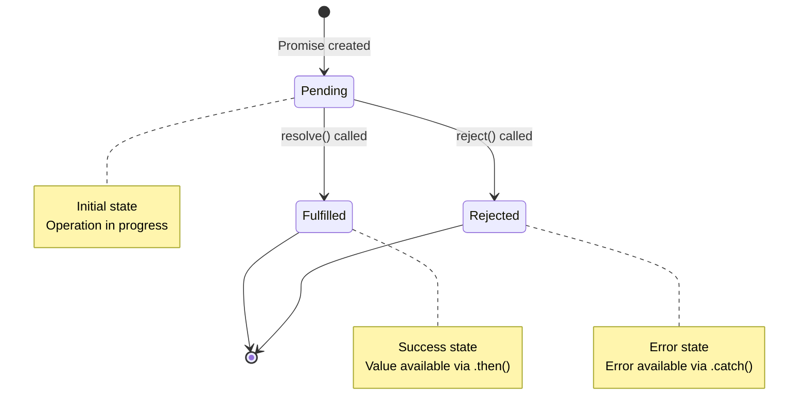

# Promises

Promises are a modern JavaScript feature that provides a cleaner, more manageable way to handle asynchronous operations compared to callbacks. A Promise represents a value that may be available now, in the future, or never. Understanding Promises is crucial for writing maintainable asynchronous code.

## What is a Promise?

A Promise is an object that represents the eventual completion or failure of an asynchronous operation. It has three possible states:

- **Pending**: Initial state, neither fulfilled nor rejected
- **Fulfilled**: Operation completed successfully
- **Rejected**: Operation failed

Once a Promise is fulfilled or rejected, it becomes immutable and cannot change states again.

### Promise State Machine



A Promise can only transition from Pending to either Fulfilled or Rejected, never backwards or between Fulfilled and Rejected.

```javascript
// Creating a simple Promise
const promise = new Promise((resolve, reject) => {
    const success = true;

    if (success) {
        resolve('Operation succeeded!');
    } else {
        reject('Operation failed!');
    }
});

console.log(promise); // Promise { 'Operation succeeded!' }
```

## Creating Promises

Promises are created using the Promise constructor, which takes an executor function with `resolve` and `reject` parameters.

```javascript
// Basic Promise creation
function delay(ms) {
    return new Promise((resolve) => {
        setTimeout(() => {
            resolve(`Waited ${ms}ms`);
        }, ms);
    });
}

delay(1000).then((message) => {
    console.log(message); // "Waited 1000ms" after 1 second
});

// Promise with rejection
function fetchUser(id) {
    return new Promise((resolve, reject) => {
        setTimeout(() => {
            if (id > 0) {
                resolve({ id, name: 'John Doe', email: 'john@example.com' });
            } else {
                reject(new Error('Invalid user ID'));
            }
        }, 500);
    });
}

// Simulating API call
function apiCall(endpoint) {
    return new Promise((resolve, reject) => {
        setTimeout(() => {
            const success = Math.random() > 0.3;

            if (success) {
                resolve({ data: `Data from ${endpoint}`, status: 200 });
            } else {
                reject({ error: 'Network error', status: 500 });
            }
        }, 1000);
    });
}
```

## Using then/catch/finally

The `then()` method handles fulfilled Promises, `catch()` handles rejections, and `finally()` runs regardless of the outcome.

```javascript
// Basic then/catch
fetchUser(1)
    .then((user) => {
        console.log('User fetched:', user);
    })
    .catch((error) => {
        console.error('Error:', error.message);
    });

// Using finally
apiCall('/api/data')
    .then((response) => {
        console.log('Success:', response);
    })
    .catch((error) => {
        console.error('Failed:', error);
    })
    .finally(() => {
        console.log('Request completed');
        // Clean up, hide loading spinner, etc.
    });

// then() can handle both success and failure
promise.then(
    (value) => {
        console.log('Fulfilled:', value);
    },
    (error) => {
        console.error('Rejected:', error);
    }
);
```

## Promise Chaining

One of the most powerful features of Promises is chaining, where each `then()` returns a new Promise, allowing sequential asynchronous operations.

```javascript
// Sequential operations
fetchUser(1)
    .then((user) => {
        console.log('1. Got user:', user.name);
        return fetchUserPosts(user.id); // Return new Promise
    })
    .then((posts) => {
        console.log('2. Got posts:', posts.length);
        return fetchPostComments(posts[0].id);
    })
    .then((comments) => {
        console.log('3. Got comments:', comments.length);
    })
    .catch((error) => {
        console.error('Error in chain:', error);
    });

// Transforming values in chain
function processData() {
    return Promise.resolve(5)
        .then((value) => {
            console.log('Initial:', value); // 5
            return value * 2;
        })
        .then((value) => {
            console.log('Doubled:', value); // 10
            return value + 3;
        })
        .then((value) => {
            console.log('Added 3:', value); // 13
            return value ** 2;
        })
        .then((value) => {
            console.log('Squared:', value); // 169
            return value;
        });
}

// Error propagation in chains
apiCall('/api/users')
    .then((response) => {
        if (response.status !== 200) {
            throw new Error('Bad response');
        }
        return response.data;
    })
    .then((data) => {
        return processData(data);
    })
    .then((processed) => {
        return saveToDatabase(processed);
    })
    .catch((error) => {
        // Catches errors from any step in the chain
        console.error('Pipeline failed:', error);
    });
```

## Promise Static Methods

JavaScript provides several static methods on the Promise class for working with multiple Promises.

```javascript
// Promise.resolve() - Create fulfilled Promise
const resolvedPromise = Promise.resolve('Instant success');
resolvedPromise.then((value) => console.log(value));

// Promise.reject() - Create rejected Promise
const rejectedPromise = Promise.reject('Instant failure');
rejectedPromise.catch((error) => console.error(error));

// Promise.all() - Wait for all Promises
const promise1 = delay(1000).then(() => 'First');
const promise2 = delay(500).then(() => 'Second');
const promise3 = delay(1500).then(() => 'Third');

Promise.all([promise1, promise2, promise3])
    .then((results) => {
        console.log('All completed:', results);
        // ['First', 'Second', 'Third']
    })
    .catch((error) => {
        console.error('One failed:', error);
    });

// Promise.allSettled() - Wait for all, don't fail fast
const promises = [
    Promise.resolve('Success 1'),
    Promise.reject('Error 1'),
    Promise.resolve('Success 2')
];

Promise.allSettled(promises).then((results) => {
    results.forEach((result, index) => {
        if (result.status === 'fulfilled') {
            console.log(`Promise ${index}: ${result.value}`);
        } else {
            console.log(`Promise ${index} failed: ${result.reason}`);
        }
    });
});

// Promise.race() - First to settle wins
const fast = delay(100).then(() => 'Fast');
const slow = delay(1000).then(() => 'Slow');

Promise.race([fast, slow]).then((winner) => {
    console.log('Winner:', winner); // 'Fast'
});

// Promise.any() - First to fulfill wins
const failing1 = Promise.reject('Fail 1');
const failing2 = Promise.reject('Fail 2');
const succeeding = delay(500).then(() => 'Success!');

Promise.any([failing1, failing2, succeeding])
    .then((result) => {
        console.log('First success:', result);
    })
    .catch((error) => {
        console.error('All failed:', error);
    });
```

## Error Handling Best Practices

Proper error handling is crucial when working with Promises.

```javascript
// Always include catch
fetchUser(1)
    .then((user) => processUser(user))
    .catch((error) => {
        console.error('Error:', error);
        // Handle error appropriately
    });

// Recovering from errors
function fetchWithFallback(url) {
    return fetch(url)
        .catch((error) => {
            console.warn('Primary failed, trying backup');
            return fetch(url + '/backup');
        })
        .catch((error) => {
            console.error('Both failed, using cache');
            return getCachedData(url);
        });
}

// Rethrowing errors
function validateAndProcess(data) {
    return Promise.resolve(data)
        .then((d) => {
            if (!d || !d.id) {
                throw new Error('Invalid data structure');
            }
            return d;
        })
        .then((d) => {
            return processData(d);
        })
        .catch((error) => {
            console.error('Validation/processing error:', error);
            throw error; // Rethrow for caller to handle
        });
}

// Creating custom error types
class NetworkError extends Error {
    constructor(message, statusCode) {
        super(message);
        this.name = 'NetworkError';
        this.statusCode = statusCode;
    }
}

function fetchData(url) {
    return new Promise((resolve, reject) => {
        setTimeout(() => {
            const statusCode = 404;
            reject(new NetworkError('Resource not found', statusCode));
        }, 500);
    });
}

fetchData('/api/user')
    .catch((error) => {
        if (error instanceof NetworkError) {
            console.error(`Network error ${error.statusCode}: ${error.message}`);
        } else {
            console.error('Unknown error:', error);
        }
    });
```

## Practical Examples

```javascript
// Loading multiple resources in parallel
function loadUserDashboard(userId) {
    return Promise.all([
        fetchUser(userId),
        fetchUserPosts(userId),
        fetchUserNotifications(userId),
        fetchUserSettings(userId)
    ]).then(([user, posts, notifications, settings]) => {
        return {
            user,
            posts,
            notifications,
            settings
        };
    });
}

loadUserDashboard(1)
    .then((dashboard) => {
        console.log('Dashboard loaded:', dashboard);
    })
    .catch((error) => {
        console.error('Failed to load dashboard:', error);
    });

// Timeout wrapper
function withTimeout(promise, ms) {
    const timeout = new Promise((_, reject) => {
        setTimeout(() => {
            reject(new Error(`Operation timed out after ${ms}ms`));
        }, ms);
    });

    return Promise.race([promise, timeout]);
}

withTimeout(fetchUser(1), 5000)
    .then((user) => console.log('User:', user))
    .catch((error) => console.error('Error:', error.message));

// Sequential processing with reduce
function processSequentially(items, processor) {
    return items.reduce((chain, item) => {
        return chain.then((results) => {
            return processor(item).then((result) => {
                return [...results, result];
            });
        });
    }, Promise.resolve([]));
}

const userIds = [1, 2, 3, 4];
processSequentially(userIds, fetchUser)
    .then((users) => {
        console.log('All users:', users);
    });

// Retry logic
function retry(fn, maxAttempts = 3, delay = 1000) {
    return new Promise((resolve, reject) => {
        function attempt(attemptsLeft) {
            fn()
                .then(resolve)
                .catch((error) => {
                    if (attemptsLeft <= 1) {
                        reject(error);
                        return;
                    }

                    console.log(`Retrying... ${attemptsLeft - 1} attempts left`);
                    setTimeout(() => {
                        attempt(attemptsLeft - 1);
                    }, delay);
                });
        }

        attempt(maxAttempts);
    });
}

retry(() => apiCall('/api/unreliable'), 3, 1000)
    .then((result) => console.log('Success:', result))
    .catch((error) => console.error('Failed after retries:', error));

// Promisifying callback-based functions
function promisify(fn) {
    return function(...args) {
        return new Promise((resolve, reject) => {
            fn(...args, (error, result) => {
                if (error) {
                    reject(error);
                } else {
                    resolve(result);
                }
            });
        });
    };
}

// Example: Converting setTimeout to Promise
const wait = (ms) => new Promise((resolve) => setTimeout(resolve, ms));

wait(1000).then(() => {
    console.log('1 second passed');
});
```

## Common Pitfalls

```javascript
// Forgetting to return Promise in chain
fetchUser(1)
    .then((user) => {
        fetchUserPosts(user.id); // Missing return!
        // Next then() receives undefined
    })
    .then((posts) => {
        console.log(posts); // undefined
    });

// Correct version
fetchUser(1)
    .then((user) => {
        return fetchUserPosts(user.id); // Return the Promise
    })
    .then((posts) => {
        console.log(posts); // Correct value
    });

// Nested Promises (Promise hell)
fetchUser(1).then((user) => {
    fetchUserPosts(user.id).then((posts) => {
        // Avoid nesting like this
    });
});

// Use chaining instead
fetchUser(1)
    .then((user) => fetchUserPosts(user.id))
    .then((posts) => console.log(posts));

// Not catching errors
fetchUser(1).then((user) => {
    processUser(user);
}); // Uncaught errors!

// Always add catch
fetchUser(1)
    .then((user) => processUser(user))
    .catch((error) => console.error(error));
```

## Conclusion

Promises provide a powerful abstraction for handling asynchronous operations in JavaScript. They eliminate callback hell, provide better error handling, and enable composition of complex asynchronous workflows. Mastering Promises is essential before moving on to async/await, which builds on Promise foundations to provide even cleaner syntax.
