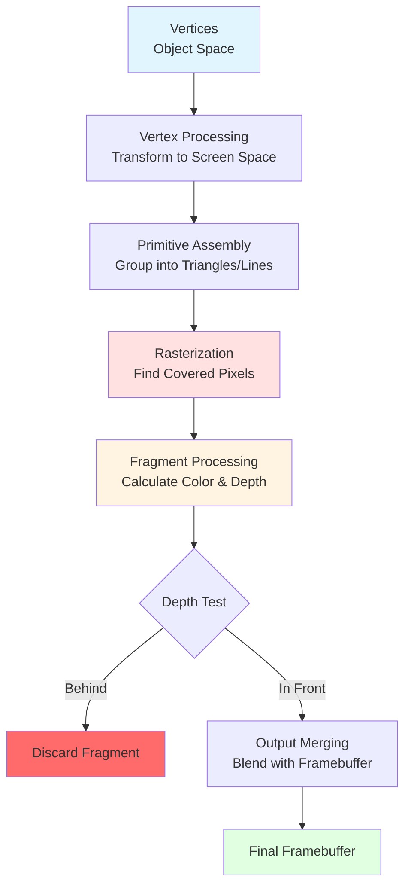

# Introduction to Rasterization

## What is Rasterization?

Rasterization is the process of converting vector-based geometric primitives (points, lines, triangles, polygons) into a raster image composed of discrete pixels on a display device. It is the fundamental technique used in real-time graphics rendering, powering virtually all video games, CAD applications, and interactive 3D visualizations.

The term "raster" comes from the Latin word "rastrum," meaning rake, referring to the systematic scanning pattern used to draw images on early cathode ray tube (CRT) displays. Modern rasterization builds on these principles while leveraging sophisticated hardware acceleration.

## The Rasterization Pipeline

Rasterization sits at the heart of the graphics pipeline, transforming geometric data into pixels:



1. **Vertex Processing**: Transform vertices from object space to screen space
2. **Primitive Assembly**: Group vertices into geometric primitives (triangles, lines)
3. **Rasterization**: Determine which pixels are covered by each primitive
4. **Fragment Processing**: Calculate color and depth for each pixel
5. **Output Merging**: Combine fragments with the framebuffer

```python
def rasterization_pipeline(vertices, primitives):
    """
    Simplified rasterization pipeline demonstration.

    Args:
        vertices: List of vertex positions in screen space
        primitives: List of primitive indices (e.g., triangle vertex indices)

    Returns:
        framebuffer: 2D array of pixel colors
    """
    framebuffer = create_framebuffer()
    depth_buffer = create_depth_buffer()

    for primitive in primitives:
        # Get vertices for this primitive
        v0, v1, v2 = get_primitive_vertices(vertices, primitive)

        # Rasterize: find all pixels covered by primitive
        fragments = rasterize_triangle(v0, v1, v2)

        # Process each fragment
        for fragment in fragments:
            # Calculate fragment color
            color = shade_fragment(fragment)

            # Depth test
            if fragment.depth < depth_buffer[fragment.x, fragment.y]:
                framebuffer[fragment.x, fragment.y] = color
                depth_buffer[fragment.x, fragment.y] = fragment.depth

    return framebuffer
```

## Scan Conversion

Scan conversion is the core rasterization operation that determines which pixels should be illuminated to represent a geometric primitive. The process must answer the fundamental question: "Which pixels does this primitive cover?"

### The Pixel Coverage Problem

Given a geometric primitive defined in continuous space, scan conversion must:

1. **Sample**: Determine which discrete pixel locations are covered
2. **Quantize**: Convert continuous coordinates to integer pixel positions
3. **Handle Edge Cases**: Deal with primitives that partially cover pixels

The basic scan conversion algorithm follows this pattern:

```python
def scan_convert_primitive(primitive, framebuffer):
    """
    Generic scan conversion algorithm.

    Args:
        primitive: Geometric primitive to rasterize
        framebuffer: Output pixel buffer
    """
    # Get bounding box of primitive
    min_x, min_y, max_x, max_y = compute_bounding_box(primitive)

    # Iterate over all pixels in bounding box
    for y in range(min_y, max_y + 1):
        for x in range(min_x, max_x + 1):
            # Test if pixel center is inside primitive
            if inside_primitive(x + 0.5, y + 0.5, primitive):
                # Draw pixel
                framebuffer[y, x] = primitive.color
```

## Coordinate Systems

Rasterization operates at the boundary between continuous geometric space and discrete pixel space. Understanding coordinate systems is crucial:

### Screen Space Coordinates

After projection and viewport transformation, primitives are defined in screen space:
- Origin typically at top-left or bottom-left corner
- X-axis extends right
- Y-axis extends down (or up, depending on convention)
- Coordinates are in pixels

```python
class ScreenSpaceVertex:
    def __init__(self, x, y, z, w=1.0):
        self.x = x  # Screen X coordinate (pixels)
        self.y = y  # Screen Y coordinate (pixels)
        self.z = z  # Depth (for depth testing)
        self.w = w  # Perspective-correct interpolation
```

### Pixel Centers

Different graphics APIs use different conventions for pixel centers:

**Direct3D Convention**: Pixel centers at (0.5, 0.5)
```
+---+---+---+
| • | • | • |  • = pixel center
+---+---+---+
(0,0) is corner of framebuffer
```

**OpenGL Convention**: Traditionally pixel centers at (0, 0)
```
  •   •   •

  •   •   •    • = pixel center

(0,0) is center of bottom-left pixel
```

## Framebuffer and Pixel Buffers

The framebuffer is the memory region where rasterization output is stored. Modern graphics systems maintain multiple buffers:

### Color Buffer
Stores pixel color values, typically in RGBA format:

```python
import numpy as np

def create_framebuffer(width, height, channels=4):
    """
    Create an RGBA framebuffer.

    Args:
        width: Width in pixels
        height: Height in pixels
        channels: Number of color channels (4 for RGBA)

    Returns:
        numpy.ndarray: Framebuffer array shape (height, width, channels)
    """
    # Initialize to black with full alpha
    framebuffer = np.zeros((height, width, channels), dtype=np.uint8)
    framebuffer[:, :, 3] = 255  # Alpha channel
    return framebuffer

def set_pixel(framebuffer, x, y, color):
    """
    Set a pixel color with bounds checking.

    Args:
        framebuffer: The framebuffer array
        x, y: Pixel coordinates
        color: RGBA color tuple (r, g, b, a)
    """
    height, width = framebuffer.shape[:2]

    if 0 <= x < width and 0 <= y < height:
        framebuffer[y, x] = color
```

### Depth Buffer (Z-Buffer)
Stores depth information for hidden surface removal:

```python
def create_depth_buffer(width, height):
    """
    Create a depth buffer initialized to far plane.

    Returns:
        numpy.ndarray: Depth buffer with shape (height, width)
    """
    # Initialize to maximum depth (far plane)
    return np.full((height, width), float('inf'), dtype=np.float32)
```

## Rasterization Challenges

### Precision and Numerical Stability

Rasterization must handle:
- **Fixed-point vs. floating-point arithmetic**: Balancing precision and performance
- **Subpixel precision**: Handling coordinates between integer pixel positions
- **Edge cases**: Primitives aligned exactly with pixel boundaries

### Rasterization Rules

Graphics APIs define rules to ensure consistent rasterization:

**Top-Left Rule** (Direct3D): A pixel is considered inside a primitive if:
- The pixel center is inside the primitive, OR
- The pixel center lies exactly on a top or left edge

```python
def is_top_or_left_edge(v0, v1):
    """
    Determine if edge from v0 to v1 is a top or left edge.

    Top edge: horizontal edge with v1 above v0 (dy = 0, dx > 0)
    Left edge: non-horizontal edge going upward (dy < 0)

    Args:
        v0, v1: Edge vertices (x, y tuples)

    Returns:
        bool: True if top or left edge
    """
    dx = v1[0] - v0[0]
    dy = v1[1] - v0[1]

    # Top edge: horizontal going right
    if dy == 0 and dx > 0:
        return True

    # Left edge: going upward
    if dy < 0:
        return True

    return False
```

### Fill Conventions

Different fill conventions prevent double-drawing of shared edges:

```python
def diamond_exit_rule(x, y, x0, y0):
    """
    Diamond exit rule for consistent edge rasterization.

    A pixel is filled if its center is inside the primitive's
    diamond-shaped region: |x - x0| + |y - y0| < 0.5

    Args:
        x, y: Pixel center coordinates
        x0, y0: Test point coordinates

    Returns:
        bool: True if pixel should be filled
    """
    dx = abs(x + 0.5 - x0)
    dy = abs(y + 0.5 - y0)
    return dx + dy < 0.5
```

## Performance Considerations

Rasterization is a highly parallel operation, making it ideal for GPU acceleration:

### Coarse Rasterization
Break screen into tiles and determine which primitives affect each tile:

```python
def coarse_rasterize(primitives, tile_size=16):
    """
    Coarse rasterization: determine which tiles each primitive affects.

    Args:
        primitives: List of primitives to rasterize
        tile_size: Size of screen tiles in pixels

    Returns:
        dict: Mapping from tile coordinates to list of primitives
    """
    tile_map = {}

    for primitive in primitives:
        # Get bounding box
        bbox = compute_bounding_box(primitive)

        # Convert to tile coordinates
        min_tile_x = bbox.min_x // tile_size
        min_tile_y = bbox.min_y // tile_size
        max_tile_x = bbox.max_x // tile_size
        max_tile_y = bbox.max_y // tile_size

        # Add primitive to all affected tiles
        for ty in range(min_tile_y, max_tile_y + 1):
            for tx in range(min_tile_x, max_tile_x + 1):
                if (tx, ty) not in tile_map:
                    tile_map[(tx, ty)] = []
                tile_map[(tx, ty)].append(primitive)

    return tile_map
```

### Early Rejection
Skip pixels that are guaranteed to be outside the primitive:

```python
def quick_reject_test(x, y, triangle):
    """
    Quick rejection test for triangle rasterization.

    Tests if pixel is definitely outside triangle using
    bounding box test.

    Args:
        x, y: Pixel coordinates
        triangle: Triangle primitive with vertices v0, v1, v2

    Returns:
        bool: True if pixel can be rejected
    """
    min_x = min(triangle.v0.x, triangle.v1.x, triangle.v2.x)
    max_x = max(triangle.v0.x, triangle.v1.x, triangle.v2.x)
    min_y = min(triangle.v0.y, triangle.v1.y, triangle.v2.y)
    max_y = max(triangle.v0.y, triangle.v1.y, triangle.v2.y)

    return x < min_x or x > max_x or y < min_y or y > max_y
```

## Historical Context

Rasterization algorithms have evolved significantly:

- **1960s**: Early CRT displays used analog rasterization
- **1965**: Bresenham's line algorithm introduced efficient integer arithmetic
- **1970s**: Scan-line polygon fill algorithms developed
- **1980s**: Hardware rasterization begins with specialized graphics chips
- **1990s**: Consumer 3D accelerators (Voodoo, TNT) popularize hardware rasterization
- **2000s**: Programmable shaders add flexibility to fixed pipeline
- **2010s**: Compute shaders enable hybrid rasterization/compute approaches

## Advantages and Limitations

### Advantages of Rasterization

1. **Speed**: Extremely fast, enabling real-time rendering at high resolutions
2. **Predictability**: Execution time proportional to screen resolution
3. **Hardware Support**: Mature GPU hardware acceleration
4. **Simplicity**: Straightforward implementation for basic primitives

### Limitations

1. **Visibility**: Handles hidden surfaces but not transparency well
2. **Global Effects**: Difficult to implement reflections, refractions, shadows
3. **Aliasing**: Prone to jagged edges without antialiasing
4. **Resolution Dependent**: Output quality tied to screen resolution

## Rasterization vs. Ray Tracing

Rasterization and ray tracing represent fundamentally different rendering approaches:

| Aspect | Rasterization | Ray Tracing |
|--------|---------------|-------------|
| **Approach** | Object-order (project geometry to screen) | Image-order (trace rays from camera) |
| **Speed** | Very fast for real-time | Slower, historically offline only |
| **Complexity** | O(n) with n primitives | O(log n) with acceleration structures |
| **Global Effects** | Difficult (requires tricks) | Natural (physically-based) |
| **Primary Use** | Games, interactive 3D | Film, high-quality rendering |

```python
def rasterization_vs_raytracing_comparison():
    """
    Conceptual comparison of the two approaches.
    """
    # Rasterization: For each primitive, find affected pixels
    def rasterize(scene, framebuffer):
        for primitive in scene.primitives:
            pixels = find_covered_pixels(primitive)
            for pixel in pixels:
                framebuffer[pixel] = shade(primitive, pixel)

    # Ray tracing: For each pixel, find intersecting primitives
    def raytrace(scene, framebuffer):
        for pixel in framebuffer:
            ray = generate_ray(camera, pixel)
            primitive = find_intersection(ray, scene)
            framebuffer[pixel] = shade(primitive, ray)
```

## Modern Hybrid Approaches

Contemporary graphics systems often combine rasterization with ray tracing:

- **Primary visibility**: Rasterization for initial geometry
- **Secondary rays**: Ray tracing for reflections, shadows, ambient occlusion
- **Deferred shading**: Rasterize geometry data, compute lighting in screen space

## Conclusion

Rasterization is the cornerstone of real-time computer graphics, enabling interactive 3D applications by efficiently converting geometric primitives into pixels. Understanding rasterization principles is essential for graphics programming, performance optimization, and appreciating the capabilities and limitations of modern rendering systems.

The following topics will explore specific rasterization algorithms for lines, polygons, triangles, and techniques for handling depth, antialiasing, and fragment operations.
