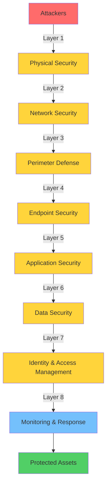

# Defense in Depth

## Introduction

Defense in Depth (DiD) is a security strategy that employs multiple layers of security controls throughout an information system. The fundamental principle is that if one security measure fails, additional layers continue to provide protection. This approach, borrowed from military strategy, ensures that no single point of failure can compromise the entire system.

Think of it like securing a castle: you don't rely solely on the outer wall. You also have a moat, gates, guards, inner walls, locked doors, and vaults. An attacker must breach multiple defenses to reach their target.

## Why Defense in Depth Matters

### The Reality of Security Failures

No single security control is perfect:

- **Software has vulnerabilities**: Even well-coded applications have bugs
- **People make mistakes**: Employees may fall for phishing or misconfigure systems
- **New attacks emerge**: Zero-day vulnerabilities exploit unknown weaknesses
- **Determined attackers**: Nation-states and organized crime have significant resources
- **Complexity**: Modern systems have countless components, each potentially vulnerable

### Benefits of Layered Security

- **Increased attack cost**: Attackers must breach multiple controls, requiring more time, skill, and resources
- **Better detection**: Multiple monitoring points increase likelihood of detecting intrusions
- **Delayed attacks**: Even if attackers breach outer defenses, inner layers buy time for response
- **Comprehensive protection**: Different controls protect against different threat types
- **Resilience**: System remains protected even if individual controls fail

## The Layers of Defense

Defense in Depth implements multiple concentric layers of security controls, each providing protection and detection capabilities:



Each layer provides overlapping protection—if an attacker breaches one layer, subsequent layers continue to defend the system and increase detection likelihood.

### 1. Physical Security

The foundation of all security is controlling physical access to systems.

**Controls:**
- Locked server rooms with badge access
- Security cameras and guards
- Visitor logs and escorts
- Secure disposal of hardware (shredding, degaussing)
- Environmental controls (fire suppression, cooling)

**Why it matters:** An attacker with physical access can bypass many logical controls.

```python
class PhysicalAccessControl:
    """Track and control physical access to secure areas"""

    def __init__(self):
        self.access_log = []
        self.authorized_personnel = {}

    def grant_access(self, person_id, area, badge_id):
        """Verify authorization before granting access"""

        # Check if person is authorized for this area
        if not self.is_authorized(person_id, area):
            self.log_unauthorized_attempt(person_id, area)
            self.trigger_alert(person_id, area)
            return False

        # Verify badge belongs to person
        if not self.verify_badge(person_id, badge_id):
            self.log_invalid_badge(person_id, badge_id)
            return False

        # Check time-based access restrictions
        if not self.is_allowed_time(person_id, area):
            return False

        # Grant access
        self.log_access(person_id, area, badge_id)
        self.unlock_door(area)
        return True

    def log_access(self, person_id, area, badge_id):
        """Maintain audit trail of physical access"""
        self.access_log.append({
            'timestamp': datetime.now(),
            'person_id': person_id,
            'area': area,
            'badge_id': badge_id,
            'action': 'ACCESS_GRANTED'
        })
```

### 2. Network Security

Protect the network infrastructure and segment it appropriately.

**Controls:**
- Firewalls (both network and host-based)
- Network segmentation and VLANs
- Intrusion Detection/Prevention Systems (IDS/IPS)
- VPNs for remote access
- Network Access Control (NAC)

```python
class NetworkSegmentation:
    """Implement network zones with different security levels"""

    def __init__(self):
        self.zones = {
            'internet': {'trust_level': 0, 'access': 'public'},
            'dmz': {'trust_level': 1, 'access': 'limited'},
            'internal': {'trust_level': 2, 'access': 'employees'},
            'secure': {'trust_level': 3, 'access': 'privileged'},
            'management': {'trust_level': 4, 'access': 'admin_only'}
        }

    def define_firewall_rules(self):
        """Create firewall rules based on zone trust levels"""

        rules = []

        # Internet to DMZ: Allow only specific services
        rules.append({
            'source': 'internet',
            'destination': 'dmz',
            'allowed_ports': [80, 443],  # HTTP/HTTPS only
            'action': 'ALLOW'
        })

        # Internet to Internal: Block all
        rules.append({
            'source': 'internet',
            'destination': 'internal',
            'action': 'DENY'
        })

        # DMZ to Database (secure zone): Only from specific IPs
        rules.append({
            'source': 'dmz',
            'source_ips': ['10.0.1.10', '10.0.1.11'],  # Web servers only
            'destination': 'secure',
            'allowed_ports': [3306],  # MySQL
            'action': 'ALLOW'
        })

        # Internal to Secure: Require authentication
        rules.append({
            'source': 'internal',
            'destination': 'secure',
            'requires_authentication': True,
            'action': 'ALLOW'
        })

        return rules

class IntrusionDetection:
    """Monitor network traffic for suspicious patterns"""

    def __init__(self):
        self.baseline_traffic = {}
        self.alert_threshold = 3  # Number of suspicious events to trigger alert

    def analyze_traffic(self, packet):
        """Detect suspicious network activity"""

        suspicious_indicators = []

        # Check for port scanning
        if self.is_port_scan(packet):
            suspicious_indicators.append('port_scan')

        # Check for unusual protocols
        if self.is_unusual_protocol(packet):
            suspicious_indicators.append('unusual_protocol')

        # Check for known attack signatures
        if self.matches_attack_signature(packet):
            suspicious_indicators.append('known_attack')

        # Check for anomalous traffic volume
        if self.is_traffic_anomaly(packet.source_ip):
            suspicious_indicators.append('traffic_anomaly')

        # Generate alert if multiple indicators present
        if len(suspicious_indicators) >= self.alert_threshold:
            self.generate_alert(packet, suspicious_indicators)

        return suspicious_indicators
```

### 3. Perimeter Defense

Controls at the boundary between internal and external networks.

**Controls:**
- Web Application Firewalls (WAF)
- Email security gateways (spam, malware filtering)
- Proxy servers
- DMZ for public-facing services

```python
class WebApplicationFirewall:
    """Protect web applications from common attacks"""

    def __init__(self):
        self.rules = self.load_protection_rules()
        self.blocked_ips = set()

    def inspect_request(self, request):
        """Analyze HTTP request for malicious content"""

        violations = []

        # SQL Injection detection
        if self.contains_sql_injection(request):
            violations.append('sql_injection')

        # XSS detection
        if self.contains_xss(request):
            violations.append('xss')

        # Path traversal detection
        if self.contains_path_traversal(request):
            violations.append('path_traversal')

        # Rate limiting
        if self.exceeds_rate_limit(request.client_ip):
            violations.append('rate_limit')

        # Block if violations detected
        if violations:
            self.block_request(request, violations)
            return False

        return True

    def contains_sql_injection(self, request):
        """Detect SQL injection patterns"""
        sql_patterns = [
            r"(\bUNION\b.*\bSELECT\b)",
            r"(\bOR\b\s+\d+\s*=\s*\d+)",
            r"(;.*DROP\s+TABLE)",
            r"(1\s*=\s*1)"
        ]

        import re
        for pattern in sql_patterns:
            if re.search(pattern, request.body, re.IGNORECASE):
                return True

        return False

    def contains_xss(self, request):
        """Detect XSS patterns"""
        xss_patterns = [
            r"<script[^>]*>.*</script>",
            r"javascript:",
            r"onerror\s*=",
            r"onload\s*="
        ]

        import re
        for pattern in xss_patterns:
            if re.search(pattern, request.body, re.IGNORECASE):
                return True

        return False
```

### 4. Endpoint Security

Protecting individual devices (workstations, servers, mobile devices).

**Controls:**
- Anti-malware software
- Host-based firewalls
- Endpoint Detection and Response (EDR)
- Full-disk encryption
- Application whitelisting
- Patch management

```python
class EndpointProtection:
    """Multi-layered protection for endpoints"""

    def __init__(self):
        self.antivirus = AntivirusEngine()
        self.firewall = HostFirewall()
        self.encryption = DiskEncryption()
        self.patch_manager = PatchManager()

    def protect_endpoint(self, device):
        """Apply multiple layers of endpoint protection"""

        protection_status = {
            'device_id': device.id,
            'protections': []
        }

        # 1. Enable firewall
        if not self.firewall.is_enabled(device):
            self.firewall.enable(device)
        protection_status['protections'].append('firewall')

        # 2. Install and update antivirus
        if not self.antivirus.is_installed(device):
            self.antivirus.install(device)
        self.antivirus.update_signatures(device)
        protection_status['protections'].append('antivirus')

        # 3. Enable disk encryption
        if not self.encryption.is_enabled(device):
            self.encryption.enable(device)
        protection_status['protections'].append('encryption')

        # 4. Ensure patches are current
        missing_patches = self.patch_manager.check_patches(device)
        if missing_patches:
            self.patch_manager.install_patches(device, missing_patches)
        protection_status['protections'].append('patches')

        # 5. Enable application whitelisting
        self.enable_application_control(device)
        protection_status['protections'].append('app_control')

        return protection_status

    def enable_application_control(self, device):
        """Only allow approved applications to run"""

        # Define allowed applications
        allowed_apps = [
            '/usr/bin/python3',
            '/usr/bin/bash',
            '/opt/company/approved-app',
            # ... approved applications
        ]

        # Block everything else
        policy = {
            'default_action': 'DENY',
            'allowed_applications': allowed_apps,
            'allow_signed_by': ['TrustedPublisher1', 'TrustedPublisher2']
        }

        return policy
```

### 5. Application Security

Building security into applications themselves.

**Controls:**
- Input validation and sanitization
- Output encoding
- Parameterized queries
- Authentication and authorization
- Secure session management
- Security headers

```python
class ApplicationSecurityControls:
    """Security controls within the application layer"""

    def __init__(self):
        self.validator = InputValidator()
        self.sanitizer = OutputSanitizer()

    def secure_database_query(self, user_input):
        """Use parameterized queries to prevent SQL injection"""

        # NEVER do this:
        # query = f"SELECT * FROM users WHERE username = '{user_input}'"

        # Always use parameterized queries:
        query = "SELECT * FROM users WHERE username = ?"
        params = (user_input,)

        return self.db.execute(query, params)

    def secure_output(self, user_content):
        """Encode output to prevent XSS"""

        import html

        # HTML context
        safe_html = html.escape(user_content)

        # JavaScript context (additional encoding)
        safe_js = user_content.replace('\\', '\\\\').replace('"', '\\"')

        return {
            'html': safe_html,
            'javascript': safe_js
        }

    def implement_security_headers(self):
        """Set HTTP security headers"""

        headers = {
            # Prevent clickjacking
            'X-Frame-Options': 'DENY',

            # Enable XSS protection
            'X-XSS-Protection': '1; mode=block',

            # Prevent MIME sniffing
            'X-Content-Type-Options': 'nosniff',

            # Content Security Policy
            'Content-Security-Policy':
                "default-src 'self'; "
                "script-src 'self' 'unsafe-inline'; "
                "style-src 'self' 'unsafe-inline';",

            # Force HTTPS
            'Strict-Transport-Security':
                'max-age=31536000; includeSubDomains',

            # Referrer policy
            'Referrer-Policy': 'strict-origin-when-cross-origin'
        }

        return headers
```

### 6. Data Security

Protecting data throughout its lifecycle.

**Controls:**
- Encryption at rest and in transit
- Data classification
- Data Loss Prevention (DLP)
- Backup and recovery
- Secure deletion

```python
class DataProtection:
    """Protect data at multiple stages"""

    def __init__(self):
        self.encryption = EncryptionService()
        self.classifier = DataClassifier()

    def protect_data_lifecycle(self, data):
        """Apply appropriate protections based on data sensitivity"""

        # 1. Classify data
        classification = self.classifier.classify(data)

        # 2. Encrypt based on classification
        if classification in ['confidential', 'restricted']:
            encrypted_data = self.encryption.encrypt(data)
        else:
            encrypted_data = data

        # 3. Apply access controls
        access_policy = self.get_access_policy(classification)

        # 4. Enable auditing
        audit_config = self.get_audit_config(classification)

        return {
            'data': encrypted_data,
            'classification': classification,
            'access_policy': access_policy,
            'audit_config': audit_config
        }

    def secure_data_transmission(self, data, destination):
        """Ensure data is encrypted in transit"""

        # Use TLS for network transmission
        if destination.protocol == 'http':
            raise SecurityError("HTTP not allowed - use HTTPS")

        # Verify certificate
        if not self.verify_ssl_certificate(destination):
            raise SecurityError("Invalid SSL certificate")

        # Additional encryption for sensitive data
        classification = self.classifier.classify(data)
        if classification == 'restricted':
            # Double encryption for highly sensitive data
            data = self.encryption.encrypt(data)

        return self.send_over_tls(data, destination)

    def secure_data_storage(self, data):
        """Encrypt data at rest"""

        # Disk-level encryption
        encrypted_disk = True  # Assume LUKS/BitLocker enabled

        # Database-level encryption
        encrypted_data = self.encryption.encrypt(data)

        # Column-level encryption for extra sensitive fields
        if data.has_sensitive_columns():
            encrypted_data = self.encryption.encrypt_columns(
                encrypted_data,
                columns=['ssn', 'credit_card', 'password_hash']
            )

        return encrypted_data
```

### 7. Identity and Access Management

Ensuring only authorized users can access resources.

**Controls:**
- Strong authentication (MFA)
- Role-Based Access Control (RBAC)
- Privileged Access Management (PAM)
- Single Sign-On (SSO)
- Account lifecycle management

```python
class IdentityAccessManagement:
    """Multi-factor authentication and authorization"""

    def authenticate_user(self, username, password, mfa_token=None):
        """Layer 1: Verify identity"""

        # First factor: Password
        user = self.verify_password(username, password)
        if not user:
            return None

        # Second factor: MFA token
        if not self.verify_mfa(user, mfa_token):
            return None

        # Third factor: Device fingerprint (optional)
        if not self.verify_device(user):
            self.require_additional_verification(user)

        return user

    def authorize_action(self, user, action, resource):
        """Layer 2: Verify permissions"""

        # Check if user has required role
        if not self.has_role(user, action.required_role):
            return False

        # Check resource-level permissions
        if not self.has_permission(user, resource):
            return False

        # Check contextual constraints
        if not self.check_constraints(user, action):
            return False

        return True

    def check_constraints(self, user, action):
        """Additional authorization checks"""

        # Time-based access
        if not self.is_allowed_time():
            return False

        # Location-based access
        if not self.is_allowed_location(user):
            return False

        # Risk-based access
        risk_score = self.calculate_risk(user, action)
        if risk_score > self.risk_threshold:
            self.require_additional_auth(user)
            return False

        return True
```

### 8. Security Monitoring and Incident Response

Detecting and responding to security events.

**Controls:**
- Security Information and Event Management (SIEM)
- Log aggregation and analysis
- Intrusion Detection Systems
- Incident response procedures
- Security Operations Center (SOC)

```python
class SecurityMonitoring:
    """Monitor and correlate security events"""

    def __init__(self):
        self.event_correlator = EventCorrelator()
        self.alert_manager = AlertManager()

    def analyze_security_events(self, events):
        """Correlate events to detect potential incidents"""

        # Collect events from multiple sources
        sources = [
            'firewall_logs',
            'ids_alerts',
            'auth_logs',
            'application_logs',
            'database_logs'
        ]

        all_events = []
        for source in sources:
            all_events.extend(self.collect_events(source))

        # Look for patterns indicating attacks
        incidents = []

        # Pattern 1: Multiple failed logins followed by success
        brute_force = self.detect_brute_force(all_events)
        if brute_force:
            incidents.append(brute_force)

        # Pattern 2: Unusual data access patterns
        data_exfiltration = self.detect_data_exfiltration(all_events)
        if data_exfiltration:
            incidents.append(data_exfiltration)

        # Pattern 3: Lateral movement
        lateral_movement = self.detect_lateral_movement(all_events)
        if lateral_movement:
            incidents.append(lateral_movement)

        # Generate alerts for detected incidents
        for incident in incidents:
            self.alert_manager.create_alert(incident)

        return incidents

    def detect_brute_force(self, events):
        """Identify brute force attack attempts"""

        from collections import defaultdict

        failed_attempts = defaultdict(list)

        for event in events:
            if event['type'] == 'auth_failure':
                failed_attempts[event['username']].append(event)

        # Check for accounts with many failed attempts
        for username, attempts in failed_attempts.items():
            if len(attempts) > 10:  # Threshold
                # Check if eventually succeeded
                success = [e for e in events if
                          e['type'] == 'auth_success' and
                          e['username'] == username]

                if success:
                    return {
                        'type': 'brute_force_success',
                        'severity': 'HIGH',
                        'username': username,
                        'failed_attempts': len(attempts),
                        'success_time': success[0]['timestamp']
                    }

        return None
```

## Implementing Defense in Depth

### Practical Example: Protecting Customer Data

```python
class CustomerDataProtection:
    """Comprehensive protection for customer data"""

    def __init__(self):
        # Layer 1: Network security
        self.network_security = NetworkSecurity()

        # Layer 2: Application security
        self.app_security = ApplicationSecurity()

        # Layer 3: Data security
        self.data_security = DataSecurity()

        # Layer 4: Access control
        self.access_control = AccessControl()

        # Layer 5: Monitoring
        self.monitoring = SecurityMonitoring()

    def access_customer_data(self, user, customer_id):
        """Multiple security layers before granting access"""

        # Layer 1: Network - Verify request from internal network
        if not self.network_security.is_internal_network():
            raise SecurityError("Access only allowed from internal network")

        # Layer 2: Authentication - Verify user identity
        if not user.is_authenticated():
            raise SecurityError("Authentication required")

        # Layer 3: Authorization - Check permissions
        if not self.access_control.can_access_customer(user, customer_id):
            self.monitoring.log_unauthorized_access(user, customer_id)
            raise SecurityError("Insufficient permissions")

        # Layer 4: Input validation
        if not self.app_security.is_valid_customer_id(customer_id):
            raise ValueError("Invalid customer ID")

        # Layer 5: Retrieve encrypted data
        encrypted_data = self.database.get_customer(customer_id)

        # Layer 6: Decrypt (requires key management)
        decrypted_data = self.data_security.decrypt(encrypted_data)

        # Layer 7: Data minimization - Return only needed fields
        filtered_data = self.filter_sensitive_fields(decrypted_data, user)

        # Layer 8: Audit logging
        self.monitoring.log_data_access(user, customer_id)

        return filtered_data
```

## Key Principles

### 1. No Single Point of Failure

Every security control can fail. Defense in Depth ensures that:
- Multiple controls protect the same asset
- Failure of one control doesn't compromise the entire system
- Controls complement rather than duplicate each other

### 2. Fail Securely

When security controls fail, they should:
- Default to denying access
- Log the failure
- Alert security teams
- Maintain partial functionality where possible

### 3. Separation of Duties

Critical operations require multiple approvals:

```python
class SeparationOfDuties:
    """Require multiple approvals for sensitive operations"""

    def transfer_large_amount(self, initiator, approver, amount, destination):
        """Large transfers require dual control"""

        # Can't approve your own transaction
        if initiator.id == approver.id:
            raise SecurityError("Cannot self-approve transactions")

        # Initiator creates request
        request = self.create_transfer_request(initiator, amount, destination)

        # Approver must independently verify
        if not approver.has_role('approver'):
            raise SecurityError("User not authorized to approve")

        # Execute only when both parties agree
        return self.execute_transfer(request, approver)
```

## Conclusion

Defense in Depth is not about implementing every possible security control but about creating a comprehensive, layered security architecture appropriate to your risk profile. Each layer should complement others, creating overlapping protections that make successful attacks significantly more difficult.

Remember: security is never perfect, but with Defense in Depth, attackers must overcome multiple obstacles, increasing the likelihood they'll be detected and stopped before achieving their objectives.

## Key Takeaways

- No single security control is sufficient
- Multiple layers make attacks more difficult and costly
- Different layers protect against different attack types
- Controls should complement, not duplicate, each other
- Failed controls should fail securely (deny access)
- Monitoring across all layers improves detection
- Defense in Depth applies at all levels: physical, network, application, data
