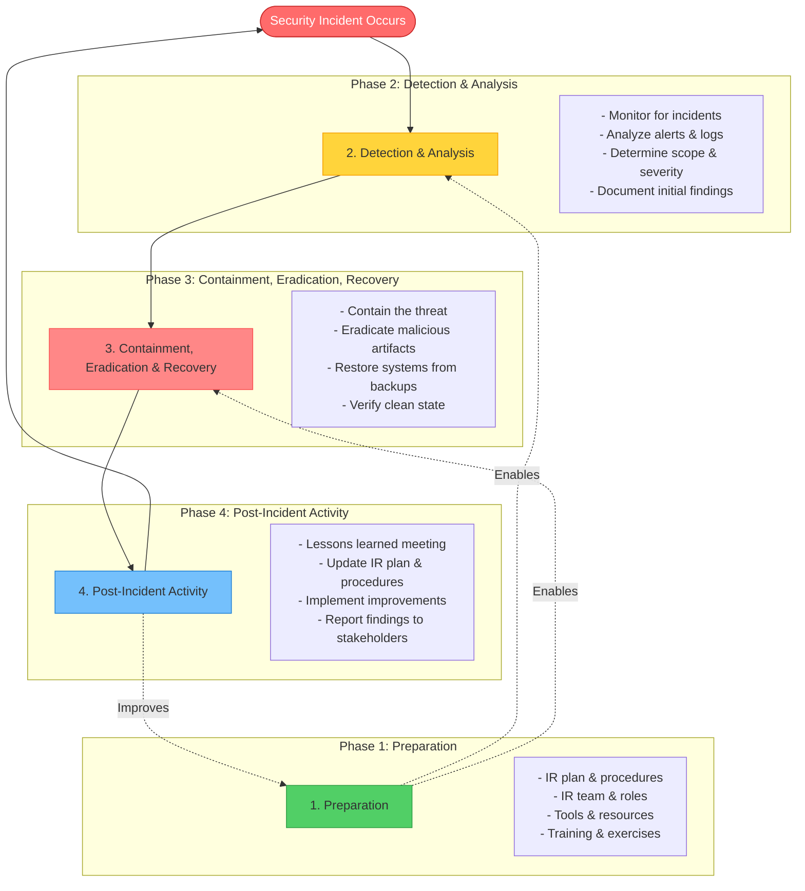

# Incident Response

Incident response is the process of handling security breaches, from detection through recovery and lessons learned. This subtopic covers IR planning, containment strategies, forensics, and post-incident analysis.

## Incident Response Overview

Effective incident response minimizes damage and recovery time while preserving evidence.

### Incident Response Lifecycle

The NIST incident response lifecycle is a continuous process for handling security incidents:



### Incident Severity Timeline

Time is critical in incident response. Different severity levels require different response times:

```mermaid
gantt
    title Incident Response Timeline by Severity
    dateFormat X
    axisFormat %M min

    section P1 Critical
    Detection          :0, 15m
    Response Started   :15m, 30m
    Containment        :45m, 2h

    section P2 High
    Detection          :0, 30m
    Response Started   :30m, 1h
    Containment        :90m, 3h

    section P3 Medium
    Detection          :0, 2h
    Response Started   :2h, 4h
    Containment        :6h, 8h
```

## Preparation

### Incident Response Plan

```python
class IncidentResponsePlan:
    """Incident response plan structure"""

    @staticmethod
    def ir_plan_template():
        """IR plan template"""
        return {
            'policy_statement': {
                'purpose': 'Define incident response procedures',
                'scope': 'All information systems',
                'authority': 'CISO',
                'compliance': ['GDPR', 'PCI DSS', 'HIPAA']
            },
            'ir_team': {
                'roles': {
                    'incident_commander': {
                        'responsibilities': [
                            'Overall incident coordination',
                            'Decision making authority',
                            'Stakeholder communication'
                        ],
                        'contact': 'ic@example.com'
                    },
                    'security_analyst': {
                        'responsibilities': [
                            'Initial triage',
                            'Technical analysis',
                            'Evidence collection'
                        ],
                        'contact': 'soc@example.com'
                    },
                    'forensics_specialist': {
                        'responsibilities': [
                            'Digital forensics',
                            'Evidence preservation',
                            'Chain of custody'
                        ],
                        'contact': 'forensics@example.com'
                    },
                    'legal': {
                        'responsibilities': [
                            'Legal compliance',
                            'Breach notification',
                            'Law enforcement liaison'
                        ],
                        'contact': 'legal@example.com'
                    },
                    'communications': {
                        'responsibilities': [
                            'Internal communications',
                            'External communications',
                            'Media relations'
                        ],
                        'contact': 'pr@example.com'
                    }
                },
                'escalation_path': [
                    'Security Analyst → Senior Analyst',
                    'Senior Analyst → Incident Commander',
                    'Incident Commander → CISO',
                    'CISO → CEO (if major incident)'
                ]
            },
            'incident_classification': {
                'severity_levels': {
                    'P1_critical': {
                        'description': 'Major breach, data loss, significant impact',
                        'response_time': '15 minutes',
                        'examples': [
                            'Ransomware outbreak',
                            'Data breach (PII)',
                            'Complete system compromise'
                        ]
                    },
                    'P2_high': {
                        'description': 'Significant security event',
                        'response_time': '1 hour',
                        'examples': [
                            'Malware infection (contained)',
                            'Unauthorized access',
                            'DDoS attack'
                        ]
                    },
                    'P3_medium': {
                        'description': 'Moderate security concern',
                        'response_time': '4 hours',
                        'examples': [
                            'Policy violations',
                            'Suspicious activity',
                            'Failed attack attempts'
                        ]
                    },
                    'P4_low': {
                        'description': 'Minor security event',
                        'response_time': '24 hours',
                        'examples': [
                            'Security alerts (false positive)',
                            'Informational findings'
                        ]
                    }
                }
            },
            'communication_plan': {
                'internal': [
                    'Incident team via Slack/Teams',
                    'Executive notification',
                    'Department heads (as needed)',
                    'All staff (if necessary)'
                ],
                'external': [
                    'Customers (breach notification)',
                    'Regulators (if required)',
                    'Law enforcement (if criminal)',
                    'Cyber insurance provider'
                ],
                'templates': [
                    'Initial notification',
                    'Status updates',
                    'Resolution notification',
                    'Breach notification letter'
                ]
            },
            'tools_and_resources': {
                'technical': [
                    'SIEM (Splunk, ELK)',
                    'EDR (CrowdStrike, Carbon Black)',
                    'Forensics tools (EnCase, FTK)',
                    'Network capture (Wireshark)',
                    'Malware analysis sandbox'
                ],
                'documentation': [
                    'Incident tracking system (Jira)',
                    'Runbooks',
                    'Contact lists',
                    'Evidence collection forms'
                ],
                'external_resources': [
                    'Incident response retainer',
                    'Legal counsel',
                    'Forensics firm',
                    'Cyber insurance'
                ]
            }
        }

    @staticmethod
    def incident_playbooks():
        """Common incident playbooks"""
        return {
            'ransomware': [
                '1. Isolate affected systems (disconnect network)',
                '2. Identify patient zero',
                '3. Determine encryption scope',
                '4. Check backups availability',
                '5. DO NOT PAY RANSOM (policy decision)',
                '6. Preserve evidence',
                '7. Restore from backups',
                '8. Implement additional monitoring'
            ],
            'data_breach': [
                '1. Identify data accessed',
                '2. Determine access method',
                '3. Revoke attacker access',
                '4. Assess regulatory requirements',
                '5. Notify stakeholders (legal timeline)',
                '6. Credit monitoring (if PII)',
                '7. Root cause analysis',
                '8. Remediation'
            ],
            'phishing': [
                '1. Identify phishing email',
                '2. Block sender domain',
                '3. Remove emails from mailboxes',
                '4. Identify users who clicked',
                '5. Reset compromised credentials',
                '6. Check for lateral movement',
                '7. User awareness training',
                '8. Email filter update'
            ],
            'malware_outbreak': [
                '1. Identify malware variant',
                '2. Isolate infected systems',
                '3. Determine spread mechanism',
                '4. Block C2 communications',
                '5. Remove malware',
                '6. Image systems for forensics',
                '7. Rebuild if necessary',
                '8. Update defenses'
            ]
        }
```

## Detection and Analysis

### Incident Detection

```python
from datetime import datetime
from typing import List, Dict
from enum import Enum

class IncidentSeverity(Enum):
    CRITICAL = 1
    HIGH = 2
    MEDIUM = 3
    LOW = 4
    INFO = 5

class SecurityIncident:
    """Security incident tracking"""

    def __init__(self, title: str, description: str, severity: IncidentSeverity):
        self.incident_id = self._generate_id()
        self.title = title
        self.description = description
        self.severity = severity
        self.status = 'DETECTED'
        self.detected_at = datetime.utcnow()
        self.timeline = []
        self.indicators = []
        self.affected_systems = []
        self.actions_taken = []

    def _generate_id(self) -> str:
        """Generate unique incident ID"""
        import uuid
        return f"INC-{datetime.utcnow().strftime('%Y%m%d')}-{uuid.uuid4().hex[:8].upper()}"

    def add_timeline_entry(self, event: str):
        """Add event to incident timeline"""
        self.timeline.append({
            'timestamp': datetime.utcnow().isoformat(),
            'event': event
        })

    def add_indicator(self, ioc_type: str, value: str):
        """Add indicator of compromise"""
        self.indicators.append({
            'type': ioc_type,  # IP, domain, hash, etc.
            'value': value,
            'detected_at': datetime.utcnow().isoformat()
        })

    def add_affected_system(self, system: str):
        """Add affected system"""
        if system not in self.affected_systems:
            self.affected_systems.append(system)

    def update_status(self, new_status: str):
        """Update incident status"""
        old_status = self.status
        self.status = new_status
        self.add_timeline_entry(f"Status changed: {old_status} → {new_status}")


class IncidentAnalysis:
    """Incident analysis and triage"""

    def __init__(self):
        self.incidents = []

    def detect_brute_force(self, failed_logins: List[Dict]) -> SecurityIncident:
        """Detect brute force attack"""
        # Group by source IP
        from collections import defaultdict
        by_ip = defaultdict(list)

        for login in failed_logins:
            by_ip[login['source_ip']].append(login)

        # Check for brute force pattern
        for ip, attempts in by_ip.items():
            if len(attempts) > 10:  # Threshold
                incident = SecurityIncident(
                    title=f"Brute force attack from {ip}",
                    description=f"{len(attempts)} failed login attempts in 5 minutes",
                    severity=IncidentSeverity.HIGH
                )
                incident.add_indicator('ip', ip)
                incident.add_timeline_entry(f"Detected {len(attempts)} failed logins")

                return incident

        return None

    def detect_data_exfiltration(self, network_traffic: List[Dict]) -> SecurityIncident:
        """Detect unusual data transfer"""
        # Check for large outbound transfers
        for conn in network_traffic:
            if conn['bytes_out'] > 1000000000:  # 1GB
                incident = SecurityIncident(
                    title=f"Suspicious data transfer to {conn['dest_ip']}",
                    description=f"{conn['bytes_out']} bytes transferred",
                    severity=IncidentSeverity.CRITICAL
                )
                incident.add_indicator('ip', conn['dest_ip'])
                incident.add_affected_system(conn['source_host'])

                return incident

        return None

    def detect_malware_execution(self, process_events: List[Dict]) -> SecurityIncident:
        """Detect malware execution"""
        suspicious_processes = []

        for proc in process_events:
            # Check process hash against threat intel
            if self._is_known_malware(proc['hash']):
                suspicious_processes.append(proc)

        if suspicious_processes:
            incident = SecurityIncident(
                title="Malware execution detected",
                description=f"{len(suspicious_processes)} malicious processes found",
                severity=IncidentSeverity.CRITICAL
            )

            for proc in suspicious_processes:
                incident.add_indicator('hash', proc['hash'])
                incident.add_affected_system(proc['hostname'])

            return incident

        return None

    def _is_known_malware(self, file_hash: str) -> bool:
        """Check against threat intelligence"""
        # In production: Query VirusTotal, threat intel feeds
        return False
```

## Containment, Eradication, and Recovery

### Containment Strategies

```python
class IncidentContainment:
    """Incident containment procedures"""

    @staticmethod
    def network_isolation(system: str, reason: str):
        """Isolate system from network"""
        # In production: Automate via EDR, firewall API
        print(f"[CONTAINMENT] Isolating {system} - Reason: {reason}")

        actions = {
            'firewall_rules': [
                f"Block all traffic to/from {system}",
                "Allow only IR team access"
            ],
            'network_port': "Disable switch port",
            'wifi': "Deauthenticate device",
            'edr': "Enable network containment mode"
        }

        return actions

    @staticmethod
    def account_disable(username: str, reason: str):
        """Disable compromised account"""
        print(f"[CONTAINMENT] Disabling account {username} - Reason: {reason}")

        actions = [
            "Disable Active Directory account",
            "Revoke all sessions/tokens",
            "Reset password",
            "Revoke API keys",
            "Disable SSO access",
            "Notify user (if legitimate)"
        ]

        return actions

    @staticmethod
    def malware_containment(system: str, malware_hash: str):
        """Contain malware outbreak"""
        print(f"[CONTAINMENT] Containing malware on {system}")

        actions = {
            'immediate': [
                "Disconnect system from network",
                "Kill malicious process",
                "Block malware hash on EDR"
            ],
            'investigation': [
                "Memory dump for analysis",
                "Disk image for forensics",
                "Check for persistence mechanisms"
            ],
            'eradication': [
                "Remove malware files",
                "Clean registry entries",
                "Remove scheduled tasks",
                "Rebuild system (recommended)"
            ]
        }

        return actions

    @staticmethod
    def data_breach_containment(data_type: str, access_method: str):
        """Contain data breach"""
        print(f"[CONTAINMENT] Containing data breach - {data_type} via {access_method}")

        actions = {
            'immediate': [
                "Revoke attacker access",
                "Change credentials",
                "Enable additional logging",
                "Snapshot system state"
            ],
            'assessment': [
                "Identify data accessed",
                "Determine access timeline",
                "Check for data exfiltration",
                "Assess regulatory impact"
            ],
            'notification': [
                "Legal review",
                "Regulatory notification (if required)",
                "Customer notification",
                "Credit monitoring (if PII)"
            ]
        }

        return actions
```

## Digital Forensics

### Evidence Collection

```python
class DigitalForensics:
    """Digital forensics procedures"""

    @staticmethod
    def collect_evidence(system: str, incident_id: str) -> Dict:
        """Collect digital evidence"""
        evidence_collection = {
            'incident_id': incident_id,
            'system': system,
            'collected_at': datetime.utcnow().isoformat(),
            'collector': 'forensics_team',
            'chain_of_custody': []
        }

        # Volatile data (collect first - lost on reboot)
        volatile_data = {
            'memory_dump': f"Memory dump of {system}",
            'running_processes': "Process list snapshot",
            'network_connections': "Active network connections",
            'logged_in_users': "Current user sessions",
            'clipboard': "Clipboard contents",
            'temporary_files': "Contents of /tmp"
        }

        # Non-volatile data
        non_volatile_data = {
            'disk_image': f"Full disk image of {system}",
            'filesystem_timeline': "Filesystem metadata timeline",
            'log_files': "System and application logs",
            'configuration_files': "System configuration",
            'user_files': "User documents and data"
        }

        # Network data
        network_data = {
            'packet_capture': "Network traffic capture",
            'firewall_logs': "Firewall logs",
            'proxy_logs': "Web proxy logs",
            'dns_logs': "DNS query logs"
        }

        evidence_collection.update({
            'volatile': volatile_data,
            'non_volatile': non_volatile_data,
            'network': network_data
        })

        return evidence_collection

    @staticmethod
    def forensic_imaging():
        """Create forensic disk image"""
        return """
        Forensic Disk Imaging:

        Tools:
        - dd (Linux/Mac/Windows)
        - FTK Imager (Windows, GUI)
        - dc3dd (enhanced dd)

        Process:
        1. Write-protect source drive
        2. Calculate source hash (SHA-256)
        3. Create bit-for-bit image
        4. Calculate image hash
        5. Verify hashes match
        6. Document in chain of custody

        Command (Linux):
        dd if=/dev/sda of=evidence.img bs=4M conv=noerror,sync status=progress

        # Calculate hash
        sha256sum evidence.img > evidence.img.sha256

        # Compress (optional)
        gzip evidence.img

        Best Practices:
        - Never work on original evidence
        - Maintain chain of custody
        - Document all actions
        - Use write blockers
        - Verify integrity (hashes)
        """

    @staticmethod
    def timeline_analysis(events: List[Dict]) -> List[Dict]:
        """Create forensic timeline"""
        # Sort events chronologically
        timeline = sorted(events, key=lambda x: x.get('timestamp', ''))

        # Analyze for patterns
        analysis = []

        for i, event in enumerate(timeline):
            entry = {
                'sequence': i + 1,
                'timestamp': event.get('timestamp'),
                'source': event.get('source'),
                'event': event.get('description'),
                'significance': 'NORMAL'
            }

            # Mark significant events
            if 'login' in event.get('description', '').lower():
                if 'failed' in event.get('description', '').lower():
                    entry['significance'] = 'SUSPICIOUS'
                elif event.get('source_ip', '').startswith('203.0.113'):
                    entry['significance'] = 'ANOMALOUS'

            analysis.append(entry)

        return analysis
```

## Post-Incident Activity

### Lessons Learned

```python
class PostIncidentReview:
    """Post-incident review and lessons learned"""

    @staticmethod
    def lessons_learned_template():
        """Lessons learned meeting template"""
        return {
            'incident_summary': {
                'incident_id': 'INC-20240101-ABCD1234',
                'title': 'Ransomware Attack',
                'date_detected': '2024-01-01 02:30 UTC',
                'date_resolved': '2024-01-03 18:00 UTC',
                'severity': 'CRITICAL',
                'impact': 'Production systems offline for 40 hours'
            },
            'timeline': [
                '2024-01-01 02:30 - Ransomware detected',
                '2024-01-01 02:45 - IR team notified',
                '2024-01-01 03:00 - Systems isolated',
                '2024-01-01 04:00 - Backup recovery started',
                '2024-01-03 18:00 - All systems restored'
            ],
            'what_went_well': [
                'Quick detection (EDR alert)',
                'Fast containment (systems isolated in 30 min)',
                'Backups were available and working',
                'Clear communication throughout',
                'No ransom paid (policy held)'
            ],
            'what_went_wrong': [
                'Phishing training ineffective (entry point)',
                'Lateral movement not detected quickly',
                'Backup restoration slower than expected',
                'Some systems not covered by backups',
                'Email filtering missed phishing email'
            ],
            'root_cause': {
                'primary': 'Phishing email with malicious attachment',
                'contributing_factors': [
                    'User clicked malicious link',
                    'Outdated endpoint protection',
                    'Lack of email authentication (DMARC)',
                    'Excessive user privileges'
                ]
            },
            'action_items': [
                {
                    'item': 'Implement DMARC for email authentication',
                    'owner': 'IT Security',
                    'due_date': '2024-02-01',
                    'priority': 'HIGH'
                },
                {
                    'item': 'Mandatory phishing training for all staff',
                    'owner': 'HR',
                    'due_date': '2024-01-15',
                    'priority': 'HIGH'
                },
                {
                    'item': 'Review and reduce user privileges',
                    'owner': 'IT Operations',
                    'due_date': '2024-02-15',
                    'priority': 'MEDIUM'
                },
                {
                    'item': 'Improve backup restoration time',
                    'owner': 'Infrastructure',
                    'due_date': '2024-03-01',
                    'priority': 'MEDIUM'
                },
                {
                    'item': 'Update incident response playbook',
                    'owner': 'Security',
                    'due_date': '2024-01-20',
                    'priority': 'HIGH'
                }
            ],
            'metrics': {
                'time_to_detect': '30 minutes',
                'time_to_contain': '30 minutes',
                'time_to_eradicate': '2 hours',
                'time_to_recover': '40 hours',
                'systems_affected': 45,
                'data_loss': 'None (restored from backups)',
                'cost_estimate': '$150,000 (downtime + response)'
            }
        }

    @staticmethod
    def improve_ir_process(lessons_learned: Dict) -> List[str]:
        """Generate improvements based on lessons learned"""
        improvements = []

        # Analyze time metrics
        if 'time_to_detect' in lessons_learned.get('metrics', {}):
            # Add detection improvements
            improvements.append("Implement additional detection rules")

        # Analyze what went wrong
        for issue in lessons_learned.get('what_went_wrong', []):
            if 'training' in issue.lower():
                improvements.append("Enhance security awareness training")
            if 'backup' in issue.lower():
                improvements.append("Improve backup/recovery procedures")
            if 'detection' in issue.lower():
                improvements.append("Enhance monitoring capabilities")

        return improvements
```

## Summary

Incident response manages security breaches effectively:

- **Lifecycle**: Preparation → Detection & Analysis → Containment/Eradication/Recovery → Post-Incident
- **Preparation**: IR plan, team roles, playbooks, tools, training
- **Detection**: SIEM monitoring, alert triage, incident classification, severity assessment
- **Containment**: Network isolation, account disable, malware removal, minimize damage
- **Forensics**: Evidence collection, disk imaging, timeline analysis, chain of custody
- **Lessons Learned**: Post-incident review, root cause analysis, action items, continuous improvement

Effective IR requires: preparation, clear procedures, skilled team, proper tools, thorough documentation, and commitment to continuous improvement.
