# Communication Paradigms in Distributed Systems

## Introduction

Communication is the lifeblood of distributed systems. Since components in a distributed system cannot share memory or directly call each other's functions like in a monolithic application, they must communicate by exchanging messages over a network. The way systems communicate fundamentally shapes their architecture, performance characteristics, fault tolerance properties, and complexity.

Different communication paradigms offer different tradeoffs between simplicity, performance, coupling, and reliability. A paradigm that works well for a microservices architecture might be inappropriate for a high-frequency trading system. Understanding these paradigms and their tradeoffs is essential for building effective distributed systems.

The evolution of communication paradigms reflects the evolution of distributed systems themselves. Early systems used simple message passing and Remote Procedure Calls (RPC) to make distributed calls look like local calls. As systems grew more complex and requirements for scalability and loose coupling increased, publish-subscribe and event-driven architectures emerged. Modern systems often use multiple paradigms, choosing the right tool for each use case.

This comprehensive exploration covers the major communication paradigms: direct message passing, request-reply patterns, Remote Procedure Calls, publish-subscribe messaging, and asynchronous messaging patterns. We'll examine how each works, when to use it, real-world implementations, and common pitfalls.

## Message Passing Fundamentals

Message passing is the most fundamental communication paradigm in distributed systems. All other paradigms are built on top of message passing primitives. At its core, message passing involves one process sending a message to another process through some communication channel.

### Basic Message Passing Model

In the basic message passing model, processes communicate by explicitly sending and receiving messages. This is similar to how network protocols like TCP and UDP work at a low level.

**Primitives**:
- `send(destination, message)`: Send a message to a destination
- `receive()`: Receive a message (may block until one arrives)

**Characteristics**:
- Explicit communication - sender knows who they're sending to
- Low-level control over communication
- Direct coupling between sender and receiver
- Can be synchronous (blocking) or asynchronous (non-blocking)

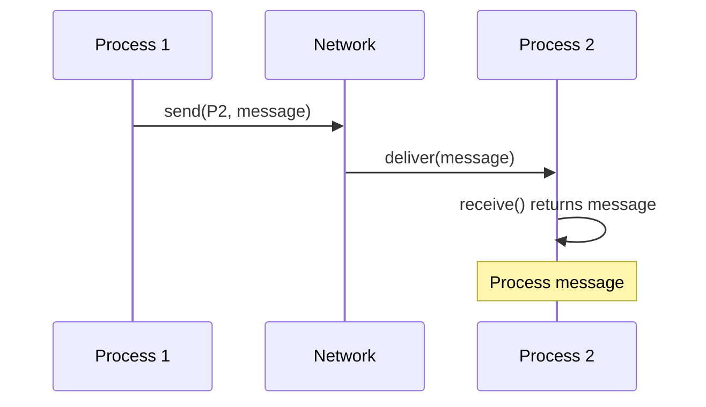

### Synchronous vs Asynchronous Message Passing

**Synchronous message passing** (also called rendezvous) blocks the sender until the receiver has received the message. This provides strong guarantees about message delivery but couples the sender's progress to the receiver's availability.

```python
# Synchronous send - blocks until received
def synchronous_send(destination, message):
    channel.send(destination, message)
    # Blocks here until receiver calls receive()
    wait_for_acknowledgment()
    # Only returns after message is received
```

**Asynchronous message passing** allows the sender to continue immediately after sending, without waiting for the receiver. This provides better performance and availability but makes reasoning about message delivery more complex.

```python
# Asynchronous send - returns immediately
def asynchronous_send(destination, message):
    channel.send(destination, message)
    # Returns immediately, message may still be in transit
    return
```

### Message Queues

Message queues provide a buffer between sender and receiver, enabling asynchronous communication with reliability guarantees.

**Properties**:
- Messages are stored until consumed
- Multiple senders can send to the same queue
- Messages typically processed in order (FIFO)
- Persistence options for durability

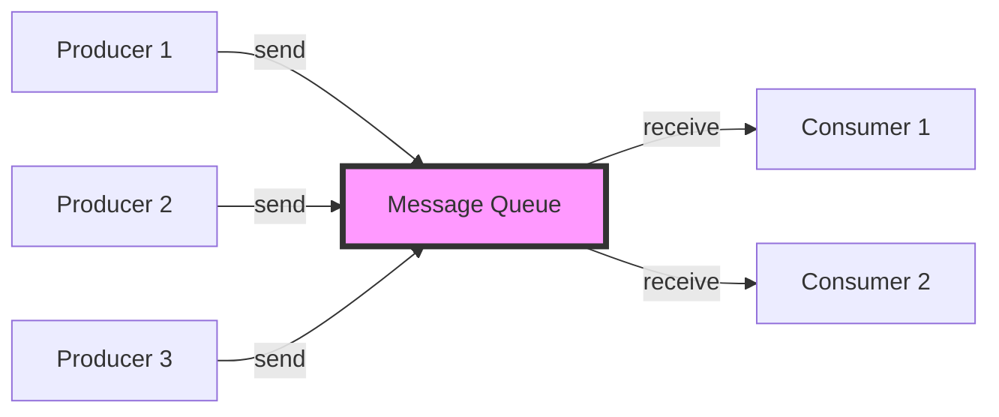

**Delivery semantics**:
- **At-most-once**: Message might be lost, never duplicated
- **At-least-once**: Message will arrive, might be duplicated
- **Exactly-once**: Message arrives exactly once (expensive to implement)

### Real-World Message Queue Systems

**Amazon SQS (Simple Queue Service)**:
- Fully managed message queuing service
- At-least-once delivery (standard queues)
- Exactly-once processing (FIFO queues)
- Automatic scaling
- Message retention up to 14 days

**Apache Kafka**:
- Distributed streaming platform
- High throughput (millions of messages/second)
- Messages organized into topics with partitions
- Durable storage with configurable retention
- Consumer groups for parallel processing

**RabbitMQ**:
- Feature-rich message broker
- Supports multiple messaging protocols (AMQP, MQTT, STOMP)
- Complex routing with exchanges
- Clustering and high availability

## Request-Reply Pattern

The request-reply pattern is one of the most common communication patterns, where a client sends a request and waits for a response from the server. This pattern models traditional client-server interactions.

### Basic Request-Reply

In its simplest form, request-reply is synchronous: the client sends a request and blocks until receiving a reply.

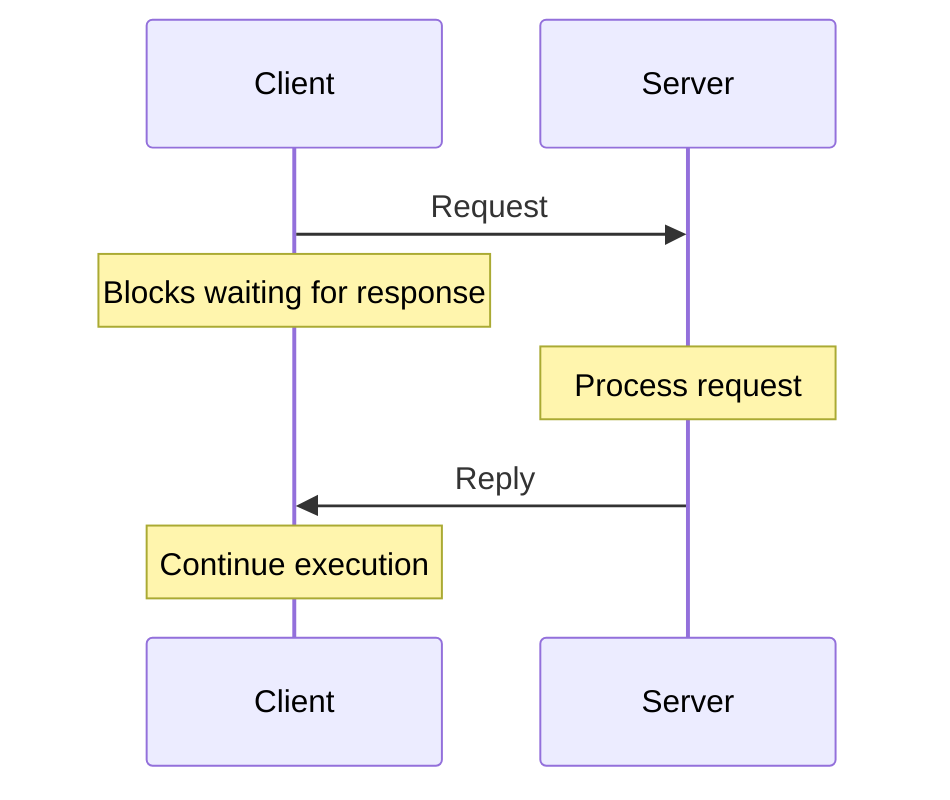

**Characteristics**:
- Synchronous by default - client waits for response
- Clear correlation between request and response
- Simple to reason about
- Server must respond (or client times out)

**Implementation considerations**:
- **Timeouts**: How long to wait before giving up?
- **Retries**: Should failed requests be retried automatically?
- **Idempotency**: Can requests be safely retried?
- **Correlation IDs**: How to match responses to requests?

### Asynchronous Request-Reply

In asynchronous request-reply, the client doesn't block after sending a request. Instead, it continues execution and handles the response when it arrives.

```python
# Asynchronous request-reply with callbacks
def async_request(url, callback):
    request_id = generate_id()
    pending_requests[request_id] = callback
    send_request(url, request_id)
    # Returns immediately
    return request_id

def handle_response(response):
    request_id = response.correlation_id
    callback = pending_requests[request_id]
    callback(response.data)
    del pending_requests[request_id]
```

**Benefits**:
- Client can do other work while waiting
- Can send multiple requests concurrently
- Better resource utilization

**Challenges**:
- More complex programming model
- Need to handle responses out of order
- Managing pending request state

### Request-Reply with Message Queues

Request-reply can be implemented using message queues, combining queue benefits (persistence, load balancing) with request-reply semantics.

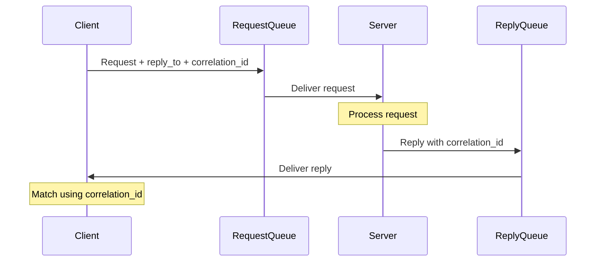

**Pattern details**:
- Client sends request to request queue with unique correlation ID
- Client listens on reply queue (temporary or permanent)
- Server processes request, sends reply to specified reply queue
- Client matches reply to request using correlation ID

**Used in**:
- RabbitMQ RPC pattern
- Amazon SQS request-response
- AMQP RPC over message queues

## Remote Procedure Call (RPC)

Remote Procedure Call abstracts distributed communication to look like local function calls. The goal is to make calling a function on a remote server feel the same as calling a local function, hiding the complexity of networking, serialization, and error handling.

### RPC Abstraction

The core idea of RPC is location transparency: calling a remote function should be syntactically identical to calling a local function.

```python
# Local function call
result = calculate_sum(5, 10)

# RPC - looks the same!
result = remote_service.calculate_sum(5, 10)
# Behind the scenes: network call, serialization,
# waiting for response, deserialization
```

**RPC components**:

1. **Client stub**: Proxy object that looks like the real service but actually makes network calls
2. **Server stub** (skeleton): Receives network calls and dispatches to actual implementation
3. **Marshalling**: Serializing arguments into bytes for transmission
4. **Unmarshalling**: Deserializing bytes back into language objects
5. **Transport**: Network protocol for sending messages (HTTP, TCP, etc.)

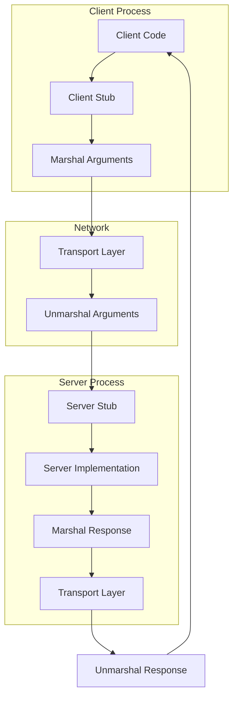

### Challenges with RPC

Despite the appealing abstraction, RPC cannot truly hide the distributed nature of the call:

**Network failures**: Remote calls can fail in ways local calls cannot:
- Network unavailable
- Server crashed
- Request timeout
- Response lost

**Latency**: Remote calls are orders of magnitude slower than local calls (microseconds vs milliseconds or more)

**Partial failures**: The remote function might execute but the response might not arrive. Did it execute or not?

**Parameter passing semantics**: Passing complex objects or references doesn't work the same way remotely

### Modern RPC Frameworks

**gRPC** (Google RPC):
- Uses Protocol Buffers for serialization
- HTTP/2 for transport
- Supports streaming (client, server, bidirectional)
- Automatic stub generation
- Strong typing with interface definitions

```protobuf
// gRPC service definition
service Calculator {
  rpc Add(AddRequest) returns (AddResponse);
  rpc StreamResults(Request) returns (stream Response);
}

message AddRequest {
  int32 a = 1;
  int32 b = 2;
}

message AddResponse {
  int32 result = 1;
}
```

**Apache Thrift**:
- Created by Facebook
- Multiple serialization formats (binary, compact, JSON)
- Code generation for many languages
- Used by companies like Uber, Pinterest

**REST over HTTP**:
- Ubiquitous web standard
- Human-readable (JSON)
- Stateless
- Uses HTTP methods (GET, POST, PUT, DELETE)
- Good for public APIs

### RPC vs REST

| Aspect | RPC | REST |
|--------|-----|------|
| Model | Function calls | Resources and operations |
| Protocol | Custom (gRPC, Thrift) | HTTP |
| Serialization | Binary (protobuf) | Usually JSON |
| Performance | Faster, more efficient | Slower, more overhead |
| Coupling | Tighter coupling | Looser coupling |
| Streaming | Native support (gRPC) | Limited (SSE, WebSockets) |
| Tooling | Framework-specific | Universal (HTTP clients) |

## Publish-Subscribe Pattern

Publish-subscribe (pub-sub) is a messaging pattern where senders (publishers) don't send messages directly to receivers (subscribers). Instead, messages are published to topics or channels, and subscribers express interest in topics. This decouples publishers from subscribers.

### Core Concepts

**Publishers**: Produce messages to topics without knowing who will receive them

**Subscribers**: Express interest in topics and receive all messages published to those topics

**Topics/Channels**: Named categories for messages

**Message broker**: Intermediary that receives messages from publishers and delivers them to subscribers

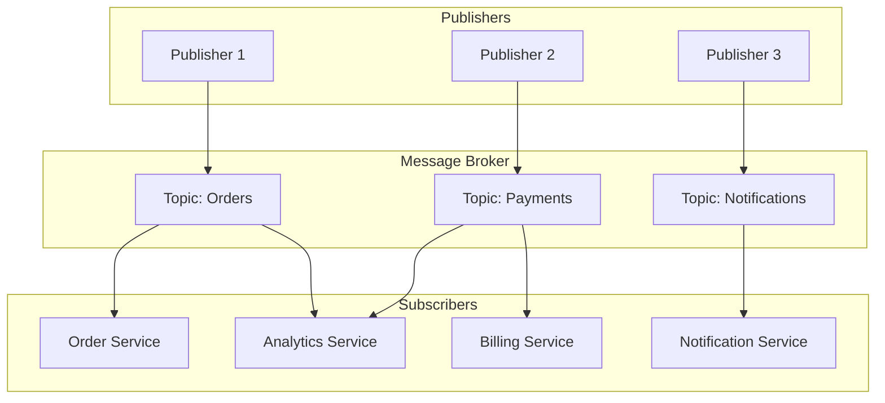

### Advantages of Pub-Sub

**Loose coupling**: Publishers and subscribers don't need to know about each other. New subscribers can be added without changing publishers.

**Scalability**: Multiple subscribers can receive the same message without additional load on publishers. Subscribers can process messages in parallel.

**Flexibility**: Easy to add new message types and new subscribers. System can evolve without breaking existing components.

**Async communication**: Publishers aren't blocked waiting for subscribers to process messages.

### Topic-Based Pub-Sub

Messages are published to named topics. Subscribers subscribe to specific topics.

```python
# Publisher
publisher.publish("orders.created", {
    "order_id": "12345",
    "customer": "john@example.com",
    "total": 99.99
})

# Subscribers
analytics.subscribe("orders.created")
fulfillment.subscribe("orders.created")
notifications.subscribe("orders.created")
```

**Topic hierarchies**: Some systems support hierarchical topics:
- `orders.created`
- `orders.updated`
- `orders.cancelled`

Subscribers can use wildcards:
- `orders.*` - all order events
- `*.created` - all creation events

### Content-Based Pub-Sub

More sophisticated than topic-based, subscribers can specify filters based on message content.

```python
# Subscriber filters
high_value_orders.subscribe(
    topic="orders.*",
    filter="total > 1000"
)

international_orders.subscribe(
    topic="orders.*",
    filter="country != 'US'"
)
```

### Real-World Pub-Sub Systems

**Redis Pub/Sub**:
- Simple, in-memory pub-sub
- Topic-based subscriptions
- Pattern matching for topics
- Fire-and-forget (no persistence)
- Good for real-time events

**Apache Kafka**:
- Distributed streaming platform
- Persistent message storage
- High throughput
- Consumer groups for scalable consumption
- Used by LinkedIn, Netflix, Uber

**Google Cloud Pub/Sub**:
- Fully managed service
- Global message routing
- At-least-once delivery
- Automatic scaling
- Push and pull delivery

**Amazon SNS (Simple Notification Service)**:
- Pub-sub messaging service
- Fan-out to multiple subscribers
- Multiple protocols (HTTP, SQS, Lambda, email, SMS)
- Topic filtering with subscription filter policies

### Push vs Pull Delivery

**Push**: Broker actively sends messages to subscribers
- Lower latency
- Simpler for subscribers
- Broker controls rate
- Can overwhelm subscribers

**Pull**: Subscribers request messages from broker
- Subscribers control rate
- Better for batch processing
- Higher latency
- More complex subscriber code

## Asynchronous Messaging Patterns

Asynchronous messaging allows components to communicate without blocking, enabling better scalability, fault tolerance, and decoupling.

### Fire-and-Forget

Sender sends a message and continues immediately without waiting for acknowledgment.

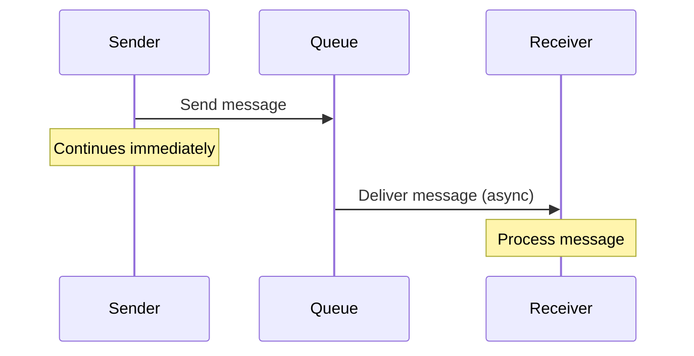

**Use cases**:
- Logging events
- Metrics collection
- Non-critical notifications

**Tradeoffs**:
- Fast for sender
- No delivery guarantee
- Sender doesn't know if message was processed

### Request-Acknowledge

Sender waits for acknowledgment that message was received (but not processed).

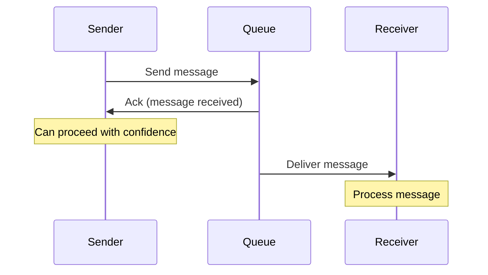

**Use cases**:
- When sender needs confirmation of delivery
- Message persistence required

**Tradeoffs**:
- Higher latency than fire-and-forget
- Delivery guarantee but not processing guarantee

### Competing Consumers

Multiple consumers compete to process messages from the same queue, enabling parallel processing.

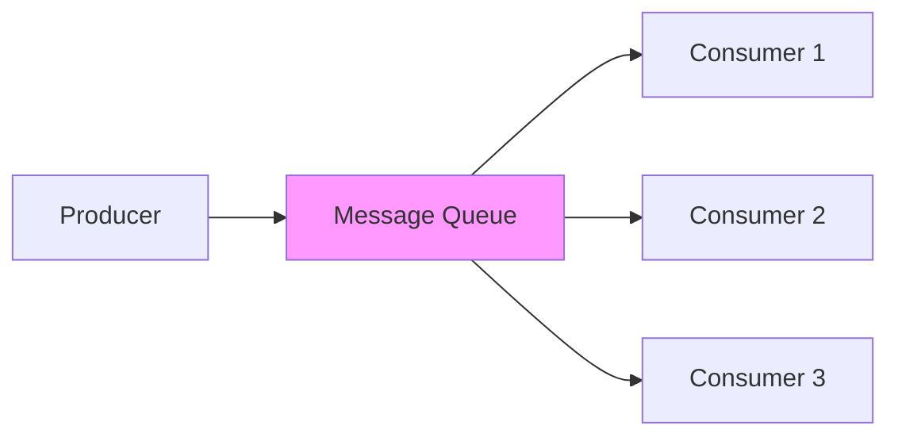

**Benefits**:
- Horizontal scalability
- Load distribution
- Fault tolerance (if one consumer fails, others continue)

**Implementation**:
- Queue ensures each message delivered to only one consumer
- Consumers acknowledge successful processing
- Unacknowledged messages returned to queue

### Event Sourcing

Instead of storing current state, store sequence of events that led to current state.

```python
# Traditional: Store current state
user = {
    "id": "123",
    "balance": 950.00
}

# Event Sourcing: Store events
events = [
    {"type": "AccountCreated", "id": "123", "initial_balance": 1000.00},
    {"type": "MoneyWithdrawn", "amount": 50.00, "timestamp": "..."}
]

# Rebuild state by replaying events
def get_current_state(events):
    state = {}
    for event in events:
        state = apply_event(state, event)
    return state
```

**Benefits**:
- Complete audit trail
- Can rebuild any past state
- Events as integration points
- Temporal queries (what was state at time T?)

**Challenges**:
- Storage requirements
- Complexity of rebuilding state
- Event schema evolution

### CQRS (Command Query Responsibility Segregation)

Separate models for reading (queries) and writing (commands).

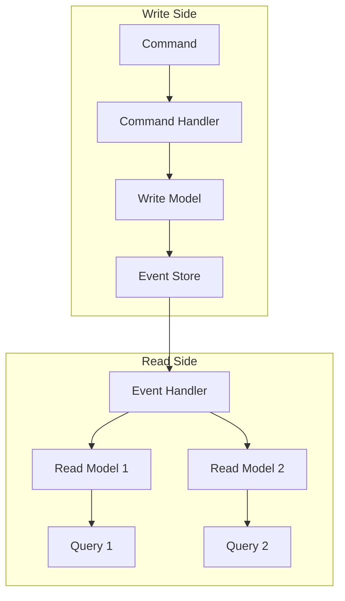

**Benefits**:
- Optimize read and write models separately
- Scale reads and writes independently
- Multiple read models for different query patterns
- Aligns with event sourcing

**Challenges**:
- Eventual consistency between read and write models
- Increased complexity
- More code to maintain

### Saga Pattern

Manage distributed transactions across services using a sequence of local transactions coordinated by events or orchestration.

**Choreography-based saga** (event-driven):

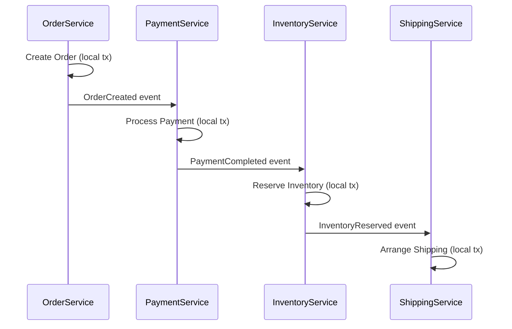

**Orchestration-based saga**:

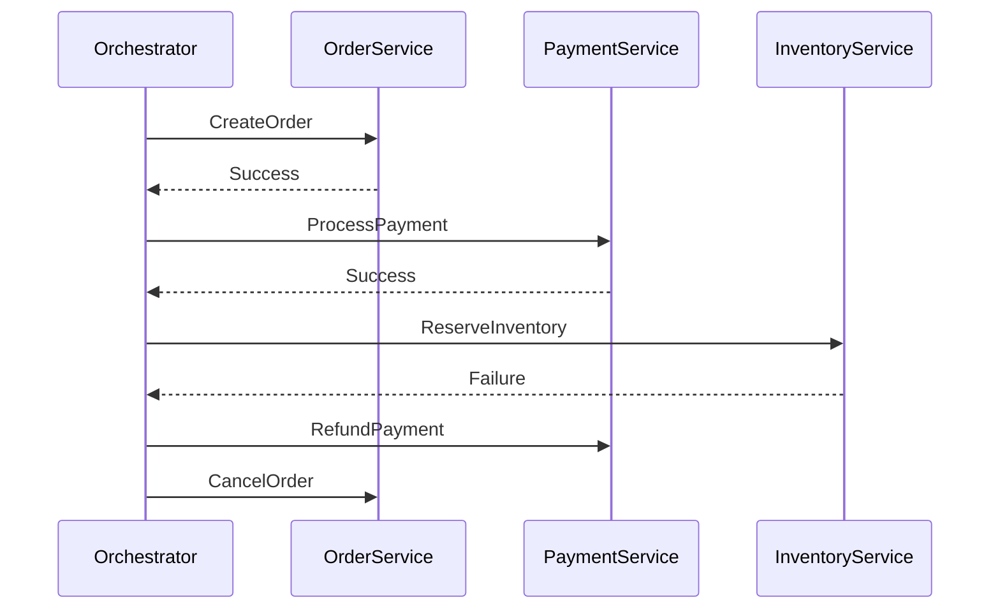

**Compensating transactions**: Each step has a compensating transaction to undo it if the saga fails.

## Choosing the Right Paradigm

Selecting the appropriate communication paradigm depends on your requirements:

### Use Message Passing When:
- Need low-level control
- Building communication primitives
- System is simple enough to manage explicit sends/receives

### Use Request-Reply When:
- Need immediate response
- Synchronous interactions make sense
- Client-server model fits your domain
- Example: User login, query for data

### Use RPC When:
- Want function call abstraction
- Performance is critical (binary protocols)
- Strong typing desired
- Internal service-to-service communication
- Example: Microservices calling each other

### Use Publish-Subscribe When:
- One event needs multiple consumers
- Decoupling publishers from subscribers
- Dynamic set of consumers
- Broadcast scenarios
- Example: Order created triggers inventory, analytics, email

### Use Asynchronous Messaging When:
- Decoupling in time is beneficial
- Systems need to scale independently
- Reliability through queuing
- Background processing
- Example: Email sending, report generation

### Combined Approach

Real systems often combine paradigms:

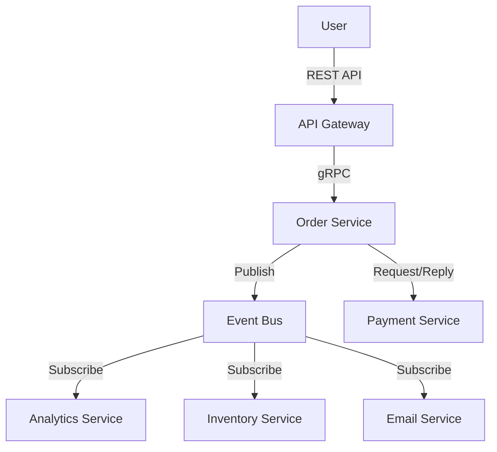

## Common Pitfalls

### Pitfall 1: Treating RPC Like Local Calls

**Problem**: Ignoring that remote calls have different failure modes and latency characteristics

**Solution**:
- Always use timeouts
- Implement retries with exponential backoff
- Handle partial failures explicitly
- Design for idempotency

### Pitfall 2: Message Queue as Database

**Problem**: Relying on message queue for long-term storage or as source of truth

**Solution**:
- Use databases for persistent storage
- Use queues for transient communication
- Implement proper persistence strategies

### Pitfall 3: Tight Coupling with Pub-Sub

**Problem**: Publishers and subscribers become tightly coupled through message structure

**Solution**:
- Use schema evolution strategies
- Version your messages
- Design for backward compatibility
- Document contracts

### Pitfall 4: Ignoring Message Ordering

**Problem**: Assuming messages arrive in order when they might not

**Solution**:
- Use sequence numbers
- Design for out-of-order processing
- Use single partition for ordered messages (Kafka)
- Implement causal ordering if needed

### Pitfall 5: Not Handling Duplicates

**Problem**: Processing duplicate messages causes incorrect behavior

**Solution**:
- Make operations idempotent
- Track processed message IDs
- Use exactly-once semantics when available
- Design for at-least-once delivery

## Summary

Communication paradigms are fundamental to distributed systems design. Each paradigm offers different tradeoffs between simplicity, performance, coupling, and reliability.

Key takeaways:

- **Message passing** is the foundation; all other paradigms build on it
- **Request-reply** models synchronous interactions with clear request/response semantics
- **RPC** provides function call abstraction but cannot hide the distributed nature completely
- **Publish-subscribe** enables loose coupling and one-to-many communication
- **Asynchronous messaging** supports scalability and fault tolerance through decoupling in time
- **Real systems** typically use multiple paradigms, choosing the right tool for each interaction

When choosing a communication paradigm:
1. Consider your consistency requirements
2. Evaluate coupling vs. performance tradeoffs
3. Think about failure handling
4. Consider scalability needs
5. Factor in development complexity

The landscape continues evolving with new patterns and technologies, but understanding these fundamental paradigms provides the foundation for building robust distributed systems regardless of the specific tools you use.
