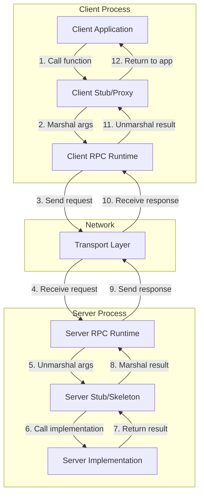
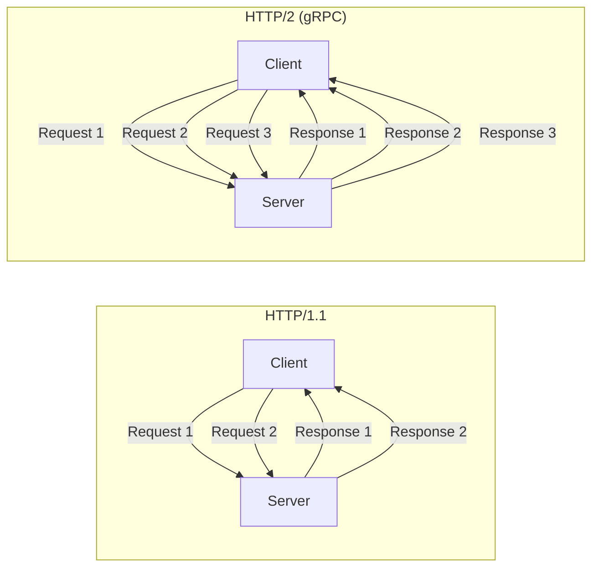
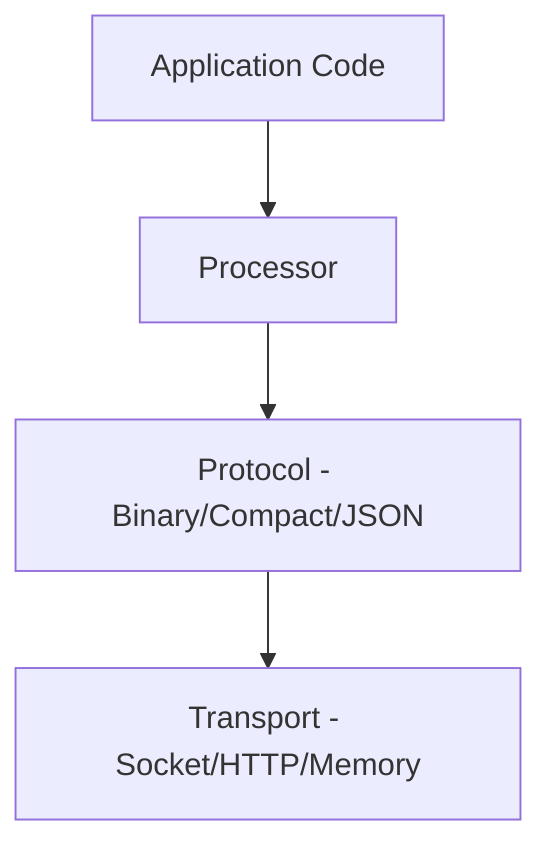
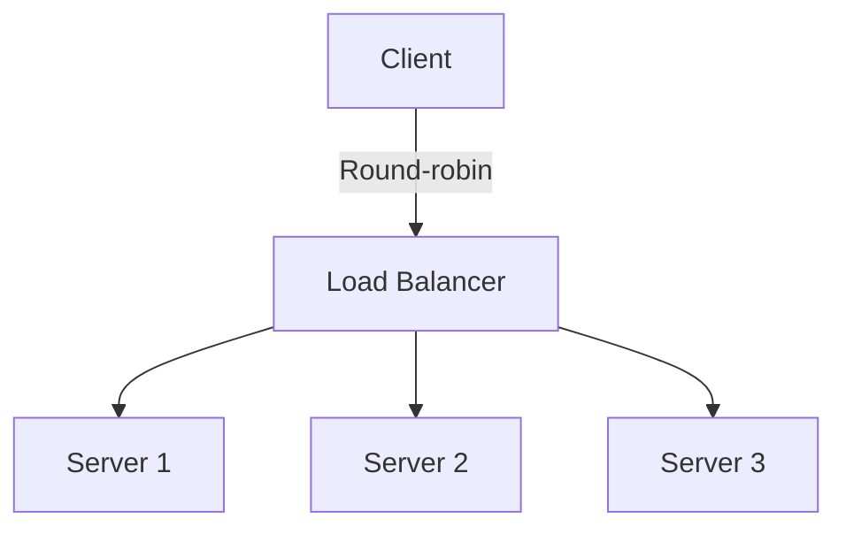

# Remote Procedure Calls (RPC)

## Introduction

Remote Procedure Call (RPC) is one of the most influential abstractions in distributed computing. The fundamental idea is deceptively simple: make calling a function on a remote computer look syntactically identical to calling a local function. This abstraction has shaped how distributed systems are built for over four decades, from early systems like Sun RPC and CORBA to modern frameworks like gRPC and Apache Thrift.

The appeal of RPC is immediate. Instead of wrestling with sockets, protocols, serialization, and error handling, developers can simply call `result = remote_service.calculate(x, y)` and have the complexity of distribution handled transparently. This abstraction has enabled countless distributed applications, from microservices architectures to distributed databases to cloud computing platforms.

However, the RPC abstraction is famously "leaky." As computer scientist Andrew Tanenbaum noted, remote calls differ fundamentally from local calls in ways that cannot be completely hidden. Network failures, latency, partial failures, and parameter passing semantics all leak through the abstraction. Understanding both the power and limitations of RPC is essential for building robust distributed systems.

This comprehensive exploration covers RPC from first principles through modern implementations. We'll examine how RPC works under the hood, the challenges of implementing it correctly, marshalling and unmarshalling data, interface definition languages, popular frameworks, and best practices for using RPC in production systems.

## RPC Fundamentals

### The RPC Abstraction

At its core, RPC aims to provide location transparency - the ability to call a function without caring whether it executes locally or remotely.

**Local function call**:
```python
def add(a, b):
    return a + b

result = add(5, 10)  # Executes locally
```

**Remote procedure call** (same syntax):
```python
# Client code - identical syntax
result = remote_calculator.add(5, 10)  # Executes on remote server
```

Behind this simple interface lies significant complexity:

1. **Parameter marshalling**: Converting function arguments into a byte stream
2. **Network transmission**: Sending the request over the network
3. **Server dispatch**: Routing the request to the correct function
4. **Execution**: Running the actual function on the server
5. **Response marshalling**: Converting the result into bytes
6. **Network transmission**: Sending the response back
7. **Response unmarshalling**: Converting bytes back into a language object
8. **Error handling**: Dealing with all the ways this can fail

### RPC Architecture Components

A complete RPC system consists of several components working together:



**Client Stub**: A proxy object that presents the same interface as the remote service but actually marshals calls and sends them over the network. Generated automatically from interface definitions.

**Server Stub (Skeleton)**: Receives incoming RPC requests, unmarshals them, calls the actual implementation, and marshals the response. Also generated automatically.

**RPC Runtime**: Handles the network communication, connection management, error handling, and low-level protocol details. This is the framework code (like gRPC or Thrift runtime).

**Interface Definition**: A language-neutral specification of the service's functions, parameters, and return types. Used to generate client and server stubs.

## Marshalling and Unmarshalling

Marshalling (also called serialization) is the process of converting in-memory data structures into a format suitable for storage or transmission. Unmarshalling (deserialization) is the reverse process.

### Why Marshalling is Necessary

Different programming languages represent data differently in memory:
- Different byte orderings (endianness)
- Different memory layouts for structs
- Different string encodings
- Different representations of numbers, booleans, etc.

To communicate between different languages or even different instances of the same program, we need a common wire format.

### Marshalling Challenges

**Heterogeneity**: The client and server might use different:
- Programming languages (Java client, Go server)
- Operating systems (Linux, Windows)
- CPU architectures (x86, ARM)
- Compiler versions or language runtime versions

**Complex data types**: How to represent:
- Nested objects
- Circular references
- Polymorphic types
- Large data structures

**Efficiency**: Marshalling overhead can dominate RPC performance for small functions. We want:
- Compact representation (less network bandwidth)
- Fast encoding/decoding
- Streaming support for large data

**Evolution**: Interfaces change over time. Marshalling must support:
- Adding new fields without breaking old clients
- Removing fields gracefully
- Changing field types safely

### Marshalling Strategies

**Text-Based (Human-Readable)**:

JSON example:
```json
{
  "method": "calculate",
  "params": {
    "operation": "add",
    "operands": [5, 10]
  },
  "id": 1
}
```

Advantages:
- Human-readable for debugging
- Easy to work with in many languages
- Self-describing (field names included)

Disadvantages:
- Larger size (field names, formatting)
- Slower to parse
- Less type safety

**Binary (Efficient)**:

Protocol Buffers example (pseudo-code):
```
Field 1 (varint): 5
Field 2 (varint): 10
```

Advantages:
- Compact representation
- Fast to encode/decode
- Strong typing
- Efficient for large datasets

Disadvantages:
- Not human-readable
- Requires schema definition
- More complex implementation

### Popular Marshalling Formats

**Protocol Buffers (protobuf)**:
- Developed by Google
- Binary format with schema definition
- Excellent performance
- Strong typing with code generation
- Good backward compatibility
- Used by gRPC

```protobuf
message CalculateRequest {
  int32 a = 1;
  int32 b = 2;
}

message CalculateResponse {
  int32 result = 1;
}
```

**Apache Thrift**:
- Developed by Facebook
- Multiple serialization formats (binary, compact, JSON)
- Cross-language RPC framework
- Similar to Protocol Buffers but includes RPC layer

**MessagePack**:
- Binary JSON-like format
- More compact than JSON
- Fast serialization
- Dynamic typing
- No schema required

**Apache Avro**:
- Schema-based binary format
- Excellent schema evolution support
- Compact encoding
- Popular in big data systems (Hadoop, Kafka)

### Marshalling Implementation Example

Here's a simplified example of how marshalling works:

```python
import struct
import json

# Simple text marshalling with JSON
def marshal_json(method, args):
    request = {
        "method": method,
        "args": args
    }
    return json.dumps(request).encode('utf-8')

def unmarshal_json(data):
    request = json.loads(data.decode('utf-8'))
    return request["method"], request["args"]

# Binary marshalling with struct
def marshal_binary(method_id, arg1, arg2):
    # Pack method_id as 1 byte, arg1 and arg2 as 4-byte integers
    return struct.pack('!Bii', method_id, arg1, arg2)

def unmarshal_binary(data):
    # Unpack in same format
    method_id, arg1, arg2 = struct.unpack('!Bii', data)
    return method_id, arg1, arg2

# Usage
# JSON: ~50 bytes
json_data = marshal_json("add", [5, 10])
print(f"JSON size: {len(json_data)} bytes")

# Binary: 9 bytes
binary_data = marshal_binary(1, 5, 10)
print(f"Binary size: {len(binary_data)} bytes")
```

Output:
```
JSON size: 34 bytes
Binary size: 9 bytes
```

### Schema Evolution

A critical challenge in RPC systems is evolving interfaces over time without breaking existing clients or servers.

**Backward compatibility**: New servers must work with old clients
**Forward compatibility**: Old servers must work with new clients (when possible)

**Strategies for evolution**:

1. **Optional fields**: New fields are optional, old code ignores them
2. **Field numbers**: Use stable identifiers (not field names) for fields
3. **Deprecation**: Mark old fields as deprecated, remove later
4. **Versioning**: Multiple versions of services running simultaneously

Protocol Buffers evolution example:

```protobuf
// Version 1
message User {
  string name = 1;
  string email = 2;
}

// Version 2 - add optional field
message User {
  string name = 1;
  string email = 2;
  string phone = 3;  // New field, old clients ignore it
}

// Version 3 - add enum with default
enum UserType {
  REGULAR = 0;  // Default value
  PREMIUM = 1;
}

message User {
  string name = 1;
  string email = 2;
  string phone = 3;
  UserType type = 4;  // Old clients get default value
}
```

## Interface Definition Languages (IDL)

Interface Definition Languages provide a language-neutral way to define service interfaces. The IDL definition is used to generate client and server code in various programming languages.

### Purpose of IDL

**Language independence**: Define interface once, use from many languages

**Contract**: Clear specification of service capabilities

**Code generation**: Automatically generate stubs, skeletons, and marshalling code

**Type safety**: Strong typing catches errors at compile time

**Documentation**: IDL serves as documentation of the API

### Protocol Buffers IDL

```protobuf
syntax = "proto3";

package calculator;

// Service definition
service Calculator {
  // Unary RPC: client sends one request, server sends one response
  rpc Add(AddRequest) returns (AddResponse);

  // Server streaming: client sends one request, server sends stream of responses
  rpc GenerateFibonacci(FibRequest) returns (stream FibResponse);

  // Client streaming: client sends stream of requests, server sends one response
  rpc Sum(stream Number) returns (SumResponse);

  // Bidirectional streaming: both client and server send streams
  rpc Calculate(stream CalcRequest) returns (stream CalcResponse);
}

// Message definitions
message AddRequest {
  int32 a = 1;
  int32 b = 2;
}

message AddResponse {
  int32 result = 1;
}

message FibRequest {
  int32 count = 1;
}

message FibResponse {
  int32 value = 1;
}

message Number {
  int32 value = 1;
}

message SumResponse {
  int32 total = 1;
}

message CalcRequest {
  enum Operation {
    ADD = 0;
    SUBTRACT = 1;
    MULTIPLY = 2;
    DIVIDE = 3;
  }

  Operation op = 1;
  int32 value = 2;
}

message CalcResponse {
  int32 result = 1;
}
```

### Apache Thrift IDL

```thrift
namespace java com.example.calculator
namespace py calculator

// Type definitions
struct AddRequest {
  1: i32 a,
  2: i32 b
}

struct AddResponse {
  1: i32 result
}

// Exception definition
exception InvalidOperation {
  1: i32 errorCode,
  2: string message
}

// Service definition
service Calculator {
  AddResponse add(1: AddRequest request) throws (1: InvalidOperation e),

  i32 subtract(1: i32 a, 2: i32 b),

  // Oneway functions don't wait for response
  oneway void logOperation(1: string operation)
}
```

### gRPC Code Generation

From the Protocol Buffers definition, gRPC generates:

**Client code** (Python example):
```python
# Generated code
import grpc
import calculator_pb2
import calculator_pb2_grpc

# Use generated stub
channel = grpc.insecure_channel('localhost:50051')
stub = calculator_pb2_grpc.CalculatorStub(channel)

# Make RPC call
request = calculator_pb2.AddRequest(a=5, b=10)
response = stub.Add(request)
print(f"Result: {response.result}")
```

**Server code** (Python example):
```python
# Generated code
import grpc
from concurrent import futures
import calculator_pb2
import calculator_pb2_grpc

# Implement the service
class CalculatorServicer(calculator_pb2_grpc.CalculatorServicer):
    def Add(self, request, context):
        result = request.a + request.b
        return calculator_pb2.AddResponse(result=result)

# Start server
server = grpc.server(futures.ThreadPoolExecutor(max_workers=10))
calculator_pb2_grpc.add_CalculatorServicer_to_server(
    CalculatorServicer(), server)
server.add_insecure_port('[::]:50051')
server.start()
server.wait_for_termination()
```

## Modern RPC Frameworks

### gRPC

gRPC is Google's modern, high-performance RPC framework built on HTTP/2 and Protocol Buffers.

**Key features**:

1. **HTTP/2 transport**: Multiplexing, flow control, header compression
2. **Protocol Buffers**: Efficient binary serialization
3. **Streaming**: Client, server, and bidirectional streaming
4. **Multiple languages**: Official support for 10+ languages
5. **Pluggable**: Authentication, load balancing, retries
6. **Deadlines/timeouts**: First-class support for timeouts

**HTTP/2 advantages**:



- Multiple requests/responses simultaneously on one connection
- Binary framing for efficiency
- Server push capability
- Header compression

**Streaming example**:

```python
# Server-side streaming
def GenerateFibonacci(self, request, context):
    a, b = 0, 1
    for _ in range(request.count):
        yield calculator_pb2.FibResponse(value=a)
        a, b = b, a + b

# Client code
responses = stub.GenerateFibonacci(
    calculator_pb2.FibRequest(count=10))
for response in responses:
    print(response.value)
```

**Metadata and context**:

```python
# Client sending metadata
metadata = [('authorization', 'Bearer token123')]
response = stub.Add(request, metadata=metadata)

# Server reading metadata
def Add(self, request, context):
    metadata = dict(context.invocation_metadata())
    auth_token = metadata.get('authorization')
    # Validate token...
    return response
```

**Deadlines**:

```python
# Client sets deadline (5 seconds from now)
response = stub.Add(request, timeout=5)

# Server checks if deadline exceeded
def Add(self, request, context):
    if context.time_remaining() < 1:
        context.abort(grpc.StatusCode.DEADLINE_EXCEEDED,
                     'Operation too slow')
    # Perform calculation...
```

### Apache Thrift

Apache Thrift is Facebook's cross-language RPC framework with multiple transport and protocol options.

**Layered architecture**:



**Multiple protocols**:
- **Binary Protocol**: Straightforward binary encoding
- **Compact Protocol**: More efficient binary encoding
- **JSON Protocol**: Human-readable for debugging
- **SimpleJSON Protocol**: Write-only JSON (for logging)

**Multiple transports**:
- **TSocket**: Blocking socket I/O
- **TFramedTransport**: Non-blocking with length prefix
- **THttpTransport**: HTTP transport
- **TMemoryTransport**: In-memory for testing

**Example**:

```java
// Java server
TServerTransport serverTransport = new TServerSocket(9090);
CalculatorHandler handler = new CalculatorHandler();
Calculator.Processor processor = new Calculator.Processor(handler);

// Choose protocol and transport
TServer server = new TThreadPoolServer(
    new TThreadPoolServer.Args(serverTransport)
        .processor(processor)
        .protocolFactory(new TBinaryProtocol.Factory())
);

server.serve();
```

### REST vs gRPC Comparison

| Aspect | REST | gRPC |
|--------|------|------|
| **Protocol** | HTTP/1.1 | HTTP/2 |
| **Payload** | JSON (usually) | Protocol Buffers |
| **Schema** | Optional (OpenAPI) | Required (proto files) |
| **Streaming** | Limited (SSE, WebSocket) | Native bidirectional |
| **Performance** | Slower, larger payloads | Faster, smaller payloads |
| **Browser support** | Native | Requires gRPC-Web |
| **Human-readable** | Yes (JSON) | No (binary) |
| **Code generation** | Optional | Required |
| **Caching** | HTTP caching | Custom implementation |
| **Load balancing** | Simple (L7) | Complex (needs aware LB) |

**When to use REST**:
- Public APIs consumed by diverse clients
- Browser-based applications
- Simple request-response patterns
- Human readability important
- Existing HTTP infrastructure

**When to use gRPC**:
- Internal microservices
- High performance requirements
- Streaming needed
- Strong typing desired
- Polyglot environments

## Implementation Details

### Connection Management

RPC frameworks must manage connections efficiently:

**Connection pooling**:
```python
# Connection pool configuration
channel = grpc.insecure_channel(
    'localhost:50051',
    options=[
        ('grpc.max_concurrent_streams', 100),
        ('grpc.keepalive_time_ms', 10000),
        ('grpc.keepalive_timeout_ms', 5000),
    ]
)
```

**Keep-alive**: Periodic pings to detect connection failures

**Reconnection**: Automatic reconnection with exponential backoff

**Load balancing**: Distribute requests across multiple servers



### Error Handling

RPC frameworks define standard error codes:

**gRPC status codes**:
```python
grpc.StatusCode.OK                # Success
grpc.StatusCode.CANCELLED         # Operation cancelled
grpc.StatusCode.INVALID_ARGUMENT  # Invalid arguments
grpc.StatusCode.DEADLINE_EXCEEDED # Operation timeout
grpc.StatusCode.NOT_FOUND         # Resource not found
grpc.StatusCode.ALREADY_EXISTS    # Resource exists
grpc.StatusCode.PERMISSION_DENIED # No permission
grpc.StatusCode.UNAUTHENTICATED   # Not authenticated
grpc.StatusCode.RESOURCE_EXHAUSTED# Rate limit exceeded
grpc.StatusCode.UNAVAILABLE       # Service unavailable
grpc.StatusCode.INTERNAL          # Internal error
```

**Error handling patterns**:

```python
# Server-side
def Add(self, request, context):
    try:
        result = request.a + request.b
        return AddResponse(result=result)
    except ValueError as e:
        context.set_code(grpc.StatusCode.INVALID_ARGUMENT)
        context.set_details(str(e))
        return AddResponse()

# Client-side
try:
    response = stub.Add(request)
except grpc.RpcError as e:
    if e.code() == grpc.StatusCode.DEADLINE_EXCEEDED:
        print("Request timed out")
    elif e.code() == grpc.StatusCode.UNAVAILABLE:
        print("Service unavailable, retrying...")
    else:
        print(f"RPC failed: {e.details()}")
```

### Retry Logic

Implementing intelligent retries:

```python
import time

def rpc_with_retry(stub_method, request, max_retries=3):
    for attempt in range(max_retries):
        try:
            return stub_method(request)
        except grpc.RpcError as e:
            if e.code() == grpc.StatusCode.UNAVAILABLE:
                if attempt < max_retries - 1:
                    # Exponential backoff
                    sleep_time = (2 ** attempt) * 0.1
                    time.sleep(sleep_time)
                    continue
            raise
    raise Exception("Max retries exceeded")
```

**Idempotency**: Retries only safe for idempotent operations

```python
# Non-idempotent - DO NOT RETRY
def DebitAccount(amount):
    account.balance -= amount  # Retrying debits twice!

# Idempotent - SAFE TO RETRY
def SetAccountBalance(new_balance):
    account.balance = new_balance  # Same result if called multiple times

# Idempotent with idempotency key
def DebitAccount(amount, idempotency_key):
    if idempotency_key in processed_requests:
        return processed_requests[idempotency_key]

    result = account.balance -= amount
    processed_requests[idempotency_key] = result
    return result
```

## Real-World Applications

### Google's Production RPC

Google uses gRPC (and its predecessor, Stubby) for inter-service communication:

- **Scale**: Billions of RPCs per second
- **Services**: Hundreds of thousands of services
- **Languages**: C++, Java, Go, Python, and more
- **Features**: Automatic retries, load balancing, deadline propagation

### Netflix's RPC Evolution

Netflix evolved from REST to gRPC for internal services:

**Benefits observed**:
- 5-10x reduction in payload size
- 2-3x improvement in latency
- Better streaming support for real-time features
- Stronger contracts with Protocol Buffers

### Uber's Microservices

Uber uses gRPC for their microservices architecture:

- **TChannel**: Custom RPC framework (now migrating to gRPC)
- **Thousands of services**: Different languages
- **Request routing**: Intelligent load balancing
- **Observability**: Distributed tracing for RPC calls

## Common Pitfalls

### Pitfall 1: Ignoring Network Realities

**Problem**: Treating remote calls as if they were local

```python
# DANGEROUS - what if this takes 30 seconds?
for user_id in user_ids:  # 10,000 users
    user = user_service.get_user(user_id)  # 10ms each = 100 seconds!
    process(user)
```

**Solution**: Batch requests, use streaming, set timeouts

```python
# BETTER - batch request
users = user_service.get_users_batch(user_ids)  # Single RPC
for user in users:
    process(user)
```

### Pitfall 2: Not Handling Partial Failures

**Problem**: Assuming all-or-nothing execution

**Solution**: Design for idempotency, use transactions where needed

```python
def transfer_money(from_account, to_account, amount):
    # Step 1: Debit from_account - SUCCEEDS
    debit(from_account, amount)

    # Step 2: Credit to_account - NETWORK FAILURE
    # Money is lost!
    credit(to_account, amount)
```

**Better approach**: Use two-phase commit or saga pattern

### Pitfall 3: Not Versioning Interfaces

**Problem**: Breaking changes break all clients

**Solution**: Version your APIs, support multiple versions

```protobuf
// Don't remove or change field numbers!
message User {
  string name = 1;
  // string email = 2;  // DON'T DELETE - breaks old clients!
  reserved 2;  // Mark as reserved instead
  string contact = 3;  // New field
}
```

### Pitfall 4: Synchronous RPC Everywhere

**Problem**: Blocking calls limit scalability

**Solution**: Use async RPC, message queues for fire-and-forget

```python
# Synchronous - blocks
response = email_service.send_email(user, subject, body)  # Wait 2s

# Asynchronous - returns immediately
future = email_service.send_email_async(user, subject, body)
# Do other work...
response = future.result()  # Wait only when needed
```

### Pitfall 5: No Observability

**Problem**: Can't debug distributed systems without visibility

**Solution**: Add logging, metrics, distributed tracing

```python
import time
import logging

def Add(self, request, context):
    start = time.time()
    try:
        result = request.a + request.b
        response = AddResponse(result=result)

        # Metrics
        duration = time.time() - start
        metrics.record('rpc.duration', duration, tags=['method:Add'])

        return response
    except Exception as e:
        logging.error(f"RPC failed: {e}")
        metrics.increment('rpc.errors', tags=['method:Add'])
        raise
```

## Summary

Remote Procedure Calls provide a powerful abstraction for distributed computing, allowing developers to call remote functions with the same syntax as local functions. However, this abstraction cannot completely hide the distributed nature of the system.

Key takeaways:

- **RPC architecture** consists of client stubs, server stubs, marshalling/unmarshalling, and RPC runtime
- **Marshalling** converts in-memory data to wire format; binary formats like Protocol Buffers are more efficient than text formats like JSON
- **IDLs** provide language-neutral interface definitions and enable code generation
- **gRPC** is a modern, high-performance RPC framework built on HTTP/2 and Protocol Buffers
- **Challenges** include handling network failures, partial failures, latency, and versioning
- **Best practices**: Use timeouts, implement retries carefully, design for idempotency, version interfaces, add observability

When using RPC in production:
1. Always set timeouts and handle failures
2. Design for idempotency to enable safe retries
3. Use appropriate marshalling format (binary for performance, JSON for debugging)
4. Version your interfaces carefully
5. Add comprehensive observability (logging, metrics, tracing)
6. Consider async RPC for non-critical paths
7. Batch requests when calling in loops
8. Test failure scenarios extensively

RPC remains a cornerstone of distributed systems, enabling the microservices revolution and powering some of the world's largest applications. Understanding its mechanics, limitations, and best practices is essential for any distributed systems engineer.
