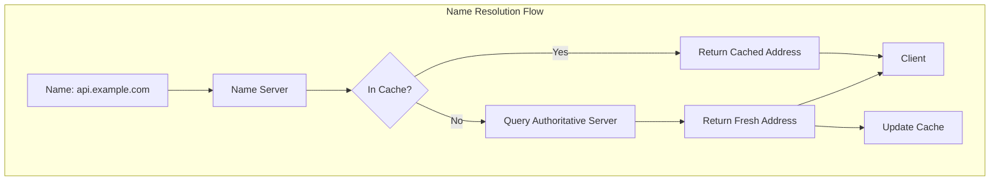
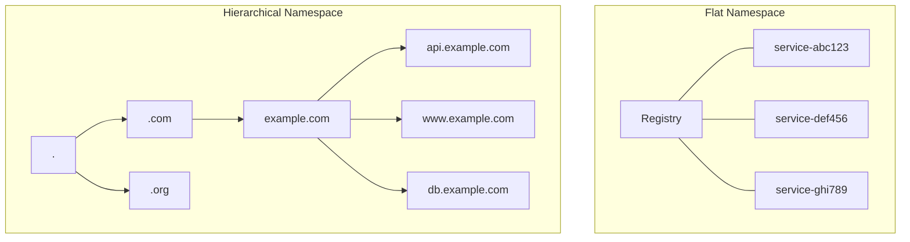
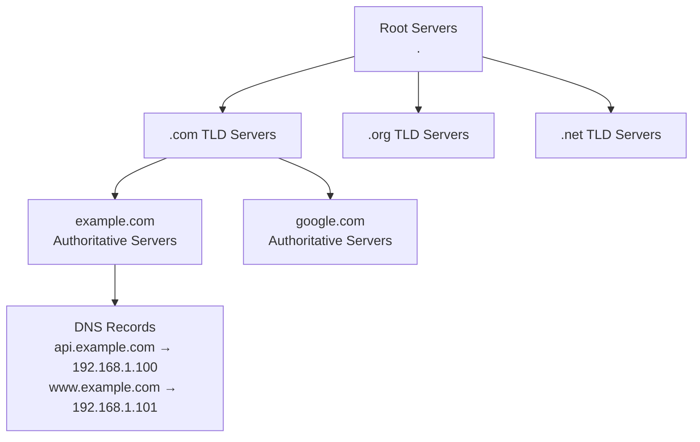
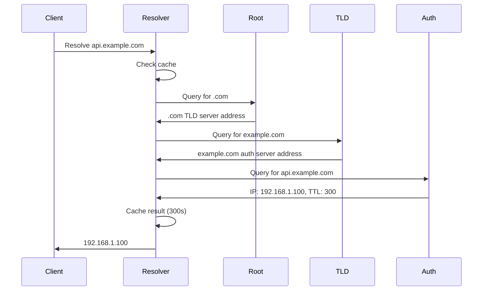
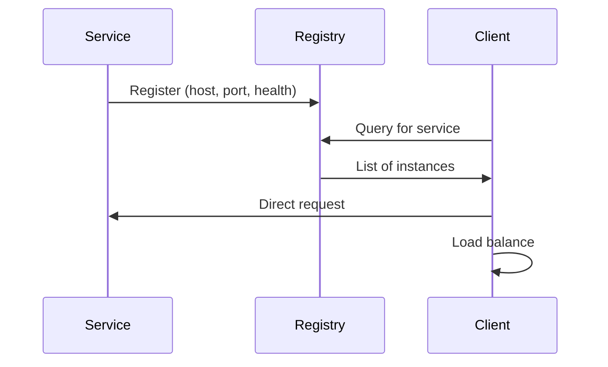
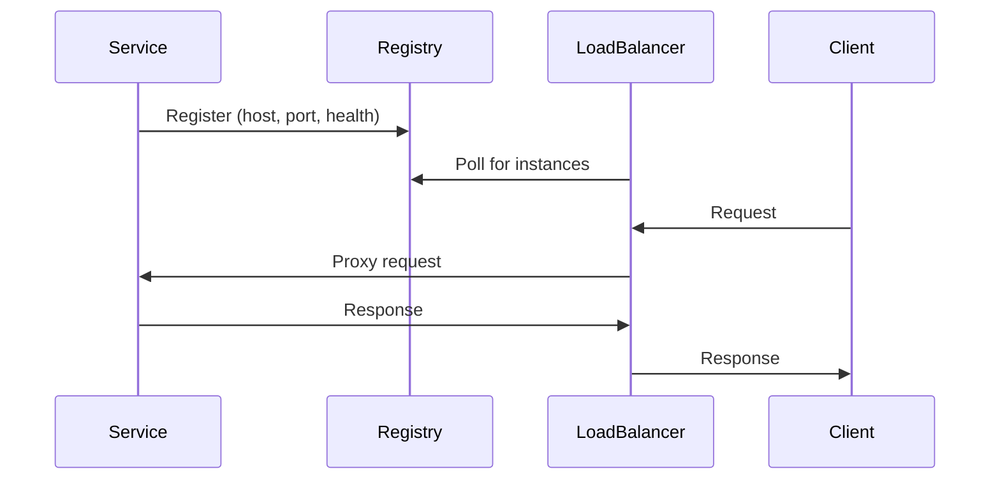
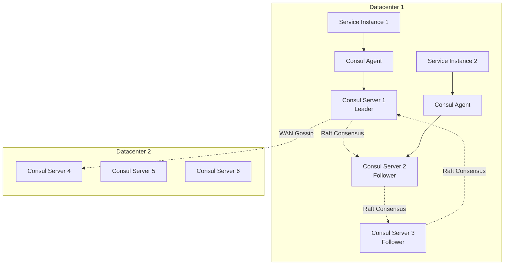
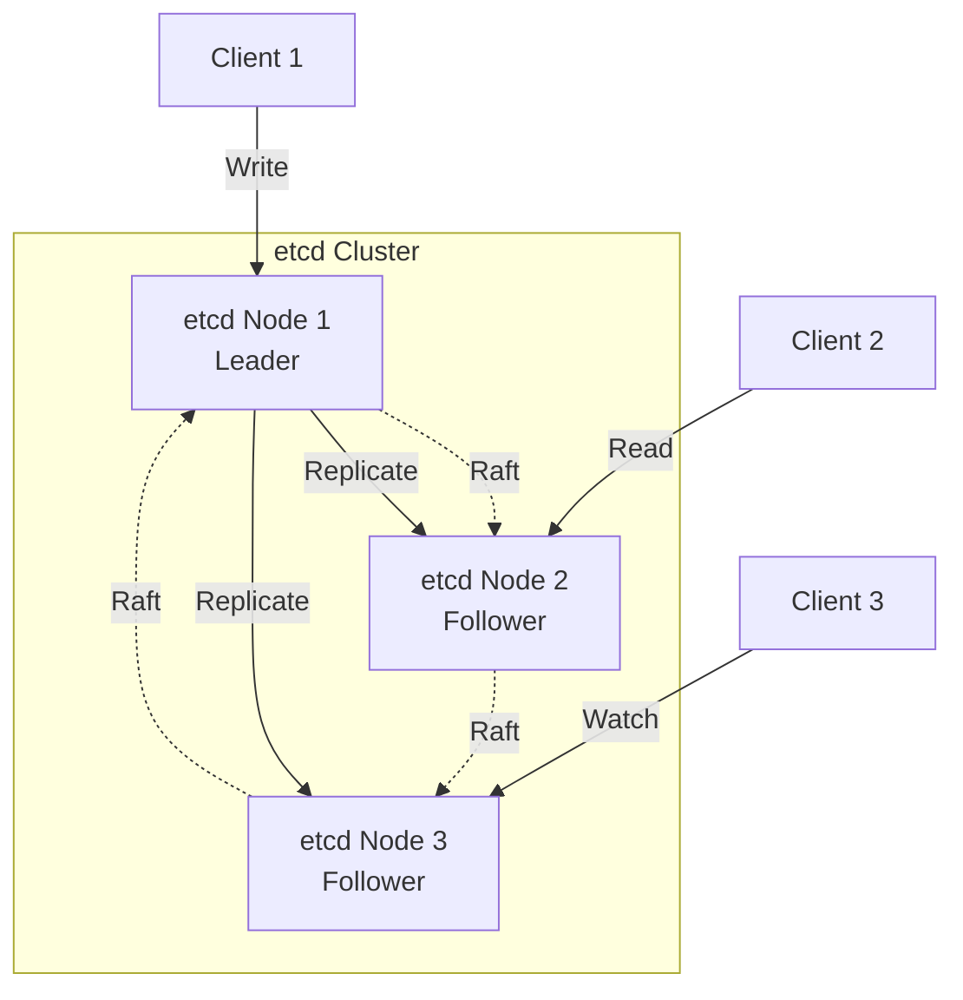

# Naming and Service Discovery

## Introduction

In a distributed system with thousands of services running across hundreds or thousands of machines, how does one service find another? How does a client know which server to connect to when servers are constantly starting, stopping, moving, and failing? This is the fundamental problem that naming and service discovery solve.

Naming systems provide a mapping from human-readable names to network addresses, allowing services to find each other without hardcoding IP addresses. Service discovery extends this concept by providing dynamic registration and discovery of services, health checking, and metadata about services.

The importance of naming and service discovery has grown with the rise of cloud computing and microservices architectures. In traditional data centers with static infrastructure, it was feasible to maintain configuration files with hardcoded addresses. In modern cloud environments with auto-scaling, containers, and ephemeral instances, addresses change constantly. A robust service discovery system is essential for maintaining reliable communication.

This exploration covers naming systems from first principles through modern service discovery platforms. We'll examine DNS, the internet's global naming system; distributed key-value stores like etcd and Consul; and coordination services like ZooKeeper. We'll explore the algorithms they use, their consistency guarantees, and practical patterns for using them in production.

## Naming Fundamentals

### What is a Name?

A name is a reference to an entity that allows us to locate or identify it. In distributed systems, we typically deal with several types of names:

**Human-readable names**: Easy for humans to remember and use
- `api.example.com`
- `user-service`
- `/databases/production/mysql`

**Addresses**: Machine-readable locations for entities
- IP addresses: `192.168.1.100`
- URLs: `http://api.example.com:8080/v1/users`
- Coordinates: `datacenter-1:rack-5:server-23`

**Identifiers**: Unique references that don't necessarily indicate location
- UUIDs: `550e8400-e29b-41d4-a716-446655440000`
- Service IDs: `user-service-a3f9c2b1`

### Properties of Naming Systems

**Uniqueness**: Each name should refer to at most one entity (within a namespace)

**Resolution**: Ability to map names to addresses efficiently

**Scalability**: Support large numbers of names and lookups

**Availability**: Continue operating despite failures

**Consistency**: Provide consistent views of name-to-address mappings

**Dynamics**: Handle entities joining, leaving, and moving



### Flat vs Hierarchical Naming

**Flat naming**: Names have no structure, all names are equal
- Example: UUIDs, content hashes
- Simple but requires centralized registry or broadcast discovery
- Used for unique identifiers

**Hierarchical naming**: Names are structured in a tree
- Example: DNS (`api.example.com`), file paths (`/var/log/app.log`)
- Enables delegation and distributed management
- Scales to very large namespaces



## DNS: The Internet's Naming System

DNS (Domain Name System) is one of the most successful distributed systems ever built, performing billions of name resolutions daily with remarkable reliability and scalability.

### DNS Architecture

DNS is a hierarchical, distributed database that maps domain names to IP addresses and other information.

**DNS Hierarchy**:



**DNS Components**:

1. **Root servers**: 13 logical root servers (actually hundreds of physical servers) that know about TLD servers
2. **TLD servers**: Top-level domain servers (`.com`, `.org`, etc.) that know about authoritative servers
3. **Authoritative servers**: Servers that hold the actual records for a domain
4. **Resolvers**: Client-side components that perform lookups
5. **Caches**: Intermediate caches to reduce load and latency

### DNS Resolution Process

When you type `api.example.com` into your browser:



This iterative process is called **recursive resolution**. The resolver handles the complexity, querying multiple servers until it finds the answer.

### DNS Record Types

**A Record**: Maps hostname to IPv4 address
```
api.example.com.    300    IN    A    192.168.1.100
```

**AAAA Record**: Maps hostname to IPv6 address
```
api.example.com.    300    IN    AAAA    2001:db8::1
```

**CNAME Record**: Canonical name (alias)
```
www.example.com.    300    IN    CNAME    example.com.
```

**MX Record**: Mail exchange (email servers)
```
example.com.    300    IN    MX    10 mail.example.com.
```

**SRV Record**: Service location (service discovery)
```
_http._tcp.example.com.    300    IN    SRV    0 5 80 api.example.com.
```

**TXT Record**: Arbitrary text (often used for verification, configuration)
```
example.com.    300    IN    TXT    "v=spf1 include:_spf.example.com ~all"
```

### DNS Caching and TTL

DNS uses Time-To-Live (TTL) values to control caching:

```python
# DNS record with TTL
record = {
    "name": "api.example.com",
    "type": "A",
    "value": "192.168.1.100",
    "ttl": 300  # Cache for 5 minutes
}
```

**Tradeoffs**:
- **High TTL** (e.g., 24 hours): Less load on DNS servers, slower updates
- **Low TTL** (e.g., 60 seconds): More responsive to changes, higher DNS load

**Caching levels**:
1. Browser cache
2. Operating system cache
3. Local resolver cache
4. ISP recursive resolver cache
5. Intermediate caches

### DNS for Service Discovery

DNS can be used for basic service discovery using SRV records:

```
# Service: _http._tcp.example.com
# Priority: 10, Weight: 60, Port: 8080, Target: server1.example.com
_http._tcp.example.com.    300    IN    SRV    10 60 8080 server1.example.com.
_http._tcp.example.com.    300    IN    SRV    10 40 8080 server2.example.com.
```

**Limitations of DNS for service discovery**:
- High TTL makes updates slow
- No health checking
- Limited metadata support
- Eventual consistency issues
- Caching makes rapid updates difficult

## Service Discovery

Service discovery automates the detection of services on a network, providing dynamic registration, lookup, and health checking.

### Service Discovery Requirements

**Service registration**: Services register themselves on startup

**Service lookup**: Clients discover available service instances

**Health checking**: Detect and remove unhealthy instances

**Load balancing**: Distribute requests across instances

**Metadata**: Store additional information about services

**Versioning**: Support multiple versions simultaneously

**Dynamic updates**: Respond quickly to topology changes

### Service Discovery Patterns

**Client-Side Discovery**:



Advantages:
- Client has full control over load balancing
- No proxy overhead
- Client can cache results

Disadvantages:
- Client must implement discovery logic
- Multiple language implementations needed
- More complex client

**Server-Side Discovery**:



Advantages:
- Simpler clients (just know load balancer)
- Centralized load balancing logic
- Language-agnostic

Disadvantages:
- Additional network hop
- Load balancer becomes critical dependency
- Potential bottleneck

### Health Checking

Health checking ensures only healthy instances receive traffic:

**Active health checks**: Registry actively probes instances
```python
def health_check(instance):
    try:
        response = http_get(f"http://{instance.host}:{instance.port}/health",
                           timeout=2)
        return response.status == 200
    except:
        return False

# Check every 10 seconds
schedule.every(10).seconds.do(health_check, instance)
```

**Passive health checks**: Monitor actual requests for failures
```python
def handle_request(instance):
    try:
        response = make_request(instance)
        instance.consecutive_failures = 0
        return response
    except:
        instance.consecutive_failures += 1
        if instance.consecutive_failures >= 3:
            mark_unhealthy(instance)
```

**Heartbeats**: Service sends periodic "I'm alive" messages
```python
# Service sends heartbeat every 5 seconds
def send_heartbeat():
    registry.heartbeat(service_id, timestamp=time.time())

schedule.every(5).seconds.do(send_heartbeat)

# Registry marks missing heartbeats as unhealthy
def check_heartbeats():
    for service in registered_services:
        if time.time() - service.last_heartbeat > 15:  # 3 missed heartbeats
            mark_unhealthy(service)
```

## Consul

Consul is HashiCorp's service discovery and configuration platform with built-in health checking, key-value store, and multi-datacenter support.

### Consul Architecture



**Components**:

1. **Consul Servers**: Store data, participate in consensus (Raft)
2. **Consul Agents**: Run on every node, perform health checks
3. **Gossip Protocol**: Manage cluster membership (Serf)
4. **Raft Consensus**: Ensure consistency across servers

### Service Registration

```json
{
  "service": {
    "name": "api-service",
    "id": "api-service-1",
    "port": 8080,
    "tags": ["production", "v1.2.3"],
    "meta": {
      "version": "1.2.3",
      "region": "us-east-1"
    },
    "check": {
      "http": "http://localhost:8080/health",
      "interval": "10s",
      "timeout": "2s"
    }
  }
}
```

Register via API:
```python
import consul

c = consul.Consul()

# Register service
c.agent.service.register(
    name='api-service',
    service_id='api-service-1',
    port=8080,
    tags=['production', 'v1.2.3'],
    check=consul.Check.http('http://localhost:8080/health', interval='10s')
)

# Deregister on shutdown
c.agent.service.deregister('api-service-1')
```

### Service Discovery

```python
# Query for healthy instances
def discover_service(service_name):
    c = consul.Consul()
    _, services = c.health.service(service_name, passing=True)

    instances = []
    for service in services:
        instances.append({
            'host': service['Service']['Address'],
            'port': service['Service']['Port'],
            'tags': service['Service']['Tags']
        })

    return instances

# Use discovered service
instances = discover_service('api-service')
if instances:
    # Simple load balancing: pick random
    instance = random.choice(instances)
    url = f"http://{instance['host']}:{instance['port']}/api/users"
    response = requests.get(url)
```

### DNS Interface

Consul provides DNS interface for service discovery:

```bash
# Query service via DNS
$ dig @localhost -p 8600 api-service.service.consul

;; ANSWER SECTION:
api-service.service.consul. 0 IN A 192.168.1.100
api-service.service.consul. 0 IN A 192.168.1.101

# SRV records include port information
$ dig @localhost -p 8600 api-service.service.consul SRV

;; ANSWER SECTION:
api-service.service.consul. 0 IN SRV 1 1 8080 instance-1.node.dc1.consul.
api-service.service.consul. 0 IN SRV 1 1 8080 instance-2.node.dc1.consul.
```

### Key-Value Store

Consul includes a distributed key-value store for configuration:

```python
# Write configuration
c.kv.put('config/database/host', 'db.example.com')
c.kv.put('config/database/port', '5432')

# Read configuration
_, data = c.kv.get('config/database/host')
db_host = data['Value'].decode('utf-8')

# Watch for changes
index = None
while True:
    index, data = c.kv.get('config/database/host', index=index)
    if data:
        new_host = data['Value'].decode('utf-8')
        print(f"Database host changed to: {new_host}")
        reconfigure_database(new_host)
```

## etcd

etcd is a distributed key-value store designed for shared configuration and service discovery, using the Raft consensus algorithm.

### etcd Architecture



**Key Features**:
- Raft consensus for strong consistency
- Watch mechanism for change notifications
- Lease-based TTLs for ephemeral keys
- Multi-version concurrency control (MVCC)
- Transaction support

### Service Registration with etcd

```python
import etcd3

etcd = etcd3.client()

# Register service with TTL (lease)
lease = etcd.lease(ttl=30)  # 30 second TTL

service_key = f"/services/api-service/{instance_id}"
service_value = json.dumps({
    "host": "192.168.1.100",
    "port": 8080,
    "version": "1.2.3"
})

etcd.put(service_key, service_value, lease=lease)

# Keep lease alive (heartbeat)
def keep_alive():
    while running:
        lease.refresh()
        time.sleep(10)  # Refresh every 10s (well before 30s TTL)

threading.Thread(target=keep_alive, daemon=True).start()
```

### Service Discovery with etcd

```python
# Discover all instances of a service
def discover_service(service_name):
    prefix = f"/services/{service_name}/"
    instances = []

    for value, metadata in etcd.get_prefix(prefix):
        service_info = json.loads(value)
        instances.append(service_info)

    return instances

# Watch for service changes
def watch_service(service_name, callback):
    prefix = f"/services/{service_name}/"

    events_iterator, cancel = etcd.watch_prefix(prefix)

    for event in events_iterator:
        if isinstance(event, etcd3.events.PutEvent):
            service_info = json.loads(event.value)
            callback('added', service_info)
        elif isinstance(event, etcd3.events.DeleteEvent):
            callback('removed', event.key)

# Usage
def on_service_change(event_type, service_info):
    if event_type == 'added':
        print(f"Service added: {service_info}")
        # Add to load balancer pool
    elif event_type == 'removed':
        print(f"Service removed: {service_info}")
        # Remove from load balancer pool

watch_service('api-service', on_service_change)
```

### Leader Election with etcd

```python
def become_leader(election_name, callback):
    election = etcd.election(election_name)

    # Campaign to become leader (blocks until elected)
    election.campaign()

    print("I am the leader!")
    callback()

    # Resign leadership
    election.resign()

# Usage
def leader_work():
    while is_leader:
        # Do leader-specific work
        coordinate_cluster()
        time.sleep(5)

become_leader('cluster-coordinator', leader_work)
```

## ZooKeeper

Apache ZooKeeper is a centralized coordination service for distributed applications, providing primitives for synchronization, configuration, and naming.

### ZooKeeper Data Model

ZooKeeper maintains a hierarchical namespace (like a file system) called znodes:

```
/
├── services/
│   ├── api-service/
│   │   ├── instance-1  (ephemeral)
│   │   ├── instance-2  (ephemeral)
│   │   └── config (persistent)
│   └── database/
│       ├── primary (ephemeral)
│       └── replicas/
│           ├── replica-1 (ephemeral)
│           └── replica-2 (ephemeral)
└── locks/
    └── distributed-lock (ephemeral sequential)
```

**Znode types**:
- **Persistent**: Remain until explicitly deleted
- **Ephemeral**: Automatically deleted when client session ends
- **Sequential**: Append monotonically increasing counter to name

### Service Registration

```python
from kazoo.client import KazooClient

zk = KazooClient(hosts='localhost:2181')
zk.start()

# Register service (ephemeral znode)
service_path = f"/services/api-service/{instance_id}"
service_data = json.dumps({
    "host": "192.168.1.100",
    "port": 8080
}).encode('utf-8')

# Ephemeral node deleted when session ends
zk.create(service_path, service_data, ephemeral=True, makepath=True)

# Keep session alive with heartbeats
# (handled automatically by KazooClient)
```

### Service Discovery

```python
# Get all instances of a service
def discover_service(service_name):
    path = f"/services/{service_name}"

    # Get children (instance IDs)
    instances = []
    children = zk.get_children(path)

    for child in children:
        data, stat = zk.get(f"{path}/{child}")
        service_info = json.loads(data)
        instances.append(service_info)

    return instances

# Watch for changes
@zk.ChildrenWatch(f"/services/api-service")
def watch_instances(children):
    print(f"Current instances: {children}")
    # Update load balancer pool
    update_service_pool(children)
```

### Distributed Lock

```python
from kazoo.recipe.lock import Lock

# Acquire distributed lock
lock = Lock(zk, "/locks/my-lock")

if lock.acquire(blocking=True, timeout=10):
    try:
        # Critical section
        # Only one process across entire cluster executes this
        update_shared_resource()
    finally:
        lock.release()
else:
    print("Could not acquire lock")
```

### Leader Election

```python
from kazoo.recipe.election import Election

def leader_function():
    print("I am the leader!")
    # Perform leader duties
    while is_leader:
        coordinate_cluster()
        time.sleep(5)

# Participate in election
election = Election(zk, "/election/cluster-leader")
election.run(leader_function)  # Blocks until elected, then runs function
```

## Comparison

| Feature | Consul | etcd | ZooKeeper |
|---------|--------|------|-----------|
| **Consensus** | Raft | Raft | ZAB (similar to Paxos) |
| **Data Model** | KV store + services | KV store | Hierarchical znodes |
| **Language** | Go | Go | Java |
| **Service Discovery** | Native | Manual | Manual |
| **Health Checks** | Native | External | External |
| **DNS Interface** | Yes | No | No |
| **Multi-DC** | Native | Manual | Manual |
| **Watches** | Blocking queries | gRPC streaming | Event callbacks |
| **TTL** | Yes | Leases | Session-based |
| **Transactions** | Limited | Yes | Limited |
| **UI** | Yes | No | No |

## Best Practices

### Service Registration

**Register early, deregister late**:
```python
def main():
    # Register as soon as service is ready
    register_service()

    # Handle graceful shutdown
    signal.signal(signal.SIGTERM, graceful_shutdown)

    try:
        serve_requests()
    finally:
        deregister_service()

def graceful_shutdown(signum, frame):
    # Stop accepting new requests
    stop_accepting_requests()

    # Deregister from service discovery
    deregister_service()

    # Finish processing existing requests
    wait_for_requests_to_complete(timeout=30)

    sys.exit(0)
```

### Health Checks

**Deep vs shallow health checks**:

```python
# Shallow: Service is running
@app.route('/health/shallow')
def shallow_health():
    return {'status': 'ok'}, 200

# Deep: Dependencies are healthy
@app.route('/health/deep')
def deep_health():
    checks = {
        'database': check_database(),
        'cache': check_cache(),
        'message_queue': check_queue()
    }

    all_healthy = all(checks.values())
    status_code = 200 if all_healthy else 503

    return {'checks': checks}, status_code
```

Use shallow for service discovery, deep for monitoring.

### Caching Discovery Results

```python
class ServiceDiscoveryCache:
    def __init__(self, ttl=30):
        self.cache = {}
        self.ttl = ttl

    def get_instances(self, service_name):
        now = time.time()

        # Check cache
        if service_name in self.cache:
            instances, timestamp = self.cache[service_name]
            if now - timestamp < self.ttl:
                return instances

        # Cache miss or expired, fetch fresh
        instances = consul.discover_service(service_name)
        self.cache[service_name] = (instances, now)

        return instances
```

### Handling Failures

```python
def call_service_with_fallback(service_name, path):
    instances = discover_service(service_name)

    # Shuffle for random load balancing
    random.shuffle(instances)

    # Try each instance until one succeeds
    for instance in instances:
        try:
            url = f"http://{instance['host']}:{instance['port']}{path}"
            response = requests.get(url, timeout=2)
            if response.status_code < 500:
                return response
        except requests.RequestException:
            continue  # Try next instance

    raise ServiceUnavailableError(f"All instances of {service_name} failed")
```

## Summary

Naming and service discovery are critical components of distributed systems, enabling dynamic communication between services in constantly changing environments.

Key takeaways:

- **DNS** provides global, hierarchical naming but has limitations for dynamic service discovery (caching, no health checks)
- **Service discovery** platforms like Consul, etcd, and ZooKeeper provide dynamic registration, health checking, and quick updates
- **Client-side discovery** gives clients control but adds complexity; **server-side discovery** simplifies clients but adds infrastructure
- **Health checking** is essential for removing failed instances and ensuring reliability
- **Consul** provides native service discovery with health checks and multi-datacenter support
- **etcd** offers a clean key-value API with strong consistency and watch capabilities
- **ZooKeeper** provides coordination primitives and has been battle-tested in large deployments

When choosing a service discovery platform:
1. Consider your consistency requirements (strong vs eventual)
2. Evaluate operational complexity
3. Think about integration with existing infrastructure
4. Consider multi-datacenter requirements
5. Evaluate health checking capabilities
6. Think about watch/notification mechanisms

Service discovery enables the microservices revolution by solving the fundamental problem of services finding each other in dynamic, cloud-native environments.
