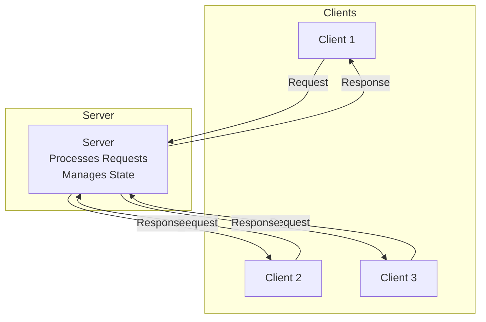
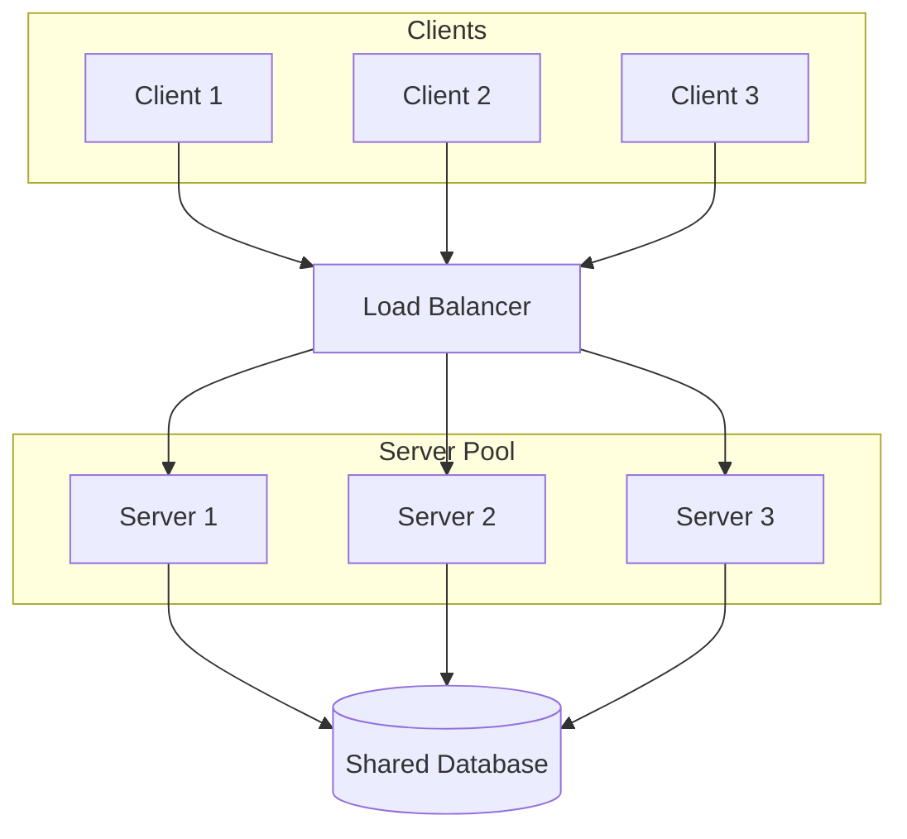
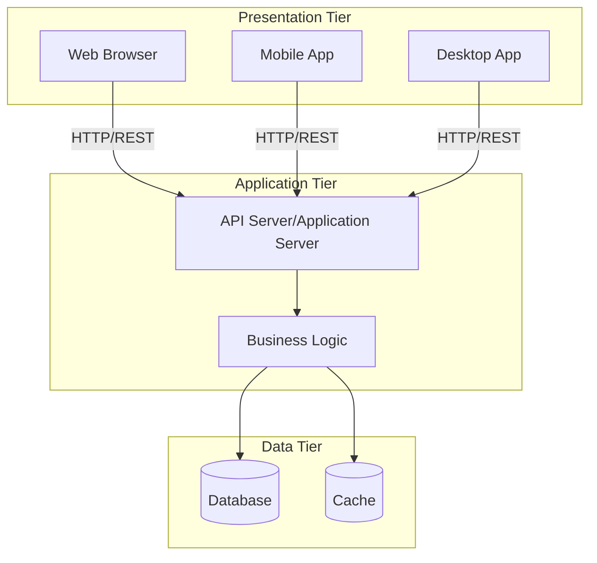
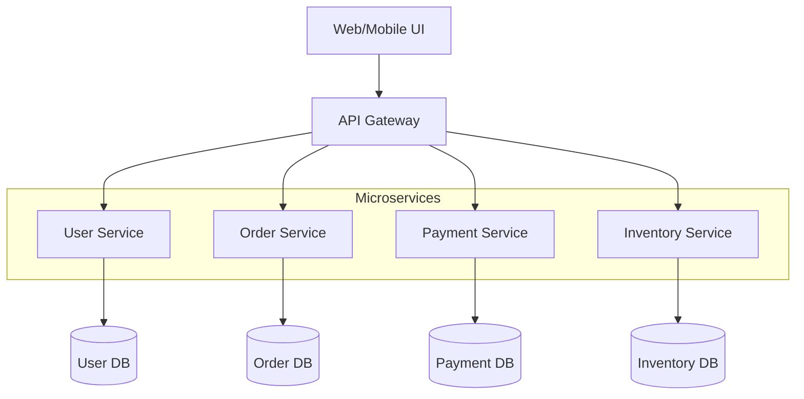
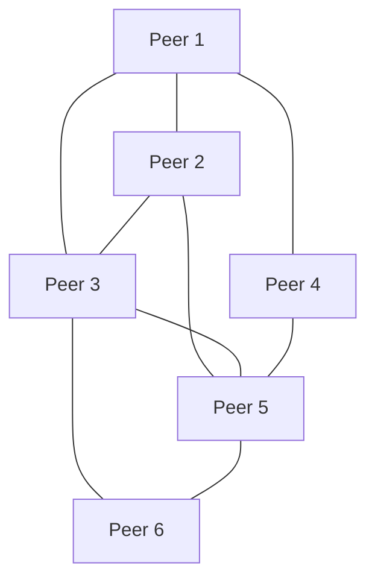
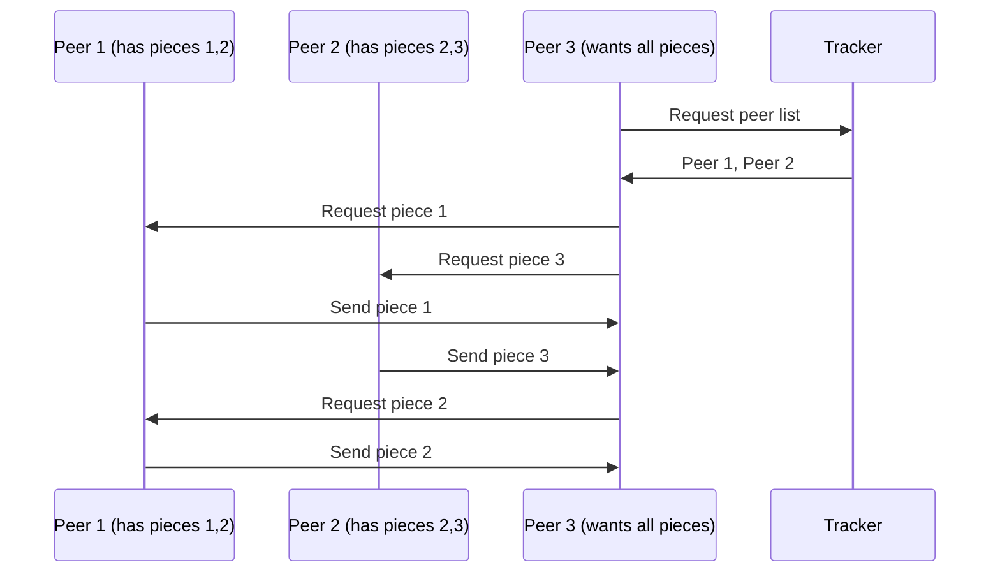
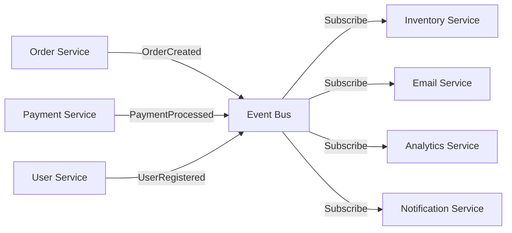
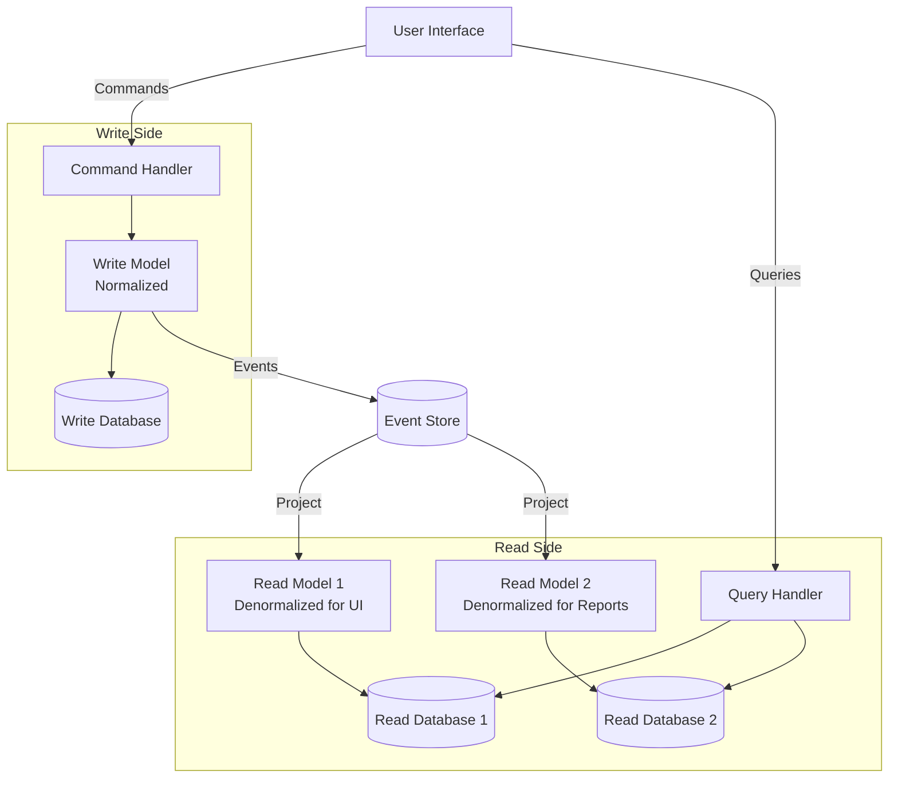

# Architectural Patterns for Distributed Systems

## Introduction

The architecture of a distributed system fundamentally determines its scalability, reliability, maintainability, and performance characteristics. While there are infinite ways to structure a distributed system, several architectural patterns have emerged as proven solutions to common challenges. These patterns represent distilled wisdom from decades of building large-scale systems.

Choosing the right architectural pattern is one of the most important decisions in building a distributed system. The pattern you choose shapes everything that follows: how components communicate, how failures are handled, how the system scales, and how easy it is to evolve. A pattern that works well for a social network might be inappropriate for a banking system. Understanding the tradeoffs of each pattern is essential for making informed decisions.

The patterns we'll explore range from traditional client-server architectures that power most web applications to modern event-driven architectures that enable real-time processing at massive scale. We'll examine peer-to-peer systems that operate without centralized control, microservices that decompose monoliths into independently deployable services, and CQRS that separates reads from writes for optimal performance.

Each pattern will be explored in depth with its characteristics, advantages, disadvantages, implementation considerations, and real-world examples. By understanding these patterns, you'll be equipped to choose and adapt the right architecture for your specific requirements.

## Client-Server Architecture

Client-server is the most fundamental distributed system pattern, where clients request services and servers provide them. This pattern underlies most of the internet and remains the foundation for many modern systems.

### Basic Client-Server Model



**Characteristics**:
- **Asymmetric**: Clients initiate requests, servers respond
- **Centralized**: Server holds authoritative state and business logic
- **Stateless or stateful**: Server may maintain session state or treat requests independently

**Request-response flow**:
```python
# Client
def get_user_data(user_id):
    response = http.get(f"http://server.com/users/{user_id}")
    return response.json()

# Server
@app.route('/users/<user_id>')
def get_user(user_id):
    user = database.query("SELECT * FROM users WHERE id = ?", user_id)
    return jsonify(user)
```

### Advantages

**Simplicity**: Clear separation of concerns, easy to understand and implement

**Centralized control**: Server maintains consistency, enforces business rules

**Security**: Easier to secure one server than many peers

**Maintenance**: Server updates don't require client changes (if API is stable)

**Resource sharing**: Many clients share expensive server resources (databases, compute)

### Disadvantages

**Single point of failure**: If server fails, entire system unavailable

**Scalability bottleneck**: Server must handle all client requests

**Network latency**: Every operation requires round-trip to server

**Server load**: Popular applications can overwhelm server

### Scaling Client-Server

**Vertical scaling**: Upgrade server hardware (limited and expensive)

**Horizontal scaling with load balancing**:



**Load balancing strategies**:
- **Round-robin**: Distribute requests evenly
- **Least connections**: Send to server with fewest active connections
- **Least response time**: Send to fastest responding server
- **Weighted**: Distribute based on server capacity
- **Sticky sessions**: Same client always goes to same server

### Real-World Example: Web Applications

Traditional web applications use client-server architecture:

```python
# Flask web server (Python)
from flask import Flask, request, jsonify
import sqlite3

app = Flask(__name__)

@app.route('/api/users', methods=['GET'])
def get_users():
    conn = sqlite3.connect('database.db')
    users = conn.execute("SELECT * FROM users").fetchall()
    conn.close()
    return jsonify(users)

@app.route('/api/users', methods=['POST'])
def create_user():
    data = request.json
    conn = sqlite3.connect('database.db')
    conn.execute("INSERT INTO users (name, email) VALUES (?, ?)",
                (data['name'], data['email']))
    conn.commit()
    conn.close()
    return jsonify({"status": "created"}), 201

if __name__ == '__main__':
    app.run(host='0.0.0.0', port=5000)
```

## Three-Tier Architecture

Three-tier architecture separates concerns into presentation, application logic, and data layers, enabling independent scaling and development of each tier.

### Three-Tier Structure



**Tiers**:

1. **Presentation Tier**: User interface (web browsers, mobile apps, desktop applications)
2. **Application Tier**: Business logic, API endpoints, application servers
3. **Data Tier**: Databases, file storage, caching systems

### Benefits of Separation

**Independent scaling**: Scale each tier based on its bottlenecks
- Scale out web servers for more users
- Scale application servers for more computation
- Scale database for more data/queries

**Technology diversity**: Use best technology for each tier
- React for UI
- Go for application logic
- PostgreSQL for data

**Security**: Add security layers between tiers
- Firewall between presentation and application
- Application tier validates all database access
- Database not directly accessible from internet

**Team specialization**: Different teams can work on different tiers

### Implementation Example

```python
# Presentation Tier (React)
function UserList() {
  const [users, setUsers] = useState([]);

  useEffect(() => {
    fetch('http://api.example.com/users')
      .then(response => response.json())
      .then(data => setUsers(data));
  }, []);

  return <ul>{users.map(user => <li key={user.id}>{user.name}</li>)}</ul>;
}

# Application Tier (Python Flask)
@app.route('/users')
def get_users():
    # Business logic
    users = user_service.get_all_users()
    # Apply transformations
    users = [format_user(u) for u in users]
    return jsonify(users)

class UserService:
    def get_all_users(self):
        # Data access logic
        return user_repository.find_all()

# Data Tier (PostgreSQL)
class UserRepository:
    def find_all(self):
        conn = psycopg2.connect(database="myapp")
        cursor = conn.cursor()
        cursor.execute("SELECT id, name, email FROM users")
        users = cursor.fetchall()
        conn.close()
        return users
```

### Modern Variation: Microservices

Microservices extend three-tier by decomposing the application tier into multiple independent services:



**Key principles**:
- **Single responsibility**: Each service does one thing well
- **Independent deployment**: Services deployed independently
- **Decentralized data**: Each service owns its database
- **API-driven**: Services communicate via APIs (REST, gRPC)

## Peer-to-Peer Architecture

Peer-to-peer (P2P) systems have no central server; all nodes are equal peers that both consume and provide resources.

### P2P Characteristics



**Properties**:
- **Symmetric**: All nodes have same capabilities
- **Decentralized**: No single point of control or failure
- **Self-organizing**: Nodes join/leave dynamically
- **Scalable**: More nodes = more capacity

### P2P Models

**Unstructured P2P**: Random connections, flooding for search
- Example: Early file-sharing (Gnutella)
- Simple but inefficient search

**Structured P2P**: Organized topology, efficient routing
- Example: Distributed Hash Tables (DHT)
- Efficient lookup: O(log N) hops

**Hybrid P2P**: Some central coordination
- Example: BitTorrent (tracker + peers)
- Combines P2P efficiency with some centralized features

### Distributed Hash Table (DHT)

DHT provides key-value storage distributed across peers:

```python
# Chord DHT example
class ChordNode:
    def __init__(self, node_id, m=160):  # m-bit identifier space
        self.id = node_id
        self.finger_table = {}  # Routing table
        self.successor = None
        self.predecessor = None

    def find_successor(self, key_id):
        """Find node responsible for key"""
        if self.id < key_id <= self.successor.id:
            return self.successor
        else:
            # Forward to closest preceding node
            node = self.closest_preceding_node(key_id)
            return node.find_successor(key_id)

    def closest_preceding_node(self, key_id):
        """Find closest node in finger table"""
        for i in range(len(self.finger_table) - 1, -1, -1):
            finger = self.finger_table[i]
            if self.id < finger.id < key_id:
                return finger
        return self

    def put(self, key, value):
        """Store key-value pair"""
        key_id = hash(key) % (2 ** 160)
        node = self.find_successor(key_id)
        node.store(key, value)

    def get(self, key):
        """Retrieve value for key"""
        key_id = hash(key) % (2 ** 160)
        node = self.find_successor(key_id)
        return node.retrieve(key)
```

### P2P Applications

**File Sharing**: BitTorrent
- Files split into pieces
- Peers download from multiple sources
- Automatic load distribution
- Resilient to peer failures



**Blockchain**: Bitcoin, Ethereum
- Distributed ledger
- Consensus without central authority
- Immutable transaction history

**Content Delivery**: IPFS
- Content-addressed storage
- Distributed file system
- Resilient to node failures

### Advantages and Challenges

**Advantages**:
- No single point of failure
- Scales with number of peers
- Reduced infrastructure costs
- Censorship resistant

**Challenges**:
- Difficult to ensure data consistency
- Search and discovery complexity
- Security and trust issues
- Unequal resource contribution (freeriders)

## Event-Driven Architecture

Event-driven architecture uses events as the primary mechanism for communication between components, enabling loose coupling and asynchronous processing.

### Event-Driven Components



**Components**:

1. **Event Producers**: Generate events when something happens
2. **Event Bus/Broker**: Routes events to interested consumers
3. **Event Consumers**: React to events by performing actions

**Event example**:
```json
{
  "event_type": "OrderCreated",
  "event_id": "evt_123456",
  "timestamp": "2024-01-15T10:30:00Z",
  "data": {
    "order_id": "ord_789",
    "customer_id": "cust_456",
    "items": [
      {"product_id": "prod_123", "quantity": 2}
    ],
    "total": 99.98
  }
}
```

### Event Processing Patterns

**Event Notification**: Signal that something happened
```python
# Producer
def create_order(order_data):
    order = save_order(order_data)

    # Publish event
    event_bus.publish('OrderCreated', {
        'order_id': order.id,
        'customer_id': order.customer_id
    })

# Consumers
@event_bus.subscribe('OrderCreated')
def send_confirmation_email(event):
    customer = get_customer(event['customer_id'])
    send_email(customer.email, "Order Confirmation", ...)

@event_bus.subscribe('OrderCreated')
def update_inventory(event):
    order = get_order(event['order_id'])
    for item in order.items:
        inventory.decrease(item.product_id, item.quantity)
```

**Event-Carried State Transfer**: Event contains full state
```python
# Event includes complete order details
event = {
    'type': 'OrderCreated',
    'order': {
        'id': 'ord_789',
        'customer': {
            'id': 'cust_456',
            'name': 'John Doe',
            'email': 'john@example.com'
        },
        'items': [...],
        'total': 99.98
    }
}

# Consumer doesn't need to fetch order details
@event_bus.subscribe('OrderCreated')
def send_confirmation_email(event):
    # All data in event
    customer = event['order']['customer']
    send_email(customer['email'], "Order Confirmation", event['order'])
```

**Event Sourcing**: Store events as source of truth
```python
class OrderAggregate:
    def __init__(self):
        self.events = []
        self.state = {}

    def create_order(self, customer_id, items):
        event = OrderCreatedEvent(customer_id, items)
        self.apply(event)
        self.events.append(event)

    def add_item(self, product_id, quantity):
        event = ItemAddedEvent(product_id, quantity)
        self.apply(event)
        self.events.append(event)

    def apply(self, event):
        if isinstance(event, OrderCreatedEvent):
            self.state['customer_id'] = event.customer_id
            self.state['items'] = event.items
        elif isinstance(event, ItemAddedEvent):
            self.state['items'].append({
                'product_id': event.product_id,
                'quantity': event.quantity
            })

    def rebuild_state(self, events):
        """Rebuild current state from events"""
        for event in events:
            self.apply(event)
```

### Advantages

**Loose coupling**: Producers don't know about consumers

**Scalability**: Add consumers without changing producers

**Flexibility**: Easy to add new features by adding consumers

**Asynchronous**: Non-blocking, better performance

**Auditability**: Event log provides complete history

### Challenges

**Complexity**: Harder to understand flow than direct calls

**Eventual consistency**: Updates not immediately visible

**Event ordering**: Ensuring correct order can be difficult

**Error handling**: Failures in consumers don't stop producers

**Debugging**: Distributed traces needed to follow event flow

### Real-World Example: Netflix

Netflix uses event-driven architecture extensively:

```python
# Simplified Netflix event flow
@event_bus.subscribe('VideoPlayed')
def update_watch_history(event):
    user_id = event['user_id']
    video_id = event['video_id']
    update_history(user_id, video_id)

@event_bus.subscribe('VideoPlayed')
def update_recommendations(event):
    user_id = event['user_id']
    video_id = event['video_id']
    recalculate_recommendations(user_id)

@event_bus.subscribe('VideoPlayed')
def track_analytics(event):
    log_to_analytics(event)

@event_bus.subscribe('VideoPlayed')
def check_subscription(event):
    user_id = event['user_id']
    if subscription_expired(user_id):
        send_renewal_reminder(user_id)
```

## CQRS (Command Query Responsibility Segregation)

CQRS separates read (query) and write (command) operations into different models, optimizing each for its specific use case.

### CQRS Architecture



### Write Side (Commands)

Commands represent intent to change state:

```python
# Command
class CreateOrderCommand:
    def __init__(self, customer_id, items):
        self.customer_id = customer_id
        self.items = items

# Command Handler
class CreateOrderHandler:
    def handle(self, command):
        # Validate
        if not self.validate_customer(command.customer_id):
            raise InvalidCustomerError()

        # Create aggregate
        order = Order.create(command.customer_id, command.items)

        # Save to write database
        self.repository.save(order)

        # Publish events
        for event in order.uncommitted_events:
            self.event_bus.publish(event)

        return order.id
```

### Read Side (Queries)

Queries return data optimized for specific use cases:

```python
# Query
class GetOrdersByCustomerQuery:
    def __init__(self, customer_id):
        self.customer_id = customer_id

# Query Handler
class GetOrdersByCustomerHandler:
    def handle(self, query):
        # Read from optimized read model
        return self.read_db.query(
            "SELECT * FROM order_list_view WHERE customer_id = ?",
            query.customer_id
        )

# Projection (builds read model from events)
@event_bus.subscribe('OrderCreated')
def project_order_list(event):
    # Denormalized view for order list UI
    read_db.execute("""
        INSERT INTO order_list_view
        (order_id, customer_id, customer_name, total, status, created_at)
        VALUES (?, ?, ?, ?, ?, ?)
    """, (
        event['order_id'],
        event['customer_id'],
        event['customer_name'],  # Denormalized
        event['total'],
        'created',
        event['timestamp']
    ))
```

### Benefits of CQRS

**Optimized models**: Read and write models optimized independently
- Write model: Normalized, enforces business rules
- Read model: Denormalized, optimized for queries

**Independent scaling**: Scale reads and writes separately
- Most applications: 90% reads, 10% writes
- Scale read database instances independently

**Multiple read models**: Different views for different use cases
```python
# Read model 1: Order list for UI
order_list_view = {
    'order_id': 'ord_123',
    'customer_name': 'John Doe',  # Denormalized
    'total': 99.98,
    'status': 'shipped'
}

# Read model 2: Analytics
order_analytics_view = {
    'date': '2024-01-15',
    'total_orders': 1523,
    'total_revenue': 45000.50,
    'average_order_value': 29.55
}

# Read model 3: Search
order_search_index = {
    'order_id': 'ord_123',
    'searchable_text': 'john doe laptop hdmi cable',
    'facets': ['electronics', 'shipped', '2024-01']
}
```

**Technology diversity**: Use best tool for each side
- Write: PostgreSQL for ACID transactions
- Read 1: Elasticsearch for full-text search
- Read 2: Redis for fast lookups
- Read 3: Cassandra for analytics

### Challenges

**Eventual consistency**: Read model lags behind write model
```python
# Write succeeds
order_id = create_order_handler.handle(CreateOrderCommand(...))

# Immediate read might not see it yet
orders = get_orders_handler.handle(GetOrdersByCustomerQuery(customer_id))
# order_id might not be in results yet!
```

**Increased complexity**: More moving parts to manage

**Operational overhead**: Multiple databases to maintain

**Event handling**: Must ensure events are processed exactly once

### When to Use CQRS

**Use CQRS when**:
- Read and write patterns differ significantly
- Different scalability requirements for reads/writes
- Need multiple representations of same data
- Complex domain with rich business logic

**Don't use CQRS when**:
- Simple CRUD application
- Reads and writes are similar
- Complexity not justified by benefits

## Summary

Architectural patterns provide proven solutions for building distributed systems, each with specific strengths and appropriate use cases.

Key takeaways:

- **Client-server** provides simplicity and centralized control but can become a bottleneck
- **Three-tier** separates concerns enabling independent scaling and development
- **Microservices** decompose applications into independently deployable services
- **Peer-to-peer** eliminates central control providing scalability and fault tolerance
- **Event-driven** enables loose coupling and asynchronous processing
- **CQRS** separates reads and writes for optimal performance

Choosing the right pattern requires understanding:
1. Your scalability requirements
2. Your consistency requirements
3. Your team's expertise
4. Operational capabilities
5. Evolution needs

Real systems often combine multiple patterns:
- Client-server with event-driven for async operations
- Microservices with CQRS for complex domains
- Three-tier with caching for performance

The key is understanding each pattern's tradeoffs and applying them judiciously to solve your specific challenges.
