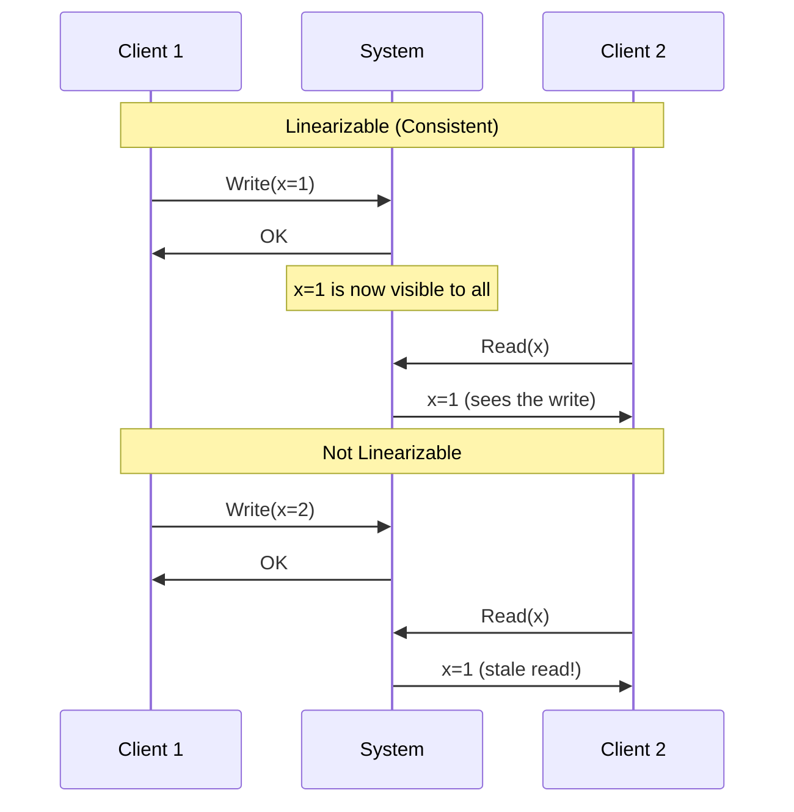
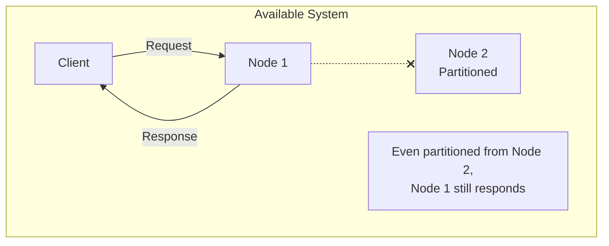
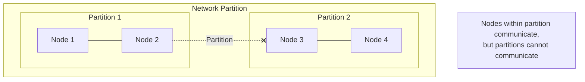
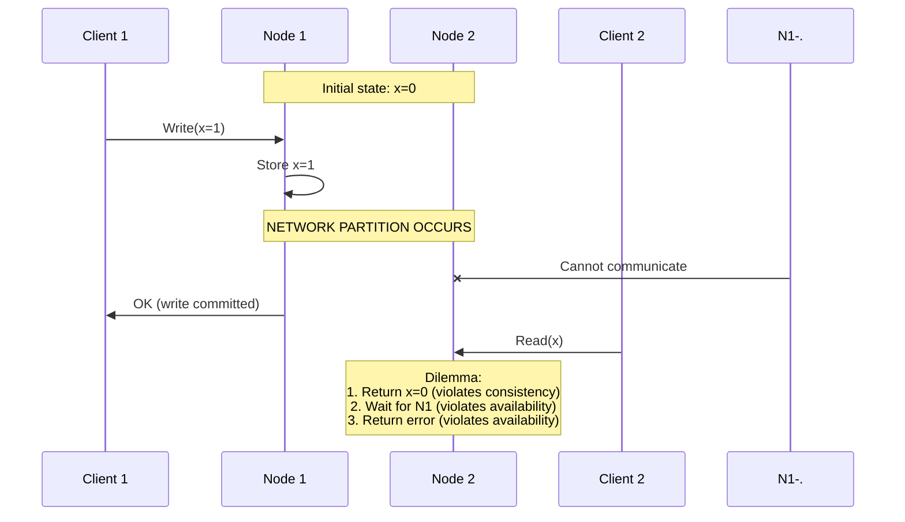
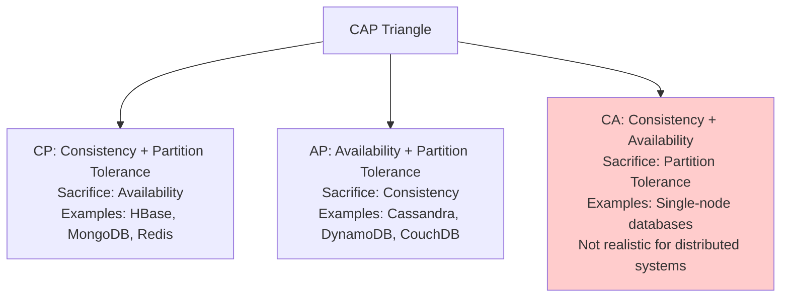
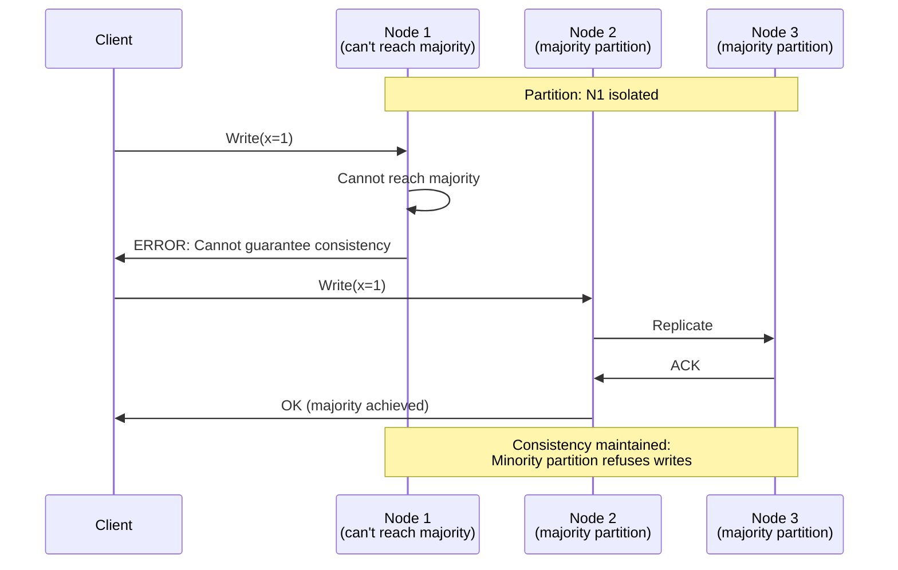
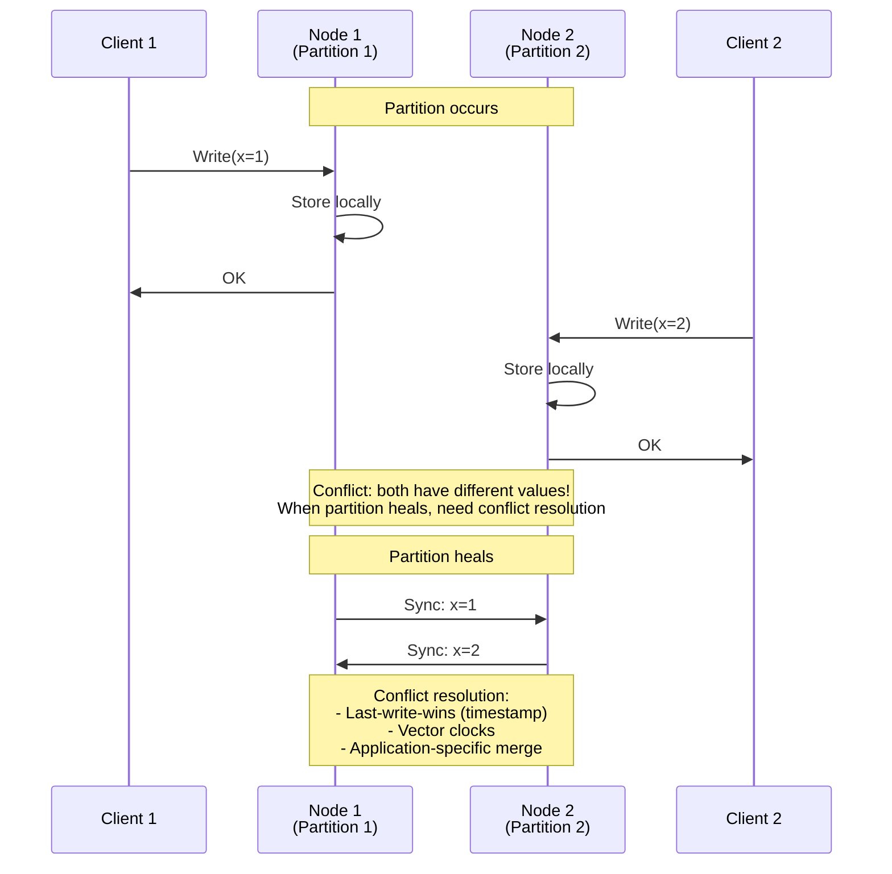
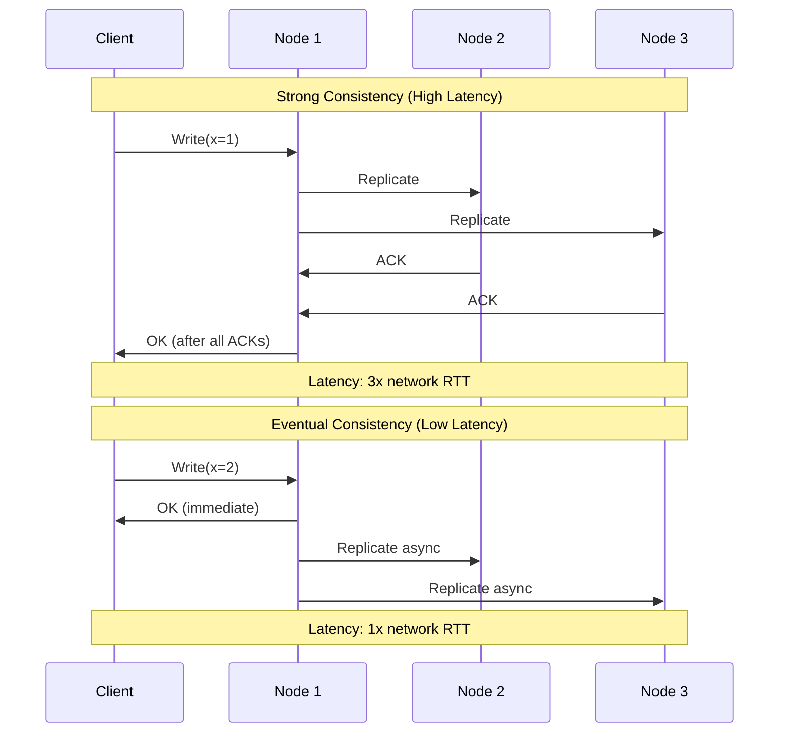
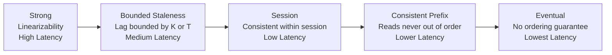

# CAP Theorem and Consistency Tradeoffs

## Introduction

The CAP theorem, proven by Eric Brewer in 2000 and formalized by Seth Gilbert and Nancy Lynch in 2002, is one of the most influential results in distributed systems theory. It states a fundamental limitation: a distributed system can provide at most two out of three guarantees: Consistency, Availability, and Partition tolerance. This impossibility result shapes how we design distributed systems and forces us to make explicit tradeoffs.

Understanding the CAP theorem is essential for anyone building distributed systems. It explains why we cannot have perfect systems that are always consistent, always available, and always tolerant to network failures. Real-world systems must choose which guarantees to prioritize based on their specific requirements. A banking system might choose consistency over availability, while a social media feed might choose availability over consistency.

The CAP theorem is often misunderstood or oversimplified. It's not simply about choosing two of three properties and forgetting the third. In practice, all distributed systems must be partition-tolerant (network failures are inevitable), so the real choice is between consistency and availability during a partition. Furthermore, the PACELC theorem extends CAP by considering what happens when there are no partitions: systems must still tradeoff between latency and consistency.

This comprehensive exploration covers the CAP theorem from first principles through practical applications. We'll examine each property in detail, prove the impossibility of achieving all three, explore the PACELC extension, analyze real-world systems and their tradeoffs, and provide guidance for making informed decisions when designing distributed systems.

## The Three Properties

### Consistency (C)

In the context of CAP, consistency means **linearizability** - the strongest form of consistency. A system is linearizable if:

1. Every operation appears to take effect atomically at some point between its start and end
2. All operations appear to execute in some sequential order
3. This order is consistent with real-time ordering

**More simply**: After a write completes, all subsequent reads return that written value (or a newer one). All nodes see the same data at the same time.



**Example of consistency violation**:
```python
# Client 1 writes
database.set('balance', 1000)
# Write completes successfully

# Client 2 reads immediately after
balance = database.get('balance')
# If balance != 1000, system is not consistent
# (assuming no other writes in between)
```

**Strong consistency** guarantees:
- **Linearizability**: Operations appear sequential, respecting real-time order
- **Sequential consistency**: Operations appear sequential, but may not respect real-time order
- **Serializability**: Transactions appear to execute serially

### Availability (A)

Availability means every request receives a (non-error) response, without guarantee that it contains the most recent write. More formally:

**Definition**: Every request to a non-failing node must terminate with a response.

This is a strong definition - the system must respond even if it cannot contact other nodes to ensure consistency.



**Example**:
```python
# Available system responds even during network partition
try:
    result = database.get('user_123')
    # Always gets a response (might be stale)
    return result
except Exception:
    # Only fails for node-level failures (crash, etc.)
    # NOT for network partition
    return None
```

**Key point**: Availability doesn't mean the system never fails. Nodes can crash. Availability means that functioning nodes continue to respond even when they cannot communicate with other nodes.

### Partition Tolerance (P)

Partition tolerance means the system continues to operate despite arbitrary message loss or failure of part of the system. More formally:

**Definition**: The system continues to function when network partitions separate nodes into groups that cannot communicate.



**Reality**: Network partitions are not hypothetical - they happen regularly in distributed systems:
- Network cable unplugged
- Switch failure
- Router misconfiguration
- High packet loss
- Network congestion
- Cloud availability zone isolation

**Therefore**: In practice, partition tolerance is not optional. All distributed systems must be partition-tolerant. The CAP choice is really **CP vs AP** during partitions.

## The CAP Theorem

### Statement

**CAP Theorem**: In a distributed system, it is impossible to simultaneously guarantee all three of:
1. Consistency (linearizability)
2. Availability (every request gets a response)
3. Partition tolerance (system works despite network partitions)

You can have at most two.

### The Impossibility Proof

Let's prove that we cannot have all three properties simultaneously.

**Proof by contradiction**:

Assume we have a distributed system with two nodes (N1 and N2) that is:
- Consistent (linearizable)
- Available (always responds)
- Partition tolerant (works during partitions)

**Scenario**:



**Analysis**:

1. **Network partition occurs**: N1 and N2 cannot communicate
2. **Client 1 writes** x=1 to N1
3. **N1 must respond** (availability) - it responds OK
4. **Client 2 reads** x from N2
5. **N2 faces a choice**:
   - **Option A**: Return x=0 (the old value)
     - ✓ Available (responds)
     - ✗ Not consistent (Client 2 doesn't see Client 1's write)
   - **Option B**: Wait for N1 to sync (impossible due to partition)
     - ✗ Not available (doesn't respond)
   - **Option C**: Return error
     - ✗ Not available (error is not a valid response per CAP definition)

**Conclusion**: There is no way for N2 to respond (availability) with the correct value (consistency) when partitioned from N1. Therefore, **we cannot have all three** properties.

### Visualizing CAP Tradeoffs



**Important**: CA systems are not truly distributed - they're single-node systems or systems that give up partition tolerance (which means giving up during network failures).

## CP Systems: Choosing Consistency

CP systems prioritize consistency over availability. During a partition, they sacrifice availability to maintain consistency.

### Behavior During Partition



**CP System Strategy**:
- Require majority quorum for operations
- Minority partition becomes unavailable (returns errors)
- Ensures all successful operations are consistent

**Example: MongoDB**:
```python
from pymongo import MongoClient

client = MongoClient('mongodb://node1,node2,node3',
                     replicaset='myReplica',
                     w='majority')  # Wait for majority

try:
    # This write requires majority
    db.users.insert_one({'name': 'Alice'})
    # Success: majority of nodes acknowledged

except Exception as e:
    # During partition, minority nodes fail writes
    # "not writable: can't reach majority"
    print(f"Write failed: {e}")
```

### When to Choose CP

**Use CP when**:
- Correctness is critical (financial transactions, inventory)
- Stale reads are unacceptable
- Can tolerate temporary unavailability
- Strong consistency simplifies application logic

**Examples**:
- **Banking**: Cannot show incorrect balance
- **Inventory**: Cannot oversell items
- **Configuration**: All nodes must see same config
- **Leader election**: Must agree on single leader

### Real CP Systems

**HBase**:
- Strongly consistent reads/writes
- Region servers coordinate via ZooKeeper
- During partition, minority partitions become unavailable

**ZooKeeper**:
- Coordination service requiring consistency
- Uses ZAB (similar to Paxos) for consensus
- Clients cannot connect during partition (minority)

**etcd**:
- Distributed key-value store
- Uses Raft consensus
- Minority partition returns errors

**MongoDB** (with majority write concern):
- Configurable, can be CP with proper settings
- Majority writes ensure consistency
- Minority partition cannot accept writes

## AP Systems: Choosing Availability

AP systems prioritize availability over consistency. During a partition, they continue serving requests even if consistency cannot be guaranteed.

### Behavior During Partition



**AP System Strategy**:
- Accept writes on all partitions
- Return success even without coordination
- Resolve conflicts when partition heals

### Conflict Resolution Strategies

**Last-Write-Wins (LWW)**:
```python
# Simple timestamp-based resolution
def resolve_conflict(value1, value2):
    if value1.timestamp > value2.timestamp:
        return value1
    else:
        return value2

# Problem: Requires synchronized clocks
# Problem: Loses data (value1 discarded)
```

**Vector Clocks**:
```python
# Track causality
class VectorClock:
    def __init__(self):
        self.clock = {}

    def increment(self, node_id):
        self.clock[node_id] = self.clock.get(node_id, 0) + 1

    def merge(self, other):
        for node_id, count in other.clock.items():
            self.clock[node_id] = max(self.clock.get(node_id, 0), count)

# Can detect concurrent writes
# Application resolves conflicts
```

**Application-Specific Merge**:
```python
# Shopping cart example
def merge_carts(cart1, cart2):
    # Union of items (both carts' items preserved)
    merged_items = {}

    for item_id, qty in cart1.items.items():
        merged_items[item_id] = qty

    for item_id, qty in cart2.items.items():
        if item_id in merged_items:
            merged_items[item_id] = max(merged_items[item_id], qty)
        else:
            merged_items[item_id] = qty

    return merged_items

# Makes sense for shopping cart
# (adding items is commutative)
```

### When to Choose AP

**Use AP when**:
- Availability is critical (must always serve users)
- Can tolerate eventual consistency
- Conflicts are rare or resolvable
- Downtime is costly

**Examples**:
- **Social media**: Stale likes/comments acceptable
- **DNS**: Stale records acceptable, availability critical
- **Shopping cart**: Can merge carts if needed
- **Sensor data**: Some staleness acceptable

### Real AP Systems

**Cassandra**:
- Highly available, eventually consistent
- Tunable consistency (can choose per-operation)
- Uses last-write-wins for conflict resolution

```python
from cassandra.cluster import Cluster

cluster = Cluster(['node1', 'node2', 'node3'])
session = cluster.connect('keyspace')

# Write with ONE (available, not consistent)
session.execute(
    "INSERT INTO users (id, name) VALUES (%s, %s)",
    (user_id, name),
    consistency_level=ConsistencyLevel.ONE
)

# Read with ONE (available, might be stale)
result = session.execute(
    "SELECT * FROM users WHERE id = %s",
    [user_id],
    consistency_level=ConsistencyLevel.ONE
)
```

**DynamoDB**:
- Highly available key-value store
- Eventually consistent by default
- Optional strongly consistent reads (with availability tradeoff)

**CouchDB**:
- Multi-master replication
- Eventual consistency
- Conflict resolution via revision trees

**Riak**:
- Distributed key-value store
- Tunable CAP tradeoffs
- Vector clocks for conflict detection

## PACELC Theorem

The PACELC theorem, proposed by Daniel Abadi, extends CAP by considering what happens when there are no partitions.

### PACELC Statement

**If there is a Partition (P)**, choose between Availability (A) and Consistency (C)
**Else (E)**, when the system operates normally, choose between Latency (L) and Consistency (C)

**Formula**: PAC-ELC

This captures the reality that even without partitions, distributed systems face tradeoffs between consistency and latency.

### Normal Operation Tradeoffs

Even without partitions, achieving consistency requires coordination:



**High latency for consistency**:
```python
# Wait for all replicas (consistent but slow)
def write_consistent(key, value):
    start = time.time()
    # Wait for all replicas to acknowledge
    primary.write(key, value)
    replica1.write(key, value)
    replica2.write(key, value)
    latency = time.time() - start  # ~100ms across data centers
    return latency
```

**Low latency with eventual consistency**:
```python
# Async replication (fast but eventually consistent)
def write_async(key, value):
    start = time.time()
    # Write to primary only
    primary.write(key, value)
    # Replicate asynchronously
    async_replicate(replica1, key, value)
    async_replicate(replica2, key, value)
    latency = time.time() - start  # ~10ms, much faster
    return latency
```

### PACELC Classification

| System | Partition | Normal Operation |
|--------|-----------|------------------|
| **MongoDB** | PC (consistent when partitioned) | EC (consistent even without partition) |
| **Cassandra** | PA (available when partitioned) | EL (low latency without partition) |
| **DynamoDB** | PA | EL |
| **HBase** | PC | EC |
| **Cosmos DB** | Configurable | Configurable (5 consistency levels) |

### Azure Cosmos DB Consistency Levels

Cosmos DB offers five consistency levels, showing the spectrum between strong consistency and availability/latency:



1. **Strong**: Linearizability (like CP)
2. **Bounded Staleness**: Reads lag by at most K versions or T time
3. **Session**: Consistency within a session (user sees own writes)
4. **Consistent Prefix**: Reads never see out-of-order writes
5. **Eventual**: Weakest, lowest latency

## Real-World Tradeoffs

### Case Study: Amazon DynamoDB

DynamoDB chooses **PA/EL** (available during partitions, low latency normally):

**Design decisions**:
- Eventually consistent reads by default (fast)
- Optional strongly consistent reads (slower, may fail during partition)
- Multi-master writes (always available)
- Last-write-wins conflict resolution

```python
import boto3

dynamodb = boto3.resource('dynamodb')
table = dynamodb.Table('users')

# Eventually consistent read (default) - fast, PA/EL
response = table.get_item(
    Key={'user_id': '123'}
)

# Strongly consistent read - slower, may fail during partition
response = table.get_item(
    Key={'user_id': '123'},
    ConsistentRead=True  # Requires coordination
)
```

**Tradeoffs**:
- ✓ Always available for writes
- ✓ Low latency reads
- ✗ May see stale data
- ✗ Conflicts possible

### Case Study: Google Spanner

Spanner chooses **PC/EC** (consistent during partitions and normally):

**Design decisions**:
- External consistency (stronger than linearizability)
- Uses atomic clocks and GPS for timestamps
- Transactions can span data centers
- Sacrifices availability during partitions

**How they achieve it**:
```python
# Spanner can determine if events are concurrent
# using TrueTime API with bounded uncertainty

uncertainty_interval = TrueTime.now()
# Returns [earliest, latest] based on clock uncertainty

# Wait out uncertainty before committing
commit_timestamp = uncertainty_interval.latest
wait_until(commit_timestamp)  # Wait for time to pass
# Now we know all previous transactions have committed

commit_transaction()
```

**Tradeoffs**:
- ✓ Strong consistency
- ✓ ACID transactions across globe
- ✗ Higher latency (wait out clock uncertainty)
- ✗ Unavailable during partitions
- ✗ Requires specialized hardware (atomic clocks)

### Case Study: Cassandra

Cassandra offers **tunable CAP tradeoffs**:

```python
# Write with ONE (AP) - available, not consistent
session.execute(
    "INSERT INTO users (id, name) VALUES (%s, %s)",
    (user_id, name),
    consistency_level=ConsistencyLevel.ONE
)

# Write with QUORUM (middle ground) - available if majority up
session.execute(
    "INSERT INTO users (id, name) VALUES (%s, %s)",
    (user_id, name),
    consistency_level=ConsistencyLevel.QUORUM
)

# Write with ALL (CP-ish) - consistent but not available
session.execute(
    "INSERT INTO users (id, name) VALUES (%s, %s)",
    (user_id, name),
    consistency_level=ConsistencyLevel.ALL
)

# Read with QUORUM + Write with QUORUM = strong consistency
# If R + W > N, you're guaranteed to see latest write
# Example: 3 nodes, R=2, W=2 (2+2 > 3)
```

**Quorum formula**:
$$R + W > N$$

Where:
- $R$ = read quorum size
- $W$ = write quorum size
- $N$ = replication factor

If this holds, reads will see latest write (strong consistency).

## Practical Guidelines

### Choosing Your Tradeoff

**Choose CP when**:

1. **Correctness is critical**
   - Financial transactions
   - Inventory management
   - Configuration management

2. **Conflicts are dangerous**
   - Cannot merge conflicting bank balances
   - Cannot resolve conflicting inventory counts

3. **Can tolerate unavailability**
   - Batch processing systems
   - Admin dashboards
   - Internal tools

**Choose AP when**:

1. **Availability is critical**
   - User-facing applications
   - Real-time systems
   - Global services

2. **Conflicts are rare or resolvable**
   - Social media (likes, follows)
   - Shopping carts
   - Collaborative editing (with CRDTs)

3. **Eventual consistency is acceptable**
   - Analytics/reporting
   - Caching layers
   - Content delivery

### Hybrid Approaches

Many systems use different tradeoffs for different operations:

```python
class HybridSystem:
    def __init__(self):
        self.cp_store = MongoDBClient()  # CP for critical data
        self.ap_store = CassandraClient()  # AP for high volume

    def create_order(self, order):
        # Critical operation: use CP
        # Must be consistent (no duplicate orders)
        return self.cp_store.insert(order)

    def log_view(self, product_id):
        # High volume, eventual consistency OK: use AP
        # Stale view counts acceptable
        return self.ap_store.increment('views', product_id)

    def get_product(self, product_id):
        # Read from AP cache first (fast)
        product = self.ap_store.get(product_id)
        if product:
            return product

        # Cache miss: read from CP store (accurate)
        product = self.cp_store.get(product_id)

        # Populate cache asynchronously
        self.ap_store.set_async(product_id, product)

        return product
```

### Partition Detection and Handling

Smart systems detect partitions and adjust behavior:

```python
class PartitionAwareSystem:
    def __init__(self):
        self.nodes = [Node1, Node2, Node3]
        self.partitioned = False

    def detect_partition(self):
        # Check if can reach majority
        reachable = sum(1 for n in self.nodes if n.ping())
        majority = len(self.nodes) // 2 + 1

        self.partitioned = reachable < majority

    def write(self, key, value):
        self.detect_partition()

        if self.partitioned:
            # During partition: choose based on requirements

            # Option 1: Fail (CP)
            raise PartitionError("Cannot guarantee consistency")

            # Option 2: Write anyway (AP)
            # return self.write_local(key, value)

        else:
            # Normal operation: synchronous replication
            return self.write_replicated(key, value)
```

## Common Misconceptions

### Misconception 1: "CAP is about choosing 2 of 3"

**Reality**: You must have P (partition tolerance). The choice is C vs A during partitions.

### Misconception 2: "AP means no consistency"

**Reality**: AP means eventual consistency, not no consistency. Data eventually converges.

### Misconception 3: "Choose once and done"

**Reality**: Can make different choices for different operations, adjust over time, or use hybrid approaches.

### Misconception 4: "CAP is binary"

**Reality**: It's a spectrum. Can tune consistency/availability with quorums, timeout policies, etc.

### Misconception 5: "Partitions are rare"

**Reality**: Partitions happen regularly in production systems:
- Network congestion
- Switch failures
- Data center connectivity issues
- Cloud provider issues

## Summary

The CAP theorem is a fundamental constraint on distributed systems, forcing explicit tradeoffs between consistency, availability, and partition tolerance.

Key takeaways:

- **CAP theorem** proves we cannot simultaneously guarantee consistency, availability, and partition tolerance
- **In practice**, partition tolerance is mandatory, so the choice is **CP vs AP** during partitions
- **CP systems** (MongoDB, HBase, ZooKeeper) prioritize consistency, sacrificing availability during partitions
- **AP systems** (Cassandra, DynamoDB, CouchDB) prioritize availability, accepting eventual consistency
- **PACELC** extends CAP: even without partitions, must choose between latency and consistency
- **Real systems** often use hybrid approaches, tunable consistency, or different choices for different operations

When designing distributed systems:

1. **Understand your requirements**: Is consistency or availability more critical?
2. **Recognize partitions will happen**: Plan for them, don't hope they won't
3. **Choose appropriate tradeoffs**: Different operations may need different guarantees
4. **Use tunable consistency**: Many systems (Cassandra, DynamoDB) allow per-operation choices
5. **Monitor and test**: Test partition scenarios, monitor for actual partitions
6. **Consider PACELC**: Remember latency-consistency tradeoffs even during normal operation

The CAP theorem doesn't tell us what choice to make - it tells us we must choose. Understanding these tradeoffs is essential for building robust, appropriate distributed systems.
