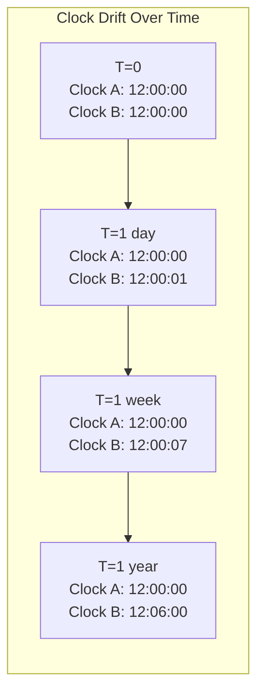
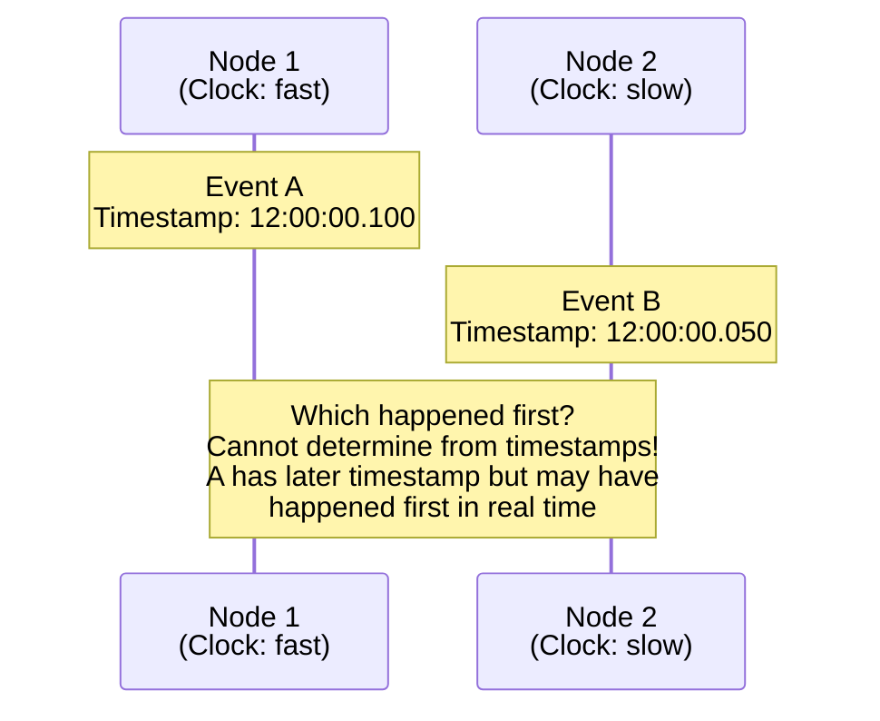
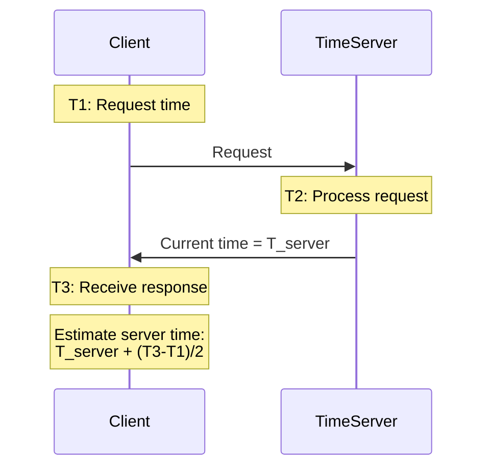
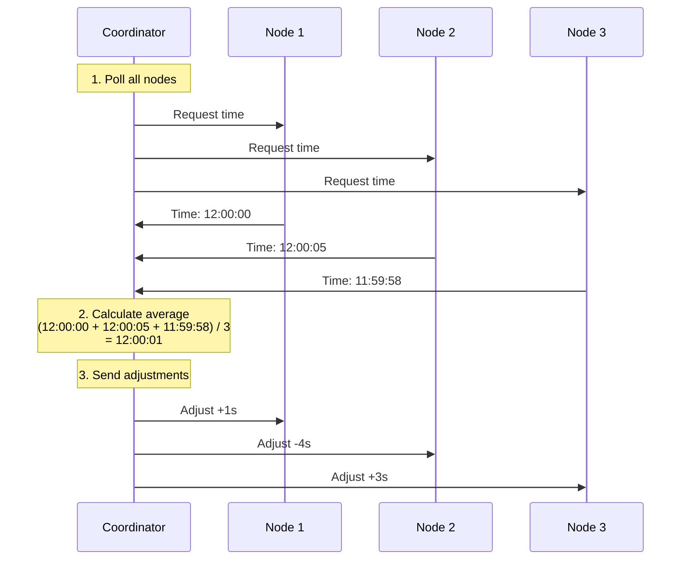
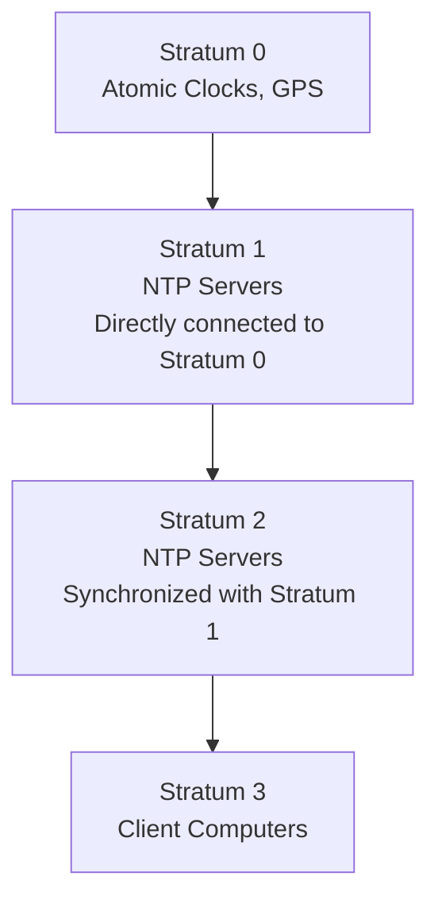
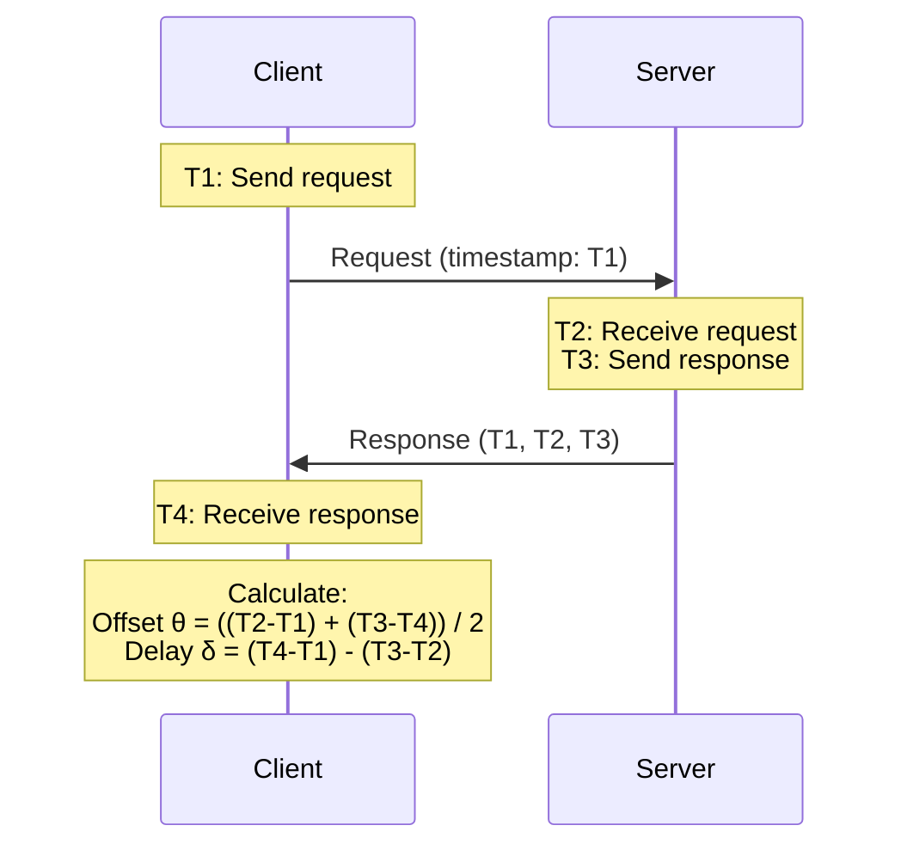
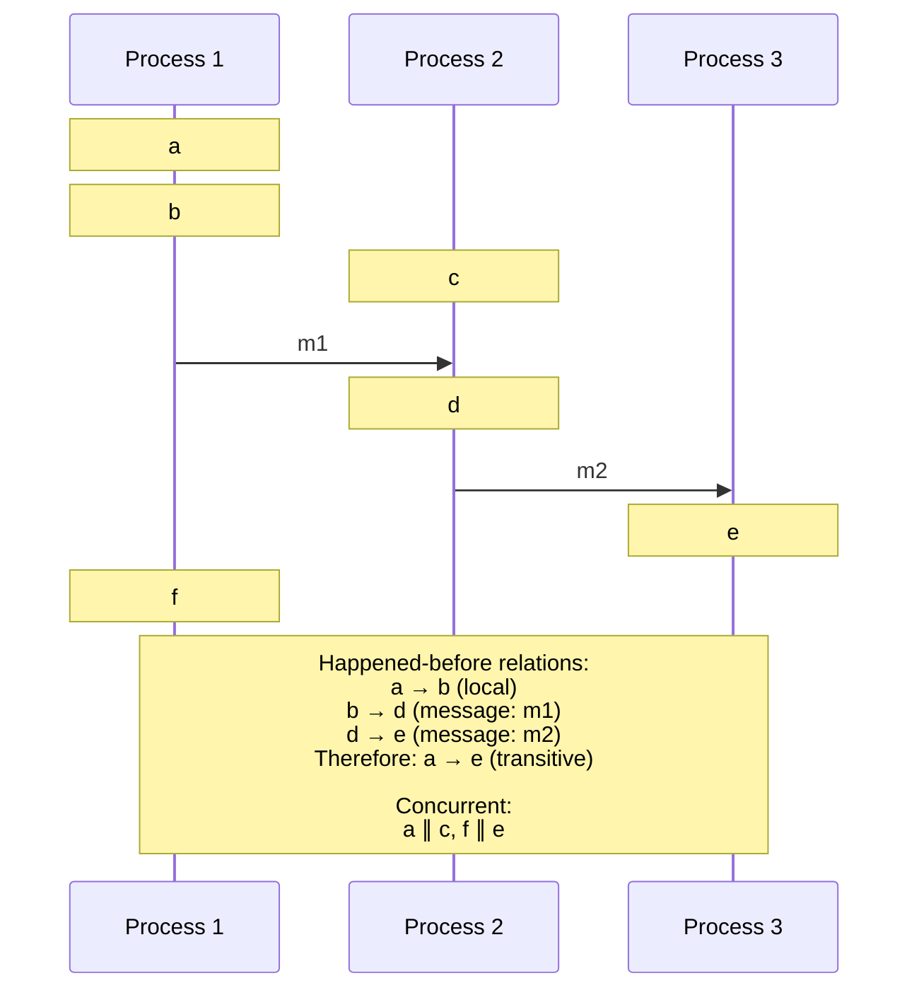

# Physical and Logical Time in Distributed Systems

## Introduction

Time is fundamental to how we understand the world. Events happen in sequence - cause precedes effect, actions happen before reactions, requests come before responses. In a single computer, we can use the system clock to determine the order of events with reasonable accuracy. But in a distributed system spanning multiple computers, possibly across continents, the concept of time becomes surprisingly complex and problematic.

The challenge of time in distributed systems stems from two fundamental issues. First, there is no global clock that all nodes can reference to get the current time. Each node has its own physical clock, and these clocks inevitably drift apart due to variations in crystal oscillators, temperature changes, and other physical factors. Second, even if we could perfectly synchronize clocks, network delays make it impossible to know exactly when an event occurred on a remote node.

These limitations have profound implications. How do we order events that occur on different nodes? How do we determine causality - whether one event could have influenced another? How do we implement distributed transactions that require a consistent view of time? How do we ensure that timestamps in logs can be trusted to reflect the actual sequence of events?

This comprehensive exploration examines both physical time (timestamps from hardware clocks) and logical time (capturing the causal ordering of events). We'll explore clock synchronization protocols like NTP, the fundamental limits of synchronization, the happened-before relation that defines causality, and how logical clocks can capture causal relationships without requiring synchronized physical clocks. Understanding time in distributed systems is essential for building correct, robust distributed applications.

## Physical Clocks and Their Challenges

### How Physical Clocks Work

Physical clocks in computers are based on quartz crystal oscillators that vibrate at a precise frequency (usually 32.768 kHz). The computer counts these oscillations to measure time:

```python
class PhysicalClock:
    def __init__(self, frequency=32768):
        self.frequency = frequency  # Hz
        self.ticks = 0
        self.time = 0  # seconds since epoch

    def tick(self):
        self.ticks += 1
        if self.ticks >= self.frequency:
            self.time += 1
            self.ticks = 0

    def get_time(self):
        return self.time + (self.ticks / self.frequency)
```

**Components**:
1. **Crystal oscillator**: Generates regular pulses
2. **Counter**: Counts oscillations
3. **Timer interrupt**: Updates system time
4. **Real-time clock (RTC)**: Battery-powered clock that persists across reboots

### Clock Drift

No two clocks tick at exactly the same rate. Even high-quality quartz crystals drift by about 1 second per day (about 10 parts per million). This means:

- After 1 day: clocks differ by ~1 second
- After 1 week: clocks differ by ~7 seconds
- After 1 year: clocks differ by ~6 minutes



**Drift rate** formula:
$$\frac{dC}{dt} = 1 + \rho$$

Where:
- $C$ is the clock reading
- $t$ is real time
- $\rho$ is the drift rate (typically $|\rho| < 10^{-6}$ for quartz)

**Example**:
```python
import time

class DriftingClock:
    def __init__(self, drift_rate=0.00001):  # 10 ppm
        self.drift_rate = drift_rate
        self.start_time = time.time()
        self.offset = 0

    def get_time(self):
        real_elapsed = time.time() - self.start_time
        # Clock runs slightly fast or slow
        drifted_elapsed = real_elapsed * (1 + self.drift_rate)
        return self.start_time + drifted_elapsed + self.offset

# Demonstrate drift
clock_a = DriftingClock(drift_rate=0.00001)   # Fast clock
clock_b = DriftingClock(drift_rate=-0.00001)  # Slow clock

time.sleep(86400)  # Wait 1 day (in simulation)

print(f"Clock A: {clock_a.get_time()}")
print(f"Clock B: {clock_b.get_time()}")
print(f"Difference: {clock_a.get_time() - clock_b.get_time()}")
# Difference: ~1.7 seconds after 1 day
```

### Environmental Factors Affecting Clocks

**Temperature**: Crystal frequency changes with temperature
- ~0.035 ppm per °C deviation from 25°C
- Data center temperature variations cause measurable drift

**Voltage**: Power supply variations affect oscillation
- Particularly problematic in battery-powered devices

**Aging**: Crystals age over time, changing frequency
- Can be several ppm over years

**Manufacturing variance**: No two crystals are identical
- Specification tolerance typically ±20 ppm

### The Fundamental Problem

Two events on different nodes:
- Event A on Node 1 at timestamp 12:00:00.100
- Event B on Node 2 at timestamp 12:00:00.050

**Question**: Did A happen before B, or B before A?

**Answer**: We cannot know from timestamps alone!
- Node 1's clock might be 100ms ahead
- Node 2's clock might be 100ms behind
- Network delay is unknown



## Clock Synchronization

Since clocks drift, they must be periodically synchronized. The goal is to keep clocks close enough for application needs.

### Synchronization Goals

**External synchronization**: Synchronize to an external time source (UTC)
$$|C(t) - t| < D$$

Where $C(t)$ is the clock reading and $D$ is the accuracy bound.

**Internal synchronization**: Synchronize clocks with each other
$$|C_i(t) - C_j(t)| < D$$

For any pair of nodes $i$ and $j$.

**Note**: External synchronization implies internal synchronization (with $D$ doubled), but not vice versa.

### Cristian's Algorithm

Simple synchronization with a time server:



**Algorithm**:
1. Client records time $T_1$ and sends request
2. Server responds with its current time $T_{server}$
3. Client records time $T_3$ when response arrives
4. Client estimates server time as: $T_{server} + \frac{T_3 - T_1}{2}$

**Assumptions**:
- Round-trip time is symmetric (request and response take equal time)
- Network delay is $\frac{T_3 - T_1}{2}$

**Implementation**:
```python
import time
import socket

def cristian_sync(server_address):
    sock = socket.socket(socket.AF_INET, socket.SOCK_DGRAM)

    # Record request time
    t1 = time.time()

    # Send request
    sock.sendto(b'TIME_REQUEST', server_address)

    # Receive response
    data, _ = sock.recvfrom(1024)
    t3 = time.time()

    # Parse server time
    t_server = float(data.decode())

    # Estimate current server time
    round_trip_time = t3 - t1
    estimated_server_time = t_server + (round_trip_time / 2)

    # Calculate offset
    offset = estimated_server_time - t3

    # Uncertainty (half of round-trip time)
    uncertainty = round_trip_time / 2

    return offset, uncertainty

# Time server
def time_server():
    sock = socket.socket(socket.AF_INET, socket.SOCK_DGRAM)
    sock.bind(('localhost', 9999))

    while True:
        data, addr = sock.recvfrom(1024)
        # Send current time
        current_time = str(time.time()).encode()
        sock.sendto(current_time, addr)
```

**Limitations**:
- Single point of failure (time server)
- Network asymmetry affects accuracy
- Assumes server clock is accurate

### Berkeley Algorithm

Distributed algorithm where nodes elect a coordinator that synchronizes them:



**Algorithm**:
1. Coordinator polls all nodes for their time
2. Coordinator calculates average time (accounting for network delay)
3. Coordinator sends each node the adjustment needed
4. Nodes gradually adjust their clocks (to avoid jumping backwards)

**Implementation**:
```python
class BerkeleyCoordinator:
    def __init__(self, nodes):
        self.nodes = nodes

    def synchronize(self):
        times = []

        # 1. Collect times from all nodes
        for node in self.nodes:
            node_time = node.get_time()
            # Account for network delay (simplified)
            times.append(node_time)

        # 2. Calculate average time
        avg_time = sum(times) / len(times)

        # 3. Send adjustments
        for i, node in enumerate(self.nodes):
            adjustment = avg_time - times[i]
            node.adjust_clock(adjustment)

class Node:
    def __init__(self, initial_time):
        self.time = initial_time

    def get_time(self):
        return self.time

    def adjust_clock(self, adjustment):
        # Gradual adjustment to avoid time going backwards
        if adjustment > 0:
            self.time += adjustment
        else:
            # Slow down clock temporarily
            self.slew_rate = adjustment
```

**Advantages**:
- No single accurate time source needed
- Fault-tolerant (can exclude faulty nodes)
- Considers all nodes' times

**Disadvantages**:
- Coordinator is single point of failure
- All nodes must be reachable
- Accuracy limited by network delay variance

### Network Time Protocol (NTP)

NTP is the standard protocol for synchronizing clocks over the internet, achieving accuracy of ~1ms over LAN and ~10ms over WAN.

**NTP Hierarchy**:



**Stratum levels**:
- **Stratum 0**: Reference clocks (atomic clocks, GPS)
- **Stratum 1**: Servers directly connected to stratum 0
- **Stratum 2**: Servers synchronized with stratum 1
- **Stratum 3-15**: Clients and servers further down the hierarchy
- **Stratum 16**: Unsynchronized

**NTP Algorithm**:



**Offset calculation**:
$$\theta = \frac{(T_2 - T_1) + (T_3 - T_4)}{2}$$

**Delay calculation**:
$$\delta = (T_4 - T_1) - (T_3 - T_2)$$

Where:
- $T_1$: Client send time
- $T_2$: Server receive time
- $T_3$: Server send time
- $T_4$: Client receive time

**Implementation**:
```python
import socket
import struct
import time

def ntp_sync(ntp_server='pool.ntp.org'):
    # NTP packet format
    client = socket.socket(socket.AF_INET, socket.SOCK_DGRAM)
    client.settimeout(5)

    # NTP request (48 bytes)
    data = b'\x1b' + 47 * b'\0'

    # T1: Client send time
    t1 = time.time()

    # Send request
    client.sendto(data, (ntp_server, 123))

    # Receive response
    response, _ = client.recvfrom(1024)

    # T4: Client receive time
    t4 = time.time()

    # Parse NTP response
    # Transmit timestamp is at bytes 40-48
    transmit_timestamp = struct.unpack('!Q', response[40:48])[0]
    # Convert NTP timestamp to Unix timestamp
    t3 = (transmit_timestamp / 2**32) - 2208988800

    # Assume T2 ≈ T3 for simplicity (server processing time negligible)
    t2 = t3

    # Calculate offset and delay
    offset = ((t2 - t1) + (t3 - t4)) / 2
    delay = (t4 - t1) - (t3 - t2)

    return offset, delay

# Use NTP to synchronize
offset, delay = ntp_sync()
print(f"Clock offset: {offset:.3f}s")
print(f"Network delay: {delay:.3f}s")
```

**NTP Features**:
- **Multiple servers**: Queries multiple servers, uses statistical algorithms to filter outliers
- **Symmetric mode**: Peers can synchronize with each other
- **Gradual adjustment**: Slews clock slowly to avoid jumping
- **Leap seconds**: Handles leap seconds correctly
- **Accuracy**: ~1ms on LAN, ~10ms on WAN

### Precision Time Protocol (PTP)

PTP provides higher accuracy than NTP (sub-microsecond) by using hardware timestamps:

**Key difference from NTP**: Timestamps recorded by network interface hardware, not software

**Accuracy**: <1 microsecond on local network

**Requirements**:
- Hardware support in network interfaces
- PTP-aware switches
- Dedicated network or low congestion

**Use cases**:
- Financial trading systems
- Telecommunications
- Industrial control systems
- Scientific instruments

## Happened-Before Relation

Since we cannot rely on physical clocks to determine event ordering, we need a logical definition of ordering based on causality.

### Definition

The **happened-before** relation ($\rightarrow$) is defined as:

1. **Local ordering**: If events $a$ and $b$ occur on the same process, and $a$ occurs before $b$ in that process's local execution, then $a \rightarrow b$

2. **Message ordering**: If $a$ is the sending of a message and $b$ is the receipt of that message, then $a \rightarrow b$

3. **Transitivity**: If $a \rightarrow b$ and $b \rightarrow c$, then $a \rightarrow c$

**Concurrent events**: If $a \not\rightarrow b$ and $b \not\rightarrow a$, then $a$ and $b$ are concurrent (written $a \parallel b$)



### Examples of Happened-Before

**Example 1: Sequential events**
```python
# Process 1
a = read_database()      # Event a
b = compute(a)           # Event b
c = write_database(b)    # Event c

# Happened-before: a → b → c
```

**Example 2: Message passing**
```python
# Process 1
send(message)            # Event a

# Process 2
receive(message)         # Event b
process(message)         # Event c

# Happened-before: a → b → c
# (a happens-before b because of message ordering)
```

**Example 3: Concurrent events**
```python
# Process 1
write(x, 1)             # Event a

# Process 2  (independently)
write(x, 2)             # Event b

# No communication between processes
# Therefore: a ∥ b (concurrent)
# Cannot determine which "happened first"
```

### Causal Ordering

The happened-before relation captures **causality**: if $a \rightarrow b$, then $a$ could potentially have caused $b$ (or influenced it).

**Causal consistency**: A consistency model that preserves causal relationships

```python
# Process 1
post("Hello")           # Event a

# Process 2 sees post
like("Hello")           # Event b

# Process 3 sees both
# Must see in order: post before like
# (b causally depends on a)

# Correct views:
# View 1: [post, like]  ✓
# View 2: []            ✓ (hasn't seen either)

# Incorrect view:
# View 3: [like, post]  ✗ (violates causality)
```

### Implementing Causal Ordering

**Approach 1: Message queuing**
```python
class CausalOrderQueue:
    def __init__(self):
        self.pending = []
        self.delivered = set()

    def send(self, message, causal_deps):
        """Send message with its causal dependencies"""
        message.deps = causal_deps
        broadcast(message)

    def receive(self, message):
        """Buffer message until dependencies delivered"""
        self.pending.append(message)
        self.try_deliver()

    def try_deliver(self):
        """Deliver messages whose dependencies are satisfied"""
        delivered_any = True
        while delivered_any:
            delivered_any = False
            for msg in self.pending:
                # Check if all dependencies have been delivered
                if all(dep in self.delivered for dep in msg.deps):
                    self.deliver(msg)
                    self.pending.remove(msg)
                    self.delivered.add(msg.id)
                    delivered_any = True
                    break

    def deliver(self, message):
        """Actually process the message"""
        process_message(message)
```

## Logical Time

Since physical clocks cannot reliably order events in a distributed system, we need **logical clocks** that capture the happened-before relation.

### Requirements for Logical Clocks

A logical clock assigns timestamps to events such that:

**Clock Condition**: If $a \rightarrow b$, then $C(a) < C(b)$

Where $C(e)$ is the logical timestamp of event $e$.

**Note**: The converse is not necessarily true. $C(a) < C(b)$ does not imply $a \rightarrow b$ (events could be concurrent but happen to have different timestamps).

### Why Logical Clocks Matter

**Use cases**:
1. **Ordering events**: Determine a consistent order for events across nodes
2. **Causality tracking**: Understand which events could have influenced others
3. **Consistent snapshots**: Capture a consistent state of the system
4. **Conflict resolution**: In replicated databases, use causality to resolve conflicts
5. **Distributed debugging**: Understand event sequences in distributed traces

**Example: Distributed debugging**
```python
# Log with logical timestamps
def log_event(event, logical_clock):
    print(f"[{logical_clock.get()}] {event}")
    logical_clock.increment()

# Node 1
log_event("Received request", clock)     # [5]
log_event("Queried database", clock)     # [6]
log_event("Sent response", clock)        # [7]

# Node 2
log_event("Received query", clock)       # [7] (received from Node 1)
log_event("Returned results", clock)     # [8]

# We can reconstruct execution:
# Node 1[5] → Node 1[6] → Node 1[7] → Node 2[7] → Node 2[8]
```

## Challenges and Limitations

### The Synchronization Bound

There is a fundamental limit to how accurately we can synchronize clocks over a network.

**Given**:
- Minimum network delay: $d_{min}$
- Maximum network delay: $d_{max}$
- Uncertainty: $u = d_{max} - d_{min}$

**Best possible synchronization**: $\pm u/2$

```python
# Example: Internet synchronization
d_min = 0.010  # 10ms minimum delay
d_max = 0.100  # 100ms maximum delay
u = d_max - d_min  # 90ms uncertainty

best_sync = u / 2  # ±45ms best possible accuracy
print(f"Best possible synchronization: ±{best_sync*1000:.0f}ms")
```

For internet-scale systems, uncertainty can be hundreds of milliseconds, making precise synchronization impossible.

### Clock Skew vs Clock Drift

**Clock skew**: The difference between two clocks at a given instant
$$\text{skew} = C_i(t) - C_j(t)$$

**Clock drift**: The rate at which clocks diverge
$$\text{drift} = \frac{dC_i}{dt} - \frac{dC_j}{dt}$$

**Implications**:
- Skew can be corrected by synchronization
- Drift causes clocks to diverge again after synchronization
- Must periodically re-synchronize to combat drift

### Time Going Backwards

What happens when synchronization makes a clock go backwards?

```python
# Dangerous: Time going backwards
current_time = get_time()  # 12:00:05
# NTP synchronization occurs
new_time = get_time()      # 12:00:02 (went backwards!)

# This can break many assumptions:
# - Timeouts might trigger incorrectly
# - Timestamps might be out of order
# - "Make clean" might not rebuild files
```

**Solution: Clock slewing**
Instead of jumping backwards, slow down the clock until it catches up:

```python
class SlewClock:
    def __init__(self):
        self.offset = 0
        self.slew_rate = 0

    def adjust(self, adjustment):
        if abs(adjustment) < 0.125:  # Small adjustment
            # Slew the clock gradually
            self.slew_rate = adjustment / 60  # Spread over 1 minute
        else:  # Large adjustment
            # Jump the clock (unavoidable)
            self.offset += adjustment

    def get_time(self):
        base_time = time.time() + self.offset
        # Apply slewing
        slewed_time = base_time * (1 + self.slew_rate)
        return slewed_time
```

### Leap Seconds

Earth's rotation is slowing, so occasionally a leap second is added to UTC to keep it synchronized with solar time.

**Problem**: Causes time to "jump" or repeat
```
23:59:59
23:59:60  ← Leap second
00:00:00
```

**Solutions**:
- **Leap smear** (Google): Gradually slow clocks over 24 hours
- **Ignore leap seconds**: Accept slight drift from UTC
- **Timestamp with TAI**: International Atomic Time (no leap seconds)

## Summary

Time in distributed systems is fundamentally more complex than in centralized systems due to clock drift, network delays, and the impossibility of perfect synchronization.

Key takeaways:

- **Physical clocks drift** at rates of ~1 second per day, making them unreliable for ordering events across nodes
- **Clock synchronization** (NTP, PTP) can reduce skew but cannot eliminate it entirely
- **Network delay uncertainty** fundamentally limits synchronization accuracy
- **Happened-before relation** provides a logical definition of ordering based on causality, not physical time
- **Logical clocks** (Lamport clocks, vector clocks) capture causal relationships without requiring synchronized physical clocks
- **Causal ordering** preserves the happened-before relation, ensuring that cause is observed before effect

Understanding time is critical for:
- Implementing distributed transactions
- Ordering events in distributed logs
- Conflict resolution in replicated systems
- Distributed debugging and tracing
- Building causally consistent systems

The next sections will explore Lamport clocks and vector clocks - elegant solutions to the problem of logical time that enable ordering and causality tracking without perfect clock synchronization.
