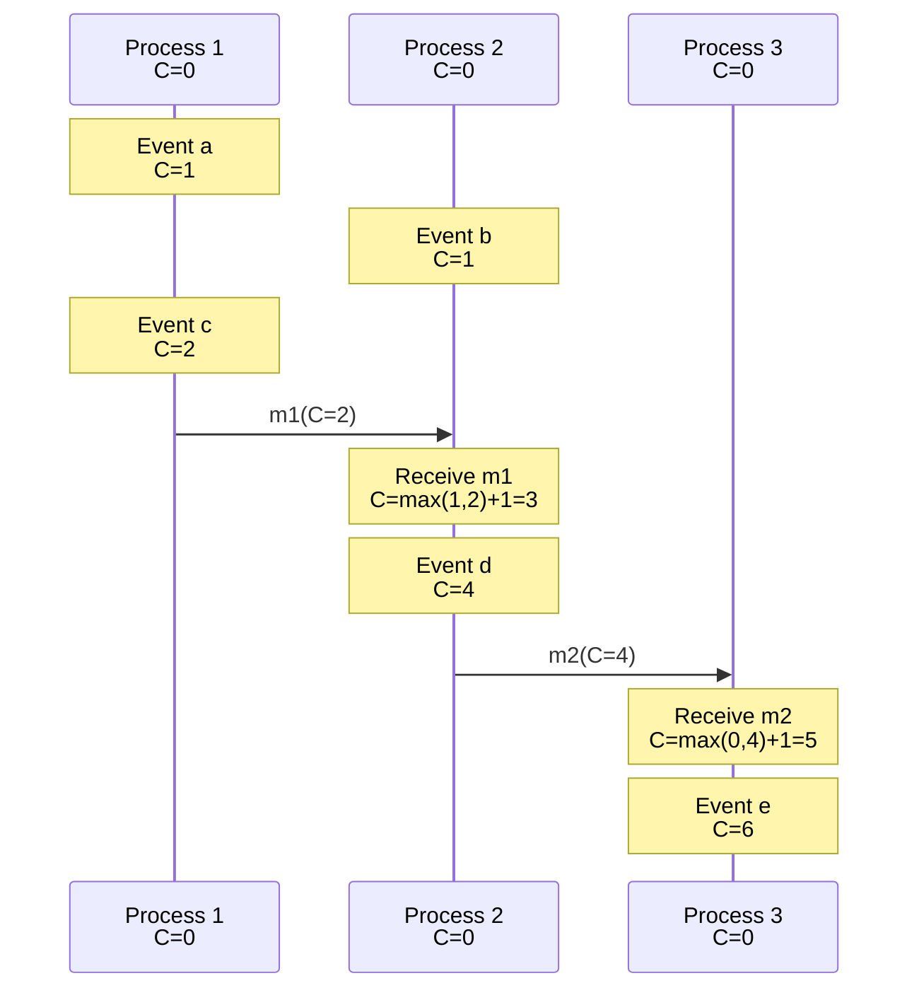
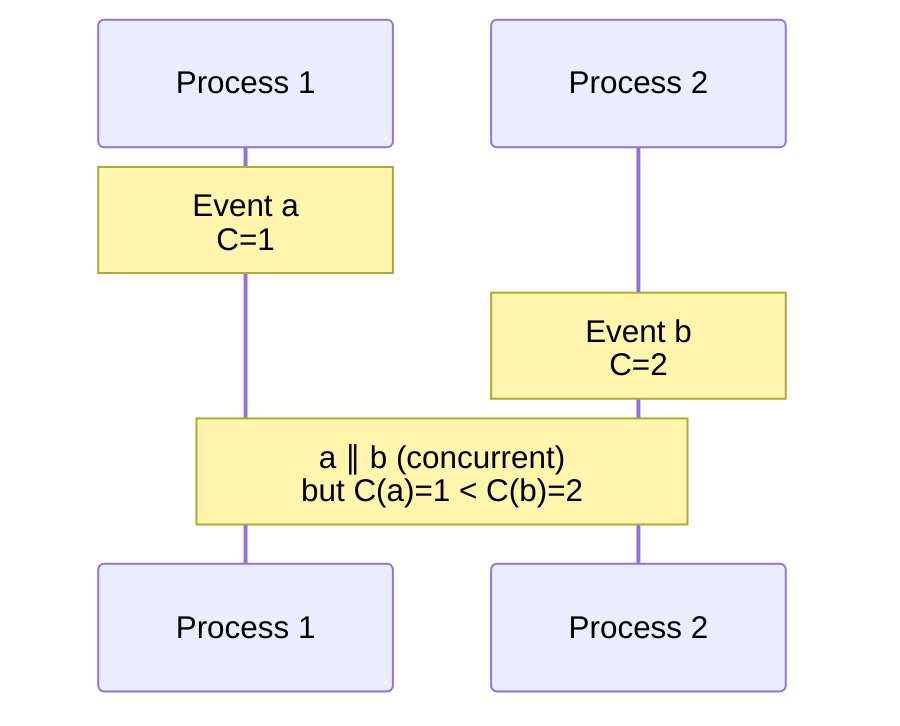

# Lamport Logical Clocks

## Introduction

In 1978, Leslie Lamport published "Time, Clocks, and the Ordering of Events in a Distributed System," one of the most influential papers in distributed systems. The paper introduced **logical clocks** - a simple yet elegant mechanism for ordering events in a distributed system without relying on synchronized physical clocks.

Lamport clocks solve a fundamental problem: how can we determine a consistent ordering of events across multiple processes when we cannot rely on physical clocks? The answer is surprisingly simple: use a counter that increments with each event and is updated when processes communicate. This counter, the Lamport clock, provides a total ordering of events that respects causality.

The beauty of Lamport clocks lies in their simplicity. Each process maintains a single integer counter. When an event occurs, the counter increments. When a message is sent, the counter value is included. When a message is received, the counter is updated to be greater than both the local counter and the received counter. These three simple rules ensure that if event $a$ happened before event $b$ (in the causal sense), then $a$'s timestamp is less than $b$'s timestamp.

This comprehensive exploration covers Lamport clocks from first principles through practical implementation. We'll examine the algorithm in detail, prove its correctness, explore its properties and limitations, implement it in code, and examine real-world applications from distributed databases to blockchain systems.

## The Algorithm

### Lamport Clock Rules

Each process $P_i$ maintains a logical clock $C_i$, initially 0. The clock is updated according to three rules:

**Rule 1 (Local events)**: Before executing an event, process $P_i$ increments its clock:
$$C_i := C_i + 1$$

**Rule 2 (Sending messages)**: When process $P_i$ sends message $m$, it includes its current clock value:
$$timestamp(m) = C_i$$

**Rule 3 (Receiving messages)**: When process $P_i$ receives message $m$ with timestamp $t_m$, it updates its clock:
$$C_i := max(C_i, t_m) + 1$$



### Basic Implementation

```python
class LamportClock:
    def __init__(self):
        self.time = 0

    def increment(self):
        """Increment clock for local event"""
        self.time += 1
        return self.time

    def send_event(self):
        """Get timestamp for sending message"""
        self.time += 1
        return self.time

    def receive_event(self, received_time):
        """Update clock on receiving message"""
        self.time = max(self.time, received_time) + 1
        return self.time

    def get_time(self):
        """Get current clock value"""
        return self.time

# Example usage
p1 = LamportClock()
p2 = LamportClock()

# Process 1: Local event
t1 = p1.increment()
print(f"P1: Event at time {t1}")  # P1: Event at time 1

# Process 1: Send message
send_time = p1.send_event()
print(f"P1: Send at time {send_time}")  # P1: Send at time 2

# Process 2: Receive message
recv_time = p2.receive_event(send_time)
print(f"P2: Receive at time {recv_time}")  # P2: Receive at time 3

# Process 2: Local event
t2 = p2.increment()
print(f"P2: Event at time {t2}")  # P2: Event at time 4
```

### Complete Process Implementation

```python
import socket
import threading
import pickle
import time

class LamportProcess:
    def __init__(self, process_id, port):
        self.id = process_id
        self.port = port
        self.clock = LamportClock()
        self.peers = []
        self.running = True

    def local_event(self, event_name):
        """Execute local event"""
        timestamp = self.clock.increment()
        self.log_event(event_name, timestamp)
        return timestamp

    def send_message(self, dest_port, message):
        """Send message to another process"""
        timestamp = self.clock.send_event()

        msg = {
            'from': self.id,
            'data': message,
            'timestamp': timestamp
        }

        self.log_event(f"Send to {dest_port}: {message}", timestamp)

        # Send via network
        sock = socket.socket(socket.AF_INET, socket.SOCK_DGRAM)
        sock.sendto(pickle.dumps(msg), ('localhost', dest_port))
        sock.close()

    def receive_loop(self):
        """Listen for incoming messages"""
        sock = socket.socket(socket.AF_INET, socket.SOCK_DGRAM)
        sock.bind(('localhost', self.port))
        sock.settimeout(1.0)

        while self.running:
            try:
                data, addr = sock.recvfrom(4096)
                msg = pickle.loads(data)

                # Update clock based on received timestamp
                timestamp = self.clock.receive_event(msg['timestamp'])

                self.log_event(
                    f"Receive from {msg['from']}: {msg['data']}",
                    timestamp
                )

                # Process message
                self.handle_message(msg)

            except socket.timeout:
                continue
            except Exception as e:
                print(f"Error receiving: {e}")

        sock.close()

    def handle_message(self, msg):
        """Override this to handle received messages"""
        pass

    def log_event(self, event, timestamp):
        """Log event with Lamport timestamp"""
        print(f"[P{self.id}][T={timestamp:3d}] {event}")

    def start(self):
        """Start receiving messages"""
        thread = threading.Thread(target=self.receive_loop, daemon=True)
        thread.start()

    def stop(self):
        """Stop the process"""
        self.running = False

# Example: Three processes communicating
if __name__ == "__main__":
    # Create processes
    p1 = LamportProcess(1, 5001)
    p2 = LamportProcess(2, 5002)
    p3 = LamportProcess(3, 5003)

    # Start receiving
    p1.start()
    p2.start()
    p3.start()

    time.sleep(0.1)  # Let servers start

    # Execute events
    p1.local_event("Initialize")
    p1.send_message(5002, "Hello P2")

    time.sleep(0.1)

    p2.local_event("Processing")
    p2.send_message(5003, "Hello P3")

    time.sleep(0.1)

    p3.local_event("Finalizing")
    p3.send_message(5001, "Done")

    time.sleep(0.5)

    # Stop all
    p1.stop()
    p2.stop()
    p3.stop()
```

## Properties of Lamport Clocks

### Clock Condition (Correctness)

**Theorem**: If event $a$ happened before event $b$ (written $a \rightarrow b$), then $C(a) < C(b)$.

**Proof** by induction on the happened-before relation:

**Base case 1** (Local ordering): If $a$ and $b$ are events in the same process with $a$ before $b$:
- By Rule 1, the clock increments between events
- Therefore $C(a) < C(b)$ ✓

**Base case 2** (Message ordering): If $a$ is sending message $m$ and $b$ is receiving $m$:
- By Rule 2, timestamp$(m) = C(a)$
- By Rule 3, $C(b) = max(C_b, timestamp(m)) + 1 > timestamp(m) = C(a)$
- Therefore $C(a) < C(b)$ ✓

**Inductive step** (Transitivity): If $a \rightarrow b$ and $b \rightarrow c$:
- By inductive hypothesis: $C(a) < C(b)$ and $C(b) < C(c)$
- By transitivity: $C(a) < C(c)$ ✓

Therefore, the clock condition holds for all happened-before relationships.

### Total Ordering

Lamport clocks provide a **total ordering** of events: for any two events $a$ and $b$, either $C(a) < C(b)$ or $C(b) < C(a)$ or $C(a) = C(b)$.

To break ties when $C(a) = C(b)$, use process IDs:

$$a \prec b \text{ if } C(a) < C(b) \text{ or } (C(a) = C(b) \text{ and } P_a < P_b)$$

```python
class TimestampedEvent:
    def __init__(self, timestamp, process_id, event_name):
        self.timestamp = timestamp
        self.process_id = process_id
        self.event_name = event_name

    def __lt__(self, other):
        """Total ordering: timestamp first, then process ID"""
        if self.timestamp != other.timestamp:
            return self.timestamp < other.timestamp
        return self.process_id < other.process_id

    def __repr__(self):
        return f"Event({self.event_name}, T={self.timestamp}, P={self.process_id})"

# Example: Ordering events
events = [
    TimestampedEvent(5, 2, "event_d"),
    TimestampedEvent(3, 1, "event_a"),
    TimestampedEvent(5, 1, "event_c"),
    TimestampedEvent(4, 3, "event_b"),
]

sorted_events = sorted(events)
for event in sorted_events:
    print(event)

# Output (total order):
# Event(event_a, T=3, P=1)
# Event(event_b, T=4, P=3)
# Event(event_c, T=5, P=1)  # Same timestamp as next, but lower process ID
# Event(event_d, T=5, P=2)
```

### Monotonicity

Lamport clocks are **monotonically increasing**: $C$ never decreases.

**Proof**:
- Rule 1: $C_i := C_i + 1$ (strictly increases)
- Rule 3: $C_i := max(C_i, t_m) + 1$ (cannot decrease)

This property is important because it ensures timestamps always move forward, even when receiving messages from the past.

## Limitations

### Cannot Determine Concurrency

**Problem**: $C(a) < C(b)$ does NOT imply $a \rightarrow b$

The converse of the clock condition does not hold. Events $a$ and $b$ can be concurrent ($a \parallel b$) even if $C(a) < C(b)$.



**Example**:
```python
p1 = LamportClock()
p2 = LamportClock()

# P1 event
a_time = p1.increment()  # a_time = 1

# P2 events (no communication)
p2.increment()  # 1
b_time = p2.increment()  # b_time = 2

print(f"C(a) = {a_time}")  # C(a) = 1
print(f"C(b) = {b_time}")  # C(b) = 2

# C(a) < C(b), but a and b are concurrent!
# Cannot determine if a→b or a∥b from timestamps alone
```

**Implication**: Lamport clocks can establish that $a \rightarrow b$ (if we know $C(a) < C(b)$ and there's a causal path), but cannot prove that $a \parallel b$.

To detect concurrency, we need **vector clocks** (next section).

### No Causality Information

Lamport clocks capture **total order** but lose **causality information**. We cannot determine from timestamps alone which events are causally related.

```python
# Given just timestamps, cannot reconstruct happened-before
events_with_timestamps = [
    ("a", 1),
    ("b", 2),
    ("c", 3),
    ("d", 4)
]

# Could be:
# Scenario 1: a→b→c→d (all causal)
# Scenario 2: a→c, b→d (two independent chains)
# Scenario 3: a→b, c, d (b causal from a, c and d concurrent)
# Cannot determine which from timestamps alone!
```

### Unbounded Growth

Lamport clocks grow without bound. In a long-running system, timestamps can become very large.

```python
# After many events
clock = LamportClock()
for _ in range(1_000_000):
    clock.increment()

print(clock.get_time())  # 1,000,000

# Potential issues:
# - Integer overflow (less of a problem with 64-bit integers)
# - Inefficient storage/transmission
# - Difficult to reason about very large numbers
```

**Mitigation strategies**:
- Use 64-bit integers (won't overflow in practice)
- Periodically reset clocks in coordinated manner (complex)
- Accept that timestamps grow large

## Practical Applications

### Distributed Mutual Exclusion

Lamport's original paper presented a distributed mutual exclusion algorithm using logical clocks:

```python
import heapq

class LamportMutex:
    def __init__(self, process_id, num_processes):
        self.id = process_id
        self.clock = LamportClock()
        self.queue = []  # Priority queue of requests
        self.replies = set()  # Received replies
        self.num_processes = num_processes

    def request_critical_section(self):
        """Request entry to critical section"""
        timestamp = self.clock.send_event()
        request = (timestamp, self.id)

        # Add own request to queue
        heapq.heappush(self.queue, request)

        # Send request to all other processes
        for i in range(1, self.num_processes + 1):
            if i != self.id:
                self.send_request(i, timestamp)

        # Wait for replies from all processes
        while len(self.replies) < self.num_processes - 1:
            self.wait_for_reply()

        # Wait until own request is at head of queue
        while self.queue[0] != request:
            self.wait_for_release()

    def receive_request(self, from_process, timestamp):
        """Handle request from another process"""
        self.clock.receive_event(timestamp)

        # Add to queue
        heapq.heappush(self.queue, (timestamp, from_process))

        # Send reply
        reply_time = self.clock.send_event()
        self.send_reply(from_process, reply_time)

    def receive_reply(self, from_process, timestamp):
        """Handle reply from another process"""
        self.clock.receive_event(timestamp)
        self.replies.add(from_process)

    def release_critical_section(self):
        """Release critical section"""
        # Remove own request from queue
        self.queue.pop(0)

        # Send release to all
        release_time = self.clock.send_event()
        for i in range(1, self.num_processes + 1):
            if i != self.id:
                self.send_release(i, release_time)

        # Clear replies for next request
        self.replies.clear()

    def receive_release(self, from_process, timestamp):
        """Handle release from another process"""
        self.clock.receive_event(timestamp)

        # Remove from queue
        self.queue = [(t, p) for t, p in self.queue if p != from_process]
        heapq.heapify(self.queue)
```

**Properties**:
- Ensures mutual exclusion (at most one in critical section)
- Requests granted in timestamp order (fairness)
- No central coordinator needed

### Consistent Database Snapshots

Lamport clocks can help create consistent snapshots across distributed databases:

```python
class DistributedDatabase:
    def __init__(self, node_id):
        self.node_id = node_id
        self.clock = LamportClock()
        self.data = {}
        self.snapshot_data = {}
        self.snapshot_time = None

    def write(self, key, value):
        """Write with Lamport timestamp"""
        timestamp = self.clock.increment()
        self.data[key] = (value, timestamp)
        self.log(f"Write {key}={value} at T={timestamp}")
        return timestamp

    def initiate_snapshot(self):
        """Initiate consistent snapshot"""
        self.snapshot_time = self.clock.increment()
        self.snapshot_data = {}

        # Include data written before snapshot time
        for key, (value, timestamp) in self.data.items():
            if timestamp <= self.snapshot_time:
                self.snapshot_data[key] = value

        self.log(f"Snapshot at T={self.snapshot_time}")
        return self.snapshot_time

    def get_snapshot(self):
        """Return snapshot data"""
        return self.snapshot_data.copy()
```

### Event Logging and Debugging

Lamport timestamps help understand distributed execution:

```python
class DistributedLogger:
    def __init__(self, process_id):
        self.id = process_id
        self.clock = LamportClock()
        self.logs = []

    def log(self, event_type, data):
        """Log event with Lamport timestamp"""
        timestamp = self.clock.increment()
        log_entry = {
            'process': self.id,
            'timestamp': timestamp,
            'type': event_type,
            'data': data,
            'wall_time': time.time()
        }
        self.logs.append(log_entry)
        return timestamp

    def log_send(self, dest, message):
        """Log message send"""
        timestamp = self.clock.send_event()
        log_entry = {
            'process': self.id,
            'timestamp': timestamp,
            'type': 'send',
            'dest': dest,
            'message': message,
            'wall_time': time.time()
        }
        self.logs.append(log_entry)
        return timestamp

    def log_receive(self, src, message, msg_timestamp):
        """Log message receive"""
        timestamp = self.clock.receive_event(msg_timestamp)
        log_entry = {
            'process': self.id,
            'timestamp': timestamp,
            'type': 'receive',
            'src': src,
            'message': message,
            'msg_timestamp': msg_timestamp,
            'wall_time': time.time()
        }
        self.logs.append(log_entry)
        return timestamp

    def reconstruct_timeline(self, all_logs):
        """Merge and sort logs from all processes"""
        merged = []
        for process_logs in all_logs:
            merged.extend(process_logs)

        # Sort by Lamport timestamp, then process ID
        merged.sort(key=lambda x: (x['timestamp'], x['process']))

        return merged

# Example usage
p1_logger = DistributedLogger(1)
p2_logger = DistributedLogger(2)

# P1 events
p1_logger.log('init', 'Starting')
send_ts = p1_logger.log_send(2, 'Hello')

# P2 events
p2_logger.log_receive(1, 'Hello', send_ts)
p2_logger.log('process', 'Handling message')

# Reconstruct timeline
timeline = p1_logger.reconstruct_timeline([p1_logger.logs, p2_logger.logs])
for entry in timeline:
    print(f"[P{entry['process']}][T={entry['timestamp']}] {entry['type']}: {entry.get('data', entry.get('message', ''))}")
```

### Blockchain and Distributed Ledgers

Lamport timestamps help order transactions:

```python
class BlockchainTransaction:
    def __init__(self, sender, receiver, amount, lamport_time):
        self.sender = sender
        self.receiver = receiver
        self.amount = amount
        self.lamport_time = lamport_time

    def __lt__(self, other):
        """Order transactions by Lamport time"""
        return self.lamport_time < other.lamport_time

class SimpleLedger:
    def __init__(self, node_id):
        self.node_id = node_id
        self.clock = LamportClock()
        self.pending_transactions = []

    def create_transaction(self, sender, receiver, amount):
        """Create transaction with Lamport timestamp"""
        timestamp = self.clock.increment()
        tx = BlockchainTransaction(sender, receiver, amount, timestamp)
        self.pending_transactions.append(tx)
        return tx

    def receive_transaction(self, tx, tx_lamport_time):
        """Receive transaction from another node"""
        self.clock.receive_event(tx_lamport_time)
        self.pending_transactions.append(tx)

    def get_ordered_transactions(self):
        """Get transactions in canonical order"""
        return sorted(self.pending_transactions)
```

## Comparison with Other Approaches

### Lamport Clocks vs Physical Clocks

| Aspect | Lamport Clocks | Physical Clocks |
|--------|----------------|-----------------|
| Synchronization | Not needed | Required (NTP, PTP) |
| Accuracy | Perfect causality tracking | Limited by network delay |
| Drift | No drift | Constant drift (~1s/day) |
| Concurrency detection | Cannot detect | Cannot detect |
| Overhead | Very low (integer increment) | Network overhead |
| Unbounded growth | Yes | No (wraps around) |

### Lamport Clocks vs Vector Clocks

| Aspect | Lamport Clocks | Vector Clocks |
|--------|----------------|---------------|
| Clock size | 1 integer | N integers (N = # processes) |
| Can detect concurrency | No | Yes |
| Causality information | Lost | Preserved |
| Overhead | Low | Higher |
| Total ordering | Yes (with process ID tie-breaker) | Partial ordering |
| Use case | When total order needed | When causality needed |

## Summary

Lamport logical clocks provide an elegant solution to ordering events in distributed systems without requiring synchronized physical clocks.

Key takeaways:

- **Lamport clocks** maintain a single counter that increments with local events and updates on message receipt
- **Clock condition**: If $a \rightarrow b$ then $C(a) < C(b)$ (captures happened-before)
- **Total ordering**: Can order all events, breaking ties with process IDs
- **Cannot detect concurrency**: $C(a) < C(b)$ doesn't imply $a \rightarrow b$
- **Applications**: Distributed mutual exclusion, consistent snapshots, event logging, blockchain ordering
- **Limitations**: Cannot detect concurrent events, loses causality information, unbounded growth

When to use Lamport clocks:
- Need total ordering of events
- Don't need to detect concurrency
- Want minimal overhead
- Building distributed mutual exclusion or consensus algorithms

When to use vector clocks instead:
- Need to detect concurrent events
- Need to preserve causality information
- Building replicated databases with conflict detection

Lamport clocks remain one of the most important concepts in distributed systems, providing the foundation for many coordination algorithms and influencing the design of systems from databases to blockchain platforms.
