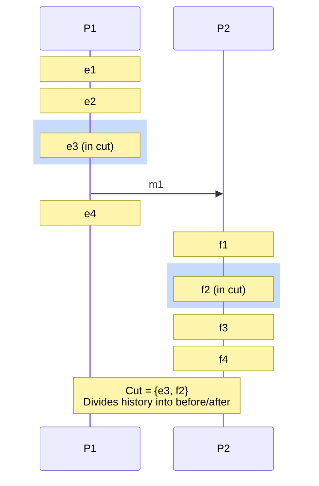
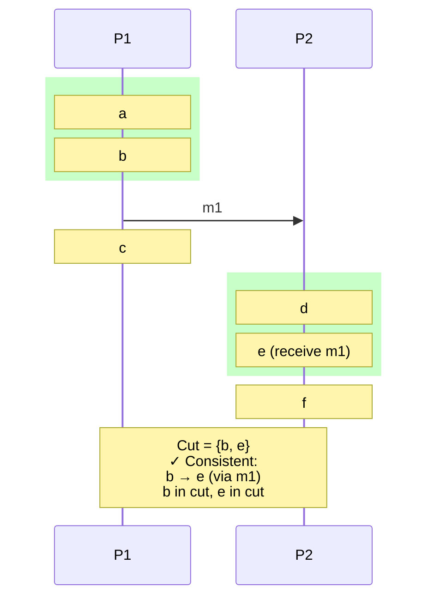
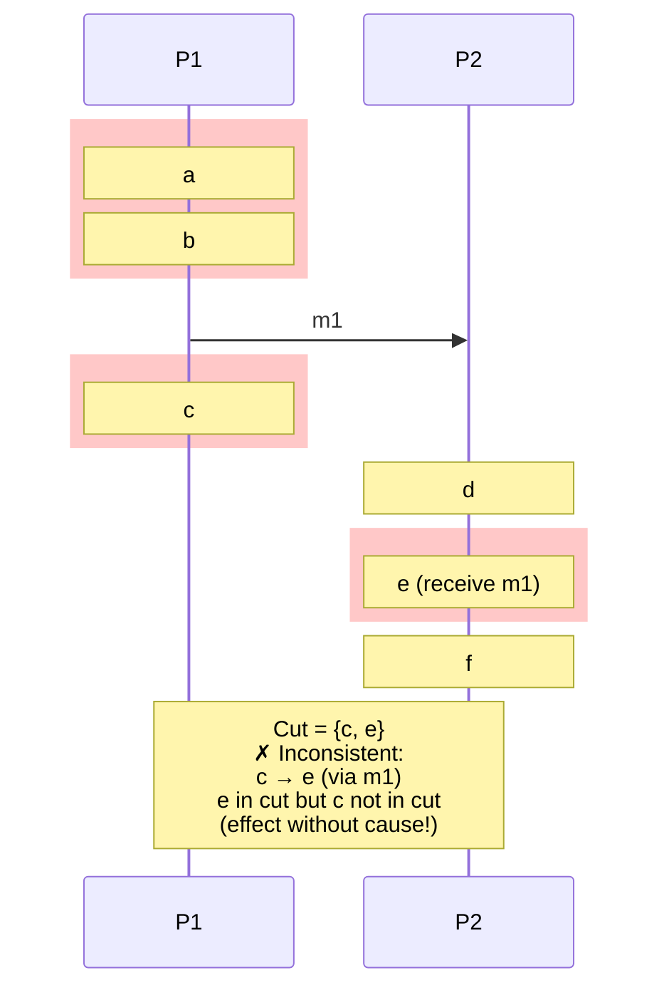

# Global State and Consistent Cuts

## Introduction

In a centralized system, determining the global state is trivial - simply pause execution and read all variables. In a distributed system, there is no global notion of "now," making it impossible to simultaneously observe the state of all processes. This fundamental challenge makes seemingly simple questions surprisingly difficult: What is the current state of the system? Has the system reached a particular state? Is a particular property true globally?

The concept of global state in distributed systems was formalized by Chandy and Lamport in their seminal 1985 paper on distributed snapshots. They introduced the notion of a **consistent cut** - a set of local states that could have existed simultaneously despite being observed at different times. This elegant solution allows us to capture meaningful global states even without perfect synchronization.

Understanding global state is essential for debugging distributed systems, implementing checkpoints for fault recovery, detecting deadlocks, termination detection, and monitoring system-wide properties. The challenge lies in capturing state while the system continues executing, ensuring the captured state is meaningful (consistent), and doing so without disrupting normal operation.

This exploration covers the fundamental concepts of global state, what makes a cut consistent, the happened-before relation's role in consistency, practical algorithms for capturing consistent cuts, and real-world applications from debugging to distributed debugging to garbage collection.

## The Global State Problem

### What is Global State?

The global state of a distributed system consists of:

1. **Local states**: The state of each process (variables, program counter, etc.)
2. **Channel states**: Messages in transit between processes

```mermaid
graph LR
    subgraph "Process P1"
        S1[Local State:<br/>x=5, y=10]
    end

    subgraph "Process P2"
        S2[Local State:<br/>a=20, b=30]
    end

    subgraph "Channels"
        C12[P1→P2: {msg1, msg2}]
        C21[P2→P1: {msg3}]
    end

    S1 -->|send| C12
    C12 -->|receive| S2
    S2 -->|send| C21
    C21 -->|receive| S1
```

**Global State** = (Local State P1, Local State P2, Channel State P1→P2, Channel State P2→P1)

### Why Capture Global State?

**Debugging**: Understand system behavior
- What were all processes doing when error occurred?
- What messages were in flight?
- Reproduce failure scenarios

**Checkpointing**: Save state for recovery
- Periodically save consistent state
- Rollback to last checkpoint on failure
- Avoid restarting from beginning

**Deadlock Detection**: Determine if system is deadlocked
- Capture global state
- Analyze wait-for graph
- Detect cycles indicating deadlock

**Termination Detection**: Determine if distributed computation has finished
- All processes idle
- No messages in transit
- Safe to conclude completion

**Monitoring**: Check system-wide invariants
- Total money in banking system
- Number of tokens in distributed algorithm
- Resource utilization across cluster

### The Challenge

Cannot instantaneously observe entire system:

```python
# This is IMPOSSIBLE in distributed systems:
def get_global_state():
    # Stop the world
    pause_all_processes()

    # Read all states
    states = {
        'p1': read_state(process1),
        'p2': read_state(process2),
        'channels': read_all_channels()
    }

    # Resume
    resume_all_processes()

    return states

# Why impossible:
# 1. No global clock to synchronize "pause"
# 2. Pausing would disrupt normal operation
# 3. Reading state takes time during which system changes
```

Instead, we must capture states at different times and ensure they form a **consistent** global state.

## Consistent Cuts

### Definition of a Cut

A **cut** is a set of local states, one from each process. Graphically, a cut divides the execution into "before" and "after":



### Consistent Cut

A cut is **consistent** if: whenever an event $e$ is in the cut and $e' \rightarrow e$ (e' happened-before e), then $e'$ is also in the cut.

**Intuitive explanation**: A consistent cut doesn't include an effect without its cause.

```python
def is_consistent_cut(cut, happened_before):
    """
    Check if cut is consistent.

    Args:
        cut: Set of events in the cut
        happened_before: Function that returns True if e1 → e2
    """
    for event in cut:
        # Find all events that happened-before this event
        for other_event in all_events:
            if happened_before(other_event, event):
                # If e' → e and e is in cut, e' must be in cut
                if other_event not in cut:
                    return False  # Inconsistent!
    return True
```

### Examples

**Consistent Cut**:



**Inconsistent Cut**:



### Consistent Cut Properties

**Theorem**: A cut C is consistent if and only if for all events $e \in C$ and $e' \notin C$, we have $e \not\rightarrow e'$.

**Proof**:
- **Forward**: If C is consistent, then any event not in C cannot have happened before an event in C (by definition of consistent cut)
- **Reverse**: If no event in C happened-before an event not in C, then C includes all causes of events in C, so it's consistent

**Implication**: Consistent cuts correspond to possible global states - states that could have actually existed at some point.

### Frontier of a Cut

The **frontier** of a cut is the set of most recent events in each process:

```python
class Cut:
    def __init__(self, num_processes):
        # Frontier: latest event in each process included in cut
        self.frontier = [None] * num_processes

    def advance(self, process_id, event):
        """Advance frontier for a process"""
        self.frontier[process_id] = event

    def includes(self, event):
        """Check if event is in the cut"""
        process_id = event.process_id
        frontier_event = self.frontier[process_id]

        if frontier_event is None:
            return False

        # Event is in cut if it happened before or at frontier
        return (event.timestamp <= frontier_event.timestamp or
                event == frontier_event)
```

## Implementing Consistent Cuts

### Using Vector Clocks

Vector clocks make it easy to determine consistent cuts:

```python
class ConsistentCutDetector:
    def __init__(self, num_processes):
        self.num_processes = num_processes
        self.cut_vector = [0] * num_processes

    def propose_cut(self, vector_clocks):
        """
        Propose a cut based on vector clock values.

        Args:
            vector_clocks: List of vector clocks, one per process
        """
        # Cut is the minimum across all vector clocks
        self.cut_vector = [float('inf')] * self.num_processes

        for vc in vector_clocks:
            for i in range(self.num_processes):
                self.cut_vector[i] = min(self.cut_vector[i], vc[i])

        return self.cut_vector

    def is_in_cut(self, event_vector):
        """Check if event (with given vector clock) is in cut"""
        # Event is in cut if its vector clock ≤ cut vector
        return all(event_vector[i] <= self.cut_vector[i]
                  for i in range(self.num_processes))

# Example
num_procs = 3

# Events with their vector clocks
events = [
    {'name': 'a', 'process': 0, 'vc': [1, 0, 0]},
    {'name': 'b', 'process': 0, 'vc': [2, 0, 0]},
    {'name': 'c', 'process': 1, 'vc': [2, 1, 0]},
    {'name': 'd', 'process': 1, 'vc': [2, 2, 0]},
    {'name': 'e', 'process': 2, 'vc': [2, 2, 1]},
]

detector = ConsistentCutDetector(num_procs)

# Propose cut at vector [2, 1, 0]
cut = detector.propose_cut([[2, 0, 0], [2, 1, 0], [0, 0, 0]])

print(f"Cut vector: {cut}")
for event in events:
    if detector.is_in_cut(event['vc']):
        print(f"  {event['name']} ✓ in cut")
    else:
        print(f"  {event['name']} ✗ not in cut")
```

### Recording Channel State

A consistent cut must include channel states - messages sent but not yet received:

```python
class ChannelState:
    def __init__(self):
        self.messages = []

    def record_send(self, message):
        """Record message sent on this channel"""
        self.messages.append(message)

    def record_receive(self, message):
        """Remove message from channel when received"""
        if message in self.messages:
            self.messages.remove(message)

    def get_in_transit_messages(self):
        """Get messages currently in transit"""
        return self.messages.copy()

class ProcessWithChannelTracking:
    def __init__(self, process_id, num_processes):
        self.id = process_id
        self.vc = VectorClock(process_id, num_processes)

        # Track channels to each other process
        self.outgoing_channels = {
            i: ChannelState() for i in range(num_processes) if i != process_id
        }

    def send(self, dest_id, message):
        """Send message and track in channel"""
        clock = self.vc.send_event()
        message.vector_clock = clock

        # Record in outgoing channel
        self.outgoing_channels[dest_id].record_send(message)

        # Actually send message
        self.transmit(dest_id, message)

    def receive(self, message):
        """Receive message and update channel"""
        self.vc.receive_event(message.vector_clock)

        # Record message as received (removes from channel)
        source_id = message.source_id
        self.outgoing_channels[source_id].record_receive(message)

    def get_channel_state(self):
        """Get current state of all channels"""
        channel_states = {}
        for dest_id, channel in self.outgoing_channels.items():
            channel_states[dest_id] = channel.get_in_transit_messages()
        return channel_states
```

## Applications

### Distributed Debugging

Capturing consistent cuts helps debug distributed systems:

```python
class DistributedDebugger:
    def __init__(self, num_processes):
        self.num_processes = num_processes
        self.snapshots = []

    def capture_snapshot(self, local_states, channel_states):
        """Capture a consistent global snapshot"""
        snapshot = {
            'timestamp': time.time(),
            'local_states': local_states,
            'channel_states': channel_states,
            'cut_vector': self.compute_cut_vector(local_states)
        }
        self.snapshots.append(snapshot)
        return snapshot

    def compute_cut_vector(self, local_states):
        """Compute vector clock for the cut"""
        cut_vector = [0] * self.num_processes
        for i, state in enumerate(local_states):
            cut_vector[i] = state['vector_clock'][i]
        return cut_vector

    def check_invariant(self, snapshot, invariant_func):
        """Check if invariant holds in snapshot"""
        return invariant_func(snapshot)

    def find_violation(self, invariant_func):
        """Find first snapshot violating invariant"""
        for i, snapshot in enumerate(self.snapshots):
            if not self.check_invariant(snapshot, invariant_func):
                return i, snapshot
        return None, None

# Example: Banking system invariant
def banking_invariant(snapshot):
    """Total money should be constant"""
    total = 0
    for state in snapshot['local_states']:
        total += state['balance']

    # Add money in transit
    for channel_messages in snapshot['channel_states'].values():
        for msg in channel_messages:
            if msg['type'] == 'transfer':
                total += msg['amount']

    EXPECTED_TOTAL = 1000
    return total == EXPECTED_TOTAL

debugger = DistributedDebugger(3)

# ... system runs, captures snapshots ...

# Check for invariant violations
violation_idx, violation = debugger.find_violation(banking_invariant)
if violation:
    print(f"Invariant violated at snapshot {violation_idx}")
    print(f"Details: {violation}")
```

### Checkpoint and Recovery

Save consistent checkpoints for failure recovery:

```python
class CheckpointCoordinator:
    def __init__(self, num_processes):
        self.num_processes = num_processes
        self.checkpoints = []

    def initiate_checkpoint(self):
        """Initiate distributed checkpoint"""
        checkpoint_id = len(self.checkpoints)

        # Broadcast checkpoint request to all processes
        for process_id in range(self.num_processes):
            self.send_checkpoint_request(process_id, checkpoint_id)

    def collect_checkpoint(self, process_id, local_state, channel_states):
        """Collect checkpoint from a process"""
        checkpoint = {
            'process_id': process_id,
            'local_state': local_state,
            'channel_states': channel_states,
            'timestamp': time.time()
        }

        # Store checkpoint
        self.store_checkpoint(checkpoint)

    def verify_consistency(self, checkpoint_id):
        """Verify collected checkpoint is consistent"""
        checkpoints = self.get_checkpoints_for_id(checkpoint_id)

        # Build happened-before graph
        # Check no message received in checkpoint was sent after checkpoint

        for cp in checkpoints:
            for channel in cp['channel_states']:
                for msg in channel['messages']:
                    # Verify message was sent before checkpoint
                    if not self.sent_before_checkpoint(msg, checkpoints):
                        return False

        return True

    def recover_from_checkpoint(self, checkpoint_id):
        """Recover system from checkpoint"""
        checkpoints = self.get_checkpoints_for_id(checkpoint_id)

        for cp in checkpoints:
            process_id = cp['process_id']
            # Restore local state
            self.restore_process_state(process_id, cp['local_state'])

            # Resend messages that were in transit
            for dest_id, messages in cp['channel_states'].items():
                for msg in messages:
                    self.resend_message(process_id, dest_id, msg)
```

### Deadlock Detection

Use consistent cuts to detect deadlocks:

```python
class DeadlockDetector:
    def __init__(self, num_processes):
        self.num_processes = num_processes

    def build_wait_for_graph(self, snapshot):
        """Build wait-for graph from snapshot"""
        graph = {i: set() for i in range(self.num_processes)}

        for state in snapshot['local_states']:
            process_id = state['process_id']

            if state['waiting_for'] is not None:
                # Process is waiting for another process
                waiting_for = state['waiting_for']
                graph[process_id].add(waiting_for)

        return graph

    def has_cycle(self, graph):
        """Detect cycle in wait-for graph (indicates deadlock)"""
        visited = set()
        rec_stack = set()

        def dfs(node):
            visited.add(node)
            rec_stack.add(node)

            for neighbor in graph[node]:
                if neighbor not in visited:
                    if dfs(neighbor):
                        return True
                elif neighbor in rec_stack:
                    return True  # Cycle found!

            rec_stack.remove(node)
            return False

        for node in graph:
            if node not in visited:
                if dfs(node):
                    return True

        return False

    def detect_deadlock(self, snapshot):
        """Detect if deadlock exists in snapshot"""
        wait_for_graph = self.build_wait_for_graph(snapshot)
        return self.has_cycle(wait_for_graph)

# Example usage
detector = DeadlockDetector(4)

snapshot = {
    'local_states': [
        {'process_id': 0, 'waiting_for': 1},  # P0 waits for P1
        {'process_id': 1, 'waiting_for': 2},  # P1 waits for P2
        {'process_id': 2, 'waiting_for': 0},  # P2 waits for P0 - CYCLE!
        {'process_id': 3, 'waiting_for': None},  # P3 not waiting
    ]
}

if detector.detect_deadlock(snapshot):
    print("Deadlock detected!")
```

### Termination Detection

Determine if distributed computation has finished:

```python
class TerminationDetector:
    def __init__(self, num_processes):
        self.num_processes = num_processes

    def is_terminated(self, snapshot):
        """Check if computation has terminated"""
        # Terminated if:
        # 1. All processes are idle
        # 2. No messages in transit

        # Check all processes idle
        for state in snapshot['local_states']:
            if state['active']:
                return False  # At least one process active

        # Check no messages in transit
        for channel_states in snapshot['channel_states'].values():
            if len(channel_states) > 0:
                return False  # Messages still in transit

        return True  # All idle, no messages - terminated!

# Example
detector = TerminationDetector(3)

snapshot = {
    'local_states': [
        {'process_id': 0, 'active': False},
        {'process_id': 1, 'active': False},
        {'process_id': 2, 'active': False},
    ],
    'channel_states': {
        (0, 1): [],
        (0, 2): [],
        (1, 0): [],
        (1, 2): [],
        (2, 0): [],
        (2, 1): [],
    }
}

if detector.is_terminated(snapshot):
    print("Computation has terminated")
```

## Common Pitfalls

### Pitfall 1: Ignoring Channel State

**Problem**: Only recording local states, forgetting messages in transit

```python
# WRONG: Incomplete snapshot
snapshot = {
    'process_states': [state1, state2, state3]
    # Missing: channel states!
}

# Can lead to inconsistencies:
# - Money in transit not accounted for
# - Messages lost on recovery
```

**Solution**: Always include channel state

### Pitfall 2: Using Physical Time

**Problem**: Relying on wall-clock time to define cuts

```python
# WRONG: Using wall-clock time
cut_time = time.time()
snapshot = {
    p: state for p, state in all_states
    if state.timestamp <= cut_time
}
# Clock skew makes this inconsistent!
```

**Solution**: Use logical time (vector clocks, Lamport clocks)

### Pitfall 3: Not Verifying Consistency

**Problem**: Assuming collected snapshots are automatically consistent

**Solution**: Verify consistency before using snapshot

```python
def verify_snapshot_consistency(snapshot):
    """Verify no message received before being sent"""
    for process_snapshot in snapshot['local_states']:
        for received_msg in process_snapshot['received_messages']:
            # Find when message was sent
            sender = received_msg['sender']
            sender_snapshot = snapshot['local_states'][sender]

            # Check message was sent in sender's snapshot
            if received_msg not in sender_snapshot['sent_messages']:
                return False  # Inconsistent!

    return True
```

## Summary

Global state and consistent cuts are fundamental concepts for understanding and managing distributed systems.

Key takeaways:

- **Global state** consists of local process states and channel states (messages in transit)
- **Consistent cut** includes an event only if it includes all events that happened-before it
- **Inconsistent cuts** include effects without causes, representing impossible states
- **Vector clocks** enable efficient detection of consistent cuts
- **Channel state** must be included in snapshots to maintain consistency
- **Applications**: debugging, checkpointing, deadlock detection, termination detection, invariant checking

When capturing global state:
1. Use logical time (vector clocks), not physical time
2. Include channel states (messages in transit)
3. Verify consistency before using snapshot
4. Consider using Chandy-Lamport algorithm (next section)
5. Test with failure scenarios

Understanding consistent cuts is essential for building robust distributed systems that can be debugged, monitored, and recovered from failures correctly.
