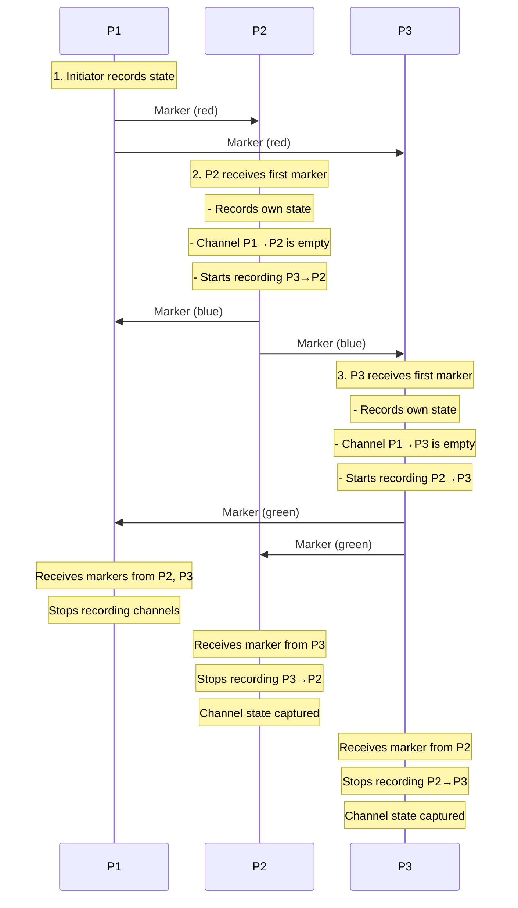

# Distributed Snapshots: Chandy-Lamport Algorithm

## Introduction

The Chandy-Lamport algorithm, published in 1985 by K. Mani Chandy and Leslie Lamport, is one of the most elegant and influential algorithms in distributed systems. It solves the problem of capturing a consistent global snapshot of a distributed system while the system continues to execute normally. This seemingly impossible task - taking a photograph of a moving system - is accomplished through a clever use of marker messages.

The algorithm's beauty lies in its simplicity. It requires only two types of messages (application messages and marker messages), makes minimal assumptions about the system (FIFO channels and reliable delivery), and captures a consistent snapshot without pausing execution. The algorithm has been used in countless production systems for checkpointing, deadlock detection, debugging, and monitoring.

What makes Chandy-Lamport particularly remarkable is that it guarantees the captured snapshot represents a consistent cut - a global state that could have actually occurred - even though different processes record their states at different physical times. This is achieved by using marker messages to delineate the "before" and "after" portions of the snapshot.

## The Algorithm

### System Model

**Assumptions**:
1. **FIFO channels**: Messages on a channel are received in the order sent
2. **Reliable delivery**: Messages are not lost
3. **Strongly connected**: Every process can reach every other process
4. **Processes don't fail**: (Can be relaxed)

### Algorithm Description

**Marker Sending Rule** (for process $P_i$):
1. $P_i$ records its own state
2. For each outgoing channel $C$, send a marker on $C$ before sending further messages

**Marker Receiving Rule** (for process $P_i$ receiving marker on channel $C$):
1. If first marker received:
   - Record own state
   - Mark channel $C$ as empty
   - Start recording on all other incoming channels
   - Send markers on all outgoing channels
2. If not first marker:
   - Stop recording on channel $C$
   - Channel state = messages recorded on $C$



### Implementation

```python
import socket
import threading
import pickle
import time
from enum import Enum

class MessageType(Enum):
    APPLICATION = 1
    MARKER = 2

class ChandyLamportProcess:
    def __init__(self, process_id, num_processes, port, peer_ports):
        self.id = process_id
        self.num_processes = num_processes
        self.port = port
        self.peer_ports = peer_ports

        # Local state
        self.state = {'balance': 100, 'data': []}

        # Snapshot state
        self.snapshot_in_progress = False
        self.recorded_state = None
        self.channel_states = {i: [] for i in range(num_processes) if i != process_id}
        self.markers_received = set()

        # Recording flags for each channel
        self.recording_channel = {i: False for i in range(num_processes) if i != process_id}

        self.running = True

    def initiate_snapshot(self):
        """Initiate snapshot (can be any process)"""
        print(f"[P{self.id}] Initiating snapshot")

        # Record own state
        self.recorded_state = self.state.copy()
        self.snapshot_in_progress = True

        print(f"[P{self.id}] Recorded state: {self.recorded_state}")

        # Send markers on all outgoing channels
        for peer_id, peer_port in enumerate(self.peer_ports):
            if peer_id != self.id:
                self.send_marker(peer_port)

    def send_marker(self, dest_port):
        """Send marker message"""
        marker = {
            'type': MessageType.MARKER,
            'from': self.id
        }
        self.send(dest_port, marker)
        print(f"[P{self.id}] Sent marker to port {dest_port}")

    def send_application_message(self, dest_port, data):
        """Send application message"""
        msg = {
            'type': MessageType.APPLICATION,
            'from': self.id,
            'data': data
        }
        self.send(dest_port, msg)

    def send(self, dest_port, msg):
        """Send message via network"""
        try:
            sock = socket.socket(socket.AF_INET, socket.SOCK_DGRAM)
            sock.sendto(pickle.dumps(msg), ('localhost', dest_port))
            sock.close()
        except Exception as e:
            print(f"[P{self.id}] Error sending: {e}")

    def receive_loop(self):
        """Listen for messages"""
        sock = socket.socket(socket.AF_INET, socket.SOCK_DGRAM)
        sock.bind(('localhost', self.port))
        sock.settimeout(1.0)

        while self.running:
            try:
                data, addr = sock.recvfrom(4096)
                msg = pickle.loads(data)

                if msg['type'] == MessageType.MARKER:
                    self.handle_marker(msg)
                elif msg['type'] == MessageType.APPLICATION:
                    self.handle_application_message(msg)

            except socket.timeout:
                continue
            except Exception as e:
                print(f"[P{self.id}] Error receiving: {e}")

        sock.close()

    def handle_marker(self, marker):
        """Handle received marker"""
        from_process = marker['from']
        print(f"[P{self.id}] Received marker from P{from_process}")

        if not self.snapshot_in_progress:
            # First marker received
            print(f"[P{self.id}] First marker - initiating snapshot")

            # Record own state
            self.recorded_state = self.state.copy()
            self.snapshot_in_progress = True

            # Channel from sender is empty
            self.channel_states[from_process] = []

            # Start recording on other channels
            for peer_id in range(self.num_processes):
                if peer_id != self.id and peer_id != from_process:
                    self.recording_channel[peer_id] = True
                    print(f"[P{self.id}] Started recording channel from P{peer_id}")

            # Send markers on outgoing channels
            for peer_id, peer_port in enumerate(self.peer_ports):
                if peer_id != self.id:
                    self.send_marker(peer_port)

        else:
            # Not first marker
            # Stop recording on this channel
            if self.recording_channel[from_process]:
                self.recording_channel[from_process] = False
                print(f"[P{self.id}] Stopped recording channel from P{from_process}")
                print(f"[P{self.id}] Channel state P{from_process}→P{self.id}: {self.channel_states[from_process]}")

        self.markers_received.add(from_process)

        # Check if snapshot is complete
        if len(self.markers_received) == self.num_processes - 1:
            self.snapshot_complete()

    def handle_application_message(self, msg):
        """Handle application message"""
        from_process = msg['from']
        data = msg['data']

        # If recording this channel, save message
        if self.recording_channel.get(from_process, False):
            self.channel_states[from_process].append(data)
            print(f"[P{self.id}] Recorded message in channel P{from_process}→P{self.id}: {data}")

        # Process message (update local state)
        self.state['data'].append(data)
        print(f"[P{self.id}] Received application message from P{from_process}: {data}")

    def snapshot_complete(self):
        """All markers received - snapshot complete"""
        print(f"\n[P{self.id}] ===== SNAPSHOT COMPLETE =====")
        print(f"[P{self.id}] Local state: {self.recorded_state}")
        for channel_id, messages in self.channel_states.items():
            print(f"[P{self.id}] Channel P{channel_id}→P{self.id}: {messages}")
        print(f"[P{self.id}] =============================\n")

    def start(self):
        """Start process"""
        thread = threading.Thread(target=self.receive_loop, daemon=True)
        thread.start()

    def stop(self):
        """Stop process"""
        self.running = False

# Example usage
if __name__ == "__main__":
    # Create 3 processes
    ports = [7001, 7002, 7003]

    p1 = ChandyLamportProcess(0, 3, ports[0], ports)
    p2 = ChandyLamportProcess(1, 3, ports[1], ports)
    p3 = ChandyLamportProcess(2, 3, ports[2], ports)

    # Start all
    p1.start()
    p2.start()
    p3.start()

    time.sleep(0.2)

    # Send some application messages
    p1.send_application_message(ports[1], "msg1_from_p1")
    p2.send_application_message(ports[2], "msg1_from_p2")

    time.sleep(0.2)

    # P1 initiates snapshot
    p1.initiate_snapshot()

    # Send more messages after snapshot initiated
    time.sleep(0.1)
    p2.send_application_message(ports[2], "msg2_from_p2")
    p3.send_application_message(ports[0], "msg1_from_p3")

    # Wait for completion
    time.sleep(2)

    # Stop all
    p1.stop()
    p2.stop()
    p3.stop()
```

## Correctness

### Consistency Proof

**Theorem**: The Chandy-Lamport algorithm captures a consistent global snapshot.

**Proof sketch**:
1. Let $S_i$ be the state recorded by process $P_i$
2. Let $SC_{ij}$ be the state of channel $C_{ij}$ (from $P_i$ to $P_j$)
3. The snapshot is consistent if it corresponds to a consistent cut

**Key insight**: The markers act as a "cut" through the execution:
- Messages sent before marker are "before" the cut
- Messages sent after marker are "after" the cut

**Why consistent**:
- If message $m$ is in channel state $SC_{ij}$, then:
  - $m$ was sent by $P_i$ before $P_i$ recorded its state (before marker sent)
  - $m$ was received by $P_j$ after $P_j$ recorded its state (between first marker and marker from $P_i$)
  - Therefore, the send event is in the cut, receive event is not
  - This is consistent (includes cause without effect)

- If message $m$ is not in any channel state:
  - Either $m$ was sent and received before snapshot (both in cut) ✓
  - Or $m$ was sent and received after snapshot (both not in cut) ✓
  - Or $m$ was sent after, received before (impossible due to markers!)

### Properties

**Termination**: Algorithm terminates in finite time (assuming reliable delivery and finite delays)

**Liveness**: Every process eventually records a snapshot

**Safety**: Recorded snapshot is consistent

## Applications

### Checkpointing

```python
class CheckpointingSystem:
    def __init__(self, process_id, num_processes, port, peer_ports):
        self.chandy_lamport = ChandyLamportProcess(process_id, num_processes, port, peer_ports)
        self.checkpoint_interval = 60  # seconds
        self.checkpoints = []

    def start_periodic_checkpointing(self):
        """Periodically initiate snapshots for checkpointing"""
        def checkpoint_loop():
            while self.chandy_lamport.running:
                time.sleep(self.checkpoint_interval)
                self.initiate_checkpoint()

        thread = threading.Thread(target=checkpoint_loop, daemon=True)
        thread.start()

    def initiate_checkpoint(self):
        """Initiate a checkpoint"""
        print(f"[Checkpoint] Initiating checkpoint at {time.time()}")
        self.chandy_lamport.initiate_snapshot()

    def save_checkpoint(self, snapshot):
        """Save checkpoint to stable storage"""
        checkpoint = {
            'timestamp': time.time(),
            'local_state': snapshot['local_state'],
            'channel_states': snapshot['channel_states']
        }
        self.checkpoints.append(checkpoint)
        # In production: write to disk
        self.write_to_disk(checkpoint)

    def recover_from_checkpoint(self):
        """Recover from latest checkpoint"""
        if not self.checkpoints:
            return None

        latest = self.checkpoints[-1]
        self.chandy_lamport.state = latest['local_state'].copy()
        return latest
```

### Stable Property Detection

```python
class StablePropertyDetector:
    def __init__(self):
        self.snapshots = []

    def detect_stable_property(self, property_func):
        """
        Detect if a stable property holds.
        Stable property: once true, remains true
        """
        for snapshot in self.snapshots:
            if property_func(snapshot):
                return True  # Property holds!
        return False

# Example: Termination detection
def is_terminated(snapshot):
    """Check if computation has terminated"""
    # All processes idle
    all_idle = all(
        state['status'] == 'idle'
        for state in snapshot['local_states']
    )

    # No messages in transit
    no_messages = all(
        len(channel) == 0
        for channel in snapshot['channel_states'].values()
    )

    return all_idle and no_messages

detector = StablePropertyDetector()
# ... collect snapshots ...

if detector.detect_stable_property(is_terminated):
    print("Computation has terminated")
```

## Practical Considerations

### Optimizations

**1. Piggybacking markers**:
```python
def send_with_marker(self, dest_port, app_msg, include_marker=False):
    """Piggyback marker on application message"""
    msg = {
        'type': MessageType.APPLICATION,
        'data': app_msg,
        'marker': include_marker,
        'from': self.id
    }
    self.send(dest_port, msg)
```

**2. Incremental snapshots**: Only record changes since last snapshot

**3. Compression**: Compress snapshot data before storage

### Handling Failures

```python
class FaultTolerantSnapshot:
    def __init__(self):
        self.timeout = 30  # seconds

    def initiate_with_timeout(self):
        """Initiate snapshot with timeout"""
        start_time = time.time()

        while not self.snapshot_complete():
            if time.time() - start_time > self.timeout:
                # Timeout - some process may have failed
                self.handle_failure()
                break

            time.sleep(0.1)

    def handle_failure(self):
        """Handle process failure during snapshot"""
        # Identify missing processes
        missing = self.find_missing_processes()

        # Exclude failed processes from snapshot
        # Or retry with different initiator
```

## Summary

The Chandy-Lamport algorithm provides an elegant solution for capturing consistent global snapshots in distributed systems.

Key takeaways:

- **Marker messages** delineate "before" and "after" portions of snapshot
- **FIFO channels** ensure markers arrive in order, maintaining consistency
- **No pause required** - system continues executing normally
- **Consistent snapshot** guaranteed - represents a possible global state
- **Applications**: checkpointing, deadlock detection, termination detection, monitoring
- **Assumptions**: FIFO channels, reliable delivery, strongly connected graph

Practical considerations:
- Optimize by piggybacking markers on application messages
- Handle failures with timeouts and retries
- Compress snapshots for storage efficiency
- Use incremental snapshots for large state spaces

Chandy-Lamport remains one of the most important algorithms in distributed systems, enabling robust checkpointing and monitoring in production systems worldwide.
