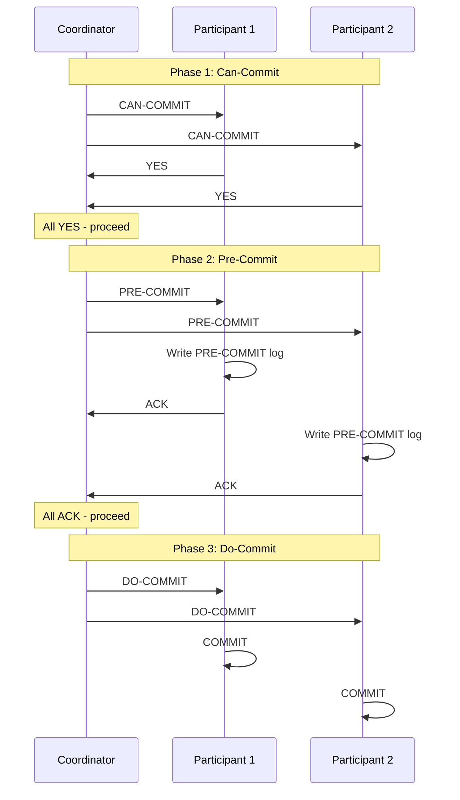

# Three-Phase Commit Protocol

## Introduction

Three-Phase Commit (3PC) extends Two-Phase Commit to address the blocking problem. By adding a third phase (pre-commit), 3PC ensures that participants can make progress even when the coordinator fails. The key insight is to separate the voting phase from the point-of-no-return, allowing participants to timeout and safely abort if the coordinator crashes.

The protocol achieves non-blocking behavior by ensuring that all participants reach a "pre-committed" state before anyone commits. This way, if the coordinator fails, participants can ask each other about the transaction state and safely decide to commit or abort based on whether anyone reached the pre-committed state.

However, 3PC is not perfect - it makes stronger assumptions about network behavior (synchronous or partially synchronous) and can still violate safety during network partitions. Despite these limitations, understanding 3PC provides important insights into consensus protocols.

## The Protocol

**Phase 1: Can-Commit (Voting)**
- Coordinator sends CAN-COMMIT
- Participants vote YES or NO

**Phase 2: Pre-Commit (Point of No Return)**
- If all YES: Coordinator sends PRE-COMMIT
- Participants acknowledge and prepare to commit
- Crucially: NO commits yet!

**Phase 3: Do-Commit (Actual Commit)**
- Coordinator sends DO-COMMIT
- Participants commit and release locks



## Key Difference from 2PC

**2PC**: After voting YES, participant must wait for coordinator
**3PC**: After PRE-COMMIT, participant knows everyone voted YES

```python
# 2PC: Uncertain state after YES
def two_pc_participant():
    vote_yes()
    # BLOCKED - don't know if others voted YES
    decision = wait_for_coordinator()  # Might wait forever

# 3PC: Certain state after PRE-COMMIT
def three_pc_participant():
    vote_yes()
    receive_pre_commit()
    # KNOW everyone voted YES
    # Can timeout and commit if coordinator fails
```

## Implementation

```python
class ThreePhaseCommitCoordinator:
    def __init__(self, participants):
        self.participants = participants
        self.state = 'INIT'

    def execute_transaction(self, operations):
        """Execute transaction using 3PC"""
        tx_id = generate_tx_id()

        # Phase 1: Can-Commit
        votes = self.can_commit_phase(tx_id, operations)

        if not all(votes):
            self.abort_phase(tx_id)
            return False

        # Phase 2: Pre-Commit
        try:
            self.pre_commit_phase(tx_id)
        except Timeout:
            # Failed during pre-commit - abort
            self.abort_phase(tx_id)
            return False

        # Phase 3: Do-Commit
        self.do_commit_phase(tx_id)

        return True

    def can_commit_phase(self, tx_id, operations):
        """Phase 1: Vote"""
        self.state = 'WAIT'
        votes = []

        for p in self.participants:
            try:
                vote = p.can_commit(tx_id, operations)
                votes.append(vote == 'YES')
            except Timeout:
                votes.append(False)

        return votes

    def pre_commit_phase(self, tx_id):
        """Phase 2: Pre-commit"""
        self.state = 'PRECOMMIT'
        self.write_log(f"{tx_id}: PRECOMMIT")

        for p in self.participants:
            p.pre_commit(tx_id)
            # Wait for ACK (with timeout)
            p.wait_for_ack(timeout=T)

    def do_commit_phase(self, tx_id):
        """Phase 3: Commit"""
        self.state = 'COMMIT'
        self.write_log(f"{tx_id}: COMMIT")

        for p in self.participants:
            p.do_commit(tx_id)

class ThreePhaseCommitParticipant:
    def __init__(self, participant_id):
        self.id = participant_id
        self.state = 'INIT'

    def can_commit(self, tx_id, operations):
        """Phase 1: Vote"""
        if self.can_perform(operations):
            self.state = 'WAIT'
            self.write_log(f"{tx_id}: WAIT")
            return 'YES'
        else:
            self.state = 'ABORT'
            return 'NO'

    def pre_commit(self, tx_id):
        """Phase 2: Prepare to commit"""
        self.state = 'PRECOMMIT'
        self.write_log(f"{tx_id}: PRECOMMIT")
        return 'ACK'

    def do_commit(self, tx_id):
        """Phase 3: Commit"""
        self.execute_commit()
        self.state = 'COMMIT'
        self.write_log(f"{tx_id}: COMMIT")
        self.release_locks()

    def timeout_in_wait(self):
        """Timeout in WAIT state - can abort"""
        self.state = 'ABORT'
        self.abort()

    def timeout_in_precommit(self):
        """Timeout in PRECOMMIT - must commit"""
        # Key difference: can proceed to commit!
        self.state = 'COMMIT'
        self.do_commit_locally()
```

## State Machine

**Coordinator states**:
```
INIT → WAIT → PRECOMMIT → COMMIT
         ↓
       ABORT
```

**Participant states**:
```
INIT → WAIT → PRECOMMIT → COMMIT
         ↓
       ABORT
```

**Timeout actions**:
- WAIT state: Can abort (haven't reached pre-commit)
- PRECOMMIT state: Must commit (others might commit)

## Termination Protocol

When coordinator fails, participants run termination protocol:

```python
def participant_termination_protocol(self):
    """Non-blocking termination when coordinator fails"""

    # Ask other participants for their states
    states = self.query_all_participants()

    if 'COMMIT' in states:
        # Someone committed - we must commit
        self.do_commit_locally()

    elif 'ABORT' in states:
        # Someone aborted - we must abort
        self.abort_locally()

    elif all(s == 'WAIT' for s in states):
        # All in WAIT - safe to abort
        self.abort_locally()

    elif 'PRECOMMIT' in states:
        # Someone pre-committed - all must have voted YES
        # Safe to commit
        self.do_commit_locally()

    else:
        # INIT state - abort
        self.abort_locally()
```

## Network Partition Problem

3PC can violate safety during network partitions:

```python
# Scenario: Network partition during pre-commit

# Partition 1: Coordinator + Participant A
coordinator.pre_commit(P_A)  # Succeeds
coordinator.do_commit(P_A)   # A commits

# Partition 2: Participant B
# Timeout in WAIT state
P_B.timeout_in_wait()
P_B.abort()  # B aborts

# INCONSISTENCY: A committed, B aborted!
```

**Why this happens**:
- 3PC assumes synchronous/partially synchronous network
- Timeouts assumed to indicate failures
- Network partition violates this assumption
- Partitioned participants make independent decisions

## Comparison: 2PC vs 3PC

| Aspect | 2PC | 3PC |
|--------|-----|-----|
| **Phases** | 2 | 3 |
| **Blocking** | Yes (coordinator failure) | No (with assumptions) |
| **Network assumption** | Asynchronous | Synchronous/Partial synchrony |
| **Partition tolerance** | No | No |
| **Message complexity** | 3n | 5n |
| **Latency** | 2 RTT | 3 RTT |
| **Practical use** | Common | Rare |

## Why 3PC Rarely Used

Despite solving blocking problem, 3PC has limitations:

**1. Stronger assumptions**: Requires synchronous/partially synchronous network

**2. Network partitions**: Can violate safety during partitions

**3. Complexity**: More complex than 2PC

**4. Better alternatives**: Paxos/Raft provide better partition tolerance

**5. Performance**: Extra phase adds latency

Modern systems prefer:
- 2PC for controlled environments (single data center)
- Paxos/Raft for partition tolerance
- Eventual consistency for availability

## Summary

Three-Phase Commit addresses 2PC's blocking problem by adding pre-commit phase.

**Key insights**:
- Pre-commit phase creates point where participants know all voted YES
- Enables non-blocking termination when coordinator fails
- Requires synchronous network assumption
- Not partition-tolerant (can violate safety)

**Tradeoffs**:
- Non-blocking vs network assumptions
- Safety during partitions vs availability
- Simplicity vs stronger guarantees

Understanding 3PC helps appreciate:
- Impossibility of perfect consensus
- Tradeoffs in consensus protocols
- Why Paxos/Raft needed

3PC represents important step in consensus protocol evolution, even if rarely used in practice.
