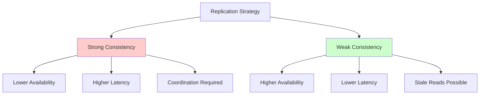
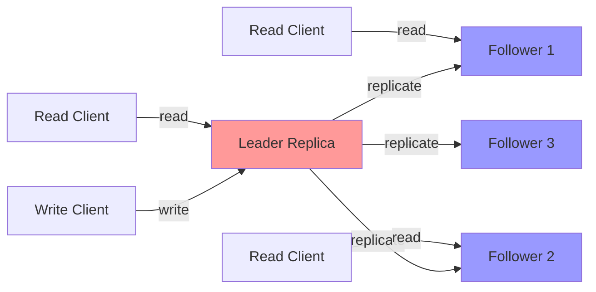
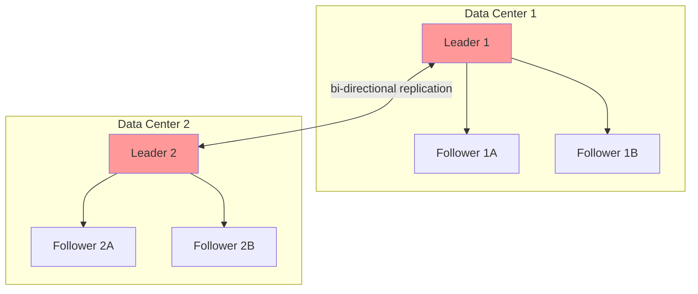
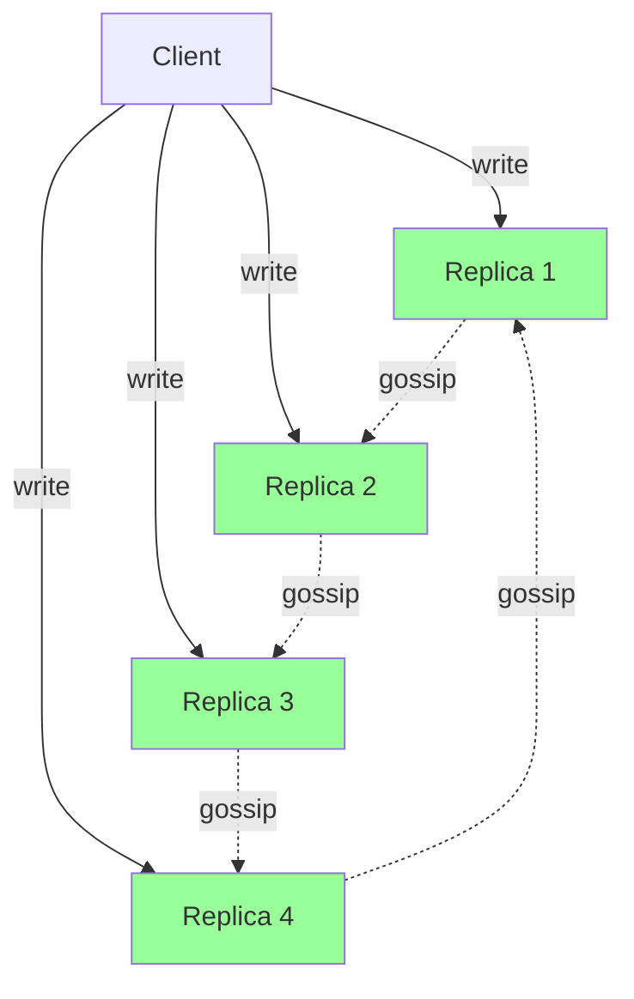

# Replication Basics

Replication is one of the most fundamental techniques in distributed systems, serving as the cornerstone for building scalable, available, and fault-tolerant applications. At its core, replication means maintaining multiple copies of data across different nodes in a distributed system. While this concept appears simple, the implications and challenges it introduces are profound and far-reaching.

## Why Replicate Data?

The decision to replicate data in a distributed system stems from several critical requirements that cannot be adequately met by a single-server architecture.

### Fault Tolerance and High Availability

The primary motivation for replication is to ensure system availability even when individual components fail. In any distributed system, failures are not exceptional events—they are the norm. Hard drives fail, network connections drop, power supplies die, and entire data centers can become unavailable due to natural disasters or human error.

By maintaining multiple replicas of data across different physical machines or geographic locations, a system can continue serving requests even when some replicas become unavailable. If one server crashes, clients can seamlessly redirect their requests to another replica without experiencing downtime. This redundancy transforms isolated component failures into manageable events rather than catastrophic outages.

Consider a critical database storing financial transactions. With a single server, a hardware failure could bring down the entire system, preventing any transactions from being processed and potentially losing data. With three replicas distributed across different availability zones, the system can tolerate up to two simultaneous failures while remaining operational.

### Performance and Scalability

Replication dramatically improves read performance by distributing the workload across multiple servers. Instead of a single server being overwhelmed by thousands of concurrent read requests, the load can be spread across many replicas, with each handling a fraction of the total traffic.

Geographic distribution of replicas also reduces latency for end users. A user in Tokyo can read from a replica located in Asia, while a user in New York reads from a North American replica, ensuring both experience low latency despite being thousands of miles apart. This geographic proximity is crucial for applications requiring real-time responsiveness.

The scalability benefits are substantial. As read traffic grows, you can simply add more read replicas to handle the increased load. This horizontal scaling approach is often more cost-effective and flexible than vertical scaling (upgrading to more powerful hardware).

### Data Locality

Replication enables data to be physically close to where it's needed. In global applications, users in different regions expect fast access to data. By placing replicas in multiple geographic locations, you can serve requests from the nearest replica, minimizing network latency and providing a better user experience.

Data locality also has regulatory implications. Many jurisdictions require that certain types of data (such as personal information) be stored within specific geographic boundaries. Replication allows you to maintain copies in compliant regions while still providing global access.

## Performance vs Availability Tradeoffs

The fundamental challenge in replication lies in the inherent tension between performance and consistency. This tradeoff, formalized in part by the CAP theorem, forces system designers to make explicit choices about which properties to prioritize.

### The Consistency-Availability Spectrum

At one extreme, we have strongly consistent systems that guarantee all replicas always agree on the current state of the data. Every read returns the most recent write, and clients observe a single, coherent view of the system. However, achieving this guarantee requires coordination between replicas, which introduces latency and reduces availability during network partitions.

At the other extreme, we have eventually consistent systems that maximize availability by allowing replicas to diverge temporarily. Writes can be accepted at any replica without coordinating with others, and reads may return stale data. Over time, through background reconciliation processes, all replicas converge to the same state.

### Synchronous vs Asynchronous Replication

This fundamental tradeoff manifests concretely in the choice between synchronous and asynchronous replication.

**Synchronous replication** ensures that writes are replicated to multiple nodes before acknowledging success to the client. This guarantees that all replicas are consistent but introduces latency proportional to the slowest replica. If a replica is slow or unreachable, the entire write operation is delayed or fails.

The mathematical relationship for write latency in synchronous replication can be expressed as:

$$
\text{Write Latency} = \max(\text{Replica}_1, \text{Replica}_2, \ldots, \text{Replica}_n) + \text{Coordination Overhead}
$$

**Asynchronous replication** acknowledges writes immediately after updating the primary replica, then propagates changes to other replicas in the background. This provides low latency and high availability but risks data loss if the primary fails before replication completes. It also allows different replicas to temporarily have different views of the data.

### Read-Heavy vs Write-Heavy Workloads

The optimal replication strategy depends heavily on workload characteristics. Read-heavy workloads benefit enormously from replication, as reads can be distributed across many replicas without coordination. Each additional replica increases total read throughput.

Write-heavy workloads face more challenges. Every write must be propagated to all replicas, and if strong consistency is required, writes may need to wait for multiple replicas to acknowledge success. The write throughput is thus bounded by the coordination overhead:

$$
\text{Write Throughput} \leq \frac{\text{Network Bandwidth}}{\text{Data Size} \times \text{Replication Factor} \times \text{Consistency Cost}}
$$

## Core Replication Strategies

Different replication architectures make different tradeoffs in the performance-availability-consistency space.

### Single-Leader (Master-Slave) Replication

The most common replication architecture designates one replica as the leader (or master) that handles all writes. The leader then propagates changes to follower replicas (or slaves), which serve read-only traffic.

**Advantages:**
- Simple to understand and implement
- No write conflicts (single writer)
- Read scalability through multiple followers
- Clear consistency semantics when using synchronous replication

**Disadvantages:**
- Single point of failure for writes
- Write throughput limited by leader capacity
- Replication lag can cause stale reads on followers
- Failover complexity when leader crashes

This architecture works exceptionally well for read-heavy workloads where the ratio of reads to writes is 10:1 or higher. Databases like PostgreSQL, MySQL, and MongoDB use this approach by default.

### Multi-Leader (Master-Master) Replication

Multi-leader replication allows multiple nodes to accept writes concurrently. Each leader replicates its changes to other leaders, which must reconcile potentially conflicting updates.

**Advantages:**
- Better performance for geographically distributed systems
- Continued write availability during network partitions
- No single point of failure for writes
- Lower latency for users in different regions

**Disadvantages:**
- Complex conflict resolution required
- Potential for data inconsistencies
- More difficult to reason about system behavior
- Increased operational complexity

Multi-leader replication excels in scenarios where writes must be accepted in multiple geographic regions with low latency, such as collaborative editing applications or globally distributed e-commerce platforms.

### Leaderless (Peer-to-Peer) Replication

Leaderless replication, popularized by Amazon's Dynamo, treats all replicas as peers. Clients write to multiple replicas in parallel, and reads query multiple replicas to ensure the most recent data is retrieved.

**Quorum-based approach:** To ensure consistency, writes and reads must reach a quorum. With N replicas, W write acknowledgments, and R read replicas:

$$
W + R > N \text{ ensures overlap (reading latest write)}
$$

$$
W > N/2 \text{ prevents write conflicts}
$$

**Advantages:**
- High availability (no single leader to fail)
- Excellent fault tolerance
- Predictable performance characteristics
- Good for high write throughput

**Disadvantages:**
- Complex client logic required
- Potential for conflicting writes
- Higher read latency (must query multiple replicas)
- More network bandwidth consumed

## Replication Lag and Its Implications

In asynchronous replication systems, there's always some delay between a write being applied on the leader and it appearing on followers. This replication lag has several important consequences.

### Read-After-Write Consistency

A user who writes data expects to immediately see their own writes in subsequent reads. However, if the write was applied to the leader but the user's next read goes to a follower with replication lag, they might not see their update—creating a jarring experience.

Solutions include:
- **Session stickiness:** Route all requests from a user to the same replica
- **Read-your-writes guarantee:** For a short time after writing, always read from the leader
- **Timestamp tracking:** Include timestamps with writes and only read from followers caught up past that timestamp

### Monotonic Reads

Without monotonic reads, a user might see data moving backward in time. If they read from a replica with low lag, then subsequently from one with higher lag, later reads might not include updates from earlier reads.

The guarantee needed is: if a user makes multiple reads, they won't see data from an earlier point in time in later reads.

### Consistent Prefix Reads

In distributed systems with multiple partitions, related writes might be seen in different orders by different observers. If a conversation consists of questions and answers written to different partitions, a user might see answers before questions.

Consistent prefix reads guarantee that if a sequence of writes happens in a certain order, anyone reading those writes will see them appear in the same order.

## Choosing a Replication Strategy

The choice of replication strategy depends on multiple factors:

1. **Consistency requirements:** Financial systems need strong consistency; social media can tolerate eventual consistency
2. **Geographic distribution:** Global applications may require multi-leader or leaderless replication
3. **Read/write ratio:** Read-heavy workloads benefit from single-leader; write-heavy may need multi-leader
4. **Latency requirements:** Low-latency writes may require asynchronous replication
5. **Operational complexity:** Single-leader is simplest; leaderless is most complex
6. **Failure scenarios:** Consider what happens during network partitions, node failures, and data center outages

The fundamental insight is that there is no universally optimal replication strategy. Each approach makes specific tradeoffs, and the best choice depends on your application's specific requirements and constraints. Understanding these tradeoffs deeply enables you to make informed architectural decisions that align with your system's goals.
