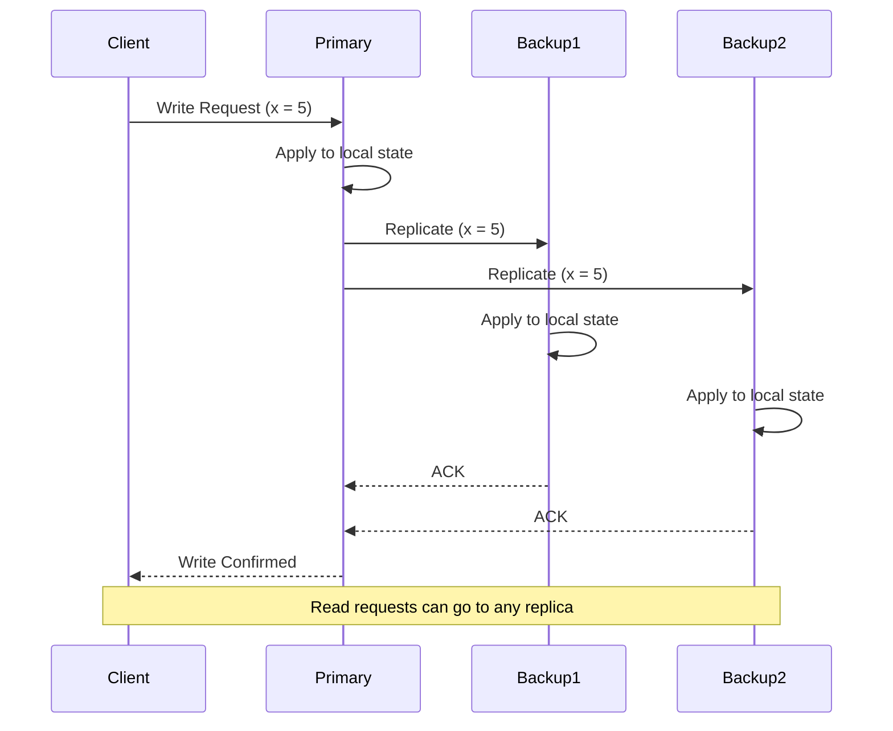
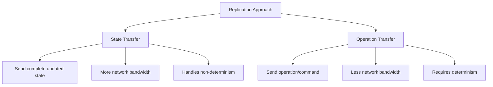
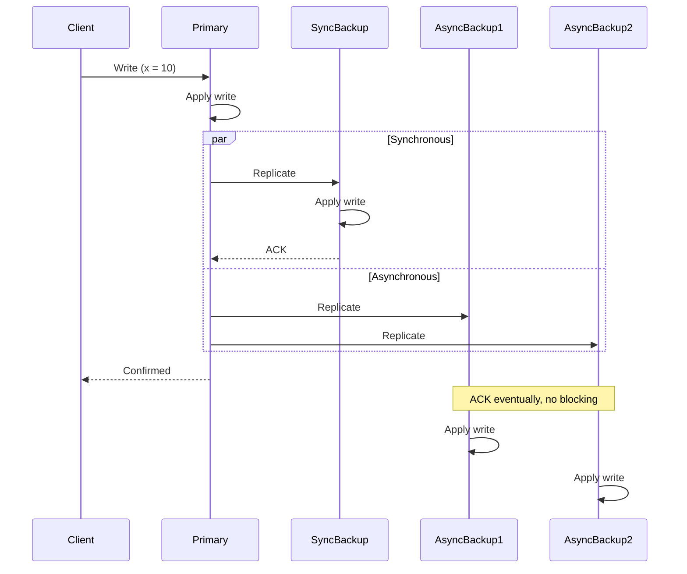
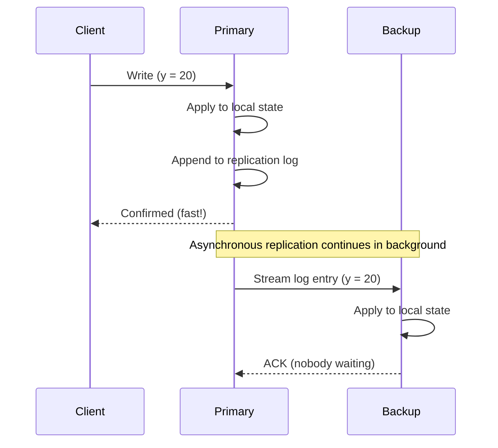
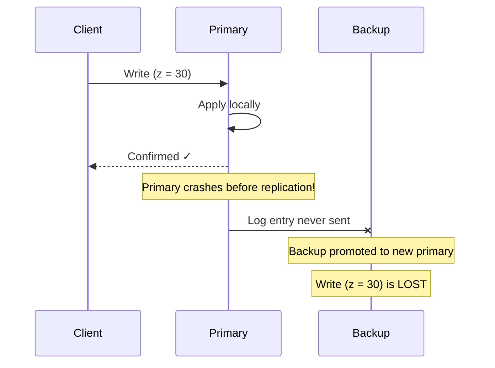
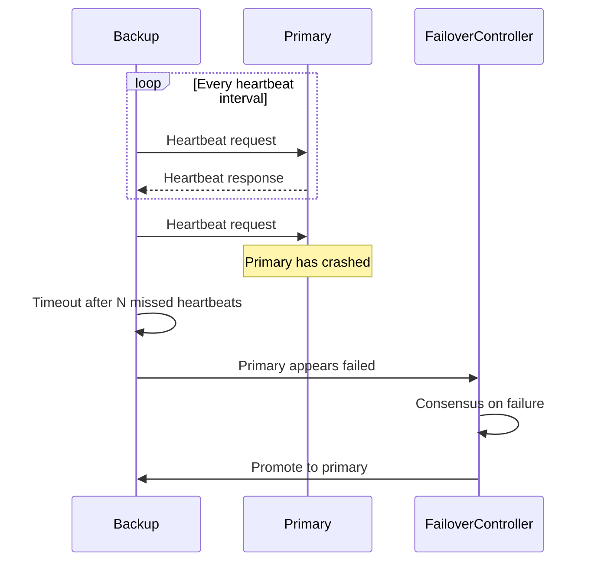
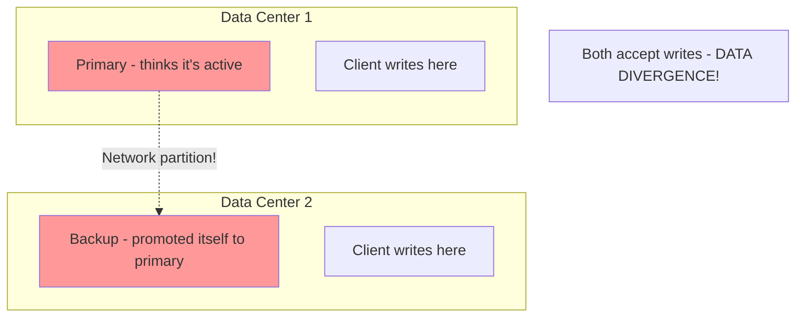
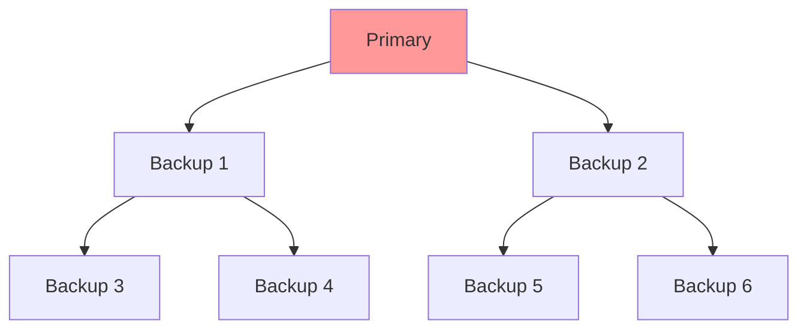

# Primary-Backup Replication

Primary-backup replication, also known as master-slave or leader-follower replication, is the most widely deployed replication architecture in production systems. Its elegance lies in its simplicity: one replica (the primary) handles all writes and coordinates replication to backup replicas, which can serve read traffic. Despite this conceptual simplicity, primary-backup systems must address numerous subtle challenges around consistency, failover, and performance.

## The Primary-Backup Protocol

The fundamental protocol operates through a clear sequence of steps that ensures data durability and consistency across replicas.

### Basic Protocol Flow

When a client initiates a write operation, the following sequence occurs:

1. **Client sends write request** to the primary replica
2. **Primary applies the write** to its local state
3. **Primary forwards the write** to all backup replicas
4. **Backups apply the write** to their local state
5. **Backups acknowledge** receipt to the primary
6. **Primary confirms success** to the client

The crucial decision point is **when** the primary acknowledges the write to the client—before or after receiving backup acknowledgments. This choice determines whether the replication is synchronous or asynchronous.

### State Transfer vs Operation Transfer

Primary-backup systems can replicate in two fundamentally different ways:

**State Transfer** involves sending the entire updated state or state snapshots to backups. After applying a write that changes a database row, the primary sends the complete new row to backups.

**Operation Transfer** (also called logical replication) sends the operation itself rather than the resulting state. The primary forwards the write command (e.g., "UPDATE users SET balance = balance + 100 WHERE id = 42") to backups, which re-execute it.

State transfer is simpler and ensures backups stay synchronized even if operations are non-deterministic. Operation transfer is more efficient for small updates but requires operations to be deterministic or carefully coordinated.

### Ensuring Ordering and Consistency

A critical challenge is ensuring all replicas apply operations in the same order. Consider two concurrent writes to different keys that both modify a shared counter. If replicas apply these in different orders, they'll diverge.

The primary solves this by imposing a total order on all operations. Each write receives a monotonically increasing sequence number, and backups apply operations in sequence number order. This guarantees all replicas transition through the same sequence of states.

For multi-partition systems, maintaining order becomes more complex. Each partition typically has its own primary-backup group, and cross-partition operations require distributed transaction protocols like two-phase commit.

## Synchronous Replication

Synchronous replication provides the strongest durability guarantees by requiring the primary to wait for acknowledgment from one or more backups before confirming a write to the client.

### Semi-Synchronous Replication

Pure synchronous replication to all replicas is often impractical because a single slow or failed backup would block all writes. A common compromise is **semi-synchronous replication**:

- The primary waits for acknowledgment from at least one backup (ensuring durability)
- The primary doesn't wait for all backups (maintaining availability)

### Performance Implications

The write latency in synchronous replication is bounded by:

$$
\text{Latency}_{\text{write}} = \text{Latency}_{\text{local}} + \max(\text{Latency}_{\text{network}}, \text{Latency}_{\text{backup}}) + \text{Latency}_{\text{network}}
$$

Where:
- $\text{Latency}_{\text{local}}$ is the time to apply the write locally on the primary
- $\text{Latency}_{\text{network}}$ is the round-trip network time to the backup
- $\text{Latency}_{\text{backup}}$ is the time for the backup to apply the write

For geographically distributed replicas, network latency can be substantial (50-100ms across continents), making synchronous replication impractical for latency-sensitive applications.

### Consistency Guarantees

Synchronous replication provides **linearizability** for writes: once a write is acknowledged, all subsequent reads (from any replica) will see that write or a later one. This makes the system appear as if there's a single copy of the data, despite physical replication.

However, this guarantee typically applies only to committed writes. If the primary crashes before acknowledging a write, that write may or may not have been replicated, leading to potential inconsistencies during failover.

### Use Cases

Synchronous replication is essential for:
- **Financial systems** where data loss is unacceptable
- **Inventory management** requiring accurate stock counts
- **Regulatory compliance** demanding strong durability guarantees
- **Critical metadata** like configuration or schema information

## Asynchronous Replication

Asynchronous replication optimizes for performance and availability by acknowledging writes immediately after the primary applies them locally, without waiting for backups.

### Protocol Characteristics

In asynchronous replication, the primary maintains a replication log of all applied operations. A background process continuously streams this log to backups:

The primary doesn't wait for backup acknowledgments before confirming the write. This provides:
- **Low latency:** Writes complete in single-digit milliseconds
- **High availability:** Slow or failed backups don't impact write performance
- **Better throughput:** The primary isn't blocked by backup performance

### Replication Lag

The time between a write being applied on the primary and appearing on a backup is called **replication lag**. In healthy systems, this is typically milliseconds to low seconds. However, under load or network issues, it can grow to minutes.

The replication lag can be quantified as:

$$
\text{Lag} = \text{Current Time} - \text{Timestamp of Last Applied Write}
$$

Applications must be designed to handle this lag. For example:
- A user updates their profile and immediately views it—they must read from the primary
- A user posts a comment and refreshes the page—they might not see their comment if reading from a lagging backup

### Data Loss Scenarios

The critical weakness of asynchronous replication is potential data loss during failures. If the primary crashes after acknowledging a write but before replicating it, that write is permanently lost:

The amount of potential data loss is bounded by the replication lag:

$$
\text{Max Data Loss (seconds)} = \text{Replication Lag}
$$

For many applications, losing a few seconds of writes during catastrophic primary failure is acceptable. For others, it's unacceptable, requiring synchronous replication.

### Performance Characteristics

Asynchronous replication provides superior performance:

**Write throughput** is limited only by the primary's local storage:
$$
\text{Throughput}_{\text{async}} \approx \text{Primary Local Write Speed}
$$

**Write latency** is minimized:
$$
\text{Latency}_{\text{async}} \approx \text{Latency}_{\text{local}} + \epsilon
$$

Where $\epsilon$ represents minimal overhead for logging.

### Use Cases

Asynchronous replication is ideal for:
- **Social media** where eventual consistency is acceptable
- **Analytics systems** where slight data lag doesn't impact insights
- **Read-heavy applications** needing read scalability without write latency penalties
- **Geographically distributed systems** where network latency makes synchronous replication impractical

## Failover Mechanisms

The most complex aspect of primary-backup replication is handling primary failures and promoting a backup to become the new primary.

### Failure Detection

Before initiating failover, the system must detect that the primary has failed. This is surprisingly difficult because it's impossible to distinguish between a crashed node and one that's merely slow or network-partitioned.

**Heartbeat-based detection** is the most common approach:

The timeout duration creates a tradeoff:
- **Short timeout:** Fast failure detection but more false positives from transient slowness
- **Long timeout:** Fewer false positives but longer unavailability during actual failures

Typical production systems use timeouts of 5-30 seconds combined with multiple consecutive missed heartbeats to reduce false positives.

### Promotion Strategies

When the primary fails, one backup must be promoted. The selection strategy impacts both consistency and availability:

#### Most Up-to-Date Replica

Select the backup with the most recent data (highest sequence number). This minimizes data loss but requires querying all backups to determine which is most current.

#### Pre-Designated Successor

Designate a specific backup as the primary successor ahead of time. This enables faster failover but may promote a replica that's slightly behind others.

#### Consensus-Based Election

Use a consensus protocol (like Raft or Paxos) to elect a new primary. This provides the strongest safety guarantees but adds complexity and latency to failover.

### Handling Divergent Replicas

In asynchronous replication, when the old primary comes back online after failover, it may have writes that weren't replicated to the new primary. These divergent writes must be handled:

**Option 1: Discard divergent writes**
- Simple but loses data
- Acceptable if writes are idempotent or cached elsewhere

**Option 2: Merge divergent writes**
- Requires application-specific conflict resolution
- Complex but preserves all data

**Option 3: Replicate divergent writes to new primary**
- May violate client expectations (writes clients think failed actually succeeded)
- Requires careful handling of sequence numbers

### Split-Brain Scenarios

The most dangerous failure scenario is **split-brain**, where network partitions cause multiple replicas to believe they're the primary:

Split-brain leads to data corruption as both primaries accept conflicting writes. Prevention mechanisms include:

**Fencing:** Before promoting a backup, fence off the old primary by:
- Revoking its access to shared storage
- Blocking its network access
- Triggering a remote shutdown (STONITH - "Shoot The Other Node In The Head")

**Generation numbers:** Each primary gets a monotonically increasing generation number. Replicas reject commands from primaries with old generation numbers.

**Quorum requirements:** Require a majority of replicas to agree before promotion. This prevents multiple simultaneous primaries in most partition scenarios.

## Advanced Considerations

### Cascading Replication

In systems with many replicas, having the primary replicate to all of them creates a bottleneck. Cascading replication alleviates this by having some backups replicate from other backups:

This reduces load on the primary but increases replication lag for downstream backups.

### Read Scaling Patterns

Primary-backup replication excels at scaling reads:

**Read-your-writes consistency:** After writing, direct the user's next reads to the primary for a short time window.

**Session consistency:** Pin a user's session to a single replica (preferably the primary) to provide monotonic read guarantees.

**Lag monitoring:** Track each replica's replication lag and route reads only to replicas within acceptable lag thresholds.

### Monitoring and Observability

Production primary-backup systems require comprehensive monitoring:

- **Replication lag:** Track lag for each backup in milliseconds/seconds
- **Replication throughput:** Monitor bytes/operations replicated per second
- **Heartbeat latency:** Detect degrading network connections before failures
- **Backup health:** Verify backups are applying writes correctly
- **Failover metrics:** Track time-to-detect and time-to-promote during failures

The combination of these mechanisms allows primary-backup replication to provide a practical balance of consistency, availability, and performance suitable for the majority of production systems. Understanding when synchronous versus asynchronous replication is appropriate, and how to handle failover safely, is essential for building reliable distributed systems.
